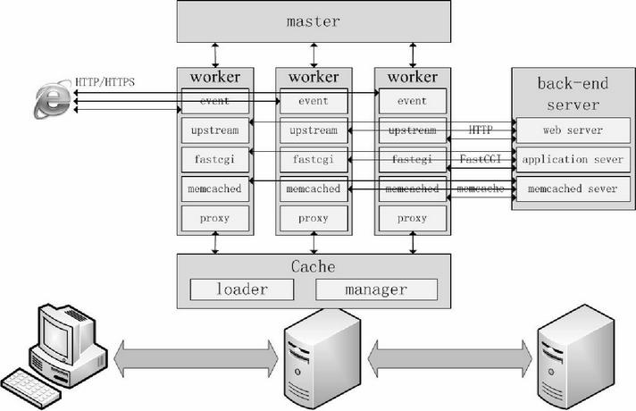

## cpp知识体系-学有价值点


### 01_重定义C++语言学习与程序人生

### C++学习_1.重定义C++语言的学习_1.体系介绍_1.基础知识            

- 学习语言大量话费时间的两个方面
  - 基础知识体系的构建
  - 逻辑思维的全面提升（内功）
- 怎么做到逻辑思维的全面提升
  - 阅读高手代码
  - 动手写项目来实践
  - 认真思考和总结
  - 再学习和再实践
- c++语言基础知识体系
  - 

### C++学习_1.重定义C++语言的学习_1.体系介绍_2.领域知识            

- 

### C++学习_1.重定义C++语言的学习_2.C++语言的学习_1-3.书籍现状、推荐            

- c++语言知识体系介绍
  - c++基础知识体系介绍
  - c++相关领域知识介绍
- 重定义c++语言的学习
  - c++语言书籍现状和问题
  - c++语言系列视频和书籍介绍
  - 我的个人履历
  - c++语言学习方法（书本讲的很泛，而书要讲重点，精写（那个要讲和哪个不要讲才重要），老师存在的意义是让学生知道哪些必须学，哪些重点掌握）
- 买视频送书籍活动
  - 活动简介
    - effective c++作者
    - more effective c++作者
  - 购买哪些课程会送书
  - 送书的操作办法

### C++学习_1.重定义C++语言的学习_2.C++语言的学习_4.C++语言学习方法

- 学东西最怕走弯路
  - 学习顺序
  - 好的学习资料
  - 好的老师（c++大部头不适合学习）

### C++学习_1.重定义C++语言的学习_3.买视频送书籍活动

### C++学习_2.程序人生_1.职场和人生_1-3.学历、人生目标、择业.pptx

### C++学习_2.程序人生_1.职场和人生_4-6.学习谈、996、身体谈

### C++学习_2.程序人生_1.职场和人生_7-9.自我、创业、恋爱谈

### C++学习_2.程序人生_2.人的幸运值

---

### c++ 编程技巧与规范

- 类和对象

  - 类和对象_1.静态对象的探讨与全局对象的构造顺序
    - （1）静态对象的探讨
      - （1.1）类中的静态成员变量【类类型静态成员】
      - （1.2）函数中的静态对象【类类型静态对象】

    - （2）全局对象的构造顺序问题


  - 类和对象_2.拷贝构造函数和拷贝赋值运算符
    - （1）拷贝构造函数和拷贝赋值运算符的书写
    - （2）对象自我赋值产生的问题
    - （3）继承关系下拷贝构造函数和拷贝赋值运算符的书写
    - （4）拷贝构造函数和拷贝赋值运算符中重复代码的处理


  - 类和对象_3.类的public继承（is-a关系）及代码编写规则
    - （1）子类遮蔽父类的普通成员函数
    - （2）父类的纯虚函数接口
    - （3）父类的虚函数接口
    - （4）为纯虚函数指定实现体
    - （5）类的public继承（is-a关系）综合范例
    - （6）public继承关系下的代码编写规则


  - 类和对象_4.类与类之间的组合关系与委托关系

    - （1）组合关系

      

      - （1.1）has-a关系
      - （1.2）is-implemented-in-terms-of关系
      - （1.3）组合关系的UML图

    - （2）委托关系

      


  - 类和对象_5.类的private继承探讨
    - 


  - 类和对象_6.不能被拷贝构造和拷贝赋值的类对象
    - noncopyable，private noncopyable


  - 类和对象_7.虚析构函数的内存泄漏问题深谈
    - 继承的父亲中一定有虚xigou


  - 类和对象_8.类设计中的一些技巧_1
    - （1）优先考虑为成员变量提供访问接口
      - public: int& GetA(){return m_a;} private: int m_a;

    - （2）如何避免将父类的虚函数暴露给子类
      - 父亲的其他函数调用虚函数，虚函数为private 修饰的 virtual

    - （3）不要在类的构造函数与析构函数中调用虚函数
    - （4）析构函数的虚与非虚谈
      - protected 和private 修饰的父类析构函数，有问题的，不要用父类指向子类没啥问题，子类指向子类。

    - （5）抽象类的模拟
    - （6）尽量避免隐式类型转换
    - （7）强制类对象不可以或只可以在堆上分配内存
      - （7.1）强制类对象不可以在堆上分配内存
        - private修饰new 和delete

      - （7.2）强制类对象只可以在堆上分配内存
        - 析构函数用private就行，然后destory


  - 类和对象_8.类设计中的一些技巧_2
    - （1）优先考虑为成员变量提供访问接口
    - （2）如何避免将父类的虚函数暴露给子类
    - （3）不要在类的构造函数与析构函数中调用虚函数
    - （4）析构函数的虚与非虚谈
    - （5）抽象类的模拟
    - （6）尽量避免隐式类型转换
    - （7）强制类对象不可以或只可以在堆上分配内存
      - （7.1）强制类对象不可以在堆上分配内存
      - （7.2）强制类对象只可以在堆上分配内存


  - 类和对象_8.类设计中的一些技巧_3
    - （1）优先考虑为成员变量提供访问接口
    - （2）如何避免将父类的虚函数暴露给子类
    - （3）不要在类的构造函数与析构函数中调用虚函数
    - （4）析构函数的虚与非虚谈
    - （5）抽象类的模拟
    - （6）尽量避免隐式类型转换
    - （7）强制类对象不可以或只可以在堆上分配内存
      - （7.1）强制类对象不可以在堆上分配内存
      - （7.2）强制类对象只可以在堆上分配内存


  - 类和对象_9.命名空间使用的一些注意事项

  - 类和对象_10.类定义的相互依赖与类的前向声明

- 引用计数基础理论和实战

  - 引用计数基础理论和实践_1.shared_ptr实现及string存储简单说明

    - （1）shared_ptr智能指针实现简单说明
    - （2）string类型字符串存储方式的简单说明
    - 其他
      - 图3.1  两个shared_ptr智能指针指向同一个数字
      - 图3.2  采用eager-copy数据存储方式的string类存储字符串时的示意图
      - 图3.3  采用copy-on-write数据存储方式的string类存储字符串时的示意图

  - 引用计数基础理论和实践_2.通过copy-on-write方式实现的mystring类_1

    - （1）骨架与计数设计
    - （2）构造函数
    - （3）拷贝构造函数
    - （4）析构函数
    - （5）拷贝赋值运算符
    - （6）外部加锁、内部加锁、写时复制（copy-on-write）
    - （7）通过指针修改mystring所指字符串的内容
    - 其他
      - 图3.4  两个不同的mystring对象所保存的数据并不会共享
      - 图3.5  三个不同的mystring对象所保存的数据共享
      - 图3.6  两个不同的mystring对象所保存的数据并不会共享
      - 图3.7  通过kxstr1对象拷贝构造出kxstr3对象

  - 引用计数基础理论和实践_2.通过copy-on-write方式实现的mystring类_2

    - （1）骨架与计数设计
    - （2）构造函数
    - （3）拷贝构造函数
    - （4）析构函数
    - （5）拷贝赋值运算符
    - （6）外部加锁、内部加锁、写时复制（copy-on-write）
    - （7）通过指针修改mystring所指字符串的内容
    - 其他
      - 图3.8  通过kxstr1对象给kxstr2对象赋值（图中X部分表示内存被释放）
      - 图3.9  执行kxstr1[0] = 'Y';后的效果示意图

  - 引用计数基础理论和实践_2.通过copy-on-write方式实现的mystring类_3

    - （1）骨架与计数设计

    - （2）构造函数

    - （3）拷贝构造函数

    - （4）析构函数

    - （5）拷贝赋值运算符

    - （6）外部加锁、内部加锁、写时复制（copy-on-write）

    - （7）通过指针修改mystring所指字符串的内容

    - 其他

      - 图3.10  一个额外的mypoint指针直接指向字符串

      - 图3.11  因调用operator[]导致kxstr4共享标记变为false，从而无法共享字符串了


---

## c++数据结构与算法

## 第一章：基本概念，算法复杂度(防御编程，设计图，位置交换，实现逻辑，设计框架（节点，大小，游标等）)

- 大O表示算法时间复杂度和算法空间复杂度

- 第一节：算法特性和设计要求

  - 数据结构：是研究数据之间组织结构的
  - 算法：是操作数据解决特定问题的步骤和方法
  - 数据结构服务于算法，算法也要作用于特定的数据结构之上，两者相辅相成，不能孤立
  - **算法五个特性：输入，输出，有穷性，确定性，可行性**
  - **一个好的算法通常有四个设计要求：正确性，可读性，健壮性（可以处理各种意外情形），高时间效率，低存储量要求（需要的内存空间）**

- 第二节：算法的效率度量

  - 算法度量：事后统计方法（编译器等也有影响，效率高的算法要看数据规模，如果给的数据小就没啥用，所以一般不做事后分析），事前分析估计算法方法（程序编写之前依据一些统计方法进行粗略估算，以算法的本身作为估算核心）

  - 事前分析估算方法：算法的时间复杂度分析（主要循环总次数，比如一个函数没有循环，有几百行代码也视为O(1), 如果有循环那么看下面的算法 ） 与 空间复杂度分析（内存）

    - 算法的时间复杂度（粗略估计就行）

      - **大O时间复杂度表示法**
        - 有公式T(n) = O(f(n)) = O(执行次数总和), 其中：
          - n：表示问题规模大小，比如 执行1000次
          - T(n): 表示算法的执行时间（T指的Time）,也就是算法的时间复杂度
          - f(n): 表示代码的执行次数总和
          - O：表示代码的执行时间T(n)与F(n)的函数关系（正比关系）
          - 所以：calc函数中T(n) = O(2n+3) = O(n)
          - calc2函数T(n) = O(2n^2^ + 4n + 4) = O(n^2^)
      - **算法时间复杂度计算规则**
        - 只关注循环中的代码段
        - 加法规则：若有T1(n) = O(f(n)), T2(n) = O(g(n)) 则T(n) = T1(n) + T2(n)=O(max(f(n), g(n)))
          - 说明，加法规则的算法时间复杂度取决于阶数最高的代码段的复杂度，所以calc2时间复杂度O(n^2^)
        - 乘法规则：若有T1(n) = O(f(n)), T2(n) = O(g(n)), 则T(n) = T1(n) * T2(n) = O(f(n)) * O(g(n)) = O(f(n) * g(n))
          - 说明，乘法规则的算法时间复杂度取决于内外循环(将对testfunc函数的调用看成是内循环)，代码段时间复杂度的乘积

      ```// 1 + 1001 + 1000 + 1 = 2003 = 2n+3
      //不用规则正常计数
      //总次数：1 + 1000 + 1 + 1000 + 1 = 2003 = 2n+3, 根据加法规则当数据规模很大的时候，去掉系数视为: n
      void calc1(int n){ // n = 1000, 问题规模 
      	int sum = 0;	// 执行1次
      	for(int i = 0; i <= n; ++1){	//执行1000 + 1次
      		sum = sum + 1;	// 执行1000次
      	}
      	cout << sum << endl;	//执行1次
      }
      
      //不用规则正常计数
      //总次数：1000 = 1000, 这种无论多少行，因为不随问题规模 n 增大而增大所以视为: 1
      void calc2(int n){ // n = 1000, 问题规模 
      	int sum = 0;	// 执行1次
      	int sum = 0;	// 执行1次
      	int sum = 0;	// 执行1次
      //..... 1000个
      	int sum = 0;	// 执行1次
      	cout << sum << endl;	//执行1次
      }
      
      //不用规则正常计数
      //总次数：1 + 1000 + 1 + 1001 x 1000 + 1001 x 1000 + 1 = 2 x 1000x 1000 + 3 x 1000 + 3 = 2n^2 + 3n + 3 ，根据加法计算规则（当数据规模很大的时候，去掉系数）视为: n^2
      void calc3(int n){ // n = 1000, 问题规模 
      	int sum = 0;	// 执行1次
      	for(int i = 0; i <= n; ++i){	//执行1000 + 1次
      		for(int j = 1; j <= n; ++j){	//执行1001 × 1000次（注意等号和初始值）
      			sum = sum + 1;	// 执行1001 × 1000次
      	    }
      	}
      	cout << sum << endl;	//执行1次
      }
      
      //加法规则
      //第一个循环总次数： 1 + 1001 + 1000 + 1 = 2003 = 2n+3, 当数据规模很大的时候视为: n
      //第二个循环总次数：1 + 1000 + 1 + 1001 x 1000 + 1001 x 1000 + 1 = 2 x 1000x 1000 + 3 x 1000 + 3 = 2n^2 + 3n + 3 ，根据加法计算规则（当数据规模很大的时候，去掉2系数）视为: n^2
      //运用加法规则总的次数视为: n^2
      void calc4(int n){ // n = 1000, 问题规模 
      	int sum = 0;	// 执行1次
      	for(int i = 0; i <= n; ++1){	//执行1000 + 1次
      		sum = sum + 1;	// 执行1000次
      	}
      	
      	for(int i = 0; i <= n; ++i){	//执行1000 + 1次
      		for(int j = 1; j <= n; ++j){	//执行1001 × 1000次（注意等号和初始值）
      			sum = sum + 1;	// 执行1001 × 1000次
      	    }
      	}
      	cout << sum << endl;	//执行1次
      }
      
      //乘法规则
      // 去掉执行一次的情况，外循环calc3总次数视为：1000
      // 去掉执行一次的情况，内循环innerCalc自身执行次数视为（规模很大只看循环）：1000 + 1000 + 1000 = 3000
      // 运用乘法规则总的循环为：1000 x 3000 = 3 x 1000 x 1000 去掉3系数视为 n^2
      int innerCalc(int n){	// n = 1000，内循环次数
      	for(int j = 1; j <= n; ++j){	//1000次（注意等号和初始值）
      		sum = sum + 1;	// 执行1000次
      	}
      	return sum; // 执行1次
      }
      void calc5(int n){ // n = 1000, 问题规模
      	int sum = 0;	// 执行1次
      	for(int i = 0; i <= n; ++i){	//执行1000 + 1次
      		sum = innerCalc(1000); // 这里要为了说明运用乘法规则
      	}
      	cout << sum << endl;	//执行1次
      }
      
      int main(){
      calc1(1000);
      calc2(1000);
      calc3(1000);
      calc4(1000);
      calc5(1000);
      }
      ```

      

      - **常见算法的时间复杂度分析**

        - 常见算法时间复杂度分析

          - O(1): 常数阶时间复杂度

          - O(logn): 对数阶时间复杂度（对数复杂度）

            ```
            // 1 + 1001 + 1000 + 1 = 2003 = 2n+3
            void calc5(int n){ // n = 1000, 问题规模 
            	int i = 1;
            	while( i < n ){
            		i = i * 2; // i 乘以了x次2之后值大于n，x就是i = i × 2这行代码的执行次数，当2^x>n时，x=logn + 1时i的值大于n
            		         
            	}
            }
            
            // 1 + 1001 + 1000 + 1 = 2003 = 2n+3
            void calc2(int n){ // n = 1000, 问题规模 
            	int i = 1;
            	while( i < n ){
            		i = i * 3; // i 乘以了x次3之后值大于n，x就是i = i × 3这行代码的执行次数，当3^x>n时，x=log～3～n + 1时i的值大于n （log以3为底），采用对数换底公式，去掉系数，那么对数就会变成logn （log以2为底）
            		         
            	}
            }
            ```

          - O(nlogn): 线性对数阶时间复杂度（线性对数复杂度）

            ```
            void calc6(int n){
            	int i = 1;
            	for(int count = 0; count < n; ++count){
            		while(i <= n){
            			i = i*2
            		}
            	}
            }
            ```

          - O(n): 线性阶(线性复杂度)

            ```
            void calc7(int n){
            	int sum = 0;
            	for(int i = 0; i<=n; ++i){
            		sum = sum + i;
            	}
            }
            ```

          - O(n^2):方阶(这里是平方复杂度)

            ```
            void calc8(int n){ // 问题规模n
            	int sum = 0;
            	for(int i = 0; i<=n; ++i){
            		for(int i = 0; i<=n; ++i){
            			sum++;
            		}
            	}
            }
            ```

          - O((n(n+1))/2) = n^2 / 2 + n / 2 视为 n^2

            ```
            void calc9(int n){ // 问题规模n
            	int sum = 0;
            	for(int i = 1; i<=n; ++i){
            		for(int j = i; j<=n; ++j){ // 总执行次数n+(n-1)+(n-2)+...+1 => 1+2+3...+n=(n(n+1))/2
            			sum++;
            		}
            	}	
            }
            ```

          - O(m*n)

            ```
            void calc10(int m, int n){ // 不同的问题规模，外循环套内循环就成相乘
            	int sum = 0;
            	for(int i = 1; i<=m; ++i){
            		for(int j = 1; j<=n; ++j){
            			sum++;
            		}
            	}	
            }
            ```

          - O(m+n)

          - ```
            void calc11(int m, int n){
            	int sum = 0;
            	for(int i = 1; i<=m; ++i){
            		sum += i;
            	}
            	for(int j = 1; j<n;i++){
            		sum += j;
            	}
            }
            ```

          - 最好、最好、平均情况时间复杂度, 通常讨论的是最坏，有时候会考虑平均（适当考虑），只有相同的代码段，有数量级的差异的时候会考虑最好，最坏，平均。

            ```
            void calc12(int array[], int n, int x){		int pos = -1;		for(int i = 0; i<n; ++i) // 查找次数的平均值，(1+2+3...+n)/n = (n+1)/2 视为 n，平均为O(n)	  {				if(array[i] == x)				{						pos = i;						break;				}		}			if(pos == -1)		{		   	}		else		{			}}
            ```

            

      - **常见算法的时间复杂度总结规律**

        - 顺序从上向下执行的代码，与问题规模无关，哪怕1000行，100000行，都忽略
        - 算法如果存在循环语句，只需要挑选循环中的某基本语句进行分析其执行次数与问题规模n的关系
        - 对于嵌套的双重甚至更多重循环，只需要关注最深层次的循环的循环次数。
        - 常见的算法时间复杂度有下面几个：
          - O(1): 常数阶
          - O(logn)
          - O(n)
          - O(nlogn)
          - O(n^2)
          - O(n^3)
          - O(2^n)
          - O(n!)：阶乘
        - 算法时间复杂度的关系式
          - O(1) < logn < n < nlogn < n^2 < n^3 < 2^n < n! < n^n
        - 写出阶数更低的算法是每个开发者都应该追求的目标
          - 2^n < n! < n^n 是非多项式量级时间复杂度，就是太过分了
          - 其余的是多项式量级时间复杂度（就挺好）（在数学中，由若干个单项式相加组成的代数式叫做多项式（若有减法：减一个数等于加上它的相反数），多项式中的每个单项式叫做多项式的项，这些单项式中的最高项次数，就是这个多项式的次数，其中多项式中不含字母的项叫做常数项。）
        - 面试题，一个算法时间复杂度是T(n) = O(n^3 + n^2logn), 如何简化
          - O(n^3) + O(n^2logn)
          - O(n^3) = O(n^2 * n)
          - 简化答案是T(n) = O(n^3)

  

- 第一章第二节：算法空间复杂度分析

  - 算法的空间复杂度分析：运行时所需要的存储空间与问题规模之间的增长关系
  - 大O空间复杂度表示法：有公式S(n) = O(f(n))

---

- 第二章：线性表概述

  - 第一节

    - 数组、链表、栈、堆、队列等都属于线性表的一种（或者理解为数组、链表、栈、队列都可以用来表达线性表）：一对一关系，直接前驱、直接后继（非线性表：一对多关系）
    - 线性表上常用的操作如下：
      - 创建线性表后对数据进行初始化
      - 销毁新型表并对资源进行释放
      - 按位置插入元素
      - 按位置删除元素
      - （按位置修改元素）
      - 查
        - 按位置获取元素
        - 按值查找线性表元素，返回该值在线性表中第一次出现的位置
        - 显示线性表中所有元素值
        - 获取线性表长度

  - 第二节

    - 本节内容

      - 线性表的顺序存储
        - 顺序表
          - 顺序表的类定义、初始化和释放操作
          - 顺序表元素插入操作
          - 顺序表元素删除操作
          - 顺序表元素获取操作
          - 顺序表元素的其他常用操作
        - 顺序表的扩展操作
        - 顺序表的特点

    - 线性表的顺序存储，指的是用**一段连续的内存空间一次储存线性表中的数据**

    - **线性表的顺序存储一般就会采用一维数组来实现，STL，vector**

    - **采用一维数组实现的线性表也叫顺序表**

    - 随机访问（的意思是）：**给出数组首地址和所给元素下标可以最快的找到任意数组元素，而且这种通过下标随机访问数组元素的**

      - **使用最基础的结构构建：数组**
      - **怎么叫快呢：a[i]的地址=数组元素的首地址+下标×sizeof（整形），这个快，直接一算就得到位置; 如果是链的话就得一个一个node往下找**
      - **因为要保持数组的连续性，往往插入或者删除时的效率就很低**

      ```
      // 建立静态数组typedef struct{	int m_data[10]; //这里给出最大长度10	int m_length;	//这里给出实际长度，表示顺序表中已经存入了多少个元素}// 建立动态数组typedef struct{	int *data;	//这里给出一个指针	int max_length;	//这里给出指针所指向的存储结构的最大长度	int m_length;	//这里给出实际长度，表示顺序表中已经存入了多少个元素}// 建立动态数组#define INITSIZE 10 // 动态数组的初始尺寸#define INCSIZE 5 // 存满是后扩容尺寸template <typename T>class SeqList{public:	SeqList(int length = INITSIZE);	~SeqList();	public:	bool ListInsert(); // 增	bool ListDelete(); //删	bool GetElement(int i，T&e); //查	bool GetLocateElement(); //查第一次出现位置public：	bool ListDisplay(); // 打印所有元素	void ListReverse(); // 反转所有元素	int ListLength(); // 长度	private:	void InvreaseSize();	// 扩容，最后考虑public:	T *m_data;	int max_length;	int m_lenght;}
      ```

    - 总结：

      - 顺序表的类定义，初始化和释放操作
      - 顺序表元素插入操作
      - 顺序表元素删除操作
      - 顺序表元素获取操作
      - 顺序表元素的其他常用操作

    - 顺序表的扩展操作

      - 顺序表的特点
      - 通过下标访问数据元素的时间复杂度仅为O(1)
      - 存储的数据紧凑，无畏为维持表中的元素之间的前后关系而增加额外的存储空间
      - 插入和删除操作可能会移动大量元素导致这两个动作效率不高
      - 需要大片连续的内存空间来存储数据
      - 扩容操作所扩展的空间的大小不好确定（不是增加，重新new一段，然后删除之前的，那个扩容大小不容易确定，根据不同的编译器算法实现不一样）
      - STL->vector(重新申请，并搬数据)->reserve->capacity（相当于m_maxsize，申请时最大大小（初始化大小），也算是预留空间（初始化的大小并没有存储元素，所以可以视为预留））

  - **第三节：线性表的链式存储-单链表**

    - 内容

      - 单链表的类定义，初始化操作
      - 单链表元素插入操作
      - 单链表元素删除操作
      - 单链表元素获取操作
      - 单链表元素的其他常用操作
      - 单链表的释放操作
      - 单链表的特点以及代码书写和测试建议

    - 用链式存储的方式

      - 
      - 哨兵节点（带一些信息）

    - 不带头节点的单链表和带头节点的单链表有什么不同

      - 带头节点的单链表中的头节点不存方任何实际元素数据，头节点之后下一个节点才开始存放数据
      - 不带头节点在初始化时不创建任何节点，带头链表初始化时要把头节点创建出来（可以把该头节点看成第0个节点）
      - 不带头节点的单链表在编写基本操作代码（插入和删除等）时更频繁，往往需要对第一个或者最后一个数据进行单独处理
      - 多数实现带头节点的单链表（因为编写更简单）

    - 代码实现：

      - 单链表的类定义，初始化操作
      - 单链表元素插入操作
      - 单链表元素删除操作
      - 单链表元素获取操作
      - 单链表元素的其他常用操作
      - 单链表的释放操作
      - 单链表的特点以及代码书写和测试建议

    - ```
      template<typename T>struct Node{	T data; //数据域	Node<T>* next;	//指针域};tempalate <typemame T>class LinkList{public:	LinkList();	// new Node	~LinkList();public:	bool ListInsert(int i, const T &e);	// 在第i个元素插入元素（比如2到3之间插入一个节点暂时称呼2.5节点）	bool ListDelete(int i);	// 删除第i个元素	bool GetElem(int i, T &e);	// 获取第i个位置的元素值, 返回的值存储在e中，返回成功通过函数返回	int GetLocateElem(const T &e);	// 按元素查找第一次出现的位置publid:	DisplayList();	// 输出所有元素	int ListLength();	// 获取单链表长度	bool Empty();	// 判断单链表是否为空	void ReverseList();	// 额外实现，反转链表	bool InsertPeriorNode(Node<T> *pcurr, const T &e);在pcurr之前插入新节点，新节点数据域元素值为e,快速的方法是在后面插入两者的数据域进行交换，最快方式，复杂度最低	bool DeleteNode<T> *pdel);在前面的节点直接指向后面的节点，直接删除中间那个。更快更高效	private:	Node<T> *m_head;	//头节点	int m_length; // 计算实际长度}
      ```

    - ```
      防御代码：if(m_length < 1){	cout << "当前链表为空，不能获取任何数据" << endl;	return false;}if(i < 1 || i > m_length){	cout << "获取元素位置" << i << "不合法，合法的位置是1到" << m_length << "之间" << endl;	return false;}
      ```

    - ```
      （算法的时间复杂度重点在这里）遍历代码示例：Node<T>* p_curr = m_head;for(int j = 0; j < i; ++j) // 这里去思考问题规模，思考最好时间复杂度，最坏时间复杂度，平均时间复杂度{	// to do...}return true; // 成功
      ```

    - ```
      析狗代码：Node<T> *pnode = m_head->next;Node<T> *ptmp;while(pnode != nullptr){	ptmp = pnode	pnode = pnode->next;	delete ptmp;}delete m_head;m_head = nullptr; //非必需m_length = 0; //非必须
      ```

    - ```
      反转的代码：if(m_length <= 1) return; //防御，0个或者1个没有必要操作//链表至少两个Node<T>* pothersjd = m_head->next->next; // 指向从第二个节点开始的后续节点m_head->next->next = nullptr; // 把第一个节点的指针域先置为空Node<T>* ptmp;while(pothersjd != nullptr){	// 比如a1, a2， a3, a4共四个节点，第一次执行该及诶单循环时指向，注意下面代码注释	ptmp = pothersjd;	// ptmp代表a2	pothersjd = pothersjd -> next; // pothersjd指向a3	ptmp -> next = m_head->next; // a2指向a1	m_head->next = ptmp; // 头节点指向a2}
      ```

    - 优点：

      - 不需要大量连续存储空间存放数据元素，扩容方便
      - 插入和删除节点方便，O(n) 链表与数组比，更合适插入、删除、操作频繁的场景
      - 存放后继指针要额外消耗内存空间，体现了利用空间换取时间来提高算法是简单额编程思想
      - 单对于内存紧张的硬件设备，就要考虑单链表是否合适
      - 内存空间不连续所以无法实现随机访问链表中元素，需要沿着链表逐个查找元素

    - 缺点：

      - 实现起来更复杂，更容易出错
      - 需要清晰思路，并时刻注意边界情况
      - 需要做更多测试

    - 设计tips:

      - 多通过图来理解逻辑并书写出自己认为正确的代码
      - 链表为空时，测试代码能否正常工作
      - 当节点为一个时，测试代码能否正常工作
      - 分别测试在处理链表中第一个和最后一个节点时代码能否正常工作
      - 发现程序执行异常并百思不得其解时，通过设置断点对代码进行调试，逐行跟踪并观察代码的执行情况

    - 额外说明

      - 实现单链表元素插入操作
      - 已知a2, 要求往a2之后插入a5, 简单方法是
        - 往a2之后插入a5
        - 把a2和a5数据域交换
        - 如果频繁的向单链表末尾插入新节点，可以考虑引入一个表尾指针，该指针在单链表为空的时指向头节点
      - 在单链表非空时要注意保持其指向最后一个节点

    - 更快更高效操作

      - bool InsertPeriorNode(Node<T> *pcurr, const T &e);在pcurr之前插入新节点，新节点数据域元素值为e,快速的方法是在后面插入两者的数据域进行交换，最快方式，复杂度最低
      - bool DeleteNode(Node<T> *pdel);在前面的节点直接指向后面的节点，直接删除中间那个。更快更高效
      - 
      - 链表反转示意图
      - 
      - 添加内存泄漏测试函数

  - **第三节：线性表的链式存储-双链表（实现与单链表相差不大，记得有前驱指针）**

    

    

    - 双链表的类定义，初始化操作

    - 双链表元素插入操作

    - 双链表元素删除操作

    - 双链表特点

      - 因为存在前驱节点指针，所以寻找前驱节点时间复杂度为O(1)
      - p->prior->next = p->ndex->prior = p
      - 存在前驱指针要额外消耗存储空间
      - 如果在单/双链表中引入last指针用于始终指向链表末尾节点，那么在链表尾部插入数据就会非常简单
        -  对于双链表，按位置查找某个节点，若位置不超过链表长度m_length的一半，就可以利用head
        -  指针从做到右查找，而如果位置超过了链表的一半，就可以利用last指针辅助prior指针从右到左查找
      - 循环链表分为：单向循环链表 和 双向循环链表

    - 

      ```
      template<typename T>
      struct DblNode{
      	T data;
      	DblNode<T>* prior; // 前驱指针，指向前面一个同类型的节点
      	DblNode<T>* next; // 后继指针，指向后面一个同类型的节点
      };
      
      tempalate <typemame T>
      class DblLinkList{
      public:
      	DblLinkList();	// new Node
      	~DblLinkList();
      
      public:
      	bool ListInsert(int i, const T &e);	// 在第i个元素后插入元素（比如2到3之间插入一个节点暂时称呼2.5节点）
      	bool ListDelete(int i);	// 删除第i个元素
      	bool GetElem(int i, T &e);	// 获取第i个位置的元素值, 返回的值存储在e中，返回成功通过函数返回
      	int GetLocateElem(const T &e);	// 按元素查找第一次出现的位置
      
      public:
      	DisplayList();	// 输出所有元素
      	int ListLength();	// 获取链表长度
      	bool Empty();	// 判断链表是否为空
      	bool InsertPeriorNode(DblNode<T> *pcurr, DblNode<T>* pnewnode); //在pcurr之前插入新节点
      	bool DeleteNode(DblNode<T>* pdel); // 删除一个节点
      	
      private:
      	DblNode<T> *m_head;	//头节点
      	int m_length; // 计算实际长度
      }
      ```

    - 

  - **第三节：线性表的链式存储-循环链表**

    - **单循环链表（跟单链表很类似）**

      - 

      - 设计的时候记得要做更高效的实现

      - 特点：

        - 传统的单循环链表

        - 把链表的头指针修改为尾指针，不再使用m_head, 引入一个尾指针m_tail,那么m_tail->next指向头节点

        - 如果需要频繁的在链表头或者链表尾进行数据操作的话，可以考虑引入m_tail表尾指针（频繁操作尾巴和头）

        - 引入尾指针的另外一个好处就是可以迅速的将两个单循环链表连接起来形成一个更大的单循环链表（组织成更大的结构）

        - 

        - 

        - ```
          实现两个单循环链表连在一起的伪代码
          看图写代码（数据结构都这个思路）
          plhead = m_tail->next; //先把单循环链表1的头节点暂存起来
          m_tail->next = m_tail2->next->next; //让单循环链表1的尾节点指向单循环链表2的头节点之后的节点
          p2head = m_tail2->next; //再把单循环链表2的头节点暂存起来
          m_tail2->next = plhead; //让单循环链表2的伪节点的next域指向单循环链表1的头节点
          // 其他代码略，包括重新设置单循环链表2的长度，让单循环链表2的头指针的next指向自己
          //而对于单循环链表2的头节点的释放，其实是在cirLinlist类的析狗函数中进行
          ```

    - **双循环链表（循环双链表）（实现代码跟双链表很类似）**

      - 保证头节点指针和尾节点的永远指向

  - **第三节：线性表的链式存储-静态链表（有的语言没有指针，用一维数组描述的链表就称为静态链表，需要分配一整块连续的内存空间）**

    - 用静态链表需要分配一整块内存

    - 静态链表的类定义、初始化操作

    - 静态链表元素插入操作

    - 静态链表元素显示、获取等操作

    - 静态链表元素删除操作

    - 静态链表的使用总结

    - 说明

      - 静态链表在内存中也需要分配一整块连续的内存空间

      - 每个数组元素都由两个数据域组成：data（存储链表节点中数据）和cur（存储后继节点所属的数组元素）

        - cur也称为游标、用来模拟指针
        - 下标为0的数组数组元素可以看成是链表的头节点、其cur域的值用于指示链表第一个数据节点对应的数组下标

      - 静态链表的类定义、初始化操作

      - ```
        #define MaxSize 201 //静态链表尺寸，可以根据实际需要设定该值，可用数组下表0-201
        enum NODEUSE
        {
        	e_MOUSE = -1; //未使用（未用）
        	e_LAST = -2; //最后一个节点（末尾）
        };
        template<typename T>
        struct Node
        {
        	T data;	//元素数据域，存放数据元素
        	int cur; // 游标，记录下个静态链表节点的数组下标
        };
        
        template<typename T>
        class StaticLinkList
        {
        public:
        	StaticLinkList();//构造函数
        	~StaticLinkList();//析狗函数
        	
        public:
            int findAnIdlePos(); //
            
        public:
            bool ListInsert(int i, const T&e ); //在第i个位置插入节点
            bool ListDelete(int i); //删除下标i节点
        	bool GetElem(int i, T &e);	// 获取第i个位置的元素值, 返回的值存储在e中，返回成功通过函数返回
        	int GetLocateElem(const T &e);	// 按元素查找第一次出现的位置
            
        public:
        	DisplayList();	// 输出所有元素
        	int ListLength();	// 获取链表长度
        	bool Empty();	// 判断链表是否为空
        	
        private:
        	Node<T> m_data[MaxSize];	//保存节点数据的数组，这里已经构建了静态链表
        	int m_length;	//当前长度，也就是当前保存的数据节点
        };
        
        template<typename T>
        StaticLinkList<T>::StaticLinkList()
        {
        	for(int i = 0; i< MaxSize; ++i){
        		m_data[i].cur = e_MOUSE;
        	}
        	m_length = 0;
        }
        
        //1、找到一个空闲位置代表新插入的节点，在其中存入数据元素
        //2、从头节点开始，找到待插入位置的前一个节点（直接前驱）
        //3、设置新插入节点的cur值以指向前驱节点所指向的节点，设置前驱节点的cur值以指向这个新插入的节点、
        //4、如果新插入的节点是最后一个节点，要设置其cur标记为末尾
        template<typename T>
        bool StaticLinkList<T>::ListInsert(int i, const T&e)
        {
        	
        }
        
        //插入前要实现这个函数，在m_data中找到一个空闲位置用于保存数据，若没有找到（静态链表满了），则返回-1
        //是个插入的辅助函数
        template<typename T>
        int StaticLinkList<T>::findAnIdlePos(){
        	for(int i = 1; i< MaxSize;++i){
        		if(m_data[i].cur == e_NOUSE) //未使用
        			return i;
        	}
        	return -1;
        }
        
        template<typename T>
        int StaticLinkList<T>::ListInsert(int iPos, const T &e){
        	if(iPos < 1 || iPos > m_length+1) // 如果为空或者满了，做防御编程
        	{
        		std::cout<<"元素插入的位置不合法:"<<iPos<<std::endl;
        		return false;
        	}
        	int iIdx;
        	if((iIdx = findAnIdlePos()) == -1)//静态链表满了
        	{
        		cout<<"静态链表满了"<<std::endl;
        		return false;
        	}
        	
        	int iDataCount = 1; //既然需要在第iPos个位置插入元素，那么肯定要找到iPos-1个位置
        	int iIdxPrev; //保存第iPos-1个位置对应的m_data数组下标
        	if(iPos == 1)//向第一个位置插入元素，要单独处理
        	{
        		m_data[iIdx].data = e;
        		if(m_length == 0) // 空表
        		{
        			m_data[iIdx].cur = e_LAST;
        		}
        		else
        		{
        			m_data[iIdx].cur = m_data[0].cur;
        		}
        		m_data[0].cur = iIdx;
        	}
        	else
        	{
        		int iPosCount = 0; //位置计数
        		int tmpcur = m_data[0].cur;
        		
        		//前面已经判断过插入位置合法，所以一定可以找到合适的位置，while(true)循环肯定可以正常退出
        		while(true)
        		{
        			iPosCount ++;
        			if(iPosCount>=(iPos-1))
        			{
        				iIdxPrev = tmpcur;
        				break;
        			}
        			tmpcur = m_data[tmpcur].cur;
        			
        		}// end while
        		
        		int iTmpCurr = m_data[iIdxPrev].cur;
        		m_data[iIdxPrev].cur = iIdx;
        		m_data[iIdx].data =e;
        		m_data[iIdx].cur = iTmpCurr;
        		
        		std::cout<<"成功插入"<<std::endl;
        		m_length++;
        		return true;
        	}
        }
        ```

      - 插入实现的对应图

        - 

      - 静态代码的显示

      - ```
        //输出静态链表中的所有元素，时间复杂度O(n)template<typename T>void StaticLinkList<T>::DispList(){	if(m_length < 1) //防御编程		return;		int tmpcur = m_data[0].cur;	while(true){		cout<<m_data[tmpcur].data <<endl;		if(tmpcur = m_data[tmpcur].cur == e_LAST)			break;	}	cout<<endl;}template<typename T>void StaticLinkList<T>::GetElem(int i, T &e){	if(m_length < 1) //防御编程	{		//静态链表为空		cout<<endl;		return false;	}		if(i < 1|| i > m_length)	{		return false;	}		int tmpcur = m_data[o].cur;	int iPos = 0;	while(true)	{		iPos++;		if(iPos == 1)		{			e = m_data[tmpcur].data;			cout<<"成功获取位置为"<<i<<"的元素，该元素的值为"<<e<<"!"<<endl;			return true;		}		tmpcur = m_data[tmpcur].cur;	}	return false;}template<typename T>void StaticLinkList<T>::GetElem(int i, T &e){	if(m_length < 1) //防御编程	{		//静态链表为空		cout<<endl;		return -1;	}		if(i < 1|| i > m_length)  //防御编程	{		return -1;	}		int tmpcur = m_data[0].cur;	int iPos = 0;	while(true){		iPos++;		if(m_data[tmpcur].data == e && m_data[tmpcur].cur!=e_NOUSE)		{			cout<<"元素在静态链表中第一次出现的位置"<<endl;			return tmpcur;		}		if(m_data[tmpcur].cur == e_LAST)		{			break; //没找到		}		tmpcur = m_data[tmpcur].cur;	}	cout<<e<<"没找到"<<endl;	return -1;}
        ```

      - 静态链表的删除操作

        - 从头节点开始，找到待删除节点的前一个直接前驱节点
        - 设置前驱节点的cur值等于当前待删除节点的cur值以指向当前节点所指向的节点
        - 设置被删除节点的状态为未用状态

      - 静态链表的使用总结

        - 不同静态链表实现方式一一将静态链表中的第一个和最后一个节点作为特殊节点来使用（不保存数据）
        - 第一个节点的cur存放在第一个未被使用的节点所对应的数组下表（这些未被使用的节点可以通过cur串起来，构成一个未被使用的节点链）
        - 最后一个节点的cur存放第一个有数据的节点对应的数组下表（相当于头节点），该值为0相当于链表为空
        - 实现代码繁琐，单插入数据能明显提高寻找空闲节点的效率，时间复杂度从O(n)编程O(1)

      - 场合特点：

        - 比较合适不支持指针的
        - 所需要的空间比较固定
        - c++语言不需要静态链表
        - 插入删除节点方便，存取时无法做随机存取
        - 不需要移动元素，仅仅需要修改游标

  - **第三节-线性表-栈**

    - **栈的顺序存储（顺序栈）**：用一段连续的内存空间依次存储栈中的数据

      - **顺序栈的类定义、初始化、释放操作**
      - **顺序栈的入栈、出栈、获取栈顶元素、显示元素等操作**
      - **共享栈**

    - **栈的特点：（受限的线性表-后进先出的线性表-线性表，属于线性表的一个子集）**

      - 
      - 只能在一端进行插入和删除操作：先今后出，后进显出。理解为一种受限的线性表
      - 两端：允许进行插入和删除操作的一段称为栈顶一一桶口
      - 栈底一一桶底（线性表表头）
      - 插入数据：进栈（入栈）
      - 删除元素：出栈
      - 空栈：不包括任何数据（空线性表）
      - 也称为后进先出的线性表：最后放入栈中的数据只能最先被从栈中拿出
      - 栈包括的操作：线性表的子集一一创建、入栈（插入）、出栈（删除）、获取栈顶元素（查）、并判断是否为空或者是否已满了

    - 栈的两种保存数据的方案：

      - 通过为一维数组静态分配内存的方式来保存数据
      - 通过为一维数组动态分配内存的方式来保存数据

    - 为了考虑到元素存取的方便性，讲数组下标为0的一端作为栈底最合适

    - 代码

      - ```
        #define InitSize 10 //动态数组的初始尺寸
        #define IncSize 5 //当动态数组存满数据后每次扩容能多保存的数据元素数量
        
        template <typename T>
        class SeqStack
        {
        public:
        	SeqStack(int length = InitSize);
        	~SeqStack();
        	
        public:
        	bool Push(const T& e); //插，从桶顶插入一个
        	bool Pop(T& e);	//删，桶顶
        	bool GetTop(T& e);	//查元素，线性表-受限制的线性表-查元素为获取栈顶元素（桶，只能看桶顶）
        
        public:
        	bool IsEmpty(); //查空
        	bool IsFull(); //查满
        	
        	void DispList(); //一般都会有的整体打印
        	int GetListLength(); //一般都会有实际长度
        	
        private:
        	void IncreaseSize(); //扩容用的，一般只会用于一开始就构建的大小的容器（分线性和链式，那么这指线性初始化有固定大小的，一般底部也只会用数组来实现，所以就是固定大小的数组）
        	
        private:
        	T* m_data; //存放顺序栈中的元素
        	int m_maxsize; //动态数组最大容量
        	int m_top; //栈顶指针（用作数组下标），指向栈顶元素，该值为-1表示空栈（类似游标）
        };
        
        template <typename T>
        SeqStack<T>::SeqStack(int length)
        {
        	m_data = new T[length]; //为一维数组动态分配内存，该值和算法空间复杂度无关，空间复杂度一般指算法额外需要的储存空间
        	m_maxsize = length; //最多可以储存的大小
        	m_top = -1; //空栈，初始化给-1
        }
        ```

    - 共享栈：两个顺序栈共享存储空间

      - 

      - ```
        template <typename T>
        class ShareStack
        {
        public:
        	ShareStack(int length = InitSize); //构造函数，参数可以有默认值
        	{
        		m_data = new T[length]; //为一维数组动态分配内存
        		m_maxsize = length; //共享栈最多可以存储m_maxsize个数据元素
        		m_top1 = -1; //顺序栈1的栈顶指针为-1,表示空栈
        		m_top2 = length; //顺序栈2的栈顶为length，表示空栈
        	}
        	~ShareStack() //析狗函数
        	{
        		delete[] m_data;
        	}
        
        public:
        	bool IsFull() //判断共享栈是否已满
        	{
        	
        	}
        	
        	bool Push(int stackNum, const T& e) //入栈，参数stackNum用于表示是栈1还是栈2
        	{
        	
        	}
        	
        	bool Pop(int stackNum, T& e) //出栈（删除元素），也就是删除栈顶数据，参数stackNum用于表示是栈1还是栈2
        	{
        	
        	}
        	
        private:
        	T* m_data; //存放共享栈中的元素
        	int m_maxsize; //动态数组最大容量
        	int m_top1; //顺序栈1的栈顶指针
        	int m_top2; //顺序栈2的栈顶指针
        }
        ```

      - 应用场景：

        - 共享栈的使用意义：对来嗯个顺序栈存储空间需求正好相反时，使用共享栈的意义比较大
        - 也就是说：当一个栈进入栈顶操作时，另一个栈同时进行出栈操作（此消彼长的时候）

  - 第三节-链式栈、栈应用（栈的链式存储（链式栈/链栈））（其实就是一个单链表，但是只是认为规定的在头插入和删除，也可以理解为受限制的单链表，一般有带头和不带头，一般不需要带头节点的）

    - 栈存在的意义和应用举例

      - 保存临时数据
      - 利用栈来进行括号匹配的检验
      - 计算表达式结果

    - 代码

      - ```
        // 链式栈中每个节点的定义
        template <typename T>
        struct StackNode
        {
        	T data; //数据域，存放数据的元素
        	StackNode<T>* next; //指针域，指向下一个同类型（和本节点类型相同）节点
        };
        
        //链式栈的定义
        template <typename T>
        class LinkStack
        {
        public:
        	LinkStack();
        	~LinkStack();
        	
        public:
        	bool Push(const T& e);
        	bool Pop(T& e);
        	bool GetTop(T& e);
        	
        	void DispList();
        	int GetListLength();
        	bool Empty();
        	
        private:
        	StackNode<T>* m_top; //栈顶指针
        	int m_length; //当前实际长度
        }
        ```

      - 应用场景

        - 如果存储的数据量无法提前预估，一般考虑用链式栈，如果数据的数量比较固定，可以考虑使用顺序栈

      - 栈存在的意义和应用举例

        - 保存临时数据：函数调用栈，栈幀
          - 
        - 利用栈来进行括号匹配的检验:左边入栈，当有右边就出栈做匹配
          - 例子: {()[]}, {{}()[{}]}, {{](){]}
          - 
        - 计算表达式结果：利用栈讲中追变成后缀表达式，然后再次利用栈对这个后缀表达式求值得到最终结果
          - 先算乘除后算加减，有括号先算括号中的值
            - 

----

## c++数据结构2

### 1_1

// MyProject.cpp : 此文件包含 "main" 函数。程序执行将在此处开始并结束。
//
//公众号：程序员速成 ，内含一辈子都让你感激自己的优质视频教程，欢迎关注

#include <iostream>

#ifdef _DEBUG   //只在Debug（调试）模式下
#ifndef DEBUG_NEW
#define DEBUG_NEW new(_NORMAL_BLOCK,__FILE__,__LINE__) //重新定义new运算符
#define new DEBUG_NEW
#endif
#endif

//#include <boost/type_index.hpp>
using namespace std;
#pragma warning(disable : 4996) 


//----------------------------
namespace _nmsp1
{
	//1+1001+1000+1 = 2003  =    2n+3次
	void calc(int n) //n=1000 问题规模
	{
		int sum = 0;    //执行1次；
		for(int i = 1; i <= n; ++i)  //执行1001次
		{
			sum = sum + i;    //执行1000次
		}
		cout << sum << endl; //执行1次
	}

//1+1001+1000  + 1001 + 1001000 + 1000000 + 1 = 2004004   = 2n^2 + 4n + 4次
void calc2(int n)
{
	int sum = 0;    //执行1次；
	for (int i = 1; i <= n; ++i)  //执行1001次
	{
		sum = sum + i;    //执行1000次
	}

​	for (int j = 1; j <= n; ++j)//执行1001次
​	{
​		for (int k = 1; k <= n; ++k) //1001 * 1000 = 1001000次
​		{
​			sum = sum + k;  //1000 * 1000次 = 1000000次
​		}
​	} //end for j

​	cout << sum << endl; //执行1次
}

int testfunc(int n) //O(n)
{
	int sum = 0;
	for (int i = 1; i <= n; ++i)
	{
		sum = sum + i;
	}
	return sum;
}
void cacl3(int n)  //O(n * n) = O(n^2)
{
	int sum = 0;
	for (int i = 1; i <= n; ++i)
	{
		sum = sum + testfunc(i);
	}
}

}

int main()
{		
	_CrtSetDbgFlag(_CRTDBG_ALLOC_MEM_DF | _CRTDBG_LEAK_CHECK_DF);//程序退出时检测内存泄漏并显示到“输出”窗口
	

//C语言：指针
//C++：类模板
//不需要C++11
//课程特色：简单好理解，细致，全面。

//第1章 基本概念、算法复杂度、编程环境介绍
//大O表示算法时间复杂度和算法空间复杂度。
//第一节 数据结构与算法概述
//a)数据结构：是研究数据之间组织结构的一门学科。
  //数据结构可以理解为一组数据在计算机中的存储结构或者理解为相互之间存在一种或者多种特定关系的数据集合。
//b)算法：是操作数据解决特定问题的求解步骤和方法。 一个问题可以有多种算法。
//c)数据结构和算法的关系：数据结构服务于算法，算法也要作用于特定的数据结构之上，两者相辅相成，不能孤立。
//d)算法五个特性：输入；输出；有穷性；确定性；可行性；
//e)一个好的算法通常有四个设计要求：正确性；可读性；健壮性；高时间效率和低存储量需求；

//第二节 算法的效率度量
//算法度量：事后统计方法；事前分析估算方法；
 //事前分析估算方法：算法的时间复杂度分析   与  空间复杂度分析
//1.2.1 算法的时间复杂度分析
//1.2.1.1  大O时间复杂度表示法
   //有公式T(n) = O(f(n))，其中：
    //a)n：表示问题规模的大小
    //b)T(n)：表示算法的执行时间（T指的Time），也就是算法的时间复杂度。
    //c)f(n)：表示代码的执行次数总和。
    //d)O：表示代码的执行时间T(n)与F(n)的函数关系（正比关系）；
    //所以：calc函数中T(n) = O(2n+3)   = O(n)。
    //      calc2函数中T(n) = O( 2n^2 + 4n + 4) = O(n^2)。
//1.2.1.2 算法时间复杂度计算规则
    //a)只关注循环中的代码段。
    //b)加法规则：  若有T1(n) = O(f(n)),  T2(n) = O(g(n))，则
       //则T(n) = T1(n) + T2(n) = O(max(f(n),g(n)))。
       //说明，加法规则的算法时间复杂度取决于阶数最高的代码段的复杂度。所以calc2时间复杂度 O(n^2)。
    //c)乘法规则： 若有T1(n) = O(f(n)),  T2(n) = O(g(n))，则
	   //则T(n) = T1(n) * T2(n) = O(f(n)) * O(g(n)) = O(f(n) * g(n))。
       //说明，乘法规则的算法时间复杂度取决于内外循环（将对testfunc函数的调用看成是内循环）代码段时间复杂度的乘积。

_nmsp1::calc(1000);
_nmsp1::calc2(1000);

return 0;

}

// 运行程序: Ctrl + F5 或调试 >“开始执行(不调试)”菜单
// 调试程序: F5 或调试 >“开始调试”菜单

// 入门使用技巧: 
//   1. 使用解决方案资源管理器窗口添加/管理文件
//   2. 使用团队资源管理器窗口连接到源代码管理
//   3. 使用输出窗口查看生成输出和其他消息
//   4. 使用错误列表窗口查看错误
//   5. 转到“项目”>“添加新项”以创建新的代码文件，或转到“项目”>“添加现有项”以将现有代码文件添加到项目
//   6. 将来，若要再次打开此项目，请转到“文件”>“打开”>“项目”并选择 .sln 文件

### 1_2

// MyProject.cpp : 此文件包含 "main" 函数。程序执行将在此处开始并结束。
//
//公众号：程序员速成 ，内含一辈子都让你感激自己的优质视频教程，欢迎关注

#include <iostream>
#include <assert.h>
#include <queue>

#ifdef _DEBUG   //只在Debug（调试）模式下
#ifndef DEBUG_NEW
#define DEBUG_NEW new(_NORMAL_BLOCK,__FILE__,__LINE__) //重新定义new运算符
#define new DEBUG_NEW
#endif
#endif

//#include <boost/type_index.hpp>
using namespace std;
#pragma warning(disable : 4996) 


//------------------------------
namespace _nmsp1
{
	void calc4(int n)
	{
		int i = 100;
		int j = 15;
		int sum = i + j+n;
		cout << sum << endl;
	}

	void calc5(int n){	int i = 1;	while (i <= n)	{		i = i * 2; //i=i*3	}}void calc6(int n){	int i = 1;	for (int count = 0; count < n; ++count)	{		while (i <= n)		{			i = i * 2; //i=i*3		}	}}void calc7(int n){	int sum = 0;	for (int i = 1; i <= n; ++i)	{		sum += i;	}}void calc8(int n){	int sum = 0;	for (int i = 1; i <= n; ++i)	{		for (int j = 1; j <= n; ++j)		{			sum++;		}	}}void calc81(int n){	int sum = 0;	for (int i = 1; i <= n; ++i)	{		for (int j = i; j <= n; ++j) //n+(n-1)+(n-2)+....+1   -》    1+2+3+4+...+n :等差数列求和公式		{                                                  // = n(n+1)/2 = n^2 / 2 + n / 2			sum++;		}	}}void calc9(int m, int n){	int sum = 0;	for (int i = 1; i <= m; ++i)	{		for (int j = 1; j <= n; ++j)		{			sum++;		}	}}void calc10(int m, int n){	int sum1 = 0;	for (int i = 1; i <= m; ++i)	{		sum1 += i;	}	int sum2 = 0;	for (int j = 1; j <= n; ++j)	{		sum2 += j;	}}void calc11(int array[], int n, int x){	int pos = -1;	for (int i = 0; i < n; ++i)	{		if (array[i] == x)		{			pos = i;			break;		}	}	if (pos == -1)		cout << "没找到值为" << x << "的元素" << endl;	else		cout << "找到了值为" << x << "的元素，其在数组中的位置下标为：" <<pos <<  endl;}

}

int main()
{		
	_CrtSetDbgFlag(_CRTDBG_ALLOC_MEM_DF | _CRTDBG_LEAK_CHECK_DF);//程序退出时检测内存泄漏并显示到“输出”窗口
	

	//第二节 算法的效率度量//（1）算法的时间复杂度分析    //3. 常见算法时间复杂度分析      //a)O(1)：常数阶时间复杂度      //b)O(logn),O(nlogn):        //O(logn)：对数阶时间复杂度。        //O(nlogn):线性对数阶时间复杂度。      //c)O(n)：线性阶时间复杂度。      //d)O(n^2)、O(m*n)        //O(n^2)：平方阶时间复杂度表示法。        //O(m*n)：      //e)O(m+n)：      //f)最好、最坏、平均情况时间复杂度：        //最好情况时间复杂度，最坏情况时间复杂度，平均情况时间复杂度		// 	//4. 常见算法时间复杂度总结     //a)顺序执行的语句与问题规模n无关，不管1000行还是10000行代码     //b)算法中若存在循环语句，只需要挑选循环中某基本语句分析其执行次数与问题规模n的关系。     //c)对于嵌套的双重甚至多重循环，只需要关注最深层循环的循环次数就可以了。          //常见算法时间复杂度：     //O(1)：常数阶     //O(logn):对数阶     //O(n)：线性阶     //O(nlogn)：线性对数阶     //O(n^2)：平方阶     //O(n^3)：立方阶。由平方阶、立方阶，扩展出k次方阶用O(n^k)表示。     //O(2^n)：指数阶     //O(n!)：阶乘阶     //关系式：常用算法时间复杂度所耗费的时间从小到大（数据量级从小到大）的排列顺序。     //O(1) <  O(logn) < O(n) < O(nlogn) < O(n^2) < O(n^3) < O(2^n) < O(n!) < O(n^n)     //写出阶数更低的算法是每个开发者都应该追求的目标。     //O(2^n) 、O(n!) 、 O(n^n)：非多项式量级的时间复杂度。     //O(1) 、  O(logn) 、 O(n) 、 O(nlogn)、 O(n^2) 、 O(n^3)：多项式量级的时间复杂度。     //考题：T(n) = O(n^3+n^2logn)；        //T(n) = O(n^3) + O(n^2 * logn)        //O(n^3) = O(n^2 * n)        // O(n) < O(nlogn)         // O(n^2 * logn)的数量级 小于 O(n^3)数量级。        //T(n) = O(n ^ 3)


​	     
​	      


	int asz[5] = { 1,2,3,4,5 };_nmsp1::calc11(asz, 5, 3);return 0;

}

// 运行程序: Ctrl + F5 或调试 >“开始执行(不调试)”菜单
// 调试程序: F5 或调试 >“开始调试”菜单

// 入门使用技巧: 
//   1. 使用解决方案资源管理器窗口添加/管理文件
//   2. 使用团队资源管理器窗口连接到源代码管理
//   3. 使用输出窗口查看生成输出和其他消息
//   4. 使用错误列表窗口查看错误
//   5. 转到“项目”>“添加新项”以创建新的代码文件，或转到“项目”>“添加现有项”以将现有代码文件添加到项目
//   6. 将来，若要再次打开此项目，请转到“文件”>“打开”>“项目”并选择 .sln 文件

### 1_3

// MyProject.cpp : 此文件包含 "main" 函数。程序执行将在此处开始并结束。
//
//公众号：程序员速成 ，内含一辈子都让你感激自己的优质视频教程，欢迎关注

#include <iostream>
#include <assert.h>
#include <queue>

#ifdef _DEBUG   //只在Debug（调试）模式下
#ifndef DEBUG_NEW
#define DEBUG_NEW new(_NORMAL_BLOCK,__FILE__,__LINE__) //重新定义new运算符
#define new DEBUG_NEW
#endif
#endif

//#include <boost/type_index.hpp>
using namespace std;
#pragma warning(disable : 4996) 

//------------------------------
namespace _nmsp1
{
	void scalc(int n)
	{
		int i, sum = 0;
		for (i = 1; i <= n; ++i)
		{
			sum = sum + 1;
		}
		cout << sum << endl;
	}

void scalc2(int n)
{
	int* array = new int[n];
	for (int i = 1; i <= n; ++i) //4n+4
	{
		array[i] = 2 * i;
	}
	//记得释放内存
	delete[] array;
}

void scalc21(int n)  //12*n   = O(n)
{
	int i, j;
	if (n > 1)
		scalc21(n - 1);
	cout << "n=" << n << endl;
}

void scalc22(int n) //递归调用n次，n+(n-1)+(n-2)+....+1。等差数列求和公式 = n(n+1) /2 = n^2/2 + n/2
{                   //O(n^2)
	int* p = new int[n];
	if (n > 1)
		scalc21(n - 1);
	cout << "n=" << n << endl;
	delete[]p;
}

void scalc3(int n) //空间复杂度O(n)
{
	//注意这里的动态二维数组的初始化代码
	int** array;
	array = new int* [n]; //4n
	for (int i = 0; i < n; ++i)
		array[i] = new int[n]; //每执行一次占用4n个字节。一共占用的是4n*n = 4n^2个字节的内存

​	//注意动态二维数组的内存释放代码
​	for (int i = 0; i < n; i++)
​	{
​		delete[] array[i];
​	}
​	delete[] array;
}

}

int main()
{		
	_CrtSetDbgFlag(_CRTDBG_ALLOC_MEM_DF | _CRTDBG_LEAK_CHECK_DF);//程序退出时检测内存泄漏并显示到“输出”窗口
	

//第1章 基本概念、算法复杂度、编程环境介绍
//第二节 算法的效率度量
//（2）算法的空间复杂度分析:运行时所需要的存储空间与问题规模之间的增长关系。
//大O空间复杂度表示法：有公式S(n) = O(f(n))。
//a)O(1)：常数阶空间复杂度。需要固定大小内存空间的情形也叫做算法原地工作。
//b)O(n)：线性阶空间复杂度。 
   //如果每次递归调用所需要的内存空间大小固定不变，那么算法的空间复杂度一般都等于递归调用深度。
//c)O(n^2)：平方阶空间复杂度表示法
// 
//一般如果没有刻意指明是时间复杂度还是空间复杂度时，一般指的都是时间复杂度。

//第三节 C++编程环境介绍
//Visual Studio ,不建议Visual Studio 2005更老。
//Visual Studio 2019集成开发环境
//（1）C++编程环境搭建说明
//（2）创建最基本的能运行的C++程序
//“Viusla Studio 2019创建新C++项目”，控制台
  //ctrl+F5
//（3）Visual Studio中程序的调试方法
//1. 普通的断点调试（跟踪调试
//F9 ：加/减断点
//F5： 执行程序，执行到断点停止
//F10：从当前停下来的程序代码行开始运行
//F11：跳入到函数中继续跟踪调试，Shift+F11跳回到该函数的调用处继续往下跟踪调试
//2. 学会调试时查看内存中的内容
//alt+6
//3. 快速监视窗口
//shift+F9


_nmsp1::scalc21(5);

return 0;

}

###　2_1顺序表(可以扩容的数组)

```
#ifdef _DEBUG   //只在Debug（调试）模式下
#ifndef DEBUG_NEW
#define DEBUG_NEW new(_NORMAL_BLOCK,__FILE__,__LINE__) //重新定义new运算符
#define new DEBUG_NEW
#endif
#endif

//#include <boost/type_index.hpp>
using namespace std;
#pragma warning(disable : 4996) 

#define InitSize 10 //动态数组的初始尺寸
#define IncSize  5   //当动态数组存满数据后每次扩容所能多保存的数据元素数量

//------------------------------
namespace _nmsp1
{
	//typedef struct
	//{
	//	int m_data[10]; //静态数组来保存顺序表中的元素，一共10个位置（最多存入10个元素）
	//	int m_length;  //顺序表中当前实际长度（当前顺序表中已经存入了多少个元素）
	//}SeqList;

	//typedef struct
	//{
	//	int* m_data;  //顺序表中的元素保存再m_data所指向的动态数组内存中。
	//	int m_length;  //顺序表中当前实际长度
	//	int  m_maxsize; //动态数组最大容量，因为动态数组可以扩容，因此要记录该值。
	//}SeqList;

	template <typename T> //T代表数组中元素的类型
	class SeqList
	{
	public:
		SeqList(int length = InitSize); //构造函数，参数可以有默认值
		~SeqList();      //析构函数

	public:
		bool ListInsert(int i, const T& e); //在第i个位置插入指定元素
		bool ListDelete(int i);  //删除第i个位置的元素
		bool GetElem(int i, T& e);  //获得第i个位置的元素值
		int LocateElem(const T& e); //按元素值查找其在顺序表中第一次出现的位置

		void DispList(); //输出顺序表中的所有元素
		int ListLength(); //获取顺序表长度
		void ReverseList();  //翻转顺序表

	private:
		void IncreaseSize();  //当顺序存满数据后可以调用此函数为顺序表扩容

	private:
		T* m_data;  //存放顺序表中的元素
		int m_length;  //顺序表中当前实际长度(当前有几个元素)
		int  m_maxsize; //动态数组最大容量
	};

	//通过构造函数对顺序表进行初始化
	template <typename T>
	SeqList<T>::SeqList(int length)
	{
		m_data = new T[length]; //为一维数组动态分配内存
		m_length = 0; //顺序表当前实际长度为0，表示还未向其中存入任何数据元素
		m_maxsize = length; //顺序表最多可以存储m_maxsize个数据元素
	}
	//通过析构函数对顺序表进行资源释放
	template <typename T>
	SeqList<T>::~SeqList()
	{
		delete[] m_data;
		m_length = 0; //非必须
	}

	//在第i个位置（位置编号从1开始）插入指定元素e，时间复杂度O(n)，时间开销主要是缘于元素的移动。
	template <typename T>
	bool SeqList<T>::ListInsert(int i, const T& e)
	{
		//如果顺序表已经存满数据，则不允许再插入数据了
		if (m_length >= m_maxsize)
		{
			cout << "顺序表已满，不能再进行插入操作了！" << endl;
			return false;
		}
		//判断插入位置i是否合法，i的和合法值应该是从1到m_length+1之间
		if (i < 1 || i >(m_length + 1))
		{
			cout << "元素" << e << "插入位置" << i << "不合法，合法的位置是1到" << m_length+1 << "之间!" << endl;
			return false;
		}
		//从最后有一个元素 开始向前遍历到要插入新元素的第i个位置，分别将这些位置中原有的元素向后移动一个位置
		for (int j = m_length; j >= i; --j) //O(1),O(n), 1/(n+1)
			                               //后移次数平均值=(1+2+3+...+n)/(n+1) = (n(n+1)/2)/(n+1)
		{
			m_data[j] = m_data[j - 1];
		}
		m_data[i - 1] = e; //在指定位置i处插入元素e，因为数组下标从0开始，所以这里用i-1表示插入位置所对应的数组下标。
		cout << "成功在位置为" << i << "处插入元素" << m_data[i - 1] << "!" << endl;
		m_length++; //表长度+1
		return true;
	}
}

int main()
{		
	_CrtSetDbgFlag(_CRTDBG_ALLOC_MEM_DF | _CRTDBG_LEAK_CHECK_DF);//程序退出时检测内存泄漏并显示到“输出”窗口
	
	//第2章 线性表:线性结构，保存的数据象线一样按顺序排列，数据之间一对一的关系。
	//第一节 线性表概述:具有相同数据类型的n(n>=0)个数据的有限序列。n：线性表长度。
	   //一般线性表表示为：(a1,a2,......ai,a i+1,....,an）；
	   //直接前趋，直接后继。
	   //线性表：数组、链表、栈、队列等都属于线性表的一种（或者理解为 数组，链表，栈，队列都可以用来表达线性表）。
	    //非线性表：一对多
	//第二节 线性表的顺序存储:指的是用一段连续的内存空间一次存储线性表中的数据。
	 //线性表的顺序存储一般就会采用一维数组来实现。STL,vecotr。
	  //采用一维数组实现的线性表也被称为顺序表。
	   //随机访问：通过数组首地址和所给元素下标可以最快的找到任意数组元素。而且这种通过下标随机访问数组元素的时间复杂度仅仅O(1)
	    //a[i]的地址 = 数组元素的首地址+下标*sizeof(整型）； ---->a[2] = 1000 + 2*4 = 1008
	    //插入或者删除数据时效率会很低。

	//（1）顺序表
	//(1.1)顺序表的类定义、初始化和释放操作
	//(1.2)顺序表元素插入操作
	_nmsp1::SeqList<int> seqobj(10);
	seqobj.ListInsert(1, 15);
	seqobj.ListInsert(2, 10);
	seqobj.ListInsert(30, 8);
	

	return 0;
}
```

### 2_2顺序表续(比２_1增加了删除操作)

```
#include <iostream>

#ifdef _DEBUG   //只在Debug（调试）模式下
#ifndef DEBUG_NEW
#define DEBUG_NEW new(_NORMAL_BLOCK,__FILE__,__LINE__) //重新定义new运算符
#define new DEBUG_NEW
#endif
#endif

//#include <boost/type_index.hpp>
using namespace std;
#pragma warning(disable : 4996) 

#define InitSize 10 //动态数组的初始尺寸
#define IncSize  5   //当动态数组存满数据后每次扩容所能多保存的数据元素数量

//------------------------------
namespace _nmsp1
{
	//typedef struct
	//{
	//	int m_data[10]; //静态数组来保存顺序表中的元素，一共10个位置（最多存入10个元素）
	//	int m_length;  //顺序表中当前实际长度（当前顺序表中已经存入了多少个元素）
	//}SeqList;

	//typedef struct
	//{
	//	int* m_data;  //顺序表中的元素保存再m_data所指向的动态数组内存中。
	//	int m_length;  //顺序表中当前实际长度
	//	int  m_maxsize; //动态数组最大容量，因为动态数组可以扩容，因此要记录该值。
	//}SeqList;

	template <typename T> //T代表数组中元素的类型
	class SeqList
	{
	public:
		SeqList(int length = InitSize); //构造函数，参数可以有默认值
		~SeqList();      //析构函数

	public:
		bool ListInsert(int i, const T& e); //在第i个位置插入指定元素
		bool ListDelete(int i);  //删除第i个位置的元素
		bool GetElem(int i, T& e);  //获得第i个位置的元素值
		int LocateElem(const T& e); //按元素值查找其在顺序表中第一次出现的位置

		void DispList(); //输出顺序表中的所有元素
		int ListLength(); //获取顺序表长度
		void ReverseList();  //翻转顺序表

	private:
		void IncreaseSize();  //当顺序表存满数据后可以调用此函数为顺序表扩容

	private:
		T* m_data;  //存放顺序表中的元素
		int m_length;  //顺序表中当前实际长度(当前有几个元素)
		int  m_maxsize; //动态数组最大容量
	};

	//通过构造函数对顺序表进行初始化
	template <typename T>
	SeqList<T>::SeqList(int length)
	{
		m_data = new T[length]; //为一维数组动态分配内存
		m_length = 0; //顺序表当前实际长度为0，表示还未向其中存入任何数据元素
		m_maxsize = length; //顺序表最多可以存储m_maxsize个数据元素
	}
	//通过析构函数对顺序表进行资源释放
	template <typename T>
	SeqList<T>::~SeqList()
	{
		delete[] m_data;
		m_length = 0; //非必须
	}

	//在第i个位置（位置编号从1开始）插入指定元素e，时间复杂度O(n)，时间开销主要是缘于元素的移动。
	template <typename T>
	bool SeqList<T>::ListInsert(int i, const T& e)
	{
		//如果顺序表已经存满数据，则不允许再插入数据了
		if (m_length >= m_maxsize)
		{
			//cout << "顺序表已满，不能再进行插入操作了！" << endl;
			//return false;
			IncreaseSize();
		}
		//判断插入位置i是否合法，i的和合法值应该是从1到m_length+1之间
		if (i < 1 || i >(m_length + 1))
		{
			cout << "元素" << e << "插入位置" << i << "不合法，合法的位置是1到" << m_length+1 << "之间!" << endl;
			return false;
		}
		//从最后有一个元素 开始向前遍历到要插入新元素的第i个位置，分别将这些位置中原有的元素向后移动一个位置
		for (int j = m_length; j >= i; --j) //O(1),O(n), 1/(n+1)
			                               //后移次数平均值=(1+2+3+...+n)/(n+1) = (n(n+1)/2)/(n+1)
		{
			m_data[j] = m_data[j - 1];
		}
		m_data[i - 1] = e; //在指定位置i处插入元素e，因为数组下标从0开始，所以这里用i-1表示插入位置所对应的数组下标。
		cout << "成功在位置为" << i << "处插入元素" << m_data[i - 1] << "!" << endl;
		m_length++; //表长度+1
		return true;
	}

	//删除第i个位置的元素
	template <typename T>
	bool SeqList<T>::ListDelete(int i)
	{
		if (m_length < 1)
		{
			cout << "当前顺序表为空，不能删除任何数据！" << endl;
			return false;
		}
		if(i < 1 || i > m_length)
		{
			cout << "删除的位置" << i << "不合法，合法的位置是1到" << m_length << "之间!" << endl;
			return false;
		}
		cout << "成功删除位置为" << i << "的元素，该元素的值为" << m_data[i-1] << "!" << endl;
		//从数组中第i+1个位置开始向后遍历所有元素，分别将这些位置中原有的元素向前移动一个位置
		for (int j = i; j < m_length; ++j)
		{
			m_data[j - 1] = m_data[j];
		}
		m_length--; //实际表长-1
		return true;
	}

	//获取第i个位置的元素值
	template <typename T>
	bool SeqList<T>::GetElem(int i, T& e) //参数e是引用类型参数，确保将该值带回调用者
	{
		if (m_length < 1)
		{
			cout << "当前顺序表为空，不能获取任何数据！" << endl;
			return false;
		}
		if (i < 1 || i > m_length)
		{
			cout << "获取元素的位置" << i << "不合法，合法的位置是1到" << m_length << "之间!" << endl;
			return false;
		}
		e = m_data[i - 1];
		cout << "成功获取位置为" << i << "的元素，该元素的值为" << m_data[i - 1] << "!" << endl;
		return true;
	}
	//按元素值查找其在顺序表中第一次出现的位置
	template <typename T>
	int SeqList<T>::LocateElem(const  T& e)
	{
		for (int i = 0; i < m_length; ++i)
		{
			if (m_data[i] == e)
			{
				cout << "值为" << e << "的元素在顺序表中第一次出现的位置为" << i + 1 << "!" << endl;
				return i + 1; //返回位置应该用数组下标值+1
			}
		}
		cout << "值为" << e << "的元素在顺序表中没有找到!" << endl;
		return -1; //返回-1表示查找失败
	}

	template <typename T>
	void  SeqList<T>::DispList()
	{
		for (int i = 0; i < m_length; ++i)
		{
			cout << m_data[i] << " "; //每个数据之间以空格分隔
		}
		cout << endl; //换行
	}

	//获取顺序表的长度
	template <typename T>
	int SeqList<T>::ListLength()
	{
		return m_length;
	}

	//翻转顺序表，时间复杂度为O(n)
	template <typename T>
	void  SeqList<T>::ReverseList()
	{
		if (m_length <= 1)
		{
			//如果顺序表中没有元素或者只有一个元素，那么就不用做任何操作
			return;
		}
		T temp;
		for (int i = 0; i < m_length / 2; ++i)
		{
			temp = m_data[i];
			m_data[i] = m_data[m_length - i - 1];
			m_data[m_length - i - 1] = temp;
		}
	}

	//当顺序表存满数据后可以调用此函数为顺序表扩容，时间复杂度O(n)
	template <typename T>
	void  SeqList<T>::IncreaseSize()
	{
		T* p = m_data;
		m_data = new T[m_maxsize + IncSize]; //重新为顺序表分配更大的内存空间
		for (int i = 0; i < m_length; ++i)
		{
			m_data[i] = p[i]; //将数据复制到新区域
		}
		m_maxsize = m_maxsize + IncSize; //顺序表最大长度增加IncSize
		delete[] p; //释放原来的内存空间
	}

}

int main()
{		
	_CrtSetDbgFlag(_CRTDBG_ALLOC_MEM_DF | _CRTDBG_LEAK_CHECK_DF);//程序退出时检测内存泄漏并显示到“输出”窗口
	
	//第2章 线性表:线性结构，保存的数据象线一样按顺序排列，数据之间一对一的关系。
	//第一节 线性表概述:具有相同数据类型的n(n>=0)个数据的有限序列。n：线性表长度。
	   //一般线性表表示为：(a1,a2,......ai,a i+1,....,an）；
	   //直接前趋，直接后继。
	   //线性表：数组、链表、栈、队列等都属于线性表的一种（或者理解为 数组，链表，栈，队列都可以用来表达线性表）。
	    //非线性表：一对多
	//第二节 线性表的顺序存储:指的是用一段连续的内存空间一次存储线性表中的数据。
	 //线性表的顺序存储一般就会采用一维数组来实现。STL,vecotr。
	  //采用一维数组实现的线性表也被称为顺序表。
	   //随机访问：通过数组首地址和所给元素下标可以最快的找到任意数组元素。而且这种通过下标随机访问数组元素的时间复杂度仅仅O(1)
	    //a[i]的地址 = 数组元素的首地址+下标*sizeof(整型）； ---->a[2] = 1000 + 2*4 = 1008
	    //插入或者删除数据时效率会很低。

	//（1）顺序表
	//(1.1)顺序表的类定义、初始化和释放操作
	//(1.2)顺序表元素插入操作
	//(1.3)顺序表元素删除操作
	//(1.4)顺序表元素获取操作
	//(1.5)顺序表元素的其他常用操作

	//（2）顺序表的扩展操作
	//（3）顺序表的特点
	   //a)通过下标访问数据元素的时间复杂度仅为O(1)；
	   //b)存储的数据紧凑，无须为维持表中的元素之间的前后关系而增加额外的存储空间。
	   //c)插入和删除操作可能会移动大量元素导致这两个动作效率不高。
	   //d)需要大片连续的内存空间来存储数据。
	   //e)扩容操作所扩展的空间大小不好确定。
	//STL——vector——reserve-capacity。预留空间（m_maxsize）

	_nmsp1::SeqList<int> seqobj(10);
	seqobj.ListInsert(1, 15);
	seqobj.ListInsert(2, 10);
	seqobj.ListInsert(30, 8);

	seqobj.ListDelete(1);

	int eval = 0;
	seqobj.GetElem(1, eval);  //如果GetElem()返回true，则eval中保存着获取到的元素值

	int findvalue = 10; //在顺序表中要找的元素值
	seqobj.LocateElem(findvalue);

	seqobj.ListInsert(2, 100);
	seqobj.DispList();
	cout << seqobj.ListLength() << endl;
	seqobj.ReverseList();
	seqobj.DispList();
	
	for (int i = 3; i < 30; ++i)
	{
		seqobj.ListInsert(i, i * 2);
	}
	seqobj.DispList();

	return 0;
}
```

### 2_3单链表(线性表的链式存储-a)单链表、b)双链表、c)循环链表、d)静态链表)

```#include <iostream>
#include <iostream>

#ifdef _DEBUG   //只在Debug（调试）模式下
#ifndef DEBUG_NEW
#define DEBUG_NEW new(_NORMAL_BLOCK,__FILE__,__LINE__) //重新定义new运算符
#define new DEBUG_NEW
#endif
#endif

//#include <boost/type_index.hpp>
using namespace std;
#pragma warning(disable : 4996) 

//------------------------------
namespace _nmsp1
{
	//单链表中每个节点的定义
	template <typename T> //T代表数据元素的类型
	struct Node
	{
		T   data; //数据域，存放数据元素
		Node <T>* next; //指针域，指向下一个同类型（和本类型相同）节点。
	};

	//单链表的定义
	template <typename T>
	class LinkList
	{
	public:
		LinkList();  //构造函数
		~LinkList() {} //析构函数

	public:
		bool ListInsert(int i, const T& e); //在第i个位置插入指定元素e

		bool InsertPriorNode(Node<T>* pcurr, const T& e);

		bool ListDelete(int i); //删除第i个位置的元素

		bool GetElem(int i, T& e); //获得第i个位置的元素值
		int LocateElem(const T& e); //按元素值查找其在单链表中第一次出现的位置

		void DispList(); //输出单链表中的所有元素
		int ListLength(); //获取单链表的长度
		bool Empty();   //判断单链表是否为空
		void ReverseList(); //翻转单链表
	private:
		Node<T>* m_head;  //头指针（指向链表第一个节点的指针，如果链表有头节点，则指向头结点）
		int m_length; //单链表当前长度（当前有几个元素），为编写程序更方便和提高程序运行效率而引入，但不是必须引入。
	};
	
	//通过构造函数对单链表进行初始化
	template <typename T>
	LinkList<T>::LinkList()
	{
		m_head = new Node<T>; //先创建一个头节点
		m_head->next = nullptr;
		m_length = 0; //头节点不计入单链表的长度。

		////如果对于不带头的单链表：
		//m_head = nullptr;
		//m_length = 0;
	}


	//在第i个位置（位置编号从1开始）插入指定元素e
	template <typename T>
	bool LinkList<T>::ListInsert(int i, const T& e)
	{
		//判断插入位置i是否合法，i的合法值应该是从1到m_length+1之间
		if (i < 1 || i >(m_length + 1))
		{
			cout << "元素" << e << "插入的位置" << i << "不合适，合法的位置是1到"
				<< m_length + 1 << "之间!" << endl;
			return false;
		}
		Node<T>* p_curr = m_head;

		//整个for循环用于找到第i-1个节点
		for (int j = 0; j < (i - 1); ++j) //j从0开始，表示p_curr刚开始指向的是第0个节点（头节点）
		{
			p_curr = p_curr->next; //pcurr会找到当前要插入的位置，比如要在第2个位置插入，pcurr会指向第1个位置
		}

		Node<T>* node = new Node<T>;  //(1)
		node->data = e;  //(2)
		node->next = p_curr->next; //(3) 让新节点链上后续链表，因为pcurr->next指向后续的链表节点。
		p_curr->next = node; //(4)让当前位置链上新节点，因为node指向新节点

		cout << "成功在位置为" << i << "处插入元素" << e << "!" << endl;
		m_length++;  //实际表长+1
		return true;
	}

	////在第i个位置（位置编号从1开始）插入指定元素e【不带头节点版本】
	//template <typename T>
	//bool LinkList<T>::ListInsert(int i, const T& e)
	//{
	//	//判断插入位置i是否合法，i的合法值应该是从1到m_length+1之间
	//	if (i < 1 || i >(m_length + 1))
	//	{
	//		cout << "元素" << e << "插入的位置" << i << "不合适，合法的位置是1到"
	//			<< m_length + 1 << "之间!" << endl;
	//		return false;
	//	}

	//	if (i == 1) //插入到第一个位置与插入到其他位置不同，要单独处理
	//	{
	//		Node<T>* node = new Node<T>;
	//		node->data = e;
	//		node->next = m_head;
	//		m_head = node; //头指针指向新插入的第一个节点
	//		cout << "成功在位置为" << i << "处插入元素" << e << "!" << endl;
	//		m_length++;  //实际表长+1
	//		return true;
	//	}

	//	//插入的不是第一个位置则程序流程向下走
	//	Node<T>* p_curr = m_head;
	//	//整个for循环用于找到第i-1个节点
	//	for (int j = 1; j < (i - 1); ++j) //j从1开始，表示p_curr刚开始指向的是第1个节点
	//	{
	//		p_curr = p_curr->next; //pcurr会找到当前要插入的位置，比如要在第2个位置插入，pcurr会指向第1个位置（节点）
	//	}
	//	Node<T>* node = new Node<T>;
	//	node->data = e;
	//	node->next = p_curr->next; //让新节点链上后续链表，因为p_curr->next指向后序的链表节点
	//	p_curr->next = node; //当前位置链上新节点，因为node指向新节点
	//	cout << "成功在位置为" << i << "处插入元素" << e << "!" << endl;
	//	m_length++;  //实际表长+1
	//	return true;
	//}

	template<typename T>
	bool LinkList<T>::InsertPriorNode(Node<T>* pcurr, const T& e)
	{
		//在节点pcurr之前插入新节点，新节点数据域元素值为e，请大家自行添加相关代码。。。。
	}
}

int main()
{		
	_CrtSetDbgFlag(_CRTDBG_ALLOC_MEM_DF | _CRTDBG_LEAK_CHECK_DF);//程序退出时检测内存泄漏并显示到“输出”窗口
	
	//第2章 线性表:线性结构，保存的数据象线一样按顺序排列，数据之间一对一的关系。
	//第三节 线性表的链式存储
	//（1）单链表
	//用链式存储方式实现的线性表称为链表。链表又可以分为a)单链表、b)双链表、c)循环链表、d)静态链表。
	 //节点：每个存储数据元素的内存空间被称为一个节点。
	  //单链表中，每个节点都包含 数据域 和指针域。
	   //头节点（哨兵节点）
	//不带头节点的单链表和带头节点的单链表有什么不同：
	//a)不带头链表初始化时不创建任何节点。带头链表初始化时要把头结点创建出来（可以把该头节点看成第0个节点）。
    //b)带头节点的单链表中的头结不存放任何实际元素数据。头结点之后的下一个节点才开始存放数据。
	//c)不带头结点的单链表在编写基本操作代码（插入，删除等）时更繁琐，往往需要对第一个或者最后一个数据节点进行单独处理。
	//(1.1)单链表的类定义、初始化操作
	//(1.2)单链表元素插入操作
	//更好的插入操作实现方式：
	//已知a2，要求往a2之前插入a5，简单方法是：
	 //a)往a2之后插入a5
	 //b)把a2和a5数据域交换
	//如果频繁的向单链表末尾插入新节点，可以考虑引入一个表尾指针。该指针在单链表为空时指向头节点。
	  //在单链表非空时要注意保持其指向最后一个节点。


	_nmsp1::LinkList<int> slinkobj;
	slinkobj.ListInsert(1, 12);
	slinkobj.ListInsert(1, 24);
	slinkobj.ListInsert(3, 48);
	slinkobj.ListInsert(2, 100);

	return 0;
}
```

### 2_4单链表续(线性表的链式存储-a)单链表、b)双链表、c)循环链表、d)静态链表)

```
#include <iostream>

#ifdef _DEBUG   //只在Debug（调试）模式下
#ifndef DEBUG_NEW
#define DEBUG_NEW new(_NORMAL_BLOCK,__FILE__,__LINE__) //重新定义new运算符
#define new DEBUG_NEW
#endif
#endif

//#include <boost/type_index.hpp>
using namespace std;
#pragma warning(disable : 4996) 

//------------------------------
namespace _nmsp1
{
	//单链表中每个节点的定义
	template <typename T> //T代表数据元素的类型
	struct Node
	{
		T   data; //数据域，存放数据元素
		Node <T>* next; //指针域，指向下一个同类型（和本类型相同）节点。
	};

	//单链表的定义
	template <typename T>
	class LinkList
	{
	public:
		LinkList();  //构造函数
		~LinkList(); //析构函数

	public:
		bool ListInsert(int i, const T& e); //在第i个位置插入指定元素e

		bool InsertPriorNode(Node<T>* pcurr, const T& e);

		bool ListDelete(int i); //删除第i个位置的元素
		bool DeleteNode(Node<T>* pdel); 

		bool GetElem(int i, T& e); //获得第i个位置的元素值
		int LocateElem(const T& e); //按元素值查找其在单链表中第一次出现的位置

		void DispList(); //输出单链表中的所有元素
		int ListLength(); //获取单链表的长度
		bool Empty();   //判断单链表是否为空
		void ReverseList(); //翻转单链表
	private:
		Node<T>* m_head;  //头指针（指向链表第一个节点的指针，如果链表有头节点，则指向头结点）
		int m_length; //单链表当前长度（当前有几个元素），为编写程序更方便和提高程序运行效率而引入，但不是必须引入。
	};

	//通过构造函数对单链表进行初始化
	template <typename T>
	LinkList<T>::LinkList()
	{
		m_head = new Node<T>; //先创建一个头节点
		m_head->next = nullptr;
		m_length = 0; //头节点不计入单链表的长度。

		////如果对于不带头的单链表：
		//m_head = nullptr;
		//m_length = 0;
	}


	//在第i个位置（位置编号从1开始）插入指定元素e
	template <typename T>
	bool LinkList<T>::ListInsert(int i, const T& e)
	{
		//判断插入位置i是否合法，i的合法值应该是从1到m_length+1之间
		if (i < 1 || i >(m_length + 1))
		{
			cout << "元素" << e << "插入的位置" << i << "不合适，合法的位置是1到"
				<< m_length + 1 << "之间!" << endl;
			return false;
		}
		Node<T>* p_curr = m_head;

		//整个for循环用于找到第i-1个节点
		for (int j = 0; j < (i - 1); ++j) //j从0开始，表示p_curr刚开始指向的是第0个节点（头节点）
		{
			p_curr = p_curr->next; //pcurr会找到当前要插入的位置，比如要在第2个位置插入，pcurr会指向第1个位置
		}

		Node<T>* node = new Node<T>;  //(1)
		node->data = e;  //(2)
		node->next = p_curr->next; //(3) 让新节点链上后续链表，因为pcurr->next指向后续的链表节点。
		p_curr->next = node; //(4)让当前位置链上新节点，因为node指向新节点

		cout << "成功在位置为" << i << "处插入元素" << e << "!" << endl;
		m_length++;  //实际表长+1
		return true;
	}

	////在第i个位置（位置编号从1开始）插入指定元素e【不带头节点版本】
	//template <typename T>
	//bool LinkList<T>::ListInsert(int i, const T& e)
	//{
	//	//判断插入位置i是否合法，i的合法值应该是从1到m_length+1之间
	//	if (i < 1 || i >(m_length + 1))
	//	{
	//		cout << "元素" << e << "插入的位置" << i << "不合适，合法的位置是1到"
	//			<< m_length + 1 << "之间!" << endl;
	//		return false;
	//	}

	//	if (i == 1) //插入到第一个位置与插入到其他位置不同，要单独处理
	//	{
	//		Node<T>* node = new Node<T>;
	//		node->data = e;
	//		node->next = m_head;
	//		m_head = node; //头指针指向新插入的第一个节点
	//		cout << "成功在位置为" << i << "处插入元素" << e << "!" << endl;
	//		m_length++;  //实际表长+1
	//		return true;
	//	}

	//	//插入的不是第一个位置则程序流程向下走
	//	Node<T>* p_curr = m_head;
	//	//整个for循环用于找到第i-1个节点
	//	for (int j = 1; j < (i - 1); ++j) //j从1开始，表示p_curr刚开始指向的是第1个节点
	//	{
	//		p_curr = p_curr->next; //pcurr会找到当前要插入的位置，比如要在第2个位置插入，pcurr会指向第1个位置（节点）
	//	}
	//	Node<T>* node = new Node<T>;
	//	node->data = e;
	//	node->next = p_curr->next; //让新节点链上后续链表，因为p_curr->next指向后序的链表节点
	//	p_curr->next = node; //当前位置链上新节点，因为node指向新节点
	//	cout << "成功在位置为" << i << "处插入元素" << e << "!" << endl;
	//	m_length++;  //实际表长+1
	//	return true;
	//}

	template<typename T>
	bool LinkList<T>::InsertPriorNode(Node<T>* pcurr, const T& e)
	{
		//在节点pcurr之前插入新节点，新节点数据域元素值为e，请大家自行添加相关代码。。。。
	}

	//删除第i个位置的元素
	template<typename T>
	bool LinkList<T>::ListDelete(int i)
	{
		if (m_length < 1)
		{
			cout << "当前单链表为空，不能删除任何数据!" << endl;
			return false;
		}
		if (i < 1 || i > m_length)
		{
			cout << "删除位置" << i << "不合法，合法的位置是1到" << m_length << "之间!" << endl;
			return false;
		}

		Node<T>* p_curr = m_head;
		//整个for循环用于找到第i-1个节点
		for (int j = 0; j < (i - 1); ++j) //j从0开始，表示p_curr刚开始指向额的是第0个节点（头节点）
		{
			p_curr = p_curr->next; //p_curr会找到当前要删除的位置所代表的节点的前一个节点的位置
		}
		Node<T>* p_willdel = p_curr->next; //p_willdel指向待删除的节点
		p_curr->next = p_willdel->next; //第i-1个节点的next指针指向了第i+1个节点
		cout << "成功删除位置为" << i << "的元素，该元素的值为" << p_willdel->data << "!" << endl;
		m_length--; //实际表长-1
		delete p_willdel;
		return true;
	}

	template<typename T>
	bool LinkList<T>::DeleteNode(Node<T>* pdel)
	{
		//删除pdel所指向的节点，请自行添加相关代码......
		//特别注意书写和测试删除最后一个节点时可能遇到的问题....
	}

	//获得第i个位置的元素值
	template<typename T>
	bool LinkList<T>::GetElem(int i, T& e) 
	{
		if (m_length < 1)
		{
			cout << "当前单链表为空，不能获取任何数据!" << endl;
			return false;
		}
		if (i < 1 || i > m_length)
		{
			cout << "获取元素的位置" << i << "不合法，合法的位置是1到" << m_length << "之间!" << endl;
			return false;
		}
		Node<T>* p_curr = m_head;
		for (int j = 0; j < i; ++j)
		{
			p_curr = p_curr->next;
		}
		e = p_curr->data;
		cout << "成功获取位置为" << i << "的元素，该元素的值为" << e << "!" << endl;
		return true;
	}

	
	//按元素值查找其在单链表中第一次出现的位置
	template<typename T>
	int LinkList<T>::LocateElem(const T& e)
	{
		Node<T>* p_curr = m_head;
		for (int i = 1; i <= m_length; ++i)
		{
			if(p_curr->next->data == e)
			{
				cout << "值为" << e << "的元素在单链表中第一次出现的位置为" << i << "!" << endl;
				return i;
			}
			p_curr = p_curr->next;
		}
		cout << "值为" << e << "的元素在单链表中没有找到！" << endl;
		return  -1; //返回-1表示查找失败
	}

	//输出单链表中的所有元素，时间复杂度O(n)
	template<typename T>
	void LinkList<T>::DispList()
	{
		Node<T>* p = m_head->next;
		while (p != nullptr) //这里采用while循环或者for循环书写都可以
		{
			cout << p->data << " "; //每个数据之间以空格分隔
			p = p->next;
		}
		cout << endl; //换行
	}

	//获取单链表的长度，O(1)
	template<typename T>
	int LinkList<T>::ListLength()
	{
		return m_length;
	}

	//判断单链表是否为空
	template<typename T>
	bool LinkList<T>::Empty()
	{
		if (m_head->next == nullptr) //单链表为空（如果是不带头节点的单链表if(m_head == nullptr)来判断是否为空。
		{
			return true;
		}
		return false;
	}

	//翻转单链表
	template<typename T>
	void LinkList<T>::ReverseList()
	{
		if (m_length <= 1)
		{
			//如果顺序表中没有元素或者只有一个元素，那么就不用做任何操作
			return;
		}

		//至少有两个节点才会走到这里
		Node<T>* pothersjd = m_head->next->next; //指向从第二个节点开始的后续节点
		m_head->next->next = nullptr; //把第一个节点的指针域先置空。

		Node<T>* ptmp;
		while (pothersjd != nullptr)
		{
			//比如a1,a2,a3,a4共4个节点，第一次执行该循环时指向：注意下面代码注释
			ptmp = pothersjd;  //ptmp代表a2
			pothersjd = pothersjd->next; //pothersjd指向a3

			ptmp->next = m_head->next;  //a2指向a1
			m_head->next = ptmp;  //头节点指向a2
		}
	}

	//析构函数
	template<typename T>
	LinkList<T>::~LinkList()
	{		
		Node<T>* pnode = m_head->next;
		Node<T>* ptmp;
		while (pnode != nullptr) //该循环负责释放数据节点
		{
			ptmp = pnode;
			pnode = pnode->next;

			delete ptmp;
		}
		delete m_head; //释放头结点
		m_head = nullptr; //非必须
		m_length = 0; //非必须
	}
}

int main()
{
	_CrtSetDbgFlag(_CRTDBG_ALLOC_MEM_DF | _CRTDBG_LEAK_CHECK_DF);//程序退出时检测内存泄漏并显示到“输出”窗口

	//第2章 线性表:线性结构，保存的数据象线一样按顺序排列，数据之间一对一的关系。
	//第三节 线性表的链式存储
	//（1）单链表
	//用链式存储方式实现的线性表称为链表。链表又可以分为a)单链表、b)双链表、c)循环链表、d)静态链表。
	 //节点：每个存储数据元素的内存空间被称为一个节点。
	  //单链表中，每个节点都包含 数据域 和指针域。
	   //头节点（哨兵节点）
	//不带头节点的单链表和带头节点的单链表有什么不同：
	//a)不带头链表初始化时不创建任何节点。带头链表初始化时要把头结点创建出来（可以把该头节点看成第0个节点）。
	//b)带头节点的单链表中的头结点不存放任何实际元素数据。头结点之后的下一个节点才开始存放数据。
	//c)不带头结点的单链表在编写基本操作代码（插入，删除等）时更繁琐，往往需要对第一个或者最后一个数据节点进行单独处理。
	//(1.1)单链表的类定义、初始化操作
	//(1.2)单链表元素插入操作
	//更好的插入操作实现方式：
	//已知a2，要求往a2之前插入a5，简单方法是：
	 //a)往a2之后插入a5
	 //b)把a2和a5数据域交换
	//如果频繁的向单链表末尾插入新节点，可以考虑引入一个表尾指针。该指针在单链表为空时指向头节点。
	  //在单链表非空时要注意保持其指向最后一个节点。
	//(1.3)单链表元素删除操作
	//(1.4)单链表元素获取操作
	//(1.5)单链表元素的其他常用操作
	//(1.6)单链表的释放操作
	//(1.7)单链表的特点及代码书写和测试建议
	  //特点总结：
	   //a)不需要大量连续存储空间存放数据元素，扩容方便
	   //b)插入和删除节点方便。O(n)。链表与数组比，更适合插入、删除 操作频繁的场景。
	   //c)存放后继指针要额外消耗内存空间。体现了利用空间换取时间来提高算法时间的编程思想。
	     //但对于内存紧张的硬件设备，就要考虑单链表是否合适。
	   //d)内存空间不连续所以无法实现随机访问链表中元素。沿着链逐个查找元素。O(n)
	//代码书写测试建议：
	  //a)多通过图来理解逻辑并书写出自己认为正确的代码
	  //b)链表为空时，测试代码能否正常工作。
	  //c)当链表只有一个数据节点时，测试代码能否正常工作。
	  //d)分别测试在处理链表中第一个和最后一个节点时代码能否正常工作。
	  //e)发现程序执行异常并百思不得其解时，通过设置断点对代码进行调试，逐行跟踪并观察代码的执行情况就是必须的解决问题的手段。
	  


	_nmsp1::LinkList<int> slinkobj;
	slinkobj.ListInsert(1, 12);
	slinkobj.ListInsert(1, 24);
	slinkobj.ListInsert(3, 48);
	slinkobj.ListInsert(2, 100);

	slinkobj.ListDelete(4);
	int eval = 0;
	slinkobj.GetElem(3, eval); //如果GetElem返回true，则eval中保存着获取到的元素值
	int findvalue = 100; //在单链表中要找的元素值
	slinkobj.LocateElem(findvalue);

	slinkobj.DispList();
	slinkobj.ReverseList();
	slinkobj.DispList();


	return 0;
}
```

### 2_5 双链表、循环链表(线性表的链式存储-a)单链表、b)双链表、c)循环链表、d)静态链表)

#### 双链表

```
#include <iostream>

#ifdef _DEBUG   //只在Debug（调试）模式下
#ifndef DEBUG_NEW
#define DEBUG_NEW new(_NORMAL_BLOCK,__FILE__,__LINE__) //重新定义new运算符
#define new DEBUG_NEW
#endif
#endif

//#include <boost/type_index.hpp>
using namespace std;
#pragma warning(disable : 4996) 

//------------------------------
namespace _nmsp1
{
	//双链表中每个节点的定义
	template <typename T> //T代表数据元素类型
	struct DblNode
	{
		T data; //数据域，用来存放数据元素
		DblNode<T>* prior; //前趋指针，指向前一个同类型（和本节点类型相同）的节点
		DblNode<T>* next; //后继指针，指向下一个同类型（和本节点类型相同）的节点
	};

	template <typename T>
	class DblLinkList
	{
	public:
		DblLinkList(); //构造函数
		~DblLinkList(); //析构函数

	public:
		bool ListInsert(int i, const T& e);  //在第i个位置插入指定元素e
		bool ListDelete(int i);              //删除第i个位置的元素


		bool GetElem(int i, T& e);           //获得第i个位置的元素值
		int  LocateElem(const T& e);         //按元素值查找其在双链表中第一次出现的位置

		void DispList();                     //输出双链表中的所有元素
		int  ListLength();                   //获取双链表的长度
		bool Empty();                        //判断双链表是否为空

		bool InsertPriorNode(DblNode<T>* pcurr, DblNode<T>* pnewnode)
		{
			//在节点pcurr之前插入新节点pnewnode，请自行添加代码......

			//return true;
		}

		bool DeleteNode(DblNode<T>* pdel)
		{
			//删除pdel所指向的节点，请自行添加相关代码
		}


	private:
		DblNode<T>* m_head; //头指针（指向链表第一个节点的指针，如果链表有头结点则指向头结点）
		int m_length;    //双链表当前长度（当前有几个元素），为编写程序更加方便和提高程序运行效率而引入，但不是必须引入
	};

	//通过构造函数对双链表进行初始化
	template <typename T>
	DblLinkList<T>::DblLinkList()
	{
		m_head = new DblNode<T>; //先创建一个头结点
		m_head->next = nullptr; //该值暂时为nullptr，因为还没有后继节点
		m_head->prior = nullptr; //该值一直为nullptr
		m_length = 0;  //头结点不计入双链表的长度		
	}

	//在第i个位置（位置编号从1开始）插入指定元素e
	template <typename T>
	bool DblLinkList<T>::ListInsert(int i, const T& e)
	{
		//判断插入位置i是否合法，i的合法值应该是1到length+1之间
		if (i < 1 || i >(m_length + 1))
		{
			cout << "元素" << e << "插入的位置" << i << "不合法，合法的位置是1到" << m_length + 1 << "之间!" << endl;
			return false;
		}

		DblNode<T>* p_curr = m_head;

		//整个for循环用于找到第i-1个节点
		for (int j = 0; j < (i - 1); ++j)//j从0开始，表示p_curr刚开始指向的是第0个节点（头结点）
		{
			p_curr = p_curr->next; //pcurr会找到当前要插入的位置，比如要在第2个位置插入，pcurr会指向第1个位置(节点)
		}

		DblNode<T>* node = new DblNode<T>;
		node->data = e;
		node->next = p_curr->next;//让新节点链上后续链表，因为pcurr->next指向后续的链表节点

		node->prior = p_curr;
		if (p_curr->next != nullptr)
			p_curr->next->prior = node;

		p_curr->next = node;//让当前位置链上新节点，因为node指向新节点

		cout << "成功在位置为" << i << "处插入元素" << e << "!" << endl;
		m_length++;	        //实际表长+1
		return true;
	}
	//输出双链表中的所有元素，时间复杂度为O(n)
	template<class T>
	void DblLinkList<T>::DispList()
	{
		DblNode<T>* p = m_head->next;
		while (p != nullptr) //这里采用while循环或者for循环书写都可以
		{
			cout << p->data << " ";  //每个数据之间以空格分隔
			p = p->next;
		}
		cout << endl; //换行
	}

	//通过析构函数对双链表进行资源释放
	template <typename T>
	DblLinkList<T>::~DblLinkList()
	{
		DblNode<T>* pnode = m_head->next;
		DblNode<T>* ptmp;
		while (pnode != nullptr) //该循环负责释放数据节点
		{
			ptmp = pnode;
			pnode = pnode->next;

			delete ptmp;
		}
		delete m_head;    //释放头结点
		m_head = nullptr; //非必须
		m_length = 0;     //非必须
	}

	//删除第i个位置的元素
	template < typename T>
	bool DblLinkList<T>::ListDelete(int i)
	{
		if (m_length < 1)
		{
			cout << "当前双链表为空，不能删除任何数据!" << endl;
			return false;
		}
		if (i < 1 || i > m_length)
		{
			cout << "删除的位置" << i << "不合法，合法的位置是1到" << m_length << "之间!" << endl;
			return false;
		}

		DblNode<T>* p_curr = m_head;

		//整个for循环用于找到第i-1个节点
		for (int j = 0; j < (i - 1); ++j)//j从0开始，表示p_curr刚开始指向的是第0个节点（头结点）
		{
			p_curr = p_curr->next; //pcurr会找到当前要删除的位置所代表的节点的前一个节点的位置，比如要删除第2个位置的节点，pcurr会指向第1个位置(节点)
		}

		DblNode<T>* p_willdel = p_curr->next; //p_willdel指向待删除的节点
		DblNode<T>* p_willdelNext = p_willdel->next; //p_willdelNext指向待删除节点的下一个节点
		p_curr->next = p_willdel->next; //第i-1个节点的next指针指向第i+1个节点
		if (p_willdelNext != nullptr)
			p_willdelNext->prior = p_curr;//第i+1个节点的prior指针指向第i-1个节点

		cout << "成功删除位置为" << i << "的元素，该元素的值为" << p_willdel->data << "!" << endl;
		m_length--;       //实际表长-1
		delete p_willdel;
		return true;
	}
};


int main()
{
	_CrtSetDbgFlag(_CRTDBG_ALLOC_MEM_DF | _CRTDBG_LEAK_CHECK_DF);//程序退出时检测内存泄漏并显示到“输出”窗口

	//（2）双链表：增加了前趋指针的链表称为双链表。
	//(2.1)双链表的类定义、初始化操作
	//(2.2)双链表元素插入操作
	//(2.3)双链表元素删除操作
	//(2.4)双链表的特点
	   //a)因为存在前趋节点指针，所以寻找前趋节点时间复杂度为O(1)。
	   //b)p->prior->next = p->ndex->prior = p;
	   //c)存放前趋指针要额外消耗存储空间
	   //d)如果在单/双链表中引入last指针用于始终指向链表尾节点，那么在链表尾部插入数据就会非常简单。
	      // 对于双链表，按位置查找某个节点时，若位置不超过链表长度（m_length）的一半，就可以利用head
	      //  指针从左到右查找，而如果位置超过了链表的一半，就可以利用last指针辅助prior指针从右到左查找。

	//（3）循环链表:分为  单（单向）循环链表和  双（双向）循环链表。
	//(3.1)单循环链表
	   //传统的单循环链表
	   //把链表的头指针修改为尾指针  不再使用m_head， 引入一个尾指针m_tail,那么m_tail->next指向头节点
	      //如果需要频繁的在链表头或者链表尾进行数据操作的话，可以考虑引入m_tail表尾指针。
	      //引入尾指针的另外一个好处就是可以迅速的降两个单循环链表连接起来形成一个更大的单循环链表。
	        //p1head = m_tail1->next;  //先把单循环链表1的头节点暂存起来
	        //m_tail1->next = m_tail2->next->next; //让单循环链表1的尾节点指向单循环链表2的头节点之后的节点（第一个数据节点，也就是a11)。
	        //p2head = m_tail2->next; //再把单循环链表2的头节点暂存起来
	        //m_tail2->next = p1head; //让单循环链表2的为节点的next域指向单循环链表1的头结点。
	        //其他代码略：包括重新设置单循环链表2的长度，让单循环链表2的头指针的next指向自己。
	                 //而对于单循环链表2的头结点的释放，其实是在CirLinlist类的析构函数中进行的。

	//(3.2)双循环链表(循环双链表)

	


	_nmsp1::DblLinkList<int> sdbllinkobj;
	sdbllinkobj.ListInsert(1, 12);
	sdbllinkobj.ListInsert(1, 24);
	sdbllinkobj.ListInsert(3, 48);
	sdbllinkobj.ListInsert(2, 100);
	sdbllinkobj.DispList();

	sdbllinkobj.ListDelete(4);
	sdbllinkobj.ListDelete(2);
	sdbllinkobj.DispList();

	return 0;
}
```

```
#include <iostream>


#ifdef _DEBUG   //只在Debug（调试）模式下
#ifndef DEBUG_NEW
#define DEBUG_NEW new(_NORMAL_BLOCK,__FILE__,__LINE__) //重新定义new运算符
#define new DEBUG_NEW
#endif
#endif

//#include <boost/type_index.hpp>
using namespace std;
//#pragma warning(disable : 4996) 

namespace _nmsp1
{		
	//双链表中每个节点的定义
	template <typename T> //T代表数据元素的类型
	struct DblNode
	{
		T        data;  //数据域，存放数据元素
		DblNode<T>* prior; //前趋指针，指向前一个同类型（和本节点类型相同）节点
		DblNode<T>* next;  //后继指针，指向下一个同类型（和本节点类型相同）节点
	};

	//双链表的定义
	template <typename T>
	class DblLinkList
	{
	public:
		DblLinkList();      //构造函数，参数可以有默认值
		~DblLinkList();     //析构函数

	public:
		bool ListInsert(int i, const T& e);  //在第i个位置插入指定元素e
		bool ListDelete(int i);              //删除第i个位置的元素
				

		bool GetElem(int i, T& e);           //获得第i个位置的元素值
		int  LocateElem(const T& e);         //按元素值查找其在双链表中第一次出现的位置
		
		void DispList();                     //输出双链表中的所有元素
		int  ListLength();                   //获取双链表的长度
		bool Empty();                        //判断双链表是否为空

	private:
		DblNode<T>* m_head; //头指针（指向链表第一个节点的指针，如果链表有头结点则指向头结点）
		int m_length;    //双链表当前长度（当前有几个元素），为编写程序更加方便和提高程序运行效率而引入，但不是必须引入
	};

	//通过构造函数对双链表进行初始化
	template <typename T>
	DblLinkList<T>::DblLinkList()
	{		
		m_head = new DblNode<T>; //先创建一个头结点
		m_head->next = nullptr; //该值暂时为nullptr，因为还没有后继节点
		m_head->prior = nullptr; //该值一直为nullptr
		m_length = 0;  //头结点不计入双链表的长度		
	}

	//在第i个位置（位置编号从1开始）插入指定元素e
	template <typename T>
	bool DblLinkList<T>::ListInsert(int i, const T& e)
	{
		//判断插入位置i是否合法，i的合法值应该是1到length+1之间
		if (i < 1 || i > (m_length + 1))
		{
			cout << "元素" << e << "插入的位置" << i << "不合法，合法的位置是1到" << m_length + 1 << "之间!" << endl;
			return false;
		}
		
		DblNode<T>* p_curr = m_head;

		//整个for循环用于找到第i-1个节点
		for (int j = 0; j < (i-1); ++j)//j从0开始，表示p_curr刚开始指向的是第0个节点（头结点）
		{
			p_curr = p_curr->next; //pcurr会找到当前要插入的位置，比如要在第2个位置插入，pcurr会指向第1个位置(节点)
		}

		DblNode<T>* node = new DblNode<T>;
		node->data = e;	
		node->next = p_curr->next;//让新节点链上后续链表，因为pcurr->next指向后续的链表节点

		node->prior = p_curr;
		if(p_curr->next != nullptr)
			p_curr->next->prior = node; 

		p_curr->next = node;//让当前位置链上新节点，因为node指向新节点

		cout << "成功在位置为" << i << "处插入元素" << e << "!" << endl;
		m_length++;	        //实际表长+1
		return true;
	}

	

	//删除第i个位置的元素
	template < typename T>
	bool DblLinkList<T>::ListDelete(int i)
	{
		if (m_length < 1)
		{
			cout << "当前双链表为空，不能删除任何数据!" << endl;
			return false;
		}
		if (i < 1 || i > m_length)
		{
			cout << "删除的位置" << i << "不合法，合法的位置是1到" << m_length << "之间!" << endl;
			return false;
		}

		DblNode<T>* p_curr = m_head;

		//整个for循环用于找到第i-1个节点
		for (int j = 0; j < (i - 1); ++j)//j从0开始，表示p_curr刚开始指向的是第0个节点（头结点）
		{
			p_curr = p_curr->next; //pcurr会找到当前要删除的位置所代表的节点的前一个节点的位置，比如要删除第2个位置的节点，pcurr会指向第1个位置(节点)
		}

		DblNode<T>* p_willdel = p_curr->next; //p_willdel指向待删除的节点
		DblNode<T>* p_willdelNext = p_willdel->next; //p_willdelNext指向待删除节点的下一个节点
		p_curr->next = p_willdel->next; //第i-1个节点的next指针指向第i+1个节点
		if (p_willdelNext != nullptr)
			p_willdelNext->prior = p_curr;//第i+1个节点的prior指针指向第i-1个节点
		
		cout << "成功删除位置为" << i << "的元素，该元素的值为" << p_willdel->data << "!" << endl;
		m_length--;       //实际表长-1
		delete p_willdel;
		return true;
	}


	//获得第i个位置的元素值
	template<class T>
	bool DblLinkList<T>::GetElem(int i, T& e)
	{
		if (m_length < 1)
		{
			cout << "当前双链表为空，不能获取任何数据!" << endl;
			return false;
		}

		if (i < 1 || i > m_length)
		{
			cout << "获取元素的位置" << i << "不合法，合法的位置是1到" << m_length << "之间!" << endl;
			return false;
		}

		DblNode<T>* p_curr = m_head;
		for (int j = 0; j < i; ++j)
		{
			p_curr = p_curr->next; 
		}
		e = p_curr->data;
		cout << "成功获取位置为" << i << "的元素，该元素的值为" << e << "!" << endl;
		return true;
	}

	//按元素值查找其在双链表中第一次出现的位置
	template<class T>
	int DblLinkList<T>::LocateElem(const T& e)
	{
		DblNode<T>* p_curr = m_head;
		for (int i = 1; i <= m_length; ++i)
		{
			if (p_curr->next->data == e)
			{
				cout << "值为" << e << "的元素在双链表中第一次出现的位置为" << i<< "!" << endl;
				return i; 
			}
			p_curr = p_curr->next;
		}
		cout << "值为" << e << "的元素在双链表中没有找到!" << endl;
		return -1;  //返回-1表示查找失败
	}

	//输出双链表中的所有元素，时间复杂度为O(n)
	template<class T>
	void DblLinkList<T>::DispList()
	{
		DblNode<T>* p = m_head->next;
		while (p != nullptr) //这里采用while循环或者for循环书写都可以
		{
			cout << p->data << " ";  //每个数据之间以空格分隔
			p = p->next;
		}
		cout << endl; //换行
	}

	//获取双链表的长度，时间复杂度为O(1)
	template<class T>
	int  DblLinkList<T>::ListLength()
	{
		return m_length;
	}

	//判断双链表是否为空，时间复杂度为O(1)
	template<class T>
	bool DblLinkList<T>::Empty()
	{
		if (m_head->next == nullptr) //双链表为空（如果是不带头结点的双链表则用if(m_head == nullptr）来判断是否为空）
		{ 
			return true;
		}
		return false;
	}

	//通过析构函数对双链表进行资源释放
	template <typename T>
	DblLinkList<T>::~DblLinkList()
	{		
		DblNode<T>* pnode = m_head->next; 
		DblNode<T>* ptmp;
		while (pnode != nullptr) //该循环负责释放数据节点
		{
			ptmp = pnode;			
			pnode = pnode->next;

			delete ptmp;
		}
		delete m_head;    //释放头结点
		m_head = nullptr; //非必须
		m_length = 0;     //非必须
	}
}

int main()
{
	_CrtSetDbgFlag(_CRTDBG_ALLOC_MEM_DF | _CRTDBG_LEAK_CHECK_DF);//程序退出时检测内存泄漏并显示到“输出”窗口

	//_nmsp1::LinkList<int> slinkobj;
	//slinkobj.ListInsert(1, 12);
	//slinkobj.ListInsert(1, 24);	
	//slinkobj.ListInsert(3, 48);	
	//slinkobj.ListInsert(2, 100);
	//slinkobj.DispList();

	//slinkobj.ListDelete(4);

	//int eval = 0;
	//slinkobj.GetElem(3, eval); //如果GetElem()返回true，则eval中保存着获取到的元素值
	//int findvalue = 100; //在双链表中要找的元素值
	//slinkobj.LocateElem(findvalue);
	//slinkobj.DispList();
	////cout << "双链表的长度为：" << slinkobj.ListLength() << endl;
	//slinkobj.ReverseList();
	//slinkobj.DispList();

	_nmsp1::DblLinkList<int> sdbllinkobj;
	sdbllinkobj.ListInsert(1, 12);
	sdbllinkobj.ListInsert(1, 24);
	sdbllinkobj.ListInsert(3, 48);
	sdbllinkobj.ListInsert(2, 100);
	sdbllinkobj.DispList();
	
	sdbllinkobj.ListDelete(4);
	sdbllinkobj.ListDelete(2);
	sdbllinkobj.DispList();


	return 0;
}
```

#### 单循环链表

```
#include <iostream>


#ifdef _DEBUG   //只在Debug（调试）模式下
#ifndef DEBUG_NEW
#define DEBUG_NEW new(_NORMAL_BLOCK,__FILE__,__LINE__) //重新定义new运算符
#define new DEBUG_NEW
#endif
#endif

//#include <boost/type_index.hpp>
using namespace std;
//#pragma warning(disable : 4996) 

namespace _nmsp1
{
	//单循环链表中每个节点的定义
	template <typename T> //T代表数据元素的类型
	struct Node
	{
		T        data;  //数据域，存放数据元素
		Node<T>* next;  //指针域，指向下一个同类型（和本节点类型相同）节点
	};

	//单循环链表的定义
	template <typename T>
	class CirLinkList
	{
	public:
		CirLinkList();      //构造函数，参数可以有默认值
		~CirLinkList();     //析构函数

	public:
		bool ListInsert(int i, const T& e);  //在第i个位置插入指定元素e
		bool ListDelete(int i);              //删除第i个位置的元素

		bool GetElem(int i, T& e);           //获得第i个位置的元素值
		int  LocateElem(const T& e);         //按元素值查找其在单循环链表中第一次出现的位置

		void DispList();                     //输出单循环链表中的所有元素
		int  ListLength();                   //获取单循环链表的长度
		bool Empty();                        //判断单循环链表是否为空		


	private:
		Node<T>* m_head; //头指针（指向链表第一个节点的指针，如果链表有头结点则指向头结点）
		int m_length;    //单循环链表当前长度（当前有几个元素），为编写程序更加方便和提高程序运行效率而引入，但不是必须引入
	};

	//通过构造函数对单循环链表进行初始化
	template <typename T>
	CirLinkList<T>::CirLinkList()
	{
		m_head = new Node<T>; //先创建一个头结点
		//m_head->next = nullptr;
		m_head->next = m_head;
		m_length = 0;  //头结点不计入单循环链表的长度		
	}

	//在第i个位置（位置编号从1开始）插入指定元素e
	template <typename T>
	bool CirLinkList<T>::ListInsert(int i, const T& e)
	{
		//判断插入位置i是否合法，i的合法值应该是1到length+1之间
		if (i < 1 || i >(m_length + 1))
		{
			cout << "元素" << e << "插入的位置" << i << "不合法，合法的位置是1到" << m_length + 1 << "之间!" << endl;
			return false;
		}

		Node<T>* p_curr = m_head;

		//整个for循环用于找到第i-1个节点
		for (int j = 0; j < (i - 1); ++j)//j从0开始，表示p_curr刚开始指向的是第0个节点（头结点）
		{
			p_curr = p_curr->next; //pcurr会找到当前要插入的位置，比如要在第2个位置插入，pcurr会指向第1个位置(节点)
		}

		Node<T>* node = new Node<T>;
		node->data = e;
		node->next = p_curr->next;//让新节点链上后续链表，因为pcurr->next指向后续的链表节点
		p_curr->next = node;//让当前位置链上新节点，因为node指向新节点

		cout << "成功在位置为" << i << "处插入元素" << e << "!" << endl;
		m_length++;	        //实际表长+1
		return true;
	}


	//删除第i个位置的元素
	template < typename T>
	bool CirLinkList<T>::ListDelete(int i)
	{
		if (m_length < 1)
		{
			cout << "当前单循环链表为空，不能删除任何数据!" << endl;
			return false;
		}
		if (i < 1 || i > m_length)
		{
			cout << "删除的位置" << i << "不合法，合法的位置是1到" << m_length << "之间!" << endl;
			return false;
		}

		Node<T>* p_curr = m_head;

		//整个for循环用于找到第i-1个节点
		for (int j = 0; j < (i - 1); ++j)//j从0开始，表示p_curr刚开始指向的是第0个节点（头结点）
		{
			p_curr = p_curr->next; //pcurr会找到当前要删除的位置所代表的节点的前一个节点的位置，比如要删除第2个位置的节点，pcurr会指向第1个位置(节点)
		}

		Node<T>* p_willdel = p_curr->next; //p_willdel指向待删除的节点
		p_curr->next = p_willdel->next; //第i-1个节点的next指针指向第i+1个节点
		cout << "成功删除位置为" << i << "的元素，该元素的值为" << p_willdel->data << "!" << endl;
		m_length--;       //实际表长-1
		delete p_willdel;
		return true;
	}

	//获得第i个位置的元素值
	template<class T>
	bool CirLinkList<T>::GetElem(int i, T& e)
	{
		if (m_length < 1)
		{
			cout << "当前单循环链表为空，不能获取任何数据!" << endl;
			return false;
		}

		if (i < 1 || i > m_length)
		{
			cout << "获取元素的位置" << i << "不合法，合法的位置是1到" << m_length << "之间!" << endl;
			return false;
		}

		Node<T>* p_curr = m_head;
		for (int j = 0; j < i; ++j)
		{
			p_curr = p_curr->next;
		}
		e = p_curr->data;
		cout << "成功获取位置为" << i << "的元素，该元素的值为" << e << "!" << endl;
		return true;
	}

	//按元素值查找其在单循环链表中第一次出现的位置
	template<class T>
	int CirLinkList<T>::LocateElem(const T& e)
	{
		Node<T>* p_curr = m_head;
		for (int i = 1; i <= m_length; ++i)
		{
			if (p_curr->next->data == e)
			{
				cout << "值为" << e << "的元素在单循环链表中第一次出现的位置为" << i << "!" << endl;
				return i;
			}
			p_curr = p_curr->next;
		}
		cout << "值为" << e << "的元素在单循环链表中没有找到!" << endl;
		return -1;  //返回-1表示查找失败
	}

	//输出单循环链表中的所有元素，时间复杂度为O(n)
	template<class T>
	void CirLinkList<T>::DispList()
	{
		Node<T>* p = m_head->next;
		while (p != m_head) //这里采用while循环或者for循环书写都可以
		{
			cout << p->data << " ";  //每个数据之间以空格分隔
			p = p->next;
		}
		cout << endl; //换行
	}

	//获取单循环链表的长度，时间复杂度为O(1)
	template<class T>
	int  CirLinkList<T>::ListLength()
	{
		return m_length;
	}

	//判断单循环链表是否为空，时间复杂度为O(1)
	template<class T>
	bool CirLinkList<T>::Empty()
	{
		if (m_head->next == m_head) //单循环链表为空
		{
			return true;
		}
		return false;
	}


	//通过析构函数对单循环链表进行资源释放
	template <typename T>
	CirLinkList<T>::~CirLinkList()
	{
		Node<T>* pnode = m_head->next;
		Node<T>* ptmp;
		while (pnode != m_head) //该循环负责释放数据节点
		{
			ptmp = pnode;
			pnode = pnode->next;

			delete ptmp;
		}
		delete m_head;    //释放头结点
		m_head = nullptr; //非必须
		m_length = 0;     //非必须
	}


}

int main()
{
	_CrtSetDbgFlag(_CRTDBG_ALLOC_MEM_DF | _CRTDBG_LEAK_CHECK_DF);//程序退出时检测内存泄漏并显示到“输出”窗口

	_nmsp1::CirLinkList<int> slinkobj;
	slinkobj.ListInsert(1, 12);
	slinkobj.ListInsert(1, 24);
	slinkobj.ListInsert(3, 48);
	slinkobj.ListInsert(2, 100);
	slinkobj.DispList();

	slinkobj.ListDelete(4);

	int eval = 0;
	slinkobj.GetElem(3, eval); //如果GetElem()返回true，则eval中保存着获取到的元素值
	int findvalue = 100; //在单循环链表中要找的元素值
	slinkobj.LocateElem(findvalue);
	slinkobj.DispList();
	cout << "单循环链表的长度为：" << slinkobj.ListLength() << endl;
	
	return 0;
}
```

### 双向循环链表

```
#include <iostream>


#ifdef _DEBUG   //只在Debug（调试）模式下
#ifndef DEBUG_NEW
#define DEBUG_NEW new(_NORMAL_BLOCK,__FILE__,__LINE__) //重新定义new运算符
#define new DEBUG_NEW
#endif
#endif

//#include <boost/type_index.hpp>
using namespace std;
//#pragma warning(disable : 4996) 

namespace _nmsp1
{		
	//双循环链表中每个节点的定义
	template <typename T> //T代表数据元素的类型
	struct DblNode
	{
		T        data;  //数据域，存放数据元素
		DblNode<T>* prior; //前趋指针，指向前一个同类型（和本节点类型相同）节点
		DblNode<T>* next;  //后继指针，指向下一个同类型（和本节点类型相同）节点
	};

	//双循环链表的定义
	template <typename T>
	class DblCirLinkList
	{
	public:
		DblCirLinkList();      //构造函数，参数可以有默认值
		~DblCirLinkList();     //析构函数

	public:
		bool ListInsert(int i, const T& e);  //在第i个位置插入指定元素e
		bool ListDelete(int i);              //删除第i个位置的元素
				

		bool GetElem(int i, T& e);           //获得第i个位置的元素值
		int  LocateElem(const T& e);         //按元素值查找其在双循环链表中第一次出现的位置
		
		void DispList();                     //输出双循环链表中的所有元素
		int  ListLength();                   //获取双循环链表的长度
		bool Empty();                        //判断双循环链表是否为空

	private:
		DblNode<T>* m_head; //头指针（指向链表第一个节点的指针，如果链表有头结点则指向头结点）
		int m_length;    //双循环链表当前长度（当前有几个元素），为编写程序更加方便和提高程序运行效率而引入，但不是必须引入
	};

	//通过构造函数对双循环链表进行初始化
	template <typename T>
	DblCirLinkList<T>::DblCirLinkList()
	{		
		m_head = new DblNode<T>; //先创建一个头结点
		m_head->next = m_head; 
		m_head->prior = m_head; 
		m_length = 0;  //头结点不计入双循环链表的长度		
	}

	//在第i个位置（位置编号从1开始）插入指定元素e
	template <typename T>
	bool DblCirLinkList<T>::ListInsert(int i, const T& e)
	{
		//判断插入位置i是否合法，i的合法值应该是1到length+1之间
		if (i < 1 || i > (m_length + 1))
		{
			cout << "元素" << e << "插入的位置" << i << "不合法，合法的位置是1到" << m_length + 1 << "之间!" << endl;
			return false;
		}
		
		DblNode<T>* p_curr = m_head;

		//整个for循环用于找到第i-1个节点
		for (int j = 0; j < (i-1); ++j)//j从0开始，表示p_curr刚开始指向的是第0个节点（头结点）
		{
			p_curr = p_curr->next; //pcurr会找到当前要插入的位置，比如要在第2个位置插入，pcurr会指向第1个位置(节点)
		}

		DblNode<T>* node = new DblNode<T>;
		node->data = e;	
		node->next = p_curr->next;//让新节点链上后续链表，因为pcurr->next指向后续的链表节点

		node->prior = p_curr;
		if(p_curr->next != nullptr)
			p_curr->next->prior = node; 

		p_curr->next = node;//让当前位置链上新节点，因为node指向新节点

		cout << "成功在位置为" << i << "处插入元素" << e << "!" << endl;
		m_length++;	        //实际表长+1
		return true;
	}

	

	//删除第i个位置的元素
	template < typename T>
	bool DblCirLinkList<T>::ListDelete(int i)
	{
		if (m_length < 1)
		{
			cout << "当前双循环链表为空，不能删除任何数据!" << endl;
			return false;
		}
		if (i < 1 || i > m_length)
		{
			cout << "删除的位置" << i << "不合法，合法的位置是1到" << m_length << "之间!" << endl;
			return false;
		}

		DblNode<T>* p_curr = m_head;

		//整个for循环用于找到第i-1个节点
		for (int j = 0; j < (i - 1); ++j)//j从0开始，表示p_curr刚开始指向的是第0个节点（头结点）
		{
			p_curr = p_curr->next; //pcurr会找到当前要删除的位置所代表的节点的前一个节点的位置，比如要删除第2个位置的节点，pcurr会指向第1个位置(节点)
		}

		DblNode<T>* p_willdel = p_curr->next; //p_willdel指向待删除的节点
		DblNode<T>* p_willdelNext = p_willdel->next; //p_willdelNext指向待删除节点的下一个节点
		p_curr->next = p_willdel->next; //第i-1个节点的next指针指向第i+1个节点
		if (p_willdelNext != nullptr)
			p_willdelNext->prior = p_curr;//第i+1个节点的prior指针指向第i-1个节点
		
		cout << "成功删除位置为" << i << "的元素，该元素的值为" << p_willdel->data << "!" << endl;
		m_length--;       //实际表长-1
		delete p_willdel;
		return true;
	}


	//获得第i个位置的元素值
	template<class T>
	bool DblCirLinkList<T>::GetElem(int i, T& e)
	{
		if (m_length < 1)
		{
			cout << "当前双循环链表为空，不能获取任何数据!" << endl;
			return false;
		}

		if (i < 1 || i > m_length)
		{
			cout << "获取元素的位置" << i << "不合法，合法的位置是1到" << m_length << "之间!" << endl;
			return false;
		}

		DblNode<T>* p_curr = m_head;
		for (int j = 0; j < i; ++j)
		{
			p_curr = p_curr->next; 
		}
		e = p_curr->data;
		cout << "成功获取位置为" << i << "的元素，该元素的值为" << e << "!" << endl;
		return true;
	}

	//按元素值查找其在双循环链表中第一次出现的位置
	template<class T>
	int DblCirLinkList<T>::LocateElem(const T& e)
	{
		DblNode<T>* p_curr = m_head;
		for (int i = 1; i <= m_length; ++i)
		{
			if (p_curr->next->data == e)
			{
				cout << "值为" << e << "的元素在双循环链表中第一次出现的位置为" << i<< "!" << endl;
				return i; 
			}
			p_curr = p_curr->next;
		}
		cout << "值为" << e << "的元素在双循环链表中没有找到!" << endl;
		return -1;  //返回-1表示查找失败
	}

	//输出双循环链表中的所有元素，时间复杂度为O(n)
	template<class T>
	void DblCirLinkList<T>::DispList()
	{
		DblNode<T>* p = m_head->next;
		while (p != m_head) //这里采用while循环或者for循环书写都可以
		{
			cout << p->data << " ";  //每个数据之间以空格分隔
			p = p->next;
		}
		cout << endl; //换行
	}

	//获取双循环链表的长度，时间复杂度为O(1)
	template<class T>
	int  DblCirLinkList<T>::ListLength()
	{
		return m_length;
	}

	//判断双循环链表是否为空，时间复杂度为O(1)
	template<class T>
	bool DblCirLinkList<T>::Empty()
	{
		if (m_head->next == m_head) //双循环链表为空
		{ 
			return true;
		}
		return false;
	}

	//通过析构函数对双循环链表进行资源释放
	template <typename T>
	DblCirLinkList<T>::~DblCirLinkList()
	{		
		DblNode<T>* pnode = m_head->next; 
		DblNode<T>* ptmp;
		while (pnode != m_head) //该循环负责释放数据节点
		{
			ptmp = pnode;			
			pnode = pnode->next;

			delete ptmp;
		}
		delete m_head;    //释放头结点
		m_head = nullptr; //非必须
		m_length = 0;     //非必须
	}
}

int main()
{
	_CrtSetDbgFlag(_CRTDBG_ALLOC_MEM_DF | _CRTDBG_LEAK_CHECK_DF);//程序退出时检测内存泄漏并显示到“输出”窗口

	//_nmsp1::LinkList<int> slinkobj;
	//slinkobj.ListInsert(1, 12);
	//slinkobj.ListInsert(1, 24);	
	//slinkobj.ListInsert(3, 48);	
	//slinkobj.ListInsert(2, 100);
	//slinkobj.DispList();

	//slinkobj.ListDelete(4);

	//int eval = 0;
	//slinkobj.GetElem(3, eval); //如果GetElem()返回true，则eval中保存着获取到的元素值
	//int findvalue = 100; //在双循环链表中要找的元素值
	//slinkobj.LocateElem(findvalue);
	//slinkobj.DispList();
	////cout << "双循环链表的长度为：" << slinkobj.ListLength() << endl;
	//slinkobj.ReverseList();
	//slinkobj.DispList();

	_nmsp1::DblCirLinkList<int> sdblcirlinkobj;
	sdblcirlinkobj.ListInsert(1, 12);
	sdblcirlinkobj.ListInsert(1, 24);
	sdblcirlinkobj.ListInsert(3, 48);
	sdblcirlinkobj.ListInsert(2, 100);
	sdblcirlinkobj.DispList();
	
	sdblcirlinkobj.ListDelete(4);
	sdblcirlinkobj.ListDelete(2);
	sdblcirlinkobj.DispList();
	sdblcirlinkobj.ListDelete(1);
	sdblcirlinkobj.ListDelete(1);

	return 0;
}
```

### 2_6静态链表（用一维数组描述的链表就称为静态链表）

```
#include <iostream>


#ifdef _DEBUG   //只在Debug（调试）模式下
#ifndef DEBUG_NEW
#define DEBUG_NEW new(_NORMAL_BLOCK,__FILE__,__LINE__) //重新定义new运算符
#define new DEBUG_NEW
#endif
#endif

//#include <boost/type_index.hpp>
using namespace std;
#pragma warning(disable : 4996) 


#define MaxSize 201   //静态链表的尺寸，可以根据实际需要设定该值，可用数组下标为0-200

//------------------------------
namespace _nmsp1
{
	//节点使用情况枚举标记值
	enum NODEUSE
	{
		//这些枚举值都给负值，以免和数组下标（从0开始的正直）冲突
		e_NOUSE = -1, //未使用(未用)
		e_LAST = -2   //最后一个节点（末尾）
	};

	//静态链表中每个节点的定义
	template<typename T> //T代表数据元素类型
	struct Node
	{
		T   data; //元素数据域，存放数据元素
		int cur;  //游标，记录下个静态链表节点的数组下标
	};
	
	//静态链表的定义
	template<typename T>
	class StaticLinkList
	{
	public:
		StaticLinkList(); //构造函数
		~StaticLinkList() {}; //析构函数

	public:
		int findAnIdlePos(); //找到一个空闲位置用于保存数据
		bool ListInsert(int i, const T& e); //在第i个位置插入指定元素e
		bool ListDelete(int i); //删除第i个位置的元素

		bool GetElem(int i, T& e); //获得第i个位置的元素值
		int LocateElem(const T& e); //按元素值查找其在静态链表中第一次出现的位置

		void DispList();   //输出静态链表中的所有元素
		int ListLength();  //获取静态链表的长度
		bool Empty();   //判断静态链表是否为空

	private:
		Node<T> m_data[MaxSize]; //保存节点数据的数组
		int m_length; //当前长度，也就是当前保存的数据节点数目
	};

	//通过构造函数对静态链表进行初始化
	template<typename T>
	StaticLinkList<T>::StaticLinkList()
	{
		for (int i = 1; i < MaxSize; ++i) //从下标1开始的节点用于保存实际的数据，这些节点的cur有必要设置值，而头结点其实不用给任何值
		{
			m_data[i].cur = e_NOUSE; //标记这些节点都没使用
		}
		m_length = 0; //还未向其中存入任何数据元素
	}

	//在m_data中找到一个空闲位置用于保存数据，若没找到（静态链表满了），则返回-1。
	template<typename T>
	int StaticLinkList<T>::findAnIdlePos()
	{
		for (int i = 1; i < MaxSize; ++i) //因为下标0是头节点，不能用于保存数据，所以循环变量从1开始
		{
			if (m_data[i].cur == e_NOUSE) //未使用
				return i;
		}
		return -1;
	}

	//在第iPos个位置（位置编号从1开始）插入指定元素e
	template<typename T>
	bool  StaticLinkList<T>::ListInsert(int iPos,const T&e)
	{
		if (iPos < 1 || iPos >(m_length + 1))
		{
			cout << "元素" << e << "插入的位置" << iPos << "不合法，合法的位置是1到" << m_length + 1 << "之间!" << endl;
			return false;
		}

		int iIdx;
		if ((iIdx = findAnIdlePos()) == -1) //静态链表满了
		{
			cout << "静态链表已满!" << endl;
			return false;
		}

		//既然需要在第iPos个位置插入元素，那么肯定要找到iPos-1个位置
		int iDataCount = 1; //统计静态链表中元素数量
		int iIdxPrev;  //保存第iPos-1个位置对应的m_data数组的下标

		if (iPos == 1)  //向第一个位置插入元素，要单独处理
		{
			m_data[iIdx].data = e;
			if (m_length == 0) //空表
			{
				m_data[iIdx].cur = e_LAST;
			}
			else //非空表
			{
				m_data[iIdx].cur = m_data[0].cur;
			}
			m_data[0].cur = iIdx;
		}
		else
		{
			int iPosCount = 0; //位置计数
			int tmpcur = m_data[0].cur;

			//前面已经判断过插入位置合法，所以一定可以找到合适的位置，while(true)循环肯定可以正常退出
			while (true)
			{
				iPosCount++;
				if (iPosCount >= (iPos - 1)) //找到了第iPos-1个位置
				{
					iIdxPrev = tmpcur;
					break;
				}
				tmpcur = m_data[tmpcur].cur;				
			}//end while
			int iTmpCurr = m_data[iIdxPrev].cur;
			m_data[iIdxPrev].cur = iIdx;
			m_data[iIdx].data = e;
			m_data[iIdx].cur = iTmpCurr;			
		}
		cout << "成功在位置为" << iPos << "处插入元素" << e << "!" << endl;
		m_length++;
		return true;
	}

	//输出静态链表中所有元素，时间复杂度O(n)
	template<typename T>
	void  StaticLinkList<T>::DispList()
	{
		if (m_length < 1)
			return; //静态链表为空

		int tmpcur = m_data[0].cur;
		while (true)
		{
			cout << m_data[tmpcur].data << "  ";
			if ((tmpcur = m_data[tmpcur].cur) == e_LAST)
				break;
		} //end while
		cout << endl; //换行
	}

	//获取第i个位置的元素值，时间复杂度O(n)
	template<typename T>
	bool  StaticLinkList<T>::GetElem(int i, T& e)
	{
		if (m_length < 1)
		{
			//静态链表为空
			cout << "当前静态链表为空，不能获取任何数据！" << endl;
			return false; 
		}
		if (i < 1 || i > m_length)
		{
			cout << "获取元素的位置" << i << "不合法，合法的位置是1到" << m_length << "之间!" << endl;
			return false;
		}

		int tmpcur = m_data[0].cur;
		int iPos = 0;
		while (true)
		{
			iPos++;
			if (iPos == i)
			{
				e = m_data[tmpcur].data;
				cout << "成功获取位置为" << i << "的元素，该元素的值为" << e << "!" << endl;
				return true;
			}
			tmpcur = m_data[tmpcur].cur;
		}
		return false;
	}
	
	//按元素值查找其在静态链表中第一次出现的位置，时间复杂度O(n)
	template<typename T>
	int StaticLinkList<T>::LocateElem(const T& e)
	{
		if (m_length < 1)
		{
			//静态链表为空
			cout << "当前静态链表为空，不能获取任何数据！" << endl;
			return -1;
		}
		int tmpcur = m_data[0].cur;
		int iPos = 0;
		while (true)
		{
			iPos++;
			if (m_data[tmpcur].data == e && m_data[tmpcur].cur != e_NOUSE)
			{
				cout << "值为" << e << "的元素在静态链表中第一次出现的位置为" << iPos << "!" << endl;
				return tmpcur;
			}
			if (m_data[tmpcur].cur == e_LAST)
			{
				//没找到
				break;
			}
			tmpcur = m_data[tmpcur].cur;
		}
		cout << "值为" << e << "的元素在静态链表中没有找到!" << endl;
		return -1; //-1表示查找失败
	}

	//获取静态链表的长度，时间复杂度O(1)
	template<typename T>
	int StaticLinkList<T>::ListLength()
	{
		return m_length;
	}

	//判断静态链表是否为空，时间复杂度O(1)
	template<typename T>
	bool StaticLinkList<T>::Empty()
	{
		if (m_length < 1)
			return true;
		return false;
	}

	//删除第iPos个位置的元素
	template<typename T>
	bool StaticLinkList<T>::ListDelete(int iPos)
	{
		if (m_length < 1)
		{
			//静态链表为空
			cout << "当前静态链表为空，不能删除任何数据！" << endl;
			return false;
		}
		if (iPos < 1 || iPos > m_length)
		{
			cout << "删除的位置" << iPos << "不合法，合法的位置是1到" << m_length << "之间!" << endl;
			return false;
		}
		int tmpcur = m_data[0].cur; //第一个数据节点的数组下标
		if (iPos == 1) //删除第一个位置元素，要单独处理
		{
			if (m_length != 1)
			{
				//这个静态链表里有多个元素，那么
				m_data[0].cur = m_data[tmpcur].cur; //头节点指向第二个数据节点的数组下标
			}
			m_data[tmpcur].cur = e_NOUSE;
			cout << "成功删除位置为" << iPos << "的元素，该元素的值为" << m_data[tmpcur].data << "!" << endl;
		}
		else
		{
			int iIdxPrev; //第iPos-1个位置对应的m_data数组的下标
			int iPosCount = 0; //位置计数
			//前面已经判断过删除位置合法，所以一定可以找到合适位置，while(true)循环肯定可以正常退出
			while (true)
			{
				iPosCount++;
				if (iPosCount >= (iPos - 1)) //找到了第i-1个位置
				{
					iIdxPrev = tmpcur;
					break;
				}
				tmpcur = m_data[tmpcur].cur;
			} //end while
			int iTmpCurr = m_data[iIdxPrev].cur; //当前要删除的这个节点的数组下标
			m_data[iIdxPrev].cur = m_data[iTmpCurr].cur; //前一个节点的cur指向当前要删除节点的cur
			m_data[iTmpCurr].cur = e_NOUSE; //标记被删除数据节点的数组下标为未用状态
			cout << "成功删除位置为" << iPos << "的元素，该元素的值为" << m_data[iTmpCurr].data << "!" << endl;
		} //end if (iPos == 1)
		m_length--; //实际表厂-1
		return true;
	}
}

int main()
{
	_CrtSetDbgFlag(_CRTDBG_ALLOC_MEM_DF | _CRTDBG_LEAK_CHECK_DF);//程序退出时检测内存泄漏并显示到“输出”窗口
	
	//（4）静态链表：用一维数组描述的链表就称为静态链表。
	   //静态链表在内存中也需要分配一整块连续的内存空间。
	//每个数组元素（链表中的节点）都由两个数据域组成：data（存储链表节点中数据）和cur（存储后继节点所属的数组元素下标）。
	      //cur也称为游标，用来模拟指针。 
	      //下标为0的数组元素可以看成是链表的头节点，其cur域的值用于指示链表第一个数据节点对应的数组下标。      
	//(4.1)静态链表的类定义、初始化操作
	//(4.2)静态链表元素插入操作
	//步骤：a)找到一个空闲位置代表新插入的节点，在其中存入数据元素。
	        //b)从头节点开始，找到待插入位置的前一个（前趋）节点；
	        //c)设置新插入节点的cur值以指向前趋节点所指向的节点，设置前趋节点的cur值以指向这个新插入的节点。
	        //d)如果新插入的节点是最后一个节点，要设置其cur标记为“末尾”。
	//(4.3)静态链表元素显示、获取等操作
	//(4.4)静态链表元素删除操作
	//步骤：a)从头节点开始，找到待删除节点的前一个（前趋）节点；
	       //b)设置前趋节点的cur值等于当前待删除节点的cur值以指向当前节点所指向的节点。
	       //c)设置被删除节点的状态为“未用”状态
	//(4.5)静态链表的使用总结:
	   //不同的静态链表实现方式——将静态链表中的第一个和最后一个节点作为特殊节点来使用（不保存数据）。
	    //第一个节点的cur存放第一个未被使用的节点所对应的数组下标（这些未被使用的节点可以通过cur串起来，构成一个未被使用的节点链）
        //最后一个节点的cur存放第一个有数据的节点对应的数组下标（相当于头结点），该值为0相当于链表为空。
	   //实现代码繁琐，但插入数据时能明显提高寻找空闲节点的效率，时间复杂度从O(n)变为O(1)；

	//插入删除节点方便（不需要移动元素，仅仅需要修改游标）。存取数据时无法随机存取。

	//场合：a)不支持指针的语言  b)所需要的空间比较固定。


	_nmsp1::StaticLinkList<int> slinkobj;
	slinkobj.ListInsert(1, 12);
	slinkobj.ListInsert(1, 24);
	slinkobj.ListInsert(3, 48);
	slinkobj.ListInsert(2, 100);
	slinkobj.ListInsert(5, 190);
	slinkobj.ListInsert(4, 300);
	//24,100,12,300,48,190,

	slinkobj.DispList();
	slinkobj.LocateElem(190);
	slinkobj.LocateElem(24);
	slinkobj.LocateElem(300);

	cout << "--------------" << endl;
	int eval = 0;
	slinkobj.GetElem(0, eval); //如果GetElem()返回true，则eval中保存着获取到的元素值
	slinkobj.GetElem(1, eval);
	slinkobj.GetElem(3, eval);
	slinkobj.GetElem(6, eval);

	cout << "--------------" << endl;
	slinkobj.ListDelete(1);
	slinkobj.ListDelete(5);
	slinkobj.ListDelete(10);
	slinkobj.DispList();

	cout << "--------------" << endl;
	slinkobj.ListInsert(1, 500);
	slinkobj.ListInsert(3, 600);
	slinkobj.ListInsert(4, 700);
	slinkobj.DispList();
	return 0;
}
```

### 2_7顺序栈、共享栈

```
#include <iostream>
#include  <assert.h>

#ifdef _DEBUG   //只在Debug（调试）模式下
#ifndef DEBUG_NEW
#define DEBUG_NEW new(_NORMAL_BLOCK,__FILE__,__LINE__) //重新定义new运算符
#define new DEBUG_NEW
#endif
#endif

//#include <boost/type_index.hpp>
using namespace std;
#pragma warning(disable : 4996) 
//#pragma warning(disable : 6386) 

//------------------------------
namespace _nmsp1
{
#define InitSize 10 //动态数组的初始尺寸
#define IncSize  5 //当动态数组存满数据后每次扩容所能多保存的数据元素数量

	template <typename T> //T代表数组中元素的类型
	class SeqStack
	{
	public:
		SeqStack(int length = InitSize); //构造函数，参数可以默认值
		~SeqStack();   //析构函数

	public:
		bool Push(const T& e); //入栈（增加数据）
		bool Pop(T& e);        //出栈（删除数据），也就是删除栈顶数据
		bool GetTop(T& e);     //读取栈顶元素，但该元素并没有出栈而是依旧在栈中

		void DispList(); //输出顺序栈中所有元素
		int ListLength(); //获取顺序栈的长度（实际拥有的元素数量）

		bool IsEmpty(); //判断顺序栈是否为空
		bool IsFull();  //判断顺序栈是否已满
	private:
		void IncreaseSize(); //当顺序栈存满数据后可以调用此函数为顺序栈扩容

	private:
		T* m_data;  //存放顺序栈中的元素
		int m_maxsize; //动态数组最大容量
		int m_top;  //栈顶指针（用作数组下标），指向栈顶元素，该值为-1表示空栈
	};

	//通过构造函数对顺序栈进行初始化
	template <typename T>
	SeqStack<T>::SeqStack(int length)
	{
		m_data = new T[length]; //为一维数组动态分配内存，该值和算法空间复杂度无关，空间复杂度一般指算法额外需要的存储空间。
		m_maxsize = length; //顺序栈最多可以存储m_maxsize个数据元素
		m_top = -1; //空栈
	}

	//通过析构函数对顺序栈进行资源释放
	template <typename T>
	SeqStack<T>::~SeqStack()
	{
		delete[] m_data;
	}

	//入栈（增加数据），通常时间复杂度为O(1)，但一旦需要扩容，时间复杂度就会变成O(n)了
	template <typename T>
	bool SeqStack<T>::Push(const T& e)
	{
		if (IsFull() == true)
		{
			//cout << "顺序栈已满，不能再进行入栈操作了！" << endl;
			//return false;
			IncreaseSize(); //扩容
		}

		m_top++; //栈顶指针向后走
		m_data[m_top] = e; //和上行代码合并写成 m_data[++m_top] = e;
		return true;
	}

	//当顺序栈存满数据后可以调用此函数为顺序栈扩容，时间复杂度为O(n)
	template <typename T>
	void SeqStack<T>::IncreaseSize()
	{
		T* p = m_data;
		m_data = new T[m_maxsize + IncSize]; //重新为顺序栈分配更大的内存空间
		for (int i = 0; i <= m_top; ++i)
		{
			m_data[i] = p[i]; //将数据复制到新区域
		}
		m_maxsize = m_maxsize + IncSize; //顺序栈最大长度增加IncSize
		delete[] p; //释放原来的内存空间
	}

	//出栈（删除数据），也就是删除栈顶数据，时间复杂度O(1)
	template <typename T>
	bool SeqStack<T>::Pop(T& e)
	{
		if (IsEmpty() == true)
		{
			cout << "当前顺序栈为空，不能进行出栈操作！" << endl;
			return false;
		}
		e = m_data[m_top]; //栈顶元素值返回到e中。有的实现版本不会在Pop成员函数中返回栈顶元素，此时要取得栈顶元素需要用到GetTop()成员函数。
		m_top--; //本行和上行代码可以合并  e= m_data[m_top--];
		return true;
	}

	//读取栈顶元素，但该元素并没有出栈而是依旧在栈顶中，因此m_top值不会发生改变，时间复杂度O(1)
	template <typename T>
	bool SeqStack<T>::GetTop(T& e)
	{
		if (IsEmpty() == true)
		{
			cout << "当前顺序栈为空，不能进行读取栈顶元素！" << endl;
			return false;
		}
		e = m_data[m_top]; //栈顶元素返回到e中
		return true;
	}

	//输出顺序栈中所有元素，时间复杂度O(n）
	template <typename T>
	void SeqStack<T>::DispList()
	{
		//按照从栈顶到栈底的顺序来显示数据：
		for (int i = m_top; i >= 0; --i)
		{
			cout << m_data[i] << "  ";  //每个数据之间以空格分隔
		}
		cout << endl; //换行
	}

	//获取顺序栈的长度（实际拥有的元素数量），时间复杂度O(1)
	template <typename T>
	int SeqStack<T>::ListLength()
	{
		return m_top + 1;
	}

	//判断顺序栈是否为空，复杂度O(1)
	template <typename T>
	bool SeqStack<T>::IsEmpty()
	{
		if (m_top == -1)
			return true;
		return false;
	}

	//判断顺序栈是否已满，复杂度O(1)
	template <typename T>
	bool SeqStack<T>::IsFull()
	{
		if (m_top >= m_maxsize -1)
			return true;
		return false;
	}

}
namespace _nmsp2
{
	//共享栈
	template <typename T> //T代表数组中元素的类型
	class ShareStack
	{
	public:
		ShareStack(int length = InitSize) //构造函数，参数可以有默认值
		{
			m_data = new T[length]; //为一组数组动态分配内存
			m_maxsize = length; //共享栈最多可以存储m_maxsize个数据元素
			m_top1 = -1; //顺序栈1的栈顶指针为-1，表示空栈
			m_top2 = length; //顺序栈2的栈顶指针为length，表示空栈
		}
		~ShareStack() //析构函数
		{
			delete[] m_data;
		}

	public:
		bool IsFull() //判断共享栈是否已满
		{
			if (m_top1 + 1 == m_top2)
				return true;
			return false;
		}

		bool Push(int stackNum, const T& e) //入栈（增加数据），参数stackNum用于表示栈1还是栈2
		{
			if (IsFull() == true)
			{
				//共享栈满了，可以自己增加代码支持共享栈的扩容，但这里，老师简单处理，直接返回false;
				cout << "共享栈已满，不能再进行入栈操作了！" << endl;
				return false;
			}
			if (stackNum == 1)
			{
				//要入的是顺序栈1
				m_top1++; //栈顶指针向后走
				m_data[m_top1] = e;
			}
			else
			{
				//要入的是顺序栈2
				m_top2--;
				m_data[m_top2] = e;
			}
			return true;
		}

		bool Pop(int stackNum, T& e) //出栈（删除数据），也就是删除栈顶数据
		{
			if (stackNum == 1)
			{
				//要从顺序栈1出栈
				if (m_top1 == -1)
				{
					cout << "当前顺序栈1为空，不能进行出栈操作！" << endl;
					return false;
				}
				e = m_data[m_top1]; //栈顶元素值返回到e中
				m_top1--;
			}
			else
			{
				//要从顺序栈2出栈
				if (m_top2 == m_maxsize)
				{
					cout << "当前顺序栈2为空，不能进行出栈操作！" << endl;
					return false;
				}
				e = m_data[m_top2]; //栈顶元素值返回到e中
				m_top2++;
			}
			return true;
		}

	private:
		T* m_data; //存放共享栈中的元素
		int m_maxsize; //动态数组最大容量
		int m_top1; //顺序栈1的栈顶指针
		int m_top2; //顺序栈2的栈顶指针
	};
}

int main()
{
	_CrtSetDbgFlag(_CRTDBG_ALLOC_MEM_DF | _CRTDBG_LEAK_CHECK_DF);//程序退出时检测内存泄漏并显示到“输出”窗口
	
	//第2章 线性表
	//第四节    栈 (Stack)
	// 只能在一端进行插入和删除操作：先进后出，后进先出。理解为一种受限的线性表。
	// 	两端：允许进行插入和删除操作的一端称为栈顶——桶口（表尾）。
	// 	      栈底——桶底（线性表表头）
	// 	   插入数据：进栈（入栈）。
	// 	   删除元素：出栈
	// 	   空栈：不包含任何数据（空线性表）。
	// 	   也称为后进先出（Last In First Out: LIFO)的线性表：最后放入栈中的数据（插入数据）只能最先被从栈中拿出来（删除数据）
	// 	   栈包含的操作：线性表的子集——创建、入栈（增加数据）、出栈（删除数据）、获取栈顶元素（查找数据），判断栈是否为空或者是否已满。
	// 	   STL：stack
	// 
	//（1）栈的顺序存储（顺序栈）：用一段连续的内存口空间依次存储栈中的数据。
	   //两种保存数据的方案：a)通过为一维数组静态分配内存的方式来保存数据。
	                      //b)通过为一维数组动态分配内存的方式来保存数据。 ***
	   //为了考虑到元素存取的方便性，将数组下标为0的一端作为栈底最合适。
	   //(1.1)顺序栈的类定义、初始化和释放操作
	   //(1.2)顺序栈的入栈、出栈、获取栈顶元素、显示元素等操作
	   //(1.3)共享栈:两个顺序栈共享存储空间
	   //共享栈使用的意义：对两个顺序栈存储空间需求正好相反时，使用共享栈意义才比较大。
	     //也就是说：当一个栈进行入栈操作时，另一个栈同时进行出栈操作（此消彼长）。


	_nmsp1::SeqStack<int> seqobj(10);
	seqobj.Push(150);
	seqobj.Push(200);
	seqobj.Push(300);
	seqobj.Push(400);
	seqobj.DispList();

	int eval = 0;
	seqobj.Pop(eval);
	seqobj.Pop(eval);
	cout << "-----" << endl;
	seqobj.DispList();
	
	seqobj.Push(8100);
	seqobj.DispList();

	//-------------
	_nmsp2::ShareStack<int> sharesobj(10);
	sharesobj.Push(1, 150);
	sharesobj.Push(2, 200);
	int eval2;
	sharesobj.Pop(1, eval2);
	sharesobj.Pop(1, eval2);

	return 0;
}
```

### 2_8链式栈、栈应用

```
#include <iostream>#include  <assert.h>#ifdef _DEBUG   //只在Debug（调试）模式下#ifndef DEBUG_NEW#define DEBUG_NEW new(_NORMAL_BLOCK,__FILE__,__LINE__) //重新定义new运算符#define new DEBUG_NEW#endif#endif//#include <boost/type_index.hpp>using namespace std;#pragma warning(disable : 4996) //#pragma warning(disable : 6386) //------------------------------namespace _nmsp1{	//链式栈中每个节点的定义	template <typename T> //T代表数据元素的类型	struct StackNode	{		T  data; //数据域，存放数据元素		StackNode<T>* next; //指针域，指向下一个同类型（和本节点类型相同）节点	};	//链式栈的定义	template <typename T>	class LinkStack	{	public:		LinkStack(); //构造函数		~LinkStack(); //析构函数	public:		bool Push(const T& e); //入栈元素e		bool Pop(T& e); //出栈（删除数据）操作，也就是删除栈顶数据		bool GetTop(T& e); //读取栈顶元素，但该元素并没有出栈而是依旧在栈中		void DispList(); //输出链式栈中的所有元素		int ListLength(); //获取链式栈的长度		bool Empty(); //判断链式栈是否为空	private:		StackNode<T>* m_top; //栈顶指针		int  m_length; //链式栈当前长度	};	//构造函数，通过构造函数对链式栈进行初始化	template <typename T>	LinkStack<T>::LinkStack()	{		m_top = nullptr;		m_length = 0;	}	//入栈元素e，时间复杂度为O(1)	template <typename T>	bool LinkStack<T>::Push(const T& e)	{		StackNode<T>* node = new StackNode<T>;		node->data = e;		node->next = m_top;		m_top = node;		m_length++;		return true;	}	//出栈（删除数据），也就是删除栈顶数据，时间复杂度O(1)	template <typename T>	bool LinkStack<T>::Pop(T& e)	{		if (Empty() == true) //链式栈为空			return false;		StackNode<T>* p_willdel = m_top;		m_top = m_top->next;		m_length--;		e = p_willdel->data;		delete p_willdel;		return true;	}	//读取栈顶元素，但该元素并没有出栈而是依旧在栈中	template <typename T>	bool LinkStack<T>::GetTop(T& e)	{		if (Empty() == true) //链式栈为空			return false;		e = m_top->data;		return true;	}	//输出链式栈中的所有元素，时间复杂度O(n)	template <typename T>	void LinkStack<T>::DispList()	{		if (Empty() == true) //链式栈为空			return;		StackNode<T>* p = m_top;		while (p != nullptr)		{			cout << p->data << " "; //每个数据之间以空格分隔			p = p->next;		}		cout << endl; //换行	}	//获取链式栈的长度，时间复杂度O(1)	template <typename T>	int LinkStack<T>::ListLength()	{		return m_length;	}	//判断链式栈是否为空，时间复杂度O(1)		template <typename T>	bool LinkStack<T>::Empty()	{		if (m_top == nullptr)					return true;				return false;	}	//通过析构函数对链式栈进行资源释放	template <typename T>	LinkStack<T>::~LinkStack()	{		T tmpnousevlaue = { 0 };		while (Pop(tmpnousevlaue) == true){} //把栈顶元素删光，while循环也就退出了，此时也就是空栈了	}	}namespace _nmsp2{	//求两个数字相加的和值	int Add(int tmpa, int tmpb)	{		int sum = 0;		sum = tmpa + tmpb;		return sum;	}}int main(){	_CrtSetDbgFlag(_CRTDBG_ALLOC_MEM_DF | _CRTDBG_LEAK_CHECK_DF);//程序退出时检测内存泄漏并显示到“输出”窗口		//第2章 线性表	//第四节    栈	//（2）栈的链式存储（链式栈 / 链栈）:ListInsert。ListDelete	 //就是单链表：受限的单链表，一般不需要带头结点。	//如果要存储的数据数量无法提前预估，一般考虑用链式栈，如果数据的数量比较固定，可以考虑使用顺序栈。	//（3）栈存在的意义和应用举例	//（3.1）保存临时数据	//函数调用栈，栈帧	//（3.2）利用栈来进行括号匹配的检验	//   ()   ,[] ,{} 	//可以嵌套使用：{[]()}，{[()][]}, [({}){}]，正确	//{[](})，{([)][]}、[({}{)}]，不正确	//（3.3）计算表达式结果	//先算乘除后算加减，有括号先算括号中的值	// 3+(2+5)*4-1+18/3  = 3+7*4-1+6 = 3+28-1+6 = 36	//中缀表达式：运算符在操作数中间,	//利用栈把中缀表达式转换成后缀表达式（逆波兰表达式） ,然后再次利用栈对这个后缀表达式求值得到最终结果。	//"C++利用栈计算算数表达式"。	_nmsp1::LinkStack<int> slinkobj;	slinkobj.Push(12);	slinkobj.Push(24);	slinkobj.Push(48);	slinkobj.Push(100);	slinkobj.DispList();	int eval = 0;	slinkobj.Pop(eval);	slinkobj.DispList();	//--------------	int a1 = 15;	int a2 = 6;	int result = 0;	result = _nmsp2::Add(a1, 100);	cout << "和值为" << result << endl;	//-------------------------	bool ifMatchSucc = true; //是否匹配成功的标志，先标记匹配成功。	_nmsp1::LinkStack<char> slinkobjprocKH; //保存左括号的栈	//string strExp = "[({}){}]";	string strExp = "[({}){]}";	for (size_t i = 0; i < strExp.size(); ++i)	{		if (strExp[i] == '(' ||   //左括号全部入栈			strExp[i] == '[' ||			strExp[i] == '{'			)		{			slinkobjprocKH.Push(strExp[i]);		}		else		{			//当前是个右括号，则从栈顶取出一个左括号			char tmptopchar;			if (slinkobjprocKH.Pop(tmptopchar) == false) //从栈顶取出数据失败			{				ifMatchSucc = false;				break;			}			//取得了栈顶的一个左括号，看一看是否匹配			if (				(strExp[i] == ')' && tmptopchar == '(') ||				(strExp[i] == ']' && tmptopchar == '[') ||				(strExp[i] == '}' && tmptopchar == '{')				)			{				continue;			}			else			{				//括号不匹配				ifMatchSucc = false;				break;			}		} //end if	} //end for	//扫描完成，还要确定slinkobjprocKH为空才可以	if (ifMatchSucc == true && slinkobjprocKH.Empty() == false)	{		ifMatchSucc = false;	}	if (ifMatchSucc == true)	{		cout << "\"" << strExp << "\"格式合法，括号配对数量和顺序都正确" << endl;	}	else	{		cout << "\"" << strExp << "\"格式非法，括号配对数量或顺序不正确" << endl;	}	return 0;}
```

### 2_9顺序队列

```
#include <iostream>
#include  <assert.h>

#ifdef _DEBUG   //只在Debug（调试）模式下
#ifndef DEBUG_NEW
#define DEBUG_NEW new(_NORMAL_BLOCK,__FILE__,__LINE__) //重新定义new运算符
#define new DEBUG_NEW
#endif
#endif

//#include <boost/type_index.hpp>
using namespace std;
#pragma warning(disable : 4996) 
//#pragma warning(disable : 6386) 

//------------------------------
namespace _nmsp1
{

	#define MaxSize 10 //数组的尺寸

	template<typename T>  //T代表数组中元素类型
	class SeqQueue
	{
	public:
		SeqQueue(); //构造函数
		~SeqQueue(); //析构函数
	public:
		bool EnQueue(const T& e); //入队列（增加数据）
		bool DeQueue(T& e); //出队列（删除数据）
		bool GetHead(T& e); //读取对头元素，但元素并没有出队列而是依旧在队列中
		void ClearQueue(); //将队列清空

		void DispList(); //输出顺序队列中的所有元素
		int ListLength(); //获取顺序队列的长度（实际拥有的元素数量）

		bool IsEmpty(); //判断顺序队列是否为空
		bool IsFull();  //判断顺序队列是否已满

	private:
		T* m_data; //促进方顺序队列中的元素
		int m_front; //队头指针（数组下标），允许删除的一端，如果队列不为空，则指向队列头元素
		int m_rear;  //队尾指针（数组下标），允许插入的一端，如果队列不为空，则指向队列尾元素的下一个位置
	};

	//通过构造函数对顺序队列进行初始化
	template <typename T>
	SeqQueue<T>::SeqQueue()
	{
		m_data = new T[MaxSize]; //为一维数组动态分配内存

		//空队列约定m_front 和m_rear都为0
		m_front = 0;
		m_rear = 0;
	}

	//通过析构函数对顺序队列进行资源释放
	template <typename T>
	SeqQueue<T>::~SeqQueue()
	{
		delete[] m_data;
	}

	//入队列（增加数据），也就是从队尾增加数据
	template <typename T>
	bool SeqQueue<T>::EnQueue(const T& e)
	{
		if (IsFull() == true)
		{
			cout << "顺序队列已满，不能再进行入队操作了!" << endl;
			return false;
		}

		m_data[m_rear] = e; //将数据放入队尾
		//m_rear++; //队尾指针向后走
		m_rear = (m_rear + 1) % MaxSize; //队尾指针加1并取余，这样m_data的下标就控制在0 ~ (MaxSize-1)之间了。

		//m_tag = 1; //入队 
		return true;
	}

	//出队列（删除数据），也就是删除对头数据
	template <typename T>
	bool SeqQueue<T>::DeQueue(T& e)
	{
		if (IsEmpty() == true)
		{
			cout << "顺序队列为空，不能进行出队操作!" << endl;
			return false;
		}
		e = m_data[m_front]; //队头元素值返回到e中
		//m_front++; 
		m_front = (m_front + 1) % MaxSize; //对头指针加1并取余。
		//m_tag = 0; //出队 
		return true;
	}
	//读取对头元素，但该元素并没有出队列而是依旧在队列中
	template <typename T>
	bool SeqQueue<T>::GetHead(T& e)
	{
		if (IsEmpty() == true)
		{
			cout << "顺序队列为空，不能进行读取队头元素!" << endl;
			return false;
		}
		e = m_data[m_front]; //队头元素值返回到e中		
		return true;
	}

	//输出顺序队列中所有元素，时间复杂度O(n)
	template <typename T>
	void SeqQueue<T>::DispList()
	{
		//按照从队头到队尾的顺序来显示数据
		//for (int i = m_front; i < m_rear; ++i)
		for(int i = m_front; i != m_rear;)
		{
			cout << m_data[i] << " "; //每个数据之间以空格分隔。

			i = (i + 1) % MaxSize;
		}
		cout << endl; //换行
	}

	//获取顺序队列的长度（实际拥有的元素数量），时间复杂度O(n)
	template <typename T>
	int SeqQueue<T>::ListLength()
	{
		//return m_rear - m_front;
		return (m_rear + MaxSize - m_front) % MaxSize;
	}

	//判断顺序队列是否为空，时间复杂度O(1)
	template <typename T>
	bool SeqQueue<T>::IsEmpty()
	{
		if (m_front == m_rear)
			//if (m_front == m_rear && m_tag = 0)
		{
			return true;
		}
		return false;
	}

	//判断队列是否已满，时间复杂度O(1)
	template <typename T>
	bool SeqQueue<T>::IsFull()
	{
		//if(m_rear >= MaxSize) //队尾指针和数组容量做比较
		if((m_rear + 1) % MaxSize == m_front)
			//if(m_front == m_rear && m_tag = 1)  return true;
		{
			return true;
		}
		return false;
	}

	//将队列清空
	template <typename T>
	void SeqQueue<T>::ClearQueue()
	{
		m_front = m_rear = 0;
	}
}

int main()
{
	_CrtSetDbgFlag(_CRTDBG_ALLOC_MEM_DF | _CRTDBG_LEAK_CHECK_DF);//程序退出时检测内存泄漏并显示到“输出”窗口
	
	//第五节  队列
	//允许插入的一端叫队尾，允许删除的一端叫队头。
	//入队。出队。空队列。 
	//队列也叫先进先出（First In First Out:FIFO）的线性表。
	//操作：创建，入队，出队，获取对头元素，判断队列是否为空，以及队列是否为满
	//STL（标准模板库）中，queue容器。
	//分为：顺序存储和链式存储
	//（1）队列的顺序存储（顺序队列）:用一段连续的内存空间依次存储。
	//(1.1)基础实现代码
	//(1.2)循环队列
	//其他判断队列是否满的方法：
	//a)引入int，m_size，初值 = 0；入队m_size自加1，出队成功，m_size自减1.
	  //m_size == 0为空，m_size == MaxSize满。
	//b)引入一个char，变量叫m_tag = 0； 
	   //出队，m_tag = 0。入队，m_tag = 1。 标记最近执行了删除还是插入操作。
	     //只有出队操作才会导致队列为空，只有入队操作才会导致队列变满。


	_nmsp1::SeqQueue<int> seqobj; 
	seqobj.EnQueue(150);
	seqobj.EnQueue(200);
	seqobj.EnQueue(300);
	seqobj.EnQueue(400);
	seqobj.DispList();

	cout << "-----------" << endl;
	int eval = 0;
	seqobj.DeQueue(eval);
	seqobj.DeQueue(eval);
	seqobj.DispList();

	cout << "-----------" << endl;
	seqobj.EnQueue(500);
	seqobj.EnQueue(600);
	seqobj.EnQueue(700);
	seqobj.EnQueue(800);
	seqobj.EnQueue(900);
	seqobj.DispList();


	return 0;
}
```

### 2_10链式队列、双端队列

```
#include <iostream>#include  <assert.h>#ifdef _DEBUG   //只在Debug（调试）模式下#ifndef DEBUG_NEW#define DEBUG_NEW new(_NORMAL_BLOCK,__FILE__,__LINE__) //重新定义new运算符#define new DEBUG_NEW#endif#endif//#include <boost/type_index.hpp>using namespace std;#pragma warning(disable : 4996) //#pragma warning(disable : 6386) //------------------------------namespace _nmsp1{	//链式队列中每个节点的定义	template<typename T> //T代表数据元素的类型	struct QueueNode	{		T   data; //数据域，存放数据元素		QueueNode<T>* next; //指针域，指向下一个同类型（和本节点类型相同）节点。	};	//链式队列的定义	template<typename T> //T代表数据元素的类型	class LinkQueue	{	public:		LinkQueue();   //构造函数		~LinkQueue();  //析构函数	public:		bool EnQueue(const T& e); //入队列（增加数据）；		bool DeQueue(T& e);  //出队列（删除数据）；		bool GetHead(T& e);  //读取队头元素，但该元素并没有出队列而是依旧在队列中。		void DispList(); //输出链式队列中的所有元素		int ListLength(); //获取链式队列的长度（实际拥有的元素数量）		bool IsEmpty(); //判断链式队列是否为空	private:		QueueNode<T>* m_front;  //头指针（指向头节点），这一端允许出队（删除）		QueueNode<T>* m_rear;  //专门引入尾指针以方便入队（插入）操作		int m_length; //记录长度，方便长度	};	//通过构造函数对链式队列进行初始化	template<typename T>	LinkQueue<T>::LinkQueue()	{		m_front = new QueueNode<T>; //先创建一个头节点		m_front->next = nullptr;		m_rear = m_front;		m_length = 0;	}	//通过析构函数对链式队列进行资源释放	template<typename T>	LinkQueue<T>::~LinkQueue()	{		QueueNode<T>* pnode = m_front->next;		QueueNode<T>* ptmp;		while (pnode != nullptr) //该循环负责释放数据节点		{			ptmp = pnode;			pnode = pnode->next;			delete ptmp;		}		delete m_front; //释放头节点		m_front = m_rear = nullptr; //非必须		m_length = 0; //非必须	}	//入队列（增加数据），也就是从队尾增加数据	template<typename T>	bool LinkQueue<T>::EnQueue(const T& e)	{		QueueNode<T>* node = new QueueNode<T>;		node->data = e;		node->next = nullptr;		m_rear->next = node; //新节点插入到m_rear后面		m_rear = node;  //更新队尾指针		m_length++;		return true;	}	//出队列（删除数据），也就是删除队头数据	template<typename T>	bool LinkQueue<T>::DeQueue(T& e)	{		if (IsEmpty() == true)		{			cout << "当前链式队列为空，不能进行出队操作！" << endl;			return false;		}		QueueNode<T>* p_willdel = m_front->next;		e = p_willdel->data;		m_front->next = p_willdel->next;		if (m_rear == p_willdel) //队列中只有一个元素节点（被删除后，整个队列为空）		{			m_rear = m_front; //设置队列为空，尾指针，指向头指针		}		delete p_willdel;		m_length--;		return true;	}	//读取队头元素，但该元素并没有出队列而是依旧在队列中	template<typename T>	bool LinkQueue<T>::GetHead(T& e)	{		if (IsEmpty() == true)		{			cout << "当前链式队列为空，不能读取队头元素！" << endl;			return false;		}		e = m_front->next->data;		return true;	}	//输出链式队列中的所有元素，时间复杂度O(n)	template<typename T>	void LinkQueue<T>::DispList()	{		QueueNode<T>* p = m_front->next;		while (p != nullptr)		{			cout << p->data << "  "; //每个数据之间以空格分隔			p = p->next;		}		cout << endl; //换行	}	//获取链式队列的长度（实际拥有的元素数量）。O(1)	template<typename T>	int LinkQueue<T>::ListLength()	{		return m_length;	}	//判断链式队列是否为空，时间复杂度O(1)	template<typename T>	bool LinkQueue<T>::IsEmpty()	{		if (m_front == m_rear)			return true;		return false;	}}int main(){	_CrtSetDbgFlag(_CRTDBG_ALLOC_MEM_DF | _CRTDBG_LEAK_CHECK_DF);//程序退出时检测内存泄漏并显示到“输出”窗口	//第五节  队列	//（2）队列的链式存储（链式队列）:操作受限的单链表（尾部插，头部删）。	//带头节点实现方式；	//（3）双端队列:允许在两端插入、删除数据。STL，deque 容器	   //输入受限的双端队列，输出受限的双端队列。	_nmsp1::LinkQueue<int> lnobj;	lnobj.EnQueue(150);	int eval = 0;	lnobj.DeQueue(eval);	lnobj.EnQueue(200);	lnobj.EnQueue(700);	lnobj.DispList();		return 0;}
```

### 3_1、2 树概念、二叉树概念、性质

```
#include <iostream>#include  <assert.h>#ifdef _DEBUG   //只在Debug（调试）模式下#ifndef DEBUG_NEW#define DEBUG_NEW new(_NORMAL_BLOCK,__FILE__,__LINE__) //重新定义new运算符#define new DEBUG_NEW#endif#endif//#include <boost/type_index.hpp>using namespace std;#pragma warning(disable : 4996) //#pragma warning(disable : 6386) //------------------------------namespace _nmsp1{	}int main(){	_CrtSetDbgFlag(_CRTDBG_ALLOC_MEM_DF | _CRTDBG_LEAK_CHECK_DF);//程序退出时检测内存泄漏并显示到“输出”窗口	//第3章 树	//二叉树最常用	//第一节  树形结构基本概念:非线性，一对多关系：一棵数字可以分叉出很多子树枝、树叶等。	//树(Tree)是n(n>=0)个节点的有限集。n=0时的树是一棵空树。	//若非空树：a)有且只有唯一一个称为根/树根(root)的节点。	           //b)n>1时，其余节点可以分为m(m>0)个互不相交的有限集T1、T2、....、Tn。 每个集合自身又是一棵树并称呼为根的子树。	 //绘制顺序：从上到下。将树根绘制在最上面。	//有序树：各个子树是有次序的，叫做有序树。 否则称呼无序树。	//a)节点拥有的子树数目称为节点的度。	//b)度为0的节点称为叶节点或终端节点。	//c)度不为0的节点称呼为分支节点或者非终端节点。除根节点外的分支节点也称为内部节点。	//d)树的度 就是树内各节点度的最大值。	//e)节点的子树的根称为该节点的子节点。父节点。某个节点只要能有一个父节点。根节点没有父节点。	//f)节点的层次。树的高度或者深度是节点最大层数。	//g)相同父节点的孩子之间互称兄弟节点（Sibling)。层次相同但父节点不同的孩子之间称为堂兄弟节点。	//第二节  二叉树	//（1）基本概念	//每个节点最多有两个子树（左子树和右子树），有序树。	//定义：二叉树是n(n>=0)个节点的有限集合，该集合或者为空集（n=0，空二叉树)，或者由一个根节点和两个	   //互不相交的该根节点的左子树和右子树构成，左子树和右子树又分别是一棵二叉树。	//二叉树不一定是度为2的有序树。	//（2）特殊二叉树	//（2.1）满二叉树	//满二叉树特点：	  //a)所有分支节点都存在左子树和右子树（非叶子节点度一定是2）。	  //b)所有叶子节点都在同一层（叶子节点只能出现在最下层）。	  //c)不存在度为非0或者非2的节点。	//满二叉树定义：一棵高度为h，并且含2^h-1个节点的二叉树。	//（2.2）完全二叉树	//特点：	//a)叶节点在最底下两层	//b)最后一层的叶子节点都靠左侧排列（左侧连续），并且除最后一层，其他层的节点个数都要达到最大。	//c)倒数第二层如果有叶节点，则叶节点都靠右侧排列（右侧连续）。	//d)如果节点为度为1，则该节点只有左子树，不可以只有右子树，而且做多只有一个度为的节点。	//满二叉树是一棵完全二叉树，而完全二叉树不一定是一棵满二叉树		//（2.3）斜树	//左斜树，右斜树	//（3）二叉树的性质	//a)性质1：二叉树的第i层，最多有2的i-1次方个节点(i>=1)	//b)性质2：高度为k的二叉树至多有(2的k次方) - 1个节点（k>=1)	//c)性质3：二叉树节点的总数量等于节点的总度数+1	//d)性质4：（看PPT）任何一个二叉树，若叶节点数量为n0，度为2的节点数量为n2，	   //则叶节点的数量比有两个子树的节点数量多一个，即：n0 = n2 +1。	 //若假设度为1的节点数量为n1，  那么二叉树节点总数量：n = n0+n1+n2；	//节点总度数 = 2*n2 + n1；	//根据性质3，节点的总数量n = 2*n2 + n1 + 1；	//n0+n1+n2 = 2*n2 + n1 + 1  ==>n0 = n2 +1。	//知道了一个完全二叉树的节点总数n,如何求出n0(叶节点数量），n1（度为1的节点数量），n2（度为2的节点数量）。	 //d.1)完全二叉树最多只有一个度为1的节点，即n1 = 0或者n1 = 1。	 //d.2)根据公式 n = 2*n2 + n1 + 1,其中2*n2 +1的结果肯定是奇数（不能被2整除的整数）	 //d.3)那么，如果该完全二叉树节点总数是偶数（能被2整除）个，那么n1必定是奇数也就是值1.	   //如果该完全二叉树节点总数是奇数，那么n1必定是偶数也就是值0.	 //d.4)n值已知，n1值已推出，根据句公式 n = 2*n2 + n1 + 1，n2值就可以求得。再根据性质4的n0 = n2 +1，n0的值就可以求得。	//e)性质5：看PPT	//f)性质6：看PPT		return 0;}
```

### 3_2二叉树的前、中、后序遍历

```
#include <iostream>#include  <assert.h>#ifdef _DEBUG   //只在Debug（调试）模式下#ifndef DEBUG_NEW#define DEBUG_NEW new(_NORMAL_BLOCK,__FILE__,__LINE__) //重新定义new运算符#define new DEBUG_NEW#endif#endif//#include <boost/type_index.hpp>using namespace std;#pragma warning(disable : 4996) //#pragma warning(disable : 6386) //------------------------------namespace _nmsp1{	//前序遍历伪代码：	//void preOrder(BinaryTreeNode* tNode) //前序遍历二叉树	//{	//	if (tNode != nullptr) //若二叉树非空	//	{	//		//根左右	//		visit(tNode); //根问根节点，比如输出节点数据域值	//		preOrder(tNode->leftChild); //递归方式前序遍历左子树	//		preOrder(tNode->rightChild); //递归方式前序遍历右子树	//	}	//}	//中序遍历伪代码：	//void inOrder(BinaryTreeNode* tNode) //中序遍历二叉树	//{	//	if (tNode != nullptr) //若二叉树非空	//	{	//		//左根右	//		inOrder(tNode->leftChild); //递归方式中序遍历左子树	// 	    visit(tNode); //根问根节点，比如输出节点数据域值	//		inOrder(tNode->rightChild); //递归方式中序遍历右子树	//	}	//}		//后序遍历伪代码：	//void postOrder(BinaryTreeNode* tNode) //后序遍历二叉树	//{	//	if (tNode != nullptr) //若二叉树非空	//	{	//		//左右根		//		postOrder(tNode->leftChild); //递归方式后序遍历左子树		//		postOrder(tNode->rightChild); //递归方式后序遍历右子树	// 	    visit(tNode); //根问根节点，比如输出节点数据域值	//	}	//}}int main(){	_CrtSetDbgFlag(_CRTDBG_ALLOC_MEM_DF | _CRTDBG_LEAK_CHECK_DF);//程序退出时检测内存泄漏并显示到“输出”窗口	//第3章 树	//第二节  二叉树	//（1）基本概念	//（2）特殊二叉树		//（3）二叉树的性质	//（4）二叉树的遍历:根出发，依次访问二叉树所有节点。使每个节点都被访问且只被访问一次。	  //经典遍历方式：前序、中序、后序遍历（深度优先搜索/深度优先【沿着每一个分支路径进行深入访问】遍历），面试常考。	//（4.1）前序遍历、中序遍历、后序遍历基本概念	//a)前序遍历：先序遍历/先根遍历。根开始，口诀：根左右。	//b)中序遍历：中根遍历。根开始，口诀：左根右。	//c)后序遍历：后根遍历。根开始，口诀：左右根。	//（4.2）前序、中序、后序遍历简单范例	 //满二叉树：前序：ABC  。中序：BAC  。后序：BCA。	 //缺右子树的二叉树：前序：AB。中序：BA。后序：BA。	 //缺左子树的二叉树：前序：AC。中序：AC。后序：CA。	//（4.3）前序、中序、后序遍历针对3层满二叉树的遍历顺序范例	//遍历，是递归。//遍历，是递归。//遍历，是递归。//遍历，是递归。	  //前序遍历：先访问根节点，再递归输出左子树，最后递归输出右子树（根左右）。	  //中序遍历：先递归输出左子树，再输访问根节点，最后递归输出右子树（左根右）。	  //后序遍历：先递归输出左子树，再递归输出右子树，最后输出访问根节点（左右根）。	//前序遍历（根左右）：前两层   A    BDE   CFG	//中序遍历（左根右）：前两层   DBE     A     FCG	//后序遍历（左右根）：前两层   DEB     FGC     A	//（4.4）前序、中序、后序遍历针对普通二叉树的遍历顺序范例及伪代码	//前序：ABDGEHCF。	   //   A    B   DG EH    CF	//中序：DGBHEACF	   //   DG  B  HE    A     CF	//后序：GDHEBFCA	   //   GD  HE   B     FC     A	//（4.5）二叉树遍历的推导以及遍历的一些结论	//结论一：已知中序、前序、后序、前序和后序遍历、是无法唯一确定一棵二叉树。	//a)已知中序遍历，无法唯一确定一棵二叉树。BADCE	//b)已知前序遍历，无法唯一确定一棵二叉树。BADCE	//c)已知后序遍历，无法唯一确定一棵二叉树。BADCE	//d)已知前序和后序遍历，无法唯一确定一棵二叉树。前序：ABCD。后序：DCBA	//结论二：已知 前序和中序遍历，或者已知 中序和后序 遍历序列，是能够唯一确定一棵二叉树的。	//已知一棵二叉树 前序遍历序列  ABCDEF，中序遍历序列CBAEDF。	//a)根：A	//b)根据中序 CBAEDF，可以知道C,B是根节点A的左子树中的节点,EDF是根节点A右子树中的节点。	//c)根据前序和中序序列，A的左子树就绘制出来了。	//d)根据前序和中序序列，A的右子树就绘制出来了。	//上述唯一确定了一棵二叉树。则就可以得到该二叉树的后序遍历序列了CBEFDA。	//总结根据给定的遍历序列确定一个二叉树的方法：	//a）找到树根。	//b）根据中序遍历序列划分左子树和右子树	//c）进一步找到左右子树根节点以及分支和叶子节点。		return 0;}
```

### 3_3二叉树的层序遍历、存储结构以及常用操作

	-	顺序存储结构一般用于存储完全二叉树，把普通二叉树倒成完全二叉树，再存，这样不会浪费空间（用数组）-	链式存储方式（因为多了左右子节点指针，所以很合适存储普通二叉树）

```
#include <iostream>#include  <assert.h>#ifdef _DEBUG   //只在Debug（调试）模式下#ifndef DEBUG_NEW#define DEBUG_NEW new(_NORMAL_BLOCK,__FILE__,__LINE__) //重新定义new运算符#define new DEBUG_NEW#endif#endif//#include <boost/type_index.hpp>using namespace std;#pragma warning(disable : 4996) //#pragma warning(disable : 6386) #define MaxSize 100       //数组的尺寸enum ECCHILDSIGN  //节点标记{	E_Root,       //树根	E_ChildLeft,  //左孩子	E_ChildRight  //右孩子};//------------------------------namespace _nmsp1{	//树中每个节点的定义	template <typename T> //T代表数据元素的类型	struct BinaryTreeNode	{		T data;  //数据域，存放数据元素		bool isValid; //该节点是否有效以应对非完全二叉树(只有保存了实际节点数据的节点才是有效的）	};	//二叉树的定义	template <typename T>	class BinaryTree	{	public:		BinaryTree() //构造函数		{			for (int i = 0; i <= MaxSize; ++i) //注意这里数组大小是MaxSize+1，所以这里i的终止值没问题			{				SqBiTree[i].isValid = false; //开始时节点无效，没有保存任何数据			}		}		~BinaryTree() {} //析构函数	public:		//创建一个树节点		int CreateNode(int parindex, ECCHILDSIGN pointSign, const T& e);		//获取父节点的下标		int getParentIdx(int sonindex)		{			if (ifValidRangeIdx(sonindex) == false) //位置不合理				return -1;			if (SqBiTree[sonindex].isValid == false) //不是个合理的节点，不要尝试找父节点				return -1;			return int(sonindex / 2); //i的父节点是(i/2)向下取整		}		//获取某个节点所在的高度		//根据二叉树性质5：具有n(n>0)个节点的完全二叉树的高度log(n+1) 向上取整或者  log(n)向下取整 +1。这里的log都是 以2为底		int getPointLevel(int index)		{			if (ifValidRangeIdx(index) == false) //位置不合理				return -1;			if (SqBiTree[index].isValid == false) //不是个合理的节点，不要尝试找父节点				return -1;			//采用公式计算: log(n)向下取整 +1			int level = int(log(index) / log(2)) + 1; //c++中的log(n)函数求的是以e(2.71828)为底的对数值，如果要求以数字m为底，则需要log(n) / log(m)。			return level;		}		//获取二叉树的高度/深度		int getLevel()		{			if (SqBiTree[1].isValid == false) //没根				return 0;			int i;			for (i = MaxSize; i >= 1; --i)			{				if (SqBiTree[i].isValid == true) //找到了最后一个有效节点					break;			} //end for			return getPointLevel(i);		}		//判断是否是个完全二叉树		bool ifCompleteBT()		{			if (SqBiTree[1].isValid == false) //没根				return false;			int i;			for (i = MaxSize; i >= 1; --i)			{				if (SqBiTree[i].isValid == true) //找到了最后一个有效节点					break;			}			for (int k = 1; k <= i; ++k)			{				if (SqBiTree[k].isValid == false) //所有节点必须都要有效					return false;			}			return true;		}		//前序遍历二叉树，其他的遍历方式在二叉树的链式存储中再详细书写代码和讲解		void preOrder()		{			if (SqBiTree[1].isValid == false) //没根				return;			preOrder(1); //根节点的数组下标是1，所以这里把根的下标传递进去		}		void preOrder(int index)		{			if (ifValidRangeIdx(index) == false) //位置不合理				return;			if (SqBiTree[index].isValid == false) //不是个合理的节点				return;			//根左右顺序			cout << (char)SqBiTree[index].data << "  ";  //输出节点的数据域的值，为了方便观察，用char以显示字母			preOrder(2 * index); //递归方式前序遍历左子树			preOrder(2 * index +1); //递归方式前序遍历右子树		}	private:		bool ifValidRangeIdx(int index) //是否是一个有效的数组下标值		{			//位置必须合理			if (index < 1 || index > MaxSize) //[0]下标留着不用。因定义数组时定义的是MaxSize+1，所以数组最大下标是MaxSize				return false;			return true;		}			private:		BinaryTreeNode<T> SqBiTree[MaxSize + 1]; //存储二叉树节点的数组，为了写程序方便，下标为[0]的数组元素不使用，因此这里+1	};	//创建一个树节点	template<class T>	//参数1：父节点所在的数组下标。参数2：标记所创建的是树根，左孩子，右孩子。参数3：插入的数据节点的元素值。	int BinaryTree<T>::CreateNode(int parindex, ECCHILDSIGN pointSign, const T& e)	{		if (pointSign != E_Root) //非根节点，则一定是子节点，要求parindex一定是个合理值		{			if (ifValidRangeIdx(parindex) == false) //位置不合理				return -1;			if (SqBiTree[parindex].isValid == false) //不是个合理的节点				return -1;		}		int index = -1;		if (pointSign == E_Root) //根		{			index = 1; //根节点固定存储在下标为1的位置		}		else if(pointSign == E_ChildLeft) //左孩子		{			//创建的是左孩子节点，节点i的左孩子节点的下标是2i。			index = 2 * parindex;			if (ifValidRangeIdx(index) == false) //位置不合理				return -1; //非法下标		}		else //右孩子		{			//创建的是右孩子节点，节点i的右孩子节点的下标是2i+1。			index = 2 * parindex +1;			if (ifValidRangeIdx(index) == false) //位置不合理				return -1; //非法下标		}		SqBiTree[index].data = e;		SqBiTree[index].isValid = true; //标记该下标中有有效数据		return index;	}}int main(){	_CrtSetDbgFlag(_CRTDBG_ALLOC_MEM_DF | _CRTDBG_LEAK_CHECK_DF);//程序退出时检测内存泄漏并显示到“输出”窗口	//第3章 树	//第二节  二叉树	//（1）基本概念	//（2）特殊二叉树		//（3）二叉树的性质	//（4）二叉树的遍历:根出发，依次访问二叉树所有节点。使每个节点都被访问且只被访问一次。		//（4.1）前序遍历、中序遍历、后序遍历基本概念	//（4.2）前序、中序、后序遍历简单范例		//（4.4）前序、中序、后序遍历针对普通二叉树的遍历顺序范例及伪代码		//（4.5）二叉树遍历的推导以及遍历的一些结论	//（4.6）扩展二叉树 / 扩充二叉树	 //a)如果给出一个扩展二叉树的前序或后序遍历序列，是能够唯一确定一棵二叉树的。  前序:ABD###C#E##	 //b)给出一个扩展二叉树的中序遍历序列，是无法唯一确定一棵二叉树的。	//（4.7）层序遍历 / 层次遍历（也称为 广度优先遍历/广度优先搜索），一般要借助队列。	 //从根节点开始，从上到下，从左到右。	 //已知层序遍历序列是无法唯一确定一棵二叉树的。	 //已知“层序和中序遍历序列”，是能够唯一确定一棵二叉树的。 层序：ABCDEFGH。中序：DGBHEACF。	//层序遍历的过程：	//a)初始化一个队列。	//b)把二叉树的根节点入队列。	//c)判断队列是否为空，如果为空，就让队头节点出队（相当于遍历了该节点），	     //同时要将这个刚刚出队的节点的左孩子和右孩子分别入队（如果该节点有左右孩子）。	//d)重复c)步骤，一直到队列为空。	//（5）二叉树的存储结构：基于数组的顺序存储方式， 另一种是链式存储方式。	//（5.1）顺序存储方式:用一段连续的内存单元（数组）依次从上到下从左到右存储二叉树各个节点元素。	  //存储就的是完全二叉树。根在数组下标为i = 1。那么左子节点就存储就在下标2*i = 2的位置，	   //右子节点就存储在2*i+1=3的位置。	 //顺序存储结构一般用于存储完全二叉树。	//（5.2）链式存储方式(因为多了左右子节点指针，所以适合存储普通二叉树)。	  //节点结构：一个数据域，二个指针域。二叉链表（一个节点带两个指针）。	  //在设计节点结构时再增加一个指针域用于指向其父节点，这种节点结构所得到的二叉树存储结构称为三叉链表（一个节点结构中带三个指针）。	//（6）二叉树顺序存储的常用操作	_nmsp1::BinaryTree<int> mytree;	//创建一棵二叉树	int indexRoot = mytree.CreateNode(-1, E_Root, 'A'); //创建数根节点A	int indexNodeB = mytree.CreateNode(indexRoot, E_ChildLeft, 'B'); //创建树根的左子节点B	int indexNodeC = mytree.CreateNode(indexRoot, E_ChildRight, 'C'); //创建树根的右子节点C	int indexNodeD = mytree.CreateNode(indexNodeB, E_ChildLeft, 'D'); //创建B的左子节点D	int indexNodeE = mytree.CreateNode(indexNodeC, E_ChildRight, 'E'); //创建C的右子节点E	int iParentIndexE = mytree.getParentIdx(indexNodeE); //获取某个节点的父节点的下标	cout << "节点E的父节点的下标是:" << iParentIndexE << endl;	int iLevel = mytree.getPointLevel(indexNodeD); //获取某个节点所在的高度	cout << "节点D所在的高度是:" << iLevel << endl;	iLevel = mytree.getPointLevel(indexNodeE);	cout << "节点E所在的高度是:" << iLevel << endl;	cout << "二叉树的深度是：" << mytree.getLevel() << endl; 	cout << "二叉树是个完全二叉树吗？" << mytree.ifCompleteBT() << endl;	cout << "---------------" << endl;	cout << "前序遍历序列为：";	mytree.preOrder(); //前序遍历			return 0;}
```

### 3_4二叉树的链式存储以及常用操作1

```
#include <iostream>
#include  <assert.h>

#ifdef _DEBUG   //只在Debug（调试）模式下
#ifndef DEBUG_NEW
#define DEBUG_NEW new(_NORMAL_BLOCK,__FILE__,__LINE__) //重新定义new运算符
#define new DEBUG_NEW
#endif
#endif

//#include <boost/type_index.hpp>
using namespace std;
#pragma warning(disable : 4996) 
//#pragma warning(disable : 6386) 

enum ECCHILDSIGN //节点标记
{
	E_Root, //树根
	E_ChildLeft, //左孩子
	E_ChildRight //右孩子
};

//链式队列相关代码
namespace _nmsp0
{
	//链式队列中每个节点的定义
	template <typename T> //T代表数据元素的类型
	struct QueueNode
	{
		T        data;       //数据域，存放数据元素
		QueueNode<T>* next;  //指针域，指向下一个同类型（和本节点类型相同）节点
	};

	//链式队列的定义
	template <typename T> //T代表数组中元素的类型
	class LinkQueue
	{
	public:
		LinkQueue();                          //构造函数，参数可以有默认值
		~LinkQueue();                         //析构函数

	public:
		bool EnQueue(const T& e);            //入队列（增加数据）		
		bool DeQueue(T& e);                  //出队列（删除数据）
		bool GetHead(T& e);                  //读取队头元素，但该元素并没有出队列而是依旧在队列中		

		void DispList();                     //输出链式队列中的所有元素
		int  ListLength();                   //获取链式队列的长度（实际拥有的元素数量）		

		bool IsEmpty();                      //判断链式队列是否为空		

	private:
		QueueNode<T>* m_front;               //头指针（指向头结点），这一端允许出队（删除）
		QueueNode<T>* m_rear;                //专门引入尾指针以方便入队（插入）操作
		int m_length;                        //记录长度，方便获取长度
	};

	//通过构造函数对链式队列进行初始化
	template <typename T>
	LinkQueue<T>::LinkQueue()
	{
		m_front = new QueueNode<T>; //先创建一个头结点
		m_front->next = nullptr;
		m_rear = m_front;
		m_length = 0;

		//若不带头节点的链式队列初始化代码应该如下，供参考
		//m_front = nullptr;
		//m_rear = nullptr;
	}

	//通过析构函数对链式队列进行资源释放
	template <typename T>
	LinkQueue<T>::~LinkQueue()
	{
		QueueNode<T>* pnode = m_front->next;
		QueueNode<T>* ptmp;
		while (pnode != nullptr) //该循环负责释放数据节点
		{
			ptmp = pnode;
			pnode = pnode->next;
			delete ptmp;
		}
		delete m_front;             //释放头结点		
		m_front = m_rear = nullptr; //非必须
		m_length = 0;               //非必须
	}

	//入队列（增加数据），也就是从队尾增加数据
	template <typename T>
	bool LinkQueue<T>::EnQueue(const T& e)
	{
		QueueNode<T>* node = new QueueNode<T>;
		node->data = e;
		node->next = nullptr;

		m_rear->next = node; //新节点插入到m_rear后面
		m_rear = node;       //更新队列尾指针

		m_length++;
		return true;
	}

	//出队列（删除数据），也就是删除队头数据
	template <typename T>
	bool LinkQueue<T>::DeQueue(T& e)
	{
		if (IsEmpty() == true)
		{
			cout << "当前链式队列为空，不能进行出队操作!" << endl;
			return false;
		}

		QueueNode<T>* p_willdel = m_front->next;
		e = p_willdel->data;

		m_front->next = p_willdel->next;
		if (m_rear == p_willdel) //队列中只有一个元素节点（被删除后，整个队列就为空了）
			m_rear = m_front;  //设置队列为空(尾指针指向头指针)

		delete p_willdel;
		m_length--;
		return true;
	}

	//读取队头元素，但该元素并没有出队列而是依旧在队列中
	template <typename T>
	bool LinkQueue<T>::GetHead(T& e)
	{
		if (IsEmpty() == true)
		{
			cout << "当前链式队列为空，不能读取队头元素!" << endl;
			return false;
		}

		e = m_front->next->data;
		return true;
	}

	//输出链式队列中的所有元素，时间复杂度为O(n)
	template<class T>
	void LinkQueue<T>::DispList()
	{
		QueueNode<T>* p = m_front->next;
		while (p != nullptr)
		{
			cout << p->data << " ";  //每个数据之间以空格分隔
			p = p->next;
		}
		cout << endl; //换行
	}

	//获取链式队列的长度（实际拥有的元素数量），时间复杂度为O(1)
	template<class T>
	int LinkQueue<T>::ListLength()
	{
		return m_length;
	}

	//判断链式队列是否为空，时间复杂度为O(1)
	template<class T>
	bool LinkQueue<T>::IsEmpty()
	{
		if (m_front == m_rear) //当然，换一种判断方式也行：if(m_front->next == nullptr) return true;
		{
			return true;
		}
		return false;
	}
}

//------------------------------
namespace _nmsp1
{
	

	//树中每个节点的定义
	template <typename T> //T代表数据元素的类型
	struct BinaryTreeNode
	{
		T   data; //数据域，存放数据元素
		BinaryTreeNode* leftChild, //左子节点指针
						*rightChild;  //右子节点指针

		//BinaryTreeNode* parent; //父节点指针，可以根据需要决定是否引入
	};

	//二叉树的定义
	template  <typename T>
	class BinaryTree
	{
	public:
		BinaryTree(); //构造函数
		~BinaryTree(); //析构函数
	public:
		//创建一个树节点
		BinaryTreeNode<T>* CreateNode(BinaryTreeNode<T>* parentnode, ECCHILDSIGN pointSign, const T& e);
		//释放树节点
		void RleaseNode(BinaryTreeNode<T>* pnode);

	public:
		//利用扩展二叉树的前序遍历序列来创建一棵二叉树
		void CreateBTreeAccordPT(char* pstr);
	private:
		//利用扩展二叉树的前序遍历序列创建二叉树的递归函数
		void CreateBTreeAccordPTRecu(BinaryTreeNode<T>*& tnode, char*& pstr); //参数类型为引用，确保递归调用中对参数的改变会影响到调用者
		
	public:
		//前序遍历二叉树 ：根左右
		void preOrder()
		{
			preOrder(root);
		}
	private:
		void preOrder(BinaryTreeNode<T>*& tNode)
		{
			if (tNode != nullptr) //若二叉树非空
			{
				//根左右顺序
				cout << (char)tNode->data << "   "; //输出节点的数据域值，为方便观察，用char以显示字母
				preOrder(tNode->leftChild); //递归方式前序遍历左子树
				preOrder(tNode->rightChild); //递归方式前序遍历右子树
			}
		}

	public:
		//中序遍历二叉树 ：左根右
		void inOrder()
		{
			inOrder(root);
		}
	private:
		void inOrder(BinaryTreeNode<T>*& tNode)
		{
			if (tNode != nullptr) //若二叉树非空
			{
				//左根右顺序
				inOrder(tNode->leftChild); //递归方式中序遍历左子树
				cout << (char)tNode->data << "   "; //输出节点的数据域值				
				inOrder(tNode->rightChild); //递归方式中序遍历右子树
			}
		}

	public:
		//后序遍历二叉树 ：左右根
		void postOrder()
		{
			postOrder(root);
		}
	private:
		void postOrder(BinaryTreeNode<T>*& tNode)
		{
			if (tNode != nullptr) //若二叉树非空
			{
				//左右根顺序
				postOrder(tNode->leftChild); //递归方式后序遍历左子树
				postOrder(tNode->rightChild); //递归方式后序遍历右子树
				cout << (char)tNode->data << "   "; //输出节点的数据域值								
			}
		}

	public:
		//层序遍历二叉树
		void levelOrder()
		{
			levelOrder(root);
		}
	private:
		void levelOrder(BinaryTreeNode<T>* tNode)
		{
			if (tNode != nullptr) //若二叉树非空
			{
				BinaryTreeNode<T>* tmpnode;
				_nmsp0::LinkQueue< BinaryTreeNode<T>* > lnobj; //注意队列的元素类型是“节点指针”类型
				lnobj.EnQueue(tNode); //先把根节点指针入队
				while (!lnobj.IsEmpty()) //循环判断队列是否为空
				{
					lnobj.DeQueue(tmpnode); //出队列
					cout << (char)tmpnode->data << "  ";

					//左子节点不存在，而右子节点存在就不是一棵完全二叉树
					if (tmpnode->leftChild == nullptr && tmpnode->rightChild != nullptr)
					{
						//这棵二叉树不是一棵完全二叉树

					}

					if (tmpnode->leftChild != nullptr)
						lnobj.EnQueue(tmpnode->leftChild); //左孩子入队
					if (tmpnode->rightChild != nullptr)
						lnobj.EnQueue(tmpnode->rightChild); //右孩子入队
				} //end while
			} //end if
		}
		
	private:
		BinaryTreeNode<T>* root; //树根节点
	};

	//构造函数
	template  <typename T>
	BinaryTree<T>::BinaryTree()
	{
		root = nullptr;
	}
	//析构函数
	template  <typename T>
	BinaryTree<T>::~BinaryTree()
	{
		RleaseNode(root);
	}

	//释放二叉树节点
	template  <typename T>
	void BinaryTree<T>::RleaseNode(BinaryTreeNode<T>* pnode)
	{
		if (pnode != nullptr)
		{
			RleaseNode(pnode->leftChild);
			RleaseNode(pnode->rightChild);
		}
		delete pnode;
	}

	//创建一个树节点
	template  <typename T>
	BinaryTreeNode<T>* BinaryTree<T>::CreateNode(BinaryTreeNode<T>* parentnode, ECCHILDSIGN pointSign, const T& e)
	{
		//将新节点创建出来
		BinaryTreeNode<T>* tmpnode = new BinaryTreeNode<T>;
		tmpnode->data = e;
		tmpnode->leftChild = nullptr;
		tmpnode->rightChild = nullptr;

		//把新节点放入正确的位置
		if (pointSign == E_Root)
		{
			//创建的是根节点
			root = tmpnode;
		}
		if (pointSign == E_ChildLeft)
		{
			//创建的是左孩子节点
			parentnode->leftChild = tmpnode;
		}
		else if (pointSign == E_ChildRight)
		{
			//创建的是右孩子节点
			parentnode->rightChild = tmpnode;
		}
		return tmpnode;
	}

	//利用扩展二叉树的前序遍历序列来创建一棵二叉树
	template  <typename T>
	void BinaryTree<T>::CreateBTreeAccordPT(char* pstr)
	{
		CreateBTreeAccordPTRecu(root, pstr);
	}
	//利用扩展二叉树的前序遍历序列创建二叉树的递归函数
	template  <typename T>
	void BinaryTree<T>::CreateBTreeAccordPTRecu(BinaryTreeNode<T>*& tnode, char*& pstr)
	{
		//前序遍历序列:ABD###C#E##
		if (*pstr == '#')
		{
			tnode = nullptr;
		}
		else
		{
			//根左右
			tnode = new BinaryTreeNode<T>; //创建根节点
			tnode->data = *pstr;
			CreateBTreeAccordPTRecu(tnode->leftChild, ++pstr); //创建左子树
			CreateBTreeAccordPTRecu(tnode->rightChild, ++pstr); //创建右子树			
		}
	}

}

int main()
{
	_CrtSetDbgFlag(_CRTDBG_ALLOC_MEM_DF | _CRTDBG_LEAK_CHECK_DF);//程序退出时检测内存泄漏并显示到“输出”窗口

	//第3章 树
	//第二节  二叉树
	//（1）基本概念
	//（2）特殊二叉树	
	//（3）二叉树的性质
	//（4）二叉树的遍历:根出发，依次访问二叉树所有节点。使每个节点都被访问且只被访问一次。	
	//（4.1）前序遍历、中序遍历、后序遍历基本概念
	//（4.2）前序、中序、后序遍历简单范例	
	//（4.4）前序、中序、后序遍历针对普通二叉树的遍历顺序范例及伪代码	
	//（4.5）二叉树遍历的推导以及遍历的一些结论
	//（4.6）扩展二叉树 / 扩充二叉树
	 //a)如果给出一个扩展二叉树的前序或后序遍历序列，是能够唯一确定一棵二叉树的。  前序:ABD###C#E##
	 //b)给出一个扩展二叉树的中序遍历序列，是无法唯一确定一棵二叉树的。
	//（4.7）层序遍历 / 层次遍历（也称为 广度优先遍历/广度优先搜索），一般要借助队列。
	 //从根节点开始，从上到下，从左到右。
	 //已知层序遍历序列是无法唯一确定一棵二叉树的。
	 //已知“层序和中序遍历序列”，是能够唯一确定一棵二叉树的。 层序：ABCDEFGH。中序：DGBHEACF。
	//层序遍历的过程：
	//a)初始化一个队列。
	//b)把二叉树的根节点入队列。
	//c)判断队列是否为空，如果为空，就让队头节点出队（相当于遍历了该节点），
	     //同时要将这个刚刚出队的节点的左孩子和右孩子分别入队（如果该节点有左右孩子）。
	//d)重复c)步骤，一直到队列为空。

	//（5）二叉树的存储结构：基于数组的顺序存储方式， 另一种是链式存储方式。
	//（5.1）顺序存储方式:用一段连续的内存单元（数组）依次从上到下从左到右存储二叉树各个节点元素。
	  //存储就的是完全二叉树。根在数组下标为i = 1。那么左子节点就存储就在下标2*i = 2的位置，
	   //右子节点就存储在2*i+1=3的位置。
	 //顺序存储结构一般用于存储完全二叉树。
	//（5.2）链式存储方式(因为多了左右子节点指针，所以适合存储普通二叉树)。
	  //节点结构：一个数据域，二个指针域。二叉链表（一个节点带两个指针）。
	  //在设计节点结构时再增加一个指针域用于指向其父节点，这种节点结构所得到的二叉树存储结构称为三叉链表（一个节点结构中带三个指针）。
	//（6）二叉树顺序存储的常用操作
	//（7）二叉树链式存储的常用操作
	//(7.1)类定义、初始化和释放操作
	//（7.2）创建树节点操作
	//（7.3）遍历操作（二叉树遍历操作的时间复杂度为O(n)）。


	_nmsp1::BinaryTree<int> mytree;
	//创建一棵二叉树
	_nmsp1::BinaryTreeNode<int>* rootpoint = mytree.CreateNode(nullptr, E_Root, 'A'); //创建树根节点A。
	_nmsp1::BinaryTreeNode<int>* subpoint = mytree.CreateNode(rootpoint, E_ChildLeft, 'B'); //创建树根的左子节点B
	subpoint = mytree.CreateNode(subpoint, E_ChildLeft, 'D');//创建左子节点B下的左子节点D

	subpoint = mytree.CreateNode(rootpoint, E_ChildRight, 'C'); //创建树根的右子节点C
	subpoint = mytree.CreateNode(subpoint, E_ChildRight, 'E'); //创建右子节点C的右子节点E


	//前序遍历序列：ABD###C#E##(给出一个扩展二叉树的前序遍历序列，是能够唯一确定一棵二叉树的)
	_nmsp1::BinaryTree<int> mytree2;
	mytree2.CreateBTreeAccordPT((char*)"ABD###C#E##");

	cout << "前序遍历序列为：";
	mytree2.preOrder(); //前序遍历
	cout << endl; //换行


	cout << "中序遍历序列为：";
	mytree2.inOrder(); //中序遍历
	cout << endl; //换行


	cout << "后序遍历序列为：";
	mytree2.postOrder(); //后序遍历

	cout << endl; //换行
	cout << "层序遍历序列为：";
	mytree2.levelOrder();

	

	
	return 0;
}

// 运行程序: Ctrl + F5 或调试 >“开始执行(不调试)”菜单
// 调试程序: F5 或调试 >“开始调试”菜单

// 入门使用技巧: 
//   1. 使用解决方案资源管理器窗口添加/管理文件
//   2. 使用团队资源管理器窗口连接到源代码管理
//   3. 使用输出窗口查看生成输出和其他消息
//   4. 使用错误列表窗口查看错误
//   5. 转到“项目”>“添加新项”以创建新的代码文件，或转到“项目”>“添加现有项”以将现有代码文件添加到项目
//   6. 将来，若要再次打开此项目，请转到“文件”>“打开”>“项目”并选择 .sln 文件


/*

//链式栈相关代码
namespace _nmsp_1
{
	//链式栈中每个节点的定义
	template <typename T> //T代表数据元素的类型
	struct StackNode
	{
		T        data;  //数据域，存放数据元素
		StackNode<T>* next;  //指针域，指向下一个同类型（和本节点类型相同）节点
	};

	//链式栈的定义
	template <typename T>
	class LinkStack
	{
	public:
		LinkStack();      //构造函数，参数可以有默认值
		~LinkStack();     //析构函数

	public:
		bool Push(const T& e); //入栈元素e
		bool Pop(T& e);        //出栈（删除数据），也就是删除栈顶数据
		bool GetTop(T& e);     //读取栈顶元素，但该元素并没有出栈而是依旧在栈中

		void DispList();                     //输出链式栈中的所有元素
		int  ListLength();                   //获取链式栈的长度
		bool Empty();                        //判断链式栈是否为空

	private:
		StackNode<T>* m_top;   //栈顶指针
		int               m_length;//链式栈当前长度
	};

	//通过构造函数对链式栈进行初始化
	template <typename T>
	LinkStack<T>::LinkStack()
	{
		m_top = nullptr;
		m_length = 0;
	}

	//入栈元素e，时间复杂度为O(1)
	template <typename T>
	bool LinkStack<T>::Push(const T& e)
	{
		StackNode<T>* node = new StackNode<T>;
		node->data = e;
		node->next = m_top;
		m_top = node;
		m_length++;
		return true;
	}

	//出栈（删除数据），也就是删除栈顶数据，时间复杂度为O(1)
	template <typename T>
	bool LinkStack<T>::Pop(T& e)
	{
		if (Empty() == true) //链式栈为空
			return false;

		StackNode<T>* p_willdel = m_top;
		m_top = m_top->next;
		m_length--;
		e = p_willdel->data;
		delete p_willdel;
		return true;
	}

	//读取栈顶元素，但该元素并没有出栈而是依旧在栈中
	template <typename T>
	bool LinkStack<T>::GetTop(T& e)
	{
		if (Empty() == true) //链式栈为空
			return false;

		e = m_top->data;
		return true;
	}

	//输出链式栈中的所有元素，时间复杂度为O(n)
	template<class T>
	void LinkStack<T>::DispList()
	{
		if (Empty() == true) //链式栈为空
			return;

		StackNode<T>* p = m_top;
		while (p != nullptr)
		{
			cout << p->data << " ";  //每个数据之间以空格分隔
			p = p->next;
		}
		cout << endl; //换行
	}

	//获取链式栈的长度，时间复杂度为O(1)
	template<class T>
	int  LinkStack<T>::ListLength()
	{
		return m_length;
	}

	//判断链式栈是否为空，时间复杂度为O(1)
	template<class T>
	bool LinkStack<T>::Empty()
	{
		if (m_top == nullptr) //链式栈为空
		{
			return true;
		}
		return false;
	}

	//通过析构函数对链式栈进行资源释放
	template <typename T>
	LinkStack<T>::~LinkStack()
	{
		T tmpnousevalue = { 0 };
		while (Pop(tmpnousevalue) == true) {}//把栈顶元素删光，while循环也就退出了，此时也就是空栈了				
	}
}

//链式队列相关代码
namespace _nmsp0
{
	//链式队列中每个节点的定义
	template <typename T> //T代表数据元素的类型
	struct QueueNode
	{
		T        data;       //数据域，存放数据元素
		QueueNode<T>* next;  //指针域，指向下一个同类型（和本节点类型相同）节点
	};

	//链式队列的定义
	template <typename T> //T代表数组中元素的类型
	class LinkQueue
	{
	public:
		LinkQueue();                          //构造函数，参数可以有默认值
		~LinkQueue();                         //析构函数

	public:
		bool EnQueue(const T& e);            //入队列（增加数据）		
		bool DeQueue(T& e);                  //出队列（删除数据）
		bool GetHead(T& e);                  //读取队头元素，但该元素并没有出队列而是依旧在队列中		

		void DispList();                     //输出链式队列中的所有元素
		int  ListLength();                   //获取链式队列的长度（实际拥有的元素数量）		

		bool IsEmpty();                      //判断链式队列是否为空		

	private:
		QueueNode<T>* m_front;               //头指针（指向头结点），这一端允许出队（删除）
		QueueNode<T>* m_rear;                //专门引入尾指针以方便入队（插入）操作
		int m_length;                        //记录长度，方便获取长度
	};

	//通过构造函数对链式队列进行初始化
	template <typename T>
	LinkQueue<T>::LinkQueue()
	{
		m_front = new QueueNode<T>; //先创建一个头结点
		m_front->next = nullptr;
		m_rear = m_front;
		m_length = 0;

		//若不带头节点的链式队列初始化代码应该如下，供参考
		//m_front = nullptr;
		//m_rear = nullptr;
	}

	//通过析构函数对链式队列进行资源释放
	template <typename T>
	LinkQueue<T>::~LinkQueue()
	{
		QueueNode<T>* pnode = m_front->next;
		QueueNode<T>* ptmp;
		while (pnode != nullptr) //该循环负责释放数据节点
		{
			ptmp = pnode;
			pnode = pnode->next;
			delete ptmp;
		}
		delete m_front;             //释放头结点		
		m_front = m_rear = nullptr; //非必须
		m_length = 0;               //非必须
	}

	//入队列（增加数据），也就是从队尾增加数据
	template <typename T>
	bool LinkQueue<T>::EnQueue(const T& e)
	{
		QueueNode<T>* node = new QueueNode<T>;
		node->data = e;
		node->next = nullptr;

		m_rear->next = node; //新节点插入到m_rear后面
		m_rear = node;       //更新队列尾指针

		m_length++;
		return true;
	}

	//出队列（删除数据），也就是删除队头数据
	template <typename T>
	bool LinkQueue<T>::DeQueue(T& e)
	{
		if (IsEmpty() == true)
		{
			cout << "当前链式队列为空，不能进行出队操作!" << endl;
			return false;
		}

		QueueNode<T>* p_willdel = m_front->next;
		e = p_willdel->data;

		m_front->next = p_willdel->next;
		if (m_rear == p_willdel) //队列中只有一个元素节点（被删除后，整个队列就为空了）
			m_rear = m_front;  //设置队列为空(尾指针指向头指针)

		delete p_willdel;
		m_length--;
		return true;
	}

	//读取队头元素，但该元素并没有出队列而是依旧在队列中
	template <typename T>
	bool LinkQueue<T>::GetHead(T& e)
	{
		if (IsEmpty() == true)
		{
			cout << "当前链式队列为空，不能读取队头元素!" << endl;
			return false;
		}

		e = m_front->next->data;
		return true;
	}

	//输出链式队列中的所有元素，时间复杂度为O(n)
	template<class T>
	void LinkQueue<T>::DispList()
	{
		QueueNode<T>* p = m_front->next;
		while (p != nullptr)
		{
			cout << p->data << " ";  //每个数据之间以空格分隔
			p = p->next;
		}
		cout << endl; //换行
	}

	//获取链式队列的长度（实际拥有的元素数量），时间复杂度为O(1)
	template<class T>
	int LinkQueue<T>::ListLength()
	{
		return m_length;
	}

	//判断链式队列是否为空，时间复杂度为O(1)
	template<class T>
	bool LinkQueue<T>::IsEmpty()
	{
		if (m_front == m_rear) //当然，换一种判断方式也行：if(m_front->next == nullptr) return true;
		{
			return true;
		}
		return false;
	}
}

*/
```

### 3_5二叉树其他常用操作以及非递归遍历

```
#include <iostream>
#include  <assert.h>

#ifdef _DEBUG   //只在Debug（调试）模式下
#ifndef DEBUG_NEW
#define DEBUG_NEW new(_NORMAL_BLOCK,__FILE__,__LINE__) //重新定义new运算符
#define new DEBUG_NEW
#endif
#endif

//#include <boost/type_index.hpp>
using namespace std;
#pragma warning(disable : 4996) 
//#pragma warning(disable : 6386) 

enum ECCHILDSIGN //节点标记
{
	E_Root, //树根
	E_ChildLeft, //左孩子
	E_ChildRight //右孩子
};

//链式栈相关代码
namespace _nmsp_1
{
	//链式栈中每个节点的定义
	template <typename T> //T代表数据元素的类型
	struct StackNode
	{
		T        data;  //数据域，存放数据元素
		StackNode<T>* next;  //指针域，指向下一个同类型（和本节点类型相同）节点
	};

	//链式栈的定义
	template <typename T>
	class LinkStack
	{
	public:
		LinkStack();      //构造函数，参数可以有默认值
		~LinkStack();     //析构函数

	public:
		bool Push(const T& e); //入栈元素e
		bool Pop(T& e);        //出栈（删除数据），也就是删除栈顶数据
		bool GetTop(T& e);     //读取栈顶元素，但该元素并没有出栈而是依旧在栈中

		void DispList();                     //输出链式栈中的所有元素
		int  ListLength();                   //获取链式栈的长度
		bool Empty();                        //判断链式栈是否为空

	private:
		StackNode<T>* m_top;   //栈顶指针
		int               m_length;//链式栈当前长度
	};

	//通过构造函数对链式栈进行初始化
	template <typename T>
	LinkStack<T>::LinkStack()
	{
		m_top = nullptr;
		m_length = 0;
	}

	//入栈元素e，时间复杂度为O(1)
	template <typename T>
	bool LinkStack<T>::Push(const T& e)
	{
		StackNode<T>* node = new StackNode<T>;
		node->data = e;
		node->next = m_top;
		m_top = node;
		m_length++;
		return true;
	}

	//出栈（删除数据），也就是删除栈顶数据，时间复杂度为O(1)
	template <typename T>
	bool LinkStack<T>::Pop(T& e)
	{
		if (Empty() == true) //链式栈为空
			return false;

		StackNode<T>* p_willdel = m_top;
		m_top = m_top->next;
		m_length--;
		e = p_willdel->data;
		delete p_willdel;
		return true;
	}

	//读取栈顶元素，但该元素并没有出栈而是依旧在栈中
	template <typename T>
	bool LinkStack<T>::GetTop(T& e)
	{
		if (Empty() == true) //链式栈为空
			return false;

		e = m_top->data;
		return true;
	}

	//输出链式栈中的所有元素，时间复杂度为O(n)
	template<class T>
	void LinkStack<T>::DispList()
	{
		if (Empty() == true) //链式栈为空
			return;

		StackNode<T>* p = m_top;
		while (p != nullptr)
		{
			cout << p->data << " ";  //每个数据之间以空格分隔
			p = p->next;
		}
		cout << endl; //换行
	}

	//获取链式栈的长度，时间复杂度为O(1)
	template<class T>
	int  LinkStack<T>::ListLength()
	{
		return m_length;
	}

	//判断链式栈是否为空，时间复杂度为O(1)
	template<class T>
	bool LinkStack<T>::Empty()
	{
		if (m_top == nullptr) //链式栈为空
		{
			return true;
		}
		return false;
	}

	//通过析构函数对链式栈进行资源释放
	template <typename T>
	LinkStack<T>::~LinkStack()
	{
		T tmpnousevalue = { 0 };
		while (Pop(tmpnousevalue) == true) {}//把栈顶元素删光，while循环也就退出了，此时也就是空栈了				
	}
}

//链式队列相关代码
namespace _nmsp0
{
	//链式队列中每个节点的定义
	template <typename T> //T代表数据元素的类型
	struct QueueNode
	{
		T        data;       //数据域，存放数据元素
		QueueNode<T>* next;  //指针域，指向下一个同类型（和本节点类型相同）节点
	};

	//链式队列的定义
	template <typename T> //T代表数组中元素的类型
	class LinkQueue
	{
	public:
		LinkQueue();                          //构造函数，参数可以有默认值
		~LinkQueue();                         //析构函数

	public:
		bool EnQueue(const T& e);            //入队列（增加数据）		
		bool DeQueue(T& e);                  //出队列（删除数据）
		bool GetHead(T& e);                  //读取队头元素，但该元素并没有出队列而是依旧在队列中		

		void DispList();                     //输出链式队列中的所有元素
		int  ListLength();                   //获取链式队列的长度（实际拥有的元素数量）		

		bool IsEmpty();                      //判断链式队列是否为空		

	private:
		QueueNode<T>* m_front;               //头指针（指向头结点），这一端允许出队（删除）
		QueueNode<T>* m_rear;                //专门引入尾指针以方便入队（插入）操作
		int m_length;                        //记录长度，方便获取长度
	};

	//通过构造函数对链式队列进行初始化
	template <typename T>
	LinkQueue<T>::LinkQueue()
	{
		m_front = new QueueNode<T>; //先创建一个头结点
		m_front->next = nullptr;
		m_rear = m_front;
		m_length = 0;

		//若不带头节点的链式队列初始化代码应该如下，供参考
		//m_front = nullptr;
		//m_rear = nullptr;
	}

	//通过析构函数对链式队列进行资源释放
	template <typename T>
	LinkQueue<T>::~LinkQueue()
	{
		QueueNode<T>* pnode = m_front->next;
		QueueNode<T>* ptmp;
		while (pnode != nullptr) //该循环负责释放数据节点
		{
			ptmp = pnode;
			pnode = pnode->next;
			delete ptmp;
		}
		delete m_front;             //释放头结点		
		m_front = m_rear = nullptr; //非必须
		m_length = 0;               //非必须
	}

	//入队列（增加数据），也就是从队尾增加数据
	template <typename T>
	bool LinkQueue<T>::EnQueue(const T& e)
	{
		QueueNode<T>* node = new QueueNode<T>;
		node->data = e;
		node->next = nullptr;

		m_rear->next = node; //新节点插入到m_rear后面
		m_rear = node;       //更新队列尾指针

		m_length++;
		return true;
	}

	//出队列（删除数据），也就是删除队头数据
	template <typename T>
	bool LinkQueue<T>::DeQueue(T& e)
	{
		if (IsEmpty() == true)
		{
			cout << "当前链式队列为空，不能进行出队操作!" << endl;
			return false;
		}

		QueueNode<T>* p_willdel = m_front->next;
		e = p_willdel->data;

		m_front->next = p_willdel->next;
		if (m_rear == p_willdel) //队列中只有一个元素节点（被删除后，整个队列就为空了）
			m_rear = m_front;  //设置队列为空(尾指针指向头指针)

		delete p_willdel;
		m_length--;
		return true;
	}

	//读取队头元素，但该元素并没有出队列而是依旧在队列中
	template <typename T>
	bool LinkQueue<T>::GetHead(T& e)
	{
		if (IsEmpty() == true)
		{
			cout << "当前链式队列为空，不能读取队头元素!" << endl;
			return false;
		}

		e = m_front->next->data;
		return true;
	}

	//输出链式队列中的所有元素，时间复杂度为O(n)
	template<class T>
	void LinkQueue<T>::DispList()
	{
		QueueNode<T>* p = m_front->next;
		while (p != nullptr)
		{
			cout << p->data << " ";  //每个数据之间以空格分隔
			p = p->next;
		}
		cout << endl; //换行
	}

	//获取链式队列的长度（实际拥有的元素数量），时间复杂度为O(1)
	template<class T>
	int LinkQueue<T>::ListLength()
	{
		return m_length;
	}

	//判断链式队列是否为空，时间复杂度为O(1)
	template<class T>
	bool LinkQueue<T>::IsEmpty()
	{
		if (m_front == m_rear) //当然，换一种判断方式也行：if(m_front->next == nullptr) return true;
		{
			return true;
		}
		return false;
	}
}

//------------------------------
namespace _nmsp1
{
	

	//树中每个节点的定义
	template <typename T> //T代表数据元素的类型
	struct BinaryTreeNode
	{
		T   data; //数据域，存放数据元素
		BinaryTreeNode* leftChild, //左子节点指针
						*rightChild;  //右子节点指针

		//BinaryTreeNode* parent; //父节点指针，可以根据需要决定是否引入
	};

	//为实现二叉树的非递归后序遍历引入的新类模板
	template <typename T> //T代表数据元素的类型
	struct BTNode_extra
	{
		BinaryTreeNode<T>* point;
		ECCHILDSIGN pointSign;
	};

	//二叉树的定义
	template  <typename T>
	class BinaryTree
	{
	public:
		BinaryTree(); //构造函数
		~BinaryTree(); //析构函数
	public:
		//创建一个树节点
		BinaryTreeNode<T>* CreateNode(BinaryTreeNode<T>* parentnode, ECCHILDSIGN pointSign, const T& e);
		//释放树节点
		void RleaseNode(BinaryTreeNode<T>* pnode);

	public:
		//利用扩展二叉树的前序遍历序列来创建一棵二叉树
		void CreateBTreeAccordPT(char* pstr);
	private:
		//利用扩展二叉树的前序遍历序列创建二叉树的递归函数
		void CreateBTreeAccordPTRecu(BinaryTreeNode<T>*& tnode, char*& pstr); //参数类型为引用，确保递归调用中对参数的改变会影响到调用者
		
	public:
		//前序遍历二叉树 ：根左右
		void preOrder()
		{
			preOrder(root);
		}
	private:
		void preOrder(BinaryTreeNode<T>*& tNode)
		{
			if (tNode != nullptr) //若二叉树非空
			{
				//根左右顺序
				cout << (char)tNode->data << "   "; //输出节点的数据域值，为方便观察，用char以显示字母
				preOrder(tNode->leftChild); //递归方式前序遍历左子树
				preOrder(tNode->rightChild); //递归方式前序遍历右子树
			}
		}

	public:
		//中序遍历二叉树 ：左根右
		void inOrder()
		{
			inOrder(root);
		}
	private:
		void inOrder(BinaryTreeNode<T>*& tNode)
		{
			if (tNode != nullptr) //若二叉树非空
			{
				//左根右顺序
				inOrder(tNode->leftChild); //递归方式中序遍历左子树
				cout << (char)tNode->data << "   "; //输出节点的数据域值				
				inOrder(tNode->rightChild); //递归方式中序遍历右子树
			}
		}

	public:
		//后序遍历二叉树 ：左右根
		void postOrder()
		{
			postOrder(root);
		}
	private:
		void postOrder(BinaryTreeNode<T>*& tNode)
		{
			if (tNode != nullptr) //若二叉树非空
			{
				//左右根顺序
				postOrder(tNode->leftChild); //递归方式后序遍历左子树
				postOrder(tNode->rightChild); //递归方式后序遍历右子树
				cout << (char)tNode->data << "   "; //输出节点的数据域值								
			}
		}

	public:
		//层序遍历二叉树
		void levelOrder()
		{
			levelOrder(root);
		}
	private:
		void levelOrder(BinaryTreeNode<T>* tNode)
		{
			if (tNode != nullptr) //若二叉树非空
			{
				BinaryTreeNode<T>* tmpnode;
				_nmsp0::LinkQueue< BinaryTreeNode<T>* > lnobj; //注意队列的元素类型是“节点指针”类型
				lnobj.EnQueue(tNode); //先把根节点指针入队
				while (!lnobj.IsEmpty()) //循环判断队列是否为空
				{
					lnobj.DeQueue(tmpnode); //出队列
					cout << (char)tmpnode->data << "  ";

					//左子节点不存在，而右子节点存在就不是一棵完全二叉树
					if (tmpnode->leftChild == nullptr && tmpnode->rightChild != nullptr)
					{
						//这棵二叉树不是一棵完全二叉树

					}

					if (tmpnode->leftChild != nullptr)
						lnobj.EnQueue(tmpnode->leftChild); //左孩子入队
					if (tmpnode->rightChild != nullptr)
						lnobj.EnQueue(tmpnode->rightChild); //右孩子入队
				} //end while
			} //end if
		}

	public:
		//求二叉树节点个数
		int getSize()
		{
			return getSize(root);
		}
		int getSize(BinaryTreeNode<T>* tNode) //也可以用遍历二叉树的方式求节点个数
		{
			if (tNode == nullptr)
				return 0;

			return getSize(tNode->leftChild) + getSize(tNode->rightChild) + 1;//之所以+1，是因为还有个根节点
		}

		//求二叉树高度
		int getHeight()
		{
			return getHeight(root);
		}
		int getHeight(BinaryTreeNode<T>* tNode)
		{
			if (tNode == nullptr)
				return 0;
			int lheight = getHeight(tNode->leftChild); //左子树高度
			int rheight = getHeight(tNode->rightChild); //右子树高度
			if (lheight > rheight)
				return lheight + 1; //之所以+1，是因为还包括根节点高度
			return rheight + 1;  //之所以+1，是因为还包括根节点高度
		}

		//查找某个节点（假设二叉树的节点各不相同）
		BinaryTreeNode<T>* SearchElem(const T& e)
		{
			return SearchElem(root, e);
		}
		BinaryTreeNode<T>* SearchElem(BinaryTreeNode<T>* tNode, const T& e)
		{
			if (tNode == nullptr)
				return nullptr;

			if (tNode->data == e) //从根开始找
				return tNode;

			BinaryTreeNode<T>* p = SearchElem(tNode->leftChild, e); //查找左孩子
			if (p != nullptr) //这里的判断不可缺少
				return p;
			return SearchElem(tNode->rightChild, e); //左子树查不到，继续到右子树查找，所以这里直接return.
		}

		//查找某个节点的父节点
		BinaryTreeNode<T>* GetParent(BinaryTreeNode<T>* tSonNode)
		{
			return GetParent(root,tSonNode);
		}
		BinaryTreeNode<T>*  GetParent(BinaryTreeNode<T>* tParNode, BinaryTreeNode<T>* tSonNode)
		{
			if (tParNode == nullptr || tSonNode == nullptr)
				return nullptr;

			if (tParNode->leftChild == tSonNode || tParNode->rightChild == tSonNode)
				return tParNode;

			BinaryTreeNode<T>* pl = GetParent(tParNode->leftChild, tSonNode);
			if (pl != nullptr)
				return pl;

			return GetParent(tParNode->rightChild, tSonNode);
		}

		//树的拷贝
		void CopyTree(BinaryTree<T>* targetTree)
		{
			CopyTree(root, targetTree->root);
		}
		void CopyTree(BinaryTreeNode<T>* tSource, BinaryTreeNode<T>* &tTarget) //注意第二个参数类型引用
		{
			if (tSource == nullptr)
			{
				tTarget = nullptr;
			}
			else
			{
tTarget = new BinaryTreeNode<T>;
tTarget->data = tSource->data;

CopyTree(tSource->leftChild, tTarget->leftChild); //对左子树进行拷贝
CopyTree(tSource->rightChild, tTarget->rightChild); //对右子树进行拷贝
			}
		}

		//非递归方式前序遍历二叉树：
		void preOrder_noRecu()
		{
			preOrder_noRecu(root);
		}
		void preOrder_noRecu(BinaryTreeNode<T>* tRoot)
		{
			if (tRoot == nullptr)
				return;

			_nmsp_1::LinkStack< BinaryTreeNode<T>* > slinkobj;
			slinkobj.Push(tRoot); //根节点入栈

			BinaryTreeNode<T>* tmpnode;
			while (!slinkobj.Empty()) //栈不空
			{
				slinkobj.Pop(tmpnode); //栈顶元素出栈
				cout << (char)tmpnode->data << " "; //访问栈顶元素

				if (tmpnode->rightChild != nullptr) //注意先判断右树在判断左树
				{
					slinkobj.Push(tmpnode->rightChild); //把右树入栈
				}

				if (tmpnode->leftChild != nullptr)
				{
					slinkobj.Push(tmpnode->leftChild); //把左树入栈
				}
			} //end while
		}

		//非递归方式中序遍历二叉树
		void inOrder_noRecu()
		{
			inOrder_noRecu(root);
		}
		void inOrder_noRecu(BinaryTreeNode<T>* tRoot)
		{
			if (tRoot == nullptr)
				return;

			_nmsp_1::LinkStack< BinaryTreeNode<T>* > slinkobj;
			slinkobj.Push(tRoot); //根节点入栈

			BinaryTreeNode<T>* tmpnode;
			while (!slinkobj.Empty()) //栈不空
			{
				while (tRoot->leftChild != nullptr)
				{
					slinkobj.Push(tRoot->leftChild); //将 当前节点的左子节点   入栈
					tRoot = tRoot->leftChild; //将 当前节点的左子节点  重新标记为  当前节点
				} //end while

				slinkobj.Pop(tmpnode); //栈顶元素出栈并访问（显示）这个元素。
				cout << (char)tmpnode->data << " ";

				//如果被访问的元素的右子节点不为空，则把其右子节点指定为 当前节点 并入栈。
				if (tmpnode->rightChild != nullptr)
				{
					tRoot = tmpnode->rightChild; //将刚刚从栈顶出栈的元素的右节点标记为当前节点
					slinkobj.Push(tRoot); //右节点入栈
				}
			}//end while
		}

		//非递归后序遍历二叉树
		void postOrder_noRecu()
		{
			postOrder_noRecu(root);
		}
		void postOrder_noRecu(BinaryTreeNode<T>* tRoot)
		{
			if (tRoot == nullptr)
				return;

			_nmsp_1::LinkStack< BTNode_extra<T> > slinkobj;
			BTNode_extra<T> ext_tmpnode;

			do
			{
				while (tRoot != nullptr) //循环2
				{
					ext_tmpnode.point = tRoot;
					ext_tmpnode.pointSign = E_ChildLeft; //标记先处理该节点的左孩子
					slinkobj.Push(ext_tmpnode);
					tRoot = tRoot->leftChild;
				}//end while

				while (!slinkobj.Empty()) //循环3
				{
					slinkobj.Pop(ext_tmpnode); //出栈
					if (ext_tmpnode.pointSign == E_ChildLeft)
					{
						ext_tmpnode.pointSign = E_ChildRight; //标记该节点为右孩子
						slinkobj.Push(ext_tmpnode); //重新入栈
						tRoot = ext_tmpnode.point->rightChild;
						break; //终止while循环
					}
					else // if (ext_tmpnode.pointSign == E_RIghtLeft)
					{
						cout << (char)ext_tmpnode.point->data << " ";
					}
				} //end while
			} while (!slinkobj.Empty()); //循环1
		}

	private:
		BinaryTreeNode<T>* root; //树根节点
	};

	//构造函数
	template  <typename T>
	BinaryTree<T>::BinaryTree()
	{
		root = nullptr;
	}
	//析构函数
	template  <typename T>
	BinaryTree<T>::~BinaryTree()
	{
		RleaseNode(root);
	}

	//释放二叉树节点
	template  <typename T>
	void BinaryTree<T>::RleaseNode(BinaryTreeNode<T>* pnode)
	{
		if (pnode != nullptr)
		{
			RleaseNode(pnode->leftChild);
			RleaseNode(pnode->rightChild);
		}
		delete pnode;
	}

	//创建一个树节点
	template  <typename T>
	BinaryTreeNode<T>* BinaryTree<T>::CreateNode(BinaryTreeNode<T>* parentnode, ECCHILDSIGN pointSign, const T& e)
	{
		//将新节点创建出来
		BinaryTreeNode<T>* tmpnode = new BinaryTreeNode<T>;
		tmpnode->data = e;
		tmpnode->leftChild = nullptr;
		tmpnode->rightChild = nullptr;

		//把新节点放入正确的位置
		if (pointSign == E_Root)
		{
			//创建的是根节点
			root = tmpnode;
		}
		if (pointSign == E_ChildLeft)
		{
			//创建的是左孩子节点
			parentnode->leftChild = tmpnode;
		}
		else if (pointSign == E_ChildRight)
		{
			//创建的是右孩子节点
			parentnode->rightChild = tmpnode;
		}
		return tmpnode;
	}

	//利用扩展二叉树的前序遍历序列来创建一棵二叉树
	template  <typename T>
	void BinaryTree<T>::CreateBTreeAccordPT(char* pstr)
	{
		CreateBTreeAccordPTRecu(root, pstr);
	}
	//利用扩展二叉树的前序遍历序列创建二叉树的递归函数
	template  <typename T>
	void BinaryTree<T>::CreateBTreeAccordPTRecu(BinaryTreeNode<T>*& tnode, char*& pstr)
	{
		//前序遍历序列:ABD###C#E##
		if (*pstr == '#')
		{
			tnode = nullptr;
		}
		else
		{
			//根左右
			tnode = new BinaryTreeNode<T>; //创建根节点
			tnode->data = *pstr;
			CreateBTreeAccordPTRecu(tnode->leftChild, ++pstr); //创建左子树
			CreateBTreeAccordPTRecu(tnode->rightChild, ++pstr); //创建右子树			
		}
	}

}

int main()
{
	_CrtSetDbgFlag(_CRTDBG_ALLOC_MEM_DF | _CRTDBG_LEAK_CHECK_DF);//程序退出时检测内存泄漏并显示到“输出”窗口

	//第3章 树
	//第二节  二叉树
	//（1）基本概念
	//（2）特殊二叉树	
	//（3）二叉树的性质
	//（4）二叉树的遍历:根出发，依次访问二叉树所有节点。使每个节点都被访问且只被访问一次。	
	//（4.1）前序遍历、中序遍历、后序遍历基本概念
	//（4.2）前序、中序、后序遍历简单范例	
	//（4.4）前序、中序、后序遍历针对普通二叉树的遍历顺序范例及伪代码	
	//（4.5）二叉树遍历的推导以及遍历的一些结论
	//（4.6）扩展二叉树 / 扩充二叉树
	 //a)如果给出一个扩展二叉树的前序或后序遍历序列，是能够唯一确定一棵二叉树的。  前序:ABD###C#E##
	 //b)给出一个扩展二叉树的中序遍历序列，是无法唯一确定一棵二叉树的。
	//（4.7）层序遍历 / 层次遍历（也称为 广度优先遍历/广度优先搜索），一般要借助队列。
	 //从根节点开始，从上到下，从左到右。
	 //已知层序遍历序列是无法唯一确定一棵二叉树的。
	 //已知“层序和中序遍历序列”，是能够唯一确定一棵二叉树的。 层序：ABCDEFGH。中序：DGBHEACF。
	//层序遍历的过程：
	//a)初始化一个队列。
	//b)把二叉树的根节点入队列。
	//c)判断队列是否为空，如果为空，就让队头节点出队（相当于遍历了该节点），
	     //同时要将这个刚刚出队的节点的左孩子和右孩子分别入队（如果该节点有左右孩子）。
	//d)重复c)步骤，一直到队列为空。

	//（5）二叉树的存储结构：基于数组的顺序存储方式， 另一种是链式存储方式。
	//（5.1）顺序存储方式:用一段连续的内存单元（数组）依次从上到下从左到右存储二叉树各个节点元素。
	  //存储就的是完全二叉树。根在数组下标为i = 1。那么左子节点就存储就在下标2*i = 2的位置，
	   //右子节点就存储在2*i+1=3的位置。
	 //顺序存储结构一般用于存储完全二叉树。
	//（5.2）链式存储方式(因为多了左右子节点指针，所以适合存储普通二叉树)。
	  //节点结构：一个数据域，二个指针域。二叉链表（一个节点带两个指针）。
	  //在设计节点结构时再增加一个指针域用于指向其父节点，这种节点结构所得到的二叉树存储结构称为三叉链表（一个节点结构中带三个指针）。
	//（6）二叉树顺序存储的常用操作
	//（7）二叉树链式存储的常用操作
	//(7.1)类定义、初始化和释放操作
	//（7.2）创建树节点操作
	//（7.3）遍历操作（二叉树遍历操作的时间复杂度为O(n)）。
	//（7.4）其他常用操作
	//（7.5）非递归遍历（前序、中序、后序）操作,借助栈，面试
	 //a)前序遍历（根左右）,遍历过程
	   //a.1)先将根节点入栈
	   //a.2)如果栈不为空，则循环下面的步骤，直至栈为空：
	     //a.2.1)栈顶元素出栈并访问（显示节点值）这个元素
	     //a.2.2)如果这个被访问的元素右子节点不为空，则把其右子节点入栈。
		 //a.2.3)如果这个被访问的元素左子节点不为空，则把其左子节点入栈。
	 //b)中序遍历（左根右）,遍历过程
		//b.1)先将根节点入栈，并把根节点标记为  “当前”节点
	    //b.2)如果栈不为空，则循环下面的步骤，直至栈为空：
		   //b.2.1)如果当前节点的左子节点不为空，则循环做两件事，直到当前节点的左子节点为空：
	                //1:将 当前节点的左子节点   入栈
	                //2:将 当前节点的左子节点  重新标记为  当前节点
	       //b.2.2)栈顶元素出栈并访问（显示）这个元素。
	       //b.2.3)如果被访问的元素的右子节点不为空，则把其右子节点指定为 当前节点 并入栈。
	//c)后序遍历（左右根）,遍历过程
		//c.1)把根节点标记为当前节点
	    //c.2)循环下面的步骤（循环1）：
			//c.2.1)如果当前节点不为空，则循环（循环2）做两件事，直到当前节点为空：
					//1：将 当前节点  同 左子树  标记一起入栈，意味着后序会继续将当前节点的左子节点压栈
	                //2：将 当前节点的左子节点 重新标记为 当前节点
			//c.2.2)如果栈不为空，则循环（循环3）做如下事情：
					//1：栈顶元素出栈
					//2：如果出栈的元素有“左子树”标记，则
							//2.1)把该元素的“左子树”标记修改为“右子树”标记
							//2.2）重新将该元素入栈
							//2.3)将该元素的右子节点标记为当前节点
							//2.4)终止循环（终止的是循环3），流程将走到 c.2.3。
					//3:如果出栈的元素有“右子树”标记则访问（比如显示节点值）这个元素。
			//c.2.3)如果栈为空，则遍历结束，循环1结束。
			

	_nmsp1::BinaryTree<int> mytree;
	//创建一棵二叉树
	_nmsp1::BinaryTreeNode<int>* rootpoint = mytree.CreateNode(nullptr, E_Root, 'A'); //创建树根节点A。
	_nmsp1::BinaryTreeNode<int>* subpoint = mytree.CreateNode(rootpoint, E_ChildLeft, 'B'); //创建树根的左子节点B
	subpoint = mytree.CreateNode(subpoint, E_ChildLeft, 'D');//创建左子节点B下的左子节点D

	subpoint = mytree.CreateNode(rootpoint, E_ChildRight, 'C'); //创建树根的右子节点C
	subpoint = mytree.CreateNode(subpoint, E_ChildRight, 'E'); //创建右子节点C的右子节点E


	//前序遍历序列：ABD###C#E##(给出一个扩展二叉树的前序遍历序列，是能够唯一确定一棵二叉树的)
	_nmsp1::BinaryTree<int> mytree2;
	mytree2.CreateBTreeAccordPT((char*)"ABD###C#E##");

	cout << "前序遍历序列为：";
	mytree2.preOrder(); //前序遍历
	cout << endl; //换行


	cout << "中序遍历序列为：";
	mytree2.inOrder(); //中序遍历
	cout << endl; //换行


	cout << "后序遍历序列为：";
	mytree2.postOrder(); //后序遍历

	cout << endl; //换行
	cout << "层序遍历序列为：";
	mytree2.levelOrder();

	cout << endl;
	cout << "二叉树节点个数为：" << mytree2.getSize() << endl;
	cout << "二叉树高度为：" << mytree2.getHeight() << endl;

	//查找某个节点
	int val = 'B';
	_nmsp1::BinaryTreeNode<int>* p = mytree2.SearchElem(val);
	if (p != nullptr)
		cout << "找到了值为" << (char)val << "的节点" << endl;
	else
		cout << "没找到值为" << (char)val << "的节点" << endl;

	//查找某个节点的父节点
	_nmsp1::BinaryTreeNode<int>* parp = mytree2.GetParent(p);
	if (parp != nullptr)
		cout << "找到了值为" << (char)val << "的节点的父节点" << (char)parp->data << endl;
	else
		cout << "没找到值为" << (char)val << "的节点的父节点" << endl;


	//测试树的拷贝
	_nmsp1::BinaryTree<int> mytree3;
	mytree2.CopyTree(&mytree3);

	cout << "非递归方式前序遍历序列为：";
	mytree2.preOrder_noRecu();
	cout << endl;

	cout << "非递归方式中序遍历序列为：";
	mytree2.inOrder_noRecu();
	cout << endl;

	cout << "非递归方式后序遍历序列为：";
	mytree2.postOrder_noRecu();
	cout << endl;


	
	return 0;
}
```

### 3_6通过遍历序列创建二叉树、线索二叉树初步

```
#include <iostream>
#include  <assert.h>

#ifdef _DEBUG   //只在Debug（调试）模式下
#ifndef DEBUG_NEW
#define DEBUG_NEW new(_NORMAL_BLOCK,__FILE__,__LINE__) //重新定义new运算符
#define new DEBUG_NEW
#endif
#endif

//#include <boost/type_index.hpp>
using namespace std;
#pragma warning(disable : 4996) 
//#pragma warning(disable : 6386) 

enum ECCHILDSIGN //节点标记
{
	E_Root, //树根
	E_ChildLeft, //左孩子
	E_ChildRight //右孩子
};

//链式栈相关代码
namespace _nmsp_1
{
	//链式栈中每个节点的定义
	template <typename T> //T代表数据元素的类型
	struct StackNode
	{
		T        data;  //数据域，存放数据元素
		StackNode<T>* next;  //指针域，指向下一个同类型（和本节点类型相同）节点
	};

	//链式栈的定义
	template <typename T>
	class LinkStack
	{
	public:
		LinkStack();      //构造函数，参数可以有默认值
		~LinkStack();     //析构函数

	public:
		bool Push(const T& e); //入栈元素e
		bool Pop(T& e);        //出栈（删除数据），也就是删除栈顶数据
		bool GetTop(T& e);     //读取栈顶元素，但该元素并没有出栈而是依旧在栈中

		void DispList();                     //输出链式栈中的所有元素
		int  ListLength();                   //获取链式栈的长度
		bool Empty();                        //判断链式栈是否为空

	private:
		StackNode<T>* m_top;   //栈顶指针
		int               m_length;//链式栈当前长度
	};

	//通过构造函数对链式栈进行初始化
	template <typename T>
	LinkStack<T>::LinkStack()
	{
		m_top = nullptr;
		m_length = 0;
	}

	//入栈元素e，时间复杂度为O(1)
	template <typename T>
	bool LinkStack<T>::Push(const T& e)
	{
		StackNode<T>* node = new StackNode<T>;
		node->data = e;
		node->next = m_top;
		m_top = node;
		m_length++;
		return true;
	}

	//出栈（删除数据），也就是删除栈顶数据，时间复杂度为O(1)
	template <typename T>
	bool LinkStack<T>::Pop(T& e)
	{
		if (Empty() == true) //链式栈为空
			return false;

		StackNode<T>* p_willdel = m_top;
		m_top = m_top->next;
		m_length--;
		e = p_willdel->data;
		delete p_willdel;
		return true;
	}

	//读取栈顶元素，但该元素并没有出栈而是依旧在栈中
	template <typename T>
	bool LinkStack<T>::GetTop(T& e)
	{
		if (Empty() == true) //链式栈为空
			return false;

		e = m_top->data;
		return true;
	}

	//输出链式栈中的所有元素，时间复杂度为O(n)
	template<class T>
	void LinkStack<T>::DispList()
	{
		if (Empty() == true) //链式栈为空
			return;

		StackNode<T>* p = m_top;
		while (p != nullptr)
		{
			cout << p->data << " ";  //每个数据之间以空格分隔
			p = p->next;
		}
		cout << endl; //换行
	}

	//获取链式栈的长度，时间复杂度为O(1)
	template<class T>
	int  LinkStack<T>::ListLength()
	{
		return m_length;
	}

	//判断链式栈是否为空，时间复杂度为O(1)
	template<class T>
	bool LinkStack<T>::Empty()
	{
		if (m_top == nullptr) //链式栈为空
		{
			return true;
		}
		return false;
	}

	//通过析构函数对链式栈进行资源释放
	template <typename T>
	LinkStack<T>::~LinkStack()
	{
		T tmpnousevalue = { 0 };
		while (Pop(tmpnousevalue) == true) {}//把栈顶元素删光，while循环也就退出了，此时也就是空栈了				
	}
}

//链式队列相关代码
namespace _nmsp0
{
	//链式队列中每个节点的定义
	template <typename T> //T代表数据元素的类型
	struct QueueNode
	{
		T        data;       //数据域，存放数据元素
		QueueNode<T>* next;  //指针域，指向下一个同类型（和本节点类型相同）节点
	};

	//链式队列的定义
	template <typename T> //T代表数组中元素的类型
	class LinkQueue
	{
	public:
		LinkQueue();                          //构造函数，参数可以有默认值
		~LinkQueue();                         //析构函数

	public:
		bool EnQueue(const T& e);            //入队列（增加数据）		
		bool DeQueue(T& e);                  //出队列（删除数据）
		bool GetHead(T& e);                  //读取队头元素，但该元素并没有出队列而是依旧在队列中		

		void DispList();                     //输出链式队列中的所有元素
		int  ListLength();                   //获取链式队列的长度（实际拥有的元素数量）		

		bool IsEmpty();                      //判断链式队列是否为空		

	private:
		QueueNode<T>* m_front;               //头指针（指向头结点），这一端允许出队（删除）
		QueueNode<T>* m_rear;                //专门引入尾指针以方便入队（插入）操作
		int m_length;                        //记录长度，方便获取长度
	};

	//通过构造函数对链式队列进行初始化
	template <typename T>
	LinkQueue<T>::LinkQueue()
	{
		m_front = new QueueNode<T>; //先创建一个头结点
		m_front->next = nullptr;
		m_rear = m_front;
		m_length = 0;

		//若不带头节点的链式队列初始化代码应该如下，供参考
		//m_front = nullptr;
		//m_rear = nullptr;
	}

	//通过析构函数对链式队列进行资源释放
	template <typename T>
	LinkQueue<T>::~LinkQueue()
	{
		QueueNode<T>* pnode = m_front->next;
		QueueNode<T>* ptmp;
		while (pnode != nullptr) //该循环负责释放数据节点
		{
			ptmp = pnode;
			pnode = pnode->next;
			delete ptmp;
		}
		delete m_front;             //释放头结点		
		m_front = m_rear = nullptr; //非必须
		m_length = 0;               //非必须
	}

	//入队列（增加数据），也就是从队尾增加数据
	template <typename T>
	bool LinkQueue<T>::EnQueue(const T& e)
	{
		QueueNode<T>* node = new QueueNode<T>;
		node->data = e;
		node->next = nullptr;

		m_rear->next = node; //新节点插入到m_rear后面
		m_rear = node;       //更新队列尾指针

		m_length++;
		return true;
	}

	//出队列（删除数据），也就是删除队头数据
	template <typename T>
	bool LinkQueue<T>::DeQueue(T& e)
	{
		if (IsEmpty() == true)
		{
			cout << "当前链式队列为空，不能进行出队操作!" << endl;
			return false;
		}

		QueueNode<T>* p_willdel = m_front->next;
		e = p_willdel->data;

		m_front->next = p_willdel->next;
		if (m_rear == p_willdel) //队列中只有一个元素节点（被删除后，整个队列就为空了）
			m_rear = m_front;  //设置队列为空(尾指针指向头指针)

		delete p_willdel;
		m_length--;
		return true;
	}

	//读取队头元素，但该元素并没有出队列而是依旧在队列中
	template <typename T>
	bool LinkQueue<T>::GetHead(T& e)
	{
		if (IsEmpty() == true)
		{
			cout << "当前链式队列为空，不能读取队头元素!" << endl;
			return false;
		}

		e = m_front->next->data;
		return true;
	}

	//输出链式队列中的所有元素，时间复杂度为O(n)
	template<class T>
	void LinkQueue<T>::DispList()
	{
		QueueNode<T>* p = m_front->next;
		while (p != nullptr)
		{
			cout << p->data << " ";  //每个数据之间以空格分隔
			p = p->next;
		}
		cout << endl; //换行
	}

	//获取链式队列的长度（实际拥有的元素数量），时间复杂度为O(1)
	template<class T>
	int LinkQueue<T>::ListLength()
	{
		return m_length;
	}

	//判断链式队列是否为空，时间复杂度为O(1)
	template<class T>
	bool LinkQueue<T>::IsEmpty()
	{
		if (m_front == m_rear) //当然，换一种判断方式也行：if(m_front->next == nullptr) return true;
		{
			return true;
		}
		return false;
	}
}

//------------------------------
namespace _nmsp1
{
	

	//树中每个节点的定义
	template <typename T> //T代表数据元素的类型
	struct BinaryTreeNode
	{
		T   data; //数据域，存放数据元素
		BinaryTreeNode* leftChild, //左子节点指针
						*rightChild;  //右子节点指针

		//BinaryTreeNode* parent; //父节点指针，可以根据需要决定是否引入

		int8_t      leftTag;  //左标记 = 0，表示leftChild指向的是左子节点，=1表示leftChild指向的是前趋节点（线索）
		int8_t      rightTag;  //右标记 = 0，表示rightChild指向的是右子节点，=1表示rightChild指向的是后继节点（线索）
	};

	//为实现二叉树的非递归后序遍历引入的新类模板
	template <typename T> //T代表数据元素的类型
	struct BTNode_extra
	{
		BinaryTreeNode<T>* point;
		ECCHILDSIGN pointSign;
	};

	//二叉树的定义
	template  <typename T>
	class BinaryTree
	{
	public:
		BinaryTree(); //构造函数
		~BinaryTree(); //析构函数
	public:
		//创建一个树节点
		BinaryTreeNode<T>* CreateNode(BinaryTreeNode<T>* parentnode, ECCHILDSIGN pointSign, const T& e);
		//释放树节点
		void RleaseNode(BinaryTreeNode<T>* pnode);

	public:
		//利用扩展二叉树的前序遍历序列来创建一棵二叉树
		void CreateBTreeAccordPT(char* pstr);
	private:
		//利用扩展二叉树的前序遍历序列创建二叉树的递归函数
		void CreateBTreeAccordPTRecu(BinaryTreeNode<T>*& tnode, char*& pstr); //参数类型为引用，确保递归调用中对参数的改变会影响到调用者
		
	public:
		//前序遍历二叉树 ：根左右
		void preOrder()
		{
			preOrder(root);
		}
	private:
		void preOrder(BinaryTreeNode<T>*& tNode)
		{
			if (tNode != nullptr) //若二叉树非空
			{
				//根左右顺序
				cout << (char)tNode->data << "   "; //输出节点的数据域值，为方便观察，用char以显示字母
				preOrder(tNode->leftChild); //递归方式前序遍历左子树
				preOrder(tNode->rightChild); //递归方式前序遍历右子树
			}
		}

	public:
		//中序遍历二叉树 ：左根右
		void inOrder()
		{
			inOrder(root);
		}
	private:
		void inOrder(BinaryTreeNode<T>*& tNode)
		{
			if (tNode != nullptr) //若二叉树非空
			{
				//左根右顺序
				inOrder(tNode->leftChild); //递归方式中序遍历左子树
				cout << (char)tNode->data << "   "; //输出节点的数据域值				
				inOrder(tNode->rightChild); //递归方式中序遍历右子树
			}
		}

	public:
		//后序遍历二叉树 ：左右根
		void postOrder()
		{
			postOrder(root);
		}
	private:
		void postOrder(BinaryTreeNode<T>*& tNode)
		{
			if (tNode != nullptr) //若二叉树非空
			{
				//左右根顺序
				postOrder(tNode->leftChild); //递归方式后序遍历左子树
				postOrder(tNode->rightChild); //递归方式后序遍历右子树
				cout << (char)tNode->data << "   "; //输出节点的数据域值								
			}
		}

	public:
		//层序遍历二叉树
		void levelOrder()
		{
			levelOrder(root);
		}
	private:
		void levelOrder(BinaryTreeNode<T>* tNode)
		{
			if (tNode != nullptr) //若二叉树非空
			{
				BinaryTreeNode<T>* tmpnode;
				_nmsp0::LinkQueue< BinaryTreeNode<T>* > lnobj; //注意队列的元素类型是“节点指针”类型
				lnobj.EnQueue(tNode); //先把根节点指针入队
				while (!lnobj.IsEmpty()) //循环判断队列是否为空
				{
					lnobj.DeQueue(tmpnode); //出队列
					cout << (char)tmpnode->data << "  ";

					//左子节点不存在，而右子节点存在就不是一棵完全二叉树
					if (tmpnode->leftChild == nullptr && tmpnode->rightChild != nullptr)
					{
						//这棵二叉树不是一棵完全二叉树

					}

					if (tmpnode->leftChild != nullptr)
						lnobj.EnQueue(tmpnode->leftChild); //左孩子入队
					if (tmpnode->rightChild != nullptr)
						lnobj.EnQueue(tmpnode->rightChild); //右孩子入队
				} //end while
			} //end if
		}

	public:
		//求二叉树节点个数
		int getSize()
		{
			return getSize(root);
		}
		int getSize(BinaryTreeNode<T>* tNode) //也可以用遍历二叉树的方式求节点个数
		{
			if (tNode == nullptr)
				return 0;

			return getSize(tNode->leftChild) + getSize(tNode->rightChild) + 1;//之所以+1，是因为还有个根节点
		}

		//求二叉树高度
		int getHeight()
		{
			return getHeight(root);
		}
		int getHeight(BinaryTreeNode<T>* tNode)
		{
			if (tNode == nullptr)
				return 0;
			int lheight = getHeight(tNode->leftChild); //左子树高度
			int rheight = getHeight(tNode->rightChild); //右子树高度
			if (lheight > rheight)
				return lheight + 1; //之所以+1，是因为还包括根节点高度
			return rheight + 1;  //之所以+1，是因为还包括根节点高度
		}

		//查找某个节点（假设二叉树的节点各不相同）
		BinaryTreeNode<T>* SearchElem(const T& e)
		{
			return SearchElem(root, e);
		}
		BinaryTreeNode<T>* SearchElem(BinaryTreeNode<T>* tNode, const T& e)
		{
			if (tNode == nullptr)
				return nullptr;

			if (tNode->data == e) //从根开始找
				return tNode;

			BinaryTreeNode<T>* p = SearchElem(tNode->leftChild, e); //查找左孩子
			if (p != nullptr) //这里的判断不可缺少
				return p;
			return SearchElem(tNode->rightChild, e); //左子树查不到，继续到右子树查找，所以这里直接return.
		}

		//查找某个节点的父节点
		BinaryTreeNode<T>* GetParent(BinaryTreeNode<T>* tSonNode)
		{
			return GetParent(root,tSonNode);
		}
		BinaryTreeNode<T>*  GetParent(BinaryTreeNode<T>* tParNode, BinaryTreeNode<T>* tSonNode)
		{
			if (tParNode == nullptr || tSonNode == nullptr)
				return nullptr;

			if (tParNode->leftChild == tSonNode || tParNode->rightChild == tSonNode)
				return tParNode;

			BinaryTreeNode<T>* pl = GetParent(tParNode->leftChild, tSonNode);
			if (pl != nullptr)
				return pl;

			return GetParent(tParNode->rightChild, tSonNode);
		}

		//树的拷贝
		void CopyTree(BinaryTree<T>* targetTree)
		{
			CopyTree(root, targetTree->root);
		}
		void CopyTree(BinaryTreeNode<T>* tSource, BinaryTreeNode<T>* &tTarget) //注意第二个参数类型引用
		{
			if (tSource == nullptr)
			{
				tTarget = nullptr;
			}
			else
			{
tTarget = new BinaryTreeNode<T>;
tTarget->data = tSource->data;

CopyTree(tSource->leftChild, tTarget->leftChild); //对左子树进行拷贝
CopyTree(tSource->rightChild, tTarget->rightChild); //对右子树进行拷贝
			}
		}

		//非递归方式前序遍历二叉树：
		void preOrder_noRecu()
		{
			preOrder_noRecu(root);
		}
		void preOrder_noRecu(BinaryTreeNode<T>* tRoot)
		{
			if (tRoot == nullptr)
				return;

			_nmsp_1::LinkStack< BinaryTreeNode<T>* > slinkobj;
			slinkobj.Push(tRoot); //根节点入栈

			BinaryTreeNode<T>* tmpnode;
			while (!slinkobj.Empty()) //栈不空
			{
				slinkobj.Pop(tmpnode); //栈顶元素出栈
				cout << (char)tmpnode->data << " "; //访问栈顶元素

				if (tmpnode->rightChild != nullptr) //注意先判断右树在判断左树
				{
					slinkobj.Push(tmpnode->rightChild); //把右树入栈
				}

				if (tmpnode->leftChild != nullptr)
				{
					slinkobj.Push(tmpnode->leftChild); //把左树入栈
				}
			} //end while
		}

		//非递归方式中序遍历二叉树
		void inOrder_noRecu()
		{
			inOrder_noRecu(root);
		}
		void inOrder_noRecu(BinaryTreeNode<T>* tRoot)
		{
			if (tRoot == nullptr)
				return;

			_nmsp_1::LinkStack< BinaryTreeNode<T>* > slinkobj;
			slinkobj.Push(tRoot); //根节点入栈

			BinaryTreeNode<T>* tmpnode;
			while (!slinkobj.Empty()) //栈不空
			{
				while (tRoot->leftChild != nullptr)
				{
					slinkobj.Push(tRoot->leftChild); //将 当前节点的左子节点   入栈
					tRoot = tRoot->leftChild; //将 当前节点的左子节点  重新标记为  当前节点
				} //end while

				slinkobj.Pop(tmpnode); //栈顶元素出栈并访问（显示）这个元素。
				cout << (char)tmpnode->data << " ";

				//如果被访问的元素的右子节点不为空，则把其右子节点指定为 当前节点 并入栈。
				if (tmpnode->rightChild != nullptr)
				{
					tRoot = tmpnode->rightChild; //将刚刚从栈顶出栈的元素的右节点标记为当前节点
					slinkobj.Push(tRoot); //右节点入栈
				}
			}//end while
		}

		//非递归后序遍历二叉树
		void postOrder_noRecu()
		{
			postOrder_noRecu(root);
		}
		void postOrder_noRecu(BinaryTreeNode<T>* tRoot)
		{
			if (tRoot == nullptr)
				return;

			_nmsp_1::LinkStack< BTNode_extra<T> > slinkobj;
			BTNode_extra<T> ext_tmpnode;

			do
			{
				while (tRoot != nullptr) //循环2
				{
					ext_tmpnode.point = tRoot;
					ext_tmpnode.pointSign = E_ChildLeft; //标记先处理该节点的左孩子
					slinkobj.Push(ext_tmpnode);
					tRoot = tRoot->leftChild;
				}//end while

				while (!slinkobj.Empty()) //循环3
				{
					slinkobj.Pop(ext_tmpnode); //出栈
					if (ext_tmpnode.pointSign == E_ChildLeft)
					{
						ext_tmpnode.pointSign = E_ChildRight; //标记该节点为右孩子
						slinkobj.Push(ext_tmpnode); //重新入栈
						tRoot = ext_tmpnode.point->rightChild;
						break; //终止while循环
					}
					else // if (ext_tmpnode.pointSign == E_RIghtLeft)
					{
						cout << (char)ext_tmpnode.point->data << " ";
					}
				} //end while
			} while (!slinkobj.Empty()); //循环1
		}

		//如何根据前序、中序遍历序列来创建一棵二叉树
		//参数pP_T：前序遍历序列（根左右），比如"ABDCE"，PI_T：中序遍历序列（左根右），比如"DBACE"
		void CreateBTreeAccordPI(char* pP_T, char* pI_T)
		{
			CreateBTreeAccordPI(root, pP_T, pI_T,strlen(pP_T));
		}
		//参数1为引用类型，确保递归调用中对参数的改变会影响到调用者。参数n：节点个数
		void CreateBTreeAccordPI(BinaryTreeNode<T>*& tnode, char* pP_T, char* pI_T, int n)
		{
			if (n == 0)
			{
				tnode = nullptr;
			}
			else
			{
				//(1)在中序遍历序列中找根，前序遍历序列中根是在最前面的。
				int tmpindex = 0; //下标
				while (pP_T[0] != pI_T[tmpindex])
					tmpindex++;

				tnode = new BinaryTreeNode<T>; //创建根节点
				tnode->data = pI_T[tmpindex];//第一次tmpindex = 2;

				//(2)创建左孩子
				CreateBTreeAccordPI(
					tnode->leftChild,//创建左孩子
					pP_T + 1, //找到前序遍历序列中左树开始节点的位置，这里跳过了第一个节点（根）A，得到“BDCE”
					pI_T, //不需要改动，仍旧是"DBACE"
					tmpindex    //左孩子有2个节点
				);

				//(3)创建右孩子
				CreateBTreeAccordPI(
					tnode->rightChild,//创建右孩子
					pP_T + tmpindex + 1, //找到前序遍历系列中右树开始节点的位置，不难发现，
					                     //前序遍历序列和中序遍历序列右树开始节点的位置相同，这里得到的是"CE"
					pI_T + tmpindex + 1, //找到中序遍历系列中右树开始节点的位置，得到的是"CE"
					n - tmpindex - 1     //右孩子节点数
				);
			}
		}

		//如何根据中序（左根右）、后序（左右根,"DBECA"）遍历序列来创建一棵二叉树呢？
		void CreateBTreeAccordIPO(char* pI_T, char* pPOST_T)
		{
			CreateBTreeAccordIPO(root, pI_T, pPOST_T, strlen(pI_T));
		}
		//参数1为引用类型，确保递归调用中对参数的改变会影响到调用者。参数n：节点个数
		void CreateBTreeAccordIPO(BinaryTreeNode<T>*& tnode, char* pI_T, char* pPOST_T, int n)
		{
			//可以通过后序遍历找到根节点
			if (n == 0)
			{
				tnode = nullptr;
			}
			else
			{
				//在中序遍历序列中找根，后序遍历序列中根在最后
				int tmpindex = 0;//下标
				while (pPOST_T[n - 1] != pI_T[tmpindex])
					++tmpindex;

				tnode = new BinaryTreeNode<T>; //创建根节点
				tnode->data = pI_T[tmpindex]; 

				//(2)创建左孩子
				CreateBTreeAccordIPO(
					tnode->leftChild, //创建左孩子
					pI_T, //不需要改动，仍旧是DBACE，因为开头的都是左孩子
					pPOST_T, //不需要改动，仍旧是"DBECA"
					tmpindex //左孩子节点数
				);

				//(3)创建右孩子
				CreateBTreeAccordIPO(
					tnode->rightChild, //创建右孩子
					pI_T + tmpindex + 1, //找到中序遍历系列中右树开始节点的位置，得到CE
					pPOST_T+tmpindex, //找到后序遍历系列中右树开始的位置，得到的是"ECA"
					n-tmpindex-1  //右孩子节点数
				);
			}
		}

	private:
		BinaryTreeNode<T>* root; //树根节点
	};

	//构造函数
	template  <typename T>
	BinaryTree<T>::BinaryTree()
	{
		root = nullptr;
	}
	//析构函数
	template  <typename T>
	BinaryTree<T>::~BinaryTree()
	{
		RleaseNode(root);
	}

	//释放二叉树节点
	template  <typename T>
	void BinaryTree<T>::RleaseNode(BinaryTreeNode<T>* pnode)
	{
		if (pnode != nullptr)
		{
			RleaseNode(pnode->leftChild);
			RleaseNode(pnode->rightChild);
		}
		delete pnode;
	}

	//创建一个树节点
	template  <typename T>
	BinaryTreeNode<T>* BinaryTree<T>::CreateNode(BinaryTreeNode<T>* parentnode, ECCHILDSIGN pointSign, const T& e)
	{
		//将新节点创建出来
		BinaryTreeNode<T>* tmpnode = new BinaryTreeNode<T>;
		tmpnode->data = e;
		tmpnode->leftChild = nullptr;
		tmpnode->rightChild = nullptr;

		//把新节点放入正确的位置
		if (pointSign == E_Root)
		{
			//创建的是根节点
			root = tmpnode;
		}
		if (pointSign == E_ChildLeft)
		{
			//创建的是左孩子节点
			parentnode->leftChild = tmpnode;
		}
		else if (pointSign == E_ChildRight)
		{
			//创建的是右孩子节点
			parentnode->rightChild = tmpnode;
		}
		return tmpnode;
	}

	//利用扩展二叉树的前序遍历序列来创建一棵二叉树
	template  <typename T>
	void BinaryTree<T>::CreateBTreeAccordPT(char* pstr)
	{
		CreateBTreeAccordPTRecu(root, pstr);
	}
	//利用扩展二叉树的前序遍历序列创建二叉树的递归函数
	template  <typename T>
	void BinaryTree<T>::CreateBTreeAccordPTRecu(BinaryTreeNode<T>*& tnode, char*& pstr)
	{
		//前序遍历序列:ABD###C#E##
		if (*pstr == '#')
		{
			tnode = nullptr;
		}
		else
		{
			//根左右
			tnode = new BinaryTreeNode<T>; //创建根节点
			tnode->data = *pstr;
			CreateBTreeAccordPTRecu(tnode->leftChild, ++pstr); //创建左子树
			CreateBTreeAccordPTRecu(tnode->rightChild, ++pstr); //创建右子树			
		}
	}

}

int main()
{
	_CrtSetDbgFlag(_CRTDBG_ALLOC_MEM_DF | _CRTDBG_LEAK_CHECK_DF);//程序退出时检测内存泄漏并显示到“输出”窗口

	//第3章 树
	//第二节  二叉树
	//（1）基本概念
	//（2）特殊二叉树	
	//（3）二叉树的性质
	//（4）二叉树的遍历:根出发，依次访问二叉树所有节点。使每个节点都被访问且只被访问一次。	
	//（4.1）前序遍历、中序遍历、后序遍历基本概念
	//（4.2）前序、中序、后序遍历简单范例	
	//（4.4）前序、中序、后序遍历针对普通二叉树的遍历顺序范例及伪代码	
	//（4.5）二叉树遍历的推导以及遍历的一些结论
	//（4.6）扩展二叉树 / 扩充二叉树
	 //a)如果给出一个扩展二叉树的前序或后序遍历序列，是能够唯一确定一棵二叉树的。  前序:ABD###C#E##
	 //b)给出一个扩展二叉树的中序遍历序列，是无法唯一确定一棵二叉树的。
	//（4.7）层序遍历 / 层次遍历（也称为 广度优先遍历/广度优先搜索），一般要借助队列。
	 //从根节点开始，从上到下，从左到右。
	 //已知层序遍历序列是无法唯一确定一棵二叉树的。
	 //已知“层序和中序遍历序列”，是能够唯一确定一棵二叉树的。 层序：ABCDEFGH。中序：DGBHEACF。
	//层序遍历的过程：
	//a)初始化一个队列。
	//b)把二叉树的根节点入队列。
	//c)判断队列是否为空，如果为空，就让队头节点出队（相当于遍历了该节点），
	     //同时要将这个刚刚出队的节点的左孩子和右孩子分别入队（如果该节点有左右孩子）。
	//d)重复c)步骤，一直到队列为空。

	//（5）二叉树的存储结构：基于数组的顺序存储方式， 另一种是链式存储方式。
	//（5.1）顺序存储方式:用一段连续的内存单元（数组）依次从上到下从左到右存储二叉树各个节点元素。
	  //存储就的是完全二叉树。根在数组下标为i = 1。那么左子节点就存储就在下标2*i = 2的位置，
	   //右子节点就存储在2*i+1=3的位置。
	 //顺序存储结构一般用于存储完全二叉树。
	//（5.2）链式存储方式(因为多了左右子节点指针，所以适合存储普通二叉树)。
	  //节点结构：一个数据域，二个指针域。二叉链表（一个节点带两个指针）。
	  //在设计节点结构时再增加一个指针域用于指向其父节点，这种节点结构所得到的二叉树存储结构称为三叉链表（一个节点结构中带三个指针）。
	//（6）二叉树顺序存储的常用操作
	//（7）二叉树链式存储的常用操作
	//(7.1)类定义、初始化和释放操作
	//（7.2）创建树节点操作
	//（7.3）遍历操作（二叉树遍历操作的时间复杂度为O(n)）。
	//（7.4）其他常用操作
	//（7.5）非递归遍历（前序、中序、后序）操作,借助栈，面试
	 //a)前序遍历（根左右）,遍历过程
	   //a.1)先将根节点入栈
	   //a.2)如果栈不为空，则循环下面的步骤，直至栈为空：
	     //a.2.1)栈顶元素出栈并访问（显示节点值）这个元素
	     //a.2.2)如果这个被访问的元素右子节点不为空，则把其右子节点入栈。
		 //a.2.3)如果这个被访问的元素左子节点不为空，则把其左子节点入栈。
	 //b)中序遍历（左根右）,遍历过程
		//b.1)先将根节点入栈，并把根节点标记为  “当前”节点
	    //b.2)如果栈不为空，则循环下面的步骤，直至栈为空：
		   //b.2.1)如果当前节点的左子节点不为空，则循环做两件事，直到当前节点的左子节点为空：
	                //1:将 当前节点的左子节点   入栈
	                //2:将 当前节点的左子节点  重新标记为  当前节点
	       //b.2.2)栈顶元素出栈并访问（显示）这个元素。
	       //b.2.3)如果被访问的元素的右子节点不为空，则把其右子节点指定为 当前节点 并入栈。
	//c)后序遍历（左右根）,遍历过程
		//c.1)把根节点标记为当前节点
	    //c.2)循环下面的步骤（循环1）：
			//c.2.1)如果当前节点不为空，则循环（循环2）做两件事，直到当前节点为空：
					//1：将 当前节点  同 左子树  标记一起入栈，意味着后序会继续将当前节点的左子节点压栈
	                //2：将 当前节点的左子节点 重新标记为 当前节点
			//c.2.2)如果栈不为空，则循环（循环3）做如下事情：
					//1：栈顶元素出栈
					//2：如果出栈的元素有“左子树”标记，则
							//2.1)把该元素的“左子树”标记修改为“右子树”标记
							//2.2）重新将该元素入栈
							//2.3)将该元素的右子节点标记为当前节点
							//2.4)终止循环（终止的是循环3），流程将走到 c.2.3。
					//3:如果出栈的元素有“右子树”标记则访问（比如显示节点值）这个元素。
			//c.2.3)如果栈为空，则遍历结束，循环1结束。
	//（7.6）通过遍历序列创建二叉树
	//结论：已知前序和中序遍历序列，是能够唯一确定一棵二叉树。
	//结论：已知中序和后序遍历序列，也能够唯一确定一棵二叉树。


	//（8）线索二叉树（Threaded Binary Tree）
	//（8.1）基本概念:有n个节点的二叉树。指针域有2n根指针。这些指针域只是用了n-1个，剩余n+1个指针域没有被使用。
	//中序遍历序列是：DGBHEACF。
	//把指向前趋节点和后继节点的指针称为线索。
	//把加上了线索的二叉树称为线索二叉树。
	//对二叉树进行某种序列的遍历使其成为一棵线索二叉树的过程称为二叉树的线索化
	//线索二叉树分前序，中序，后序，层序。
	//以往的二叉链表，在增加了线索之后称为 线索链表
	


	_nmsp1::BinaryTree<int> mytree;
	//创建一棵二叉树
	_nmsp1::BinaryTreeNode<int>* rootpoint = mytree.CreateNode(nullptr, E_Root, 'A'); //创建树根节点A。
	_nmsp1::BinaryTreeNode<int>* subpoint = mytree.CreateNode(rootpoint, E_ChildLeft, 'B'); //创建树根的左子节点B
	subpoint = mytree.CreateNode(subpoint, E_ChildLeft, 'D');//创建左子节点B下的左子节点D

	subpoint = mytree.CreateNode(rootpoint, E_ChildRight, 'C'); //创建树根的右子节点C
	subpoint = mytree.CreateNode(subpoint, E_ChildRight, 'E'); //创建右子节点C的右子节点E


	//前序遍历序列：ABD###C#E##(给出一个扩展二叉树的前序遍历序列，是能够唯一确定一棵二叉树的)
	_nmsp1::BinaryTree<int> mytree2;
	//mytree2.CreateBTreeAccordPT((char*)"ABD###C#E##");
	//mytree2.CreateBTreeAccordPI((char*)"ABDCE", (char*)"DBACE");
	mytree2.CreateBTreeAccordIPO((char*)"DBACE", (char*)"DBECA");

	cout << "前序遍历序列为：";
	mytree2.preOrder(); //前序遍历
	cout << endl; //换行


	cout << "中序遍历序列为：";
	mytree2.inOrder(); //中序遍历
	cout << endl; //换行


	cout << "后序遍历序列为：";
	mytree2.postOrder(); //后序遍历

	cout << endl; //换行
	cout << "层序遍历序列为：";
	mytree2.levelOrder();

	cout << endl;
	cout << "二叉树节点个数为：" << mytree2.getSize() << endl;
	cout << "二叉树高度为：" << mytree2.getHeight() << endl;

	//查找某个节点
	int val = 'B';
	_nmsp1::BinaryTreeNode<int>* p = mytree2.SearchElem(val);
	if (p != nullptr)
		cout << "找到了值为" << (char)val << "的节点" << endl;
	else
		cout << "没找到值为" << (char)val << "的节点" << endl;

	//查找某个节点的父节点
	_nmsp1::BinaryTreeNode<int>* parp = mytree2.GetParent(p);
	if (parp != nullptr)
		cout << "找到了值为" << (char)val << "的节点的父节点" << (char)parp->data << endl;
	else
		cout << "没找到值为" << (char)val << "的节点的父节点" << endl;


	//测试树的拷贝
	_nmsp1::BinaryTree<int> mytree3;
	mytree2.CopyTree(&mytree3);

	cout << "非递归方式前序遍历序列为：";
	mytree2.preOrder_noRecu();
	cout << endl;

	cout << "非递归方式中序遍历序列为：";
	mytree2.inOrder_noRecu();
	cout << endl;

	cout << "非递归方式后序遍历序列为：";
	mytree2.postOrder_noRecu();
	cout << endl;


	
	return 0;
}
```

### 3_7二叉树线索化

 - 在[二叉树](https://baike.baidu.com/item/二叉树/1602879)的结点上加上线索的二叉树称为线索二叉树，对二叉树以某种遍历方式（如先序、中序、后序或层次等）进行遍历，使其变为线索二叉树的过程称为对二叉树进行线索化
 - 对于n个结点的二叉树，在二叉链存储结构中有n+1个空链域，利用这些空链域存放在某种遍历次序下该结点的前驱结点和后继结点的指针，这些指针称为线索，加上线索的二叉树称为线索二叉树。
 - 这种加上了线索的二叉链表称为线索[链表](https://baike.baidu.com/item/链表/9794473)，相应的二叉树称为线索二叉树(Threaded BinaryTree)。根据线索性质的不同，线索二叉树可分为前序线索二叉树、中序线索二叉树和后序线索二叉树三种。\
 - **注意：线索链表解决了无法直接找到该结点在某种遍历序列中的前驱和后继结点的问题，解决了二叉链表找左、右孩子困难的问题。**
 - 二叉树的遍历本质上是将一个复杂的[非线性结构](https://baike.baidu.com/item/非线性结构/10476868)转换为[线性结构](https://baike.baidu.com/item/线性结构/7106289)，使每个结点都有了唯一前驱和后继（第一个结点无前驱，最后一个结点无后继）。对于二叉树的一个结点，查找其左右子女是方便的，其前驱后继只有在遍历中得到。为了容易找到前驱和后继，有两种方法。一是在结点结构中增加向前和向后的指针，这种方法增加了存储开销，不可取；二是利用二叉树的空链指针。
 - 优势
   - (1)利用线索二叉树进行[中序遍历](https://baike.baidu.com/item/中序遍历/757281)时，不必采用[堆栈](https://baike.baidu.com/item/堆栈/1682032)处理，速度较一般二叉树的遍历速度快，且节约存储空间。
   - (2)任意一个结点都能直接找到它的前驱和后继结点。
- 不足
  - (1)结点的插入和删除麻烦，且速度也较慢。
  - (2)线索子树不能共用

```
#include <iostream>
#include  <assert.h>

#ifdef _DEBUG   //只在Debug（调试）模式下
#ifndef DEBUG_NEW
#define DEBUG_NEW new(_NORMAL_BLOCK,__FILE__,__LINE__) //重新定义new运算符
#define new DEBUG_NEW
#endif
#endif

//#include <boost/type_index.hpp>
using namespace std;
#pragma warning(disable : 4996) 
//#pragma warning(disable : 6386) 

//------------------------------
namespace _nmsp1
{
	//树中每个节点的定义
	template <typename T> //T代表数据元素的类型
	struct BinaryTreeNode
	{
		T   data; //数据域，存放数据元素
		BinaryTreeNode* leftChild, //左子节点指针
						*rightChild;  //右子节点指针

		//BinaryTreeNode* parent; //父节点指针，可以根据需要决定是否引入

		int8_t      leftTag;  //左标记 = 0，表示leftChild指向的是左子节点，=1表示leftChild指向的是前趋节点（线索）
		int8_t      rightTag;  //右标记 = 0，表示rightChild指向的是右子节点，=1表示rightChild指向的是后继节点（线索）
	};

	//线索二叉树的定义
	template <typename T>
	class ThreadBinaryTree
	{
	public:
		ThreadBinaryTree(); //构造函数
		~ThreadBinaryTree(); //析构函数
	public:
		//利用扩展二叉树的前序遍历序列来创建一棵二叉树
		void CreateBTreeAccordPT(char* pstr);
		//利用扩展二叉树的前序遍历序列创建二叉树的递归函数
		void CrerateBTreeAccordPTRecu(BinaryTreeNode<T>*& tnode, char*& pstr); //参数为引用类型，
		                                                   //确保递归调用中对参数的改变会影响到调用者

	public:
		//在二叉树中根据中序遍历序列创建线索
		void CreateThreadInBTreeAccordIO();
		void CreateThreadInBTreeAccordPO();
		void CreateThreadInBTreeAccordPOSTO();
	private:
		void CreateThreadInBTreeAccordIO(BinaryTreeNode<T>*& tnode, BinaryTreeNode<T>*& pre);//参数为引用类型
		void CreateThreadInBTreeAccordPO(BinaryTreeNode<T>*& tnode, BinaryTreeNode<T>*& pre);//参数为引用类型
		void CreateThreadInBTreeAccordPOSTO(BinaryTreeNode<T>*& tnode, BinaryTreeNode<T>*& pre);//参数为引用类型

	private:
		void ReleaseNode(BinaryTreeNode<T>* pnode);

	private:
		BinaryTreeNode<T>* root; //树根指针
	};

	//构造函数
	template<class T>
	ThreadBinaryTree<T>::ThreadBinaryTree()
	{
		root = nullptr;
	}
	//析构函数
	template <class T>
	ThreadBinaryTree<T>::~ThreadBinaryTree()
	{
		ReleaseNode(root);
	}

	//释放二叉树节点
	template <class T>
	void ThreadBinaryTree<T>::ReleaseNode(BinaryTreeNode<T>* pnode)
	{
		if (pnode != nullptr)
		{
			if (pnode->leftTag == 0)
			{
				ReleaseNode(pnode->leftChild); //只有真的需要delete的节点，才会递归调用ReleaseNode
			}
			if (pnode->rightTag == 0)
			{
				ReleaseNode(pnode->rightChild); //只有真的需要delete的节点，才会递归调用ReleaseNode
			}			
		}
		delete pnode;
	}

	//利用扩展二叉树的前序遍历序列来创建一棵二叉树
	template <class T>
	void  ThreadBinaryTree<T>::CreateBTreeAccordPT(char* pstr)
	{
		CrerateBTreeAccordPTRecu(root, pstr);
	}

	//利用扩展二叉树的前序遍历序列创建二叉树的递归函数
	template <class T>
	void ThreadBinaryTree<T>::CrerateBTreeAccordPTRecu(BinaryTreeNode<T>*& tnode, char*& pstr)
	{
		if (*pstr == '#')
		{
			tnode = nullptr;
		}
	#include <iostream>
#include  <assert.h>

#ifdef _DEBUG   //只在Debug（调试）模式下
#ifndef DEBUG_NEW
#define DEBUG_NEW new(_NORMAL_BLOCK,__FILE__,__LINE__) //重新定义new运算符
#define new DEBUG_NEW
#endif
#endif

//#include <boost/type_index.hpp>
using namespace std;
#pragma warning(disable : 4996) 
//#pragma warning(disable : 6386) 

//------------------------------
namespace _nmsp1
{
	//树中每个节点的定义
	template <typename T> //T代表数据元素的类型
	struct BinaryTreeNode
	{
		T   data; //数据域，存放数据元素
		BinaryTreeNode* leftChild, //左子节点指针
						*rightChild;  //右子节点指针

		//BinaryTreeNode* parent; //父节点指针，可以根据需要决定是否引入

		int8_t      leftTag;  //左标记 = 0，表示leftChild指向的是左子节点，=1表示leftChild指向的是前趋节点（线索）
		int8_t      rightTag;  //右标记 = 0，表示rightChild指向的是右子节点，=1表示rightChild指向的是后继节点（线索）
	};

	//线索二叉树的定义
	template <typename T>
	class ThreadBinaryTree
	{
	public:
		ThreadBinaryTree(); //构造函数
		~ThreadBinaryTree(); //析构函数
	public:
		//利用扩展二叉树的前序遍历序列来创建一棵二叉树
		void CreateBTreeAccordPT(char* pstr);
		//利用扩展二叉树的前序遍历序列创建二叉树的递归函数
		void CrerateBTreeAccordPTRecu(BinaryTreeNode<T>*& tnode, char*& pstr); //参数为引用类型，
		                                                   //确保递归调用中对参数的改变会影响到调用者

	public:
		//在二叉树中根据中序遍历序列创建线索
		void CreateThreadInBTreeAccordIO();
		void CreateThreadInBTreeAccordPO();
		void CreateThreadInBTreeAccordPOSTO();
	private:
		void CreateThreadInBTreeAccordIO(BinaryTreeNode<T>*& tnode, BinaryTreeNode<T>*& pre);//参数为引用类型
		void CreateThreadInBTreeAccordPO(BinaryTreeNode<T>*& tnode, BinaryTreeNode<T>*& pre);//参数为引用类型
		void CreateThreadInBTreeAccordPOSTO(BinaryTreeNode<T>*& tnode, BinaryTreeNode<T>*& pre);//参数为引用类型

		//找线索二叉树（中序线索化）的第一个节点
		BinaryTreeNode<T>* GetFirst_IO()
		{
			return GetFirst_IO(root);
		}
		BinaryTreeNode<T>* GetFirst_IO(BinaryTreeNode<T>* root)
		{
			//中序遍历是“左根右顺序”
			//一直找真正的左孩子
			if (root == nullptr)
				return nullptr;
			BinaryTreeNode<T>* tmpnode = root;
			while (tmpnode->leftTag == 0) //指向的是真正的左子节点
			{
				tmpnode = tmpnode->leftChild;
			}
			return tmpnode;
		}

		//找线索二叉树（中序线索化）的最后一个节点
		BinaryTreeNode<T>* GetLast_IO()
		{
			return GetLast_IO(root);
		}
		BinaryTreeNode<T>* GetLast_IO(BinaryTreeNode<T>* root)
		{
			//中序遍历是“左根右顺序”
			//一直找真正的右孩子即可
			if (root == nullptr)
				return nullptr;
			BinaryTreeNode<T>* tmpnode = root;
			while (tmpnode->rightTag == 0) //指向的是真正的右子节点
			{
				tmpnode = tmpnode->rightChild;
			}
			return tmpnode;
		}
		//找线索二叉树（中序线索化）中当前节点的后继节点
		BinaryTreeNode<T>* GetNextPoint_IO(BinaryTreeNode<T>* currnode)
		{
			if (currnode == nullptr)
				return nullptr;
			if (currnode->rightTag == 1) //rightChild指向的是后继节点（线索）
				return currnode->rightChild;

			//如果该节点的rightChild指向的是真正的右孩子节点，那么该怎样获得该节点的后继节点呢？
			//考虑到中序遍历的顺序是“左根右”，那么当前节点（看成根）的右子树的第一个节点就是：
			return GetFirst_IO(currnode->rightChild); //在右子树中查找第一个要访问的节点。			
		}

		//找线索二叉树（中序线索化）中当前节点的前趋节点
		BinaryTreeNode<T>* GetPriorPoint_IO(BinaryTreeNode<T>* currnode)
		{
			if (currnode == nullptr)
				return nullptr;
			if (currnode->leftTag == 1) //leftChild指向的是前趋节点（线索）
				return currnode->leftChild;

			//如果该节点的leftChild指向的是真正的左孩子节点，那么该怎样获得该节点的前趋节点呢？			
			return GetLast_IO(currnode->leftChild); //在左子树中查找最后一个要访问的节点。	
		}

		//找线索二叉树（前序线索化）中当前节点的后继节点
		BinaryTreeNode<T>* GetNextPoint_PO(BinaryTreeNode<T>* currnode)
		{
			//根左右
			if (currnode == nullptr)
				return nullptr;
			if (currnode->rightTag == 1)
				return currnode->rightChild;

			//该节点有右孩子才能走到这里
			//那么：如果改节点有左孩子，则该节点的后继节点必然是左孩子的第一个节点，根据根左右顺序，就是该左孩子节点
			if (currnode->leftTag == 0) //有左孩子
				return currnode->leftChild;
			//没有左孩子，而且前面已经确定了有右孩子，则根据根左右顺序
			return currnode->rightChild;
		}

		//找线索二叉树（前序线索化）中当前节点的前趋节点
		BinaryTreeNode<T>* GetPriorPoint_PO(BinaryTreeNode<T>* currnode)
		{
			if (currnode == nullptr)
				return nullptr;
			if (currnode->leftTag == 1)
				return currnode->leftChild;

			//根左右
			//有左孩子，但此时是无法找到当前节点的前趋节点的，除非重新进行一次前序遍历
			//但是如果是三叉链表，也就是说可以找到当前节点的父节点，那么就可以分几种情况：
			//(1)如果当前节点没有父节点（当前节点是根节点）则根据“根左右”规则，当前节点没有前趋节点。
			//(2)如果当前节点是 父节点 的 左孩子，那么根据“根左右”规则，当前节点的前趋节点就是父节点。
			//(3)如果当前节点是 父节点 的 右孩子，并且当前节点的左兄弟不存在，那么根据“根左右”规则，当前节点的前趋节点就是父节点
			//(4)如果当前节点是 父节点 的 右孩子，并且当前节点的左兄弟存在，那么根据“根左右”规则，当前节点的前趋节点
							//一定是其左兄弟这棵子树中的（按照前序遍历序列最后 一个被访问到的）节点。
			   //那么如何在“左兄弟这棵子树中”找到最后一个被访问到的节点呢？因为左兄弟节点是“左兄弟这棵子树”的根，所以：
				//(4.1)从根节点开始，如果有右子树，则右子树中的节点肯定最后被访问。所以从根节点开始，
			            //尽可能向右子树方向找右下节点，因为这个节点是最后被访问到的。
			    //(4.2)如果最右下角的节点还是左子树，则尽可能向左子树方向找左下的节点，这个节点是最后被访问到的。
			    //(4.3)如果这个节点又有右子树，则尽可能向右子树方向找右下节点，
						//因为这个节点是最后被访问到的。。。。，这样就回到了(4.1)
				//(4.4)直至找到最下面一个节点，这个节点就是前序遍历中的  子树最后 一个被访问到的节点。

			//....相关代码略，大家有兴趣可以自行实现。
		}

		//找线索二叉树（后序线索化）中当前节点的后继节点
		BinaryTreeNode<T>* GetNextPoint_POSTO(BinaryTreeNode<T>* currnode)
		{
			//左根右
			if (currnode == nullptr)
				return nullptr;

			if (currnode->rightTag == 1)
				return currnode->rightChild;

			//有右孩子，但此时是无法找到当前节点的后继节点的，除非重新进行一次后序遍历。
			//但是如果是三叉链表，也就是说可以找到当前节点的父节点，那么就可以分几种情况
			//(1)如果当前节点没有父节点（当前节点是根节点）则根据“左右根”规则，当前节点没有后继节点
			//(2)如果当前节点是 父节点的  右孩子，那么根据左右根规则，当前节点是该节点所代表的
						//子树中最后被访问到的节点，所以，当前节点的后继节点就是父节点。
			//(3)如果当前节点是 父节点的  左孩子，并且当前节点的右兄弟不存在，那么根据左右根规则，
						//当前节点的后继节点就是父节点。
			//(4)如果当前节点是 父节点的  左孩子，并且当前节点的右兄弟存在，那么根据左右根规则，
						//当前节点的后继节点一定是右兄弟这棵子树中（按照后序遍历顺序第一个被访问到的）节点
				//那么如何在“右兄弟这棵子树中”找到第一个被访问到的节点呢？因为右兄弟节点是
						//“右兄弟这棵子树”的根，所以：
				//(4.1)从根节点开始，尽可能向左子树方向找左下的节点，因为这个节点是最先被访问到的
				//(4.2)如果最左下角的节点还有右子树，则尽可能向右子树方向找右下的节点，这个节点是最先被访问到的。
				//(4.3)如果这个节点又有左子树，则尽可能向左子树方向找左下的节点，因为这个节点是最先被访问到的。。。
						//这就回到了(4.1)。
				
			//......相关代码略，大家有兴趣可以自己实现。
		}

		//找线索二叉树（后序线索化）中当前节点的前趋节点
		BinaryTreeNode<T>* GetPriorPoint_POSTO(BinaryTreeNode<T>* currnode)
		{
			if (currnode == nullptr)
				return nullptr;
			if (currnode->leftTag == 1)
				return currnode->leftChild;

			//有左孩子，但是否有右孩子并不确定
			if (currnode->rightTag == 0)
			{
				//有右孩子，则是右子树中按照后序遍历得到的最后一个节点，该节点就是这个右孩子
				return currnode->rightChild;
			}

			//没有右孩子，那么按照左根右的顺序，则左子树中按照后序遍历得到的最后一个节点，该节点就是这个左孩子
			return currnode->leftChild;
		}


	private:
		void ReleaseNode(BinaryTreeNode<T>* pnode);

	private:
		BinaryTreeNode<T>* root; //树根指针
	};

	//构造函数
	template<class T>
	ThreadBinaryTree<T>::ThreadBinaryTree()
	{
		root = nullptr;
	}
	//析构函数
	template <class T>
	ThreadBinaryTree<T>::~ThreadBinaryTree()
	{
		ReleaseNode(root);
	}

	//释放二叉树节点
	template <class T>
	void ThreadBinaryTree<T>::ReleaseNode(BinaryTreeNode<T>* pnode)
	{
		if (pnode != nullptr)
		{
			if (pnode->leftTag == 0)
			{
				ReleaseNode(pnode->leftChild); //只有真的需要delete的节点，才会递归调用ReleaseNode
			}
			if (pnode->rightTag == 0)
			{
				ReleaseNode(pnode->rightChild); //只有真的需要delete的节点，才会递归调用ReleaseNode
			}			
		}
		delete pnode;
	}

	//利用扩展二叉树的前序遍历序列来创建一棵二叉树
	template <class T>
	void  ThreadBinaryTree<T>::CreateBTreeAccordPT(char* pstr)
	{
		CrerateBTreeAccordPTRecu(root, pstr);
	}

	//利用扩展二叉树的前序遍历序列创建二叉树的递归函数
	template <class T>
	void ThreadBinaryTree<T>::CrerateBTreeAccordPTRecu(BinaryTreeNode<T>*& tnode, char*& pstr)
	{
		if (*pstr == '#')
		{
			tnode = nullptr;
		}
		else
		{
			tnode = new BinaryTreeNode<T>; //创建根节点
			tnode->leftTag = tnode->rightTag = 0; //标志先给0
			tnode->data = *pstr;
			CrerateBTreeAccordPTRecu(tnode->leftChild, ++pstr); //创建左子树
			CrerateBTreeAccordPTRecu(tnode->rightChild, ++pstr); //创建右子树
		}
	}

	//在二叉树中根据中序遍历序列创建线索
	template <class T>
	void ThreadBinaryTree<T>::CreateThreadInBTreeAccordIO()
	{
		BinaryTreeNode<T>* pre = nullptr; //记录当前所指向的节点的前趋节点（刚开始的节点没有前驱，所以设置为nullptr)
		CreateThreadInBTreeAccordIO(root, pre);

		//注意处理最后一个节点的右孩子，因为这个右孩子没处理：
		pre->rightChild = nullptr; //这里之所以直接给nullptr，是因为中序遍历访问顺序是 左根右
		                         //，所以最后一个节点不可能有右孩子，否则最后一个访问的节点就会是他的右孩子。
		                          //其实就算不执行这句，pre->rightChild也已经是等于nullptr了的。
		pre->rightTag = 1; //线索化
	}

	template <class T>
	void ThreadBinaryTree<T>::CreateThreadInBTreeAccordIO(BinaryTreeNode<T>*& tnode, BinaryTreeNode<T>*& pre)
	{
		if (tnode == nullptr)
			return;

		//中序遍历序列（左根右），递归顺序非常类似于中序遍历
		CreateThreadInBTreeAccordIO(tnode->leftChild, pre);

		if (tnode->leftChild == nullptr) //找空闲的指针域进行线索化
		{
			tnode->leftTag = 1; //线索
			tnode->leftChild = pre; 
		}

		//这个前趋节点的后继节点肯定是当前这个节点tnode
		if (pre != nullptr && pre->rightChild == nullptr)
		{
			pre->rightTag = 1; //线索
			pre->rightChild = tnode;			
		}
		pre = tnode; //前趋节点指针指向当前节点

		CreateThreadInBTreeAccordIO(tnode->rightChild, pre);
	}

	//--------------
	//在二叉树中根据前序遍历序列创建线索
	template <class T>
	void ThreadBinaryTree<T>::CreateThreadInBTreeAccordPO()
	{
		BinaryTreeNode<T>* pre = nullptr; 
		CreateThreadInBTreeAccordPO(root, pre);				
		pre->rightChild = nullptr;
		pre->rightTag = 1;
	}

	template <class T>
	void ThreadBinaryTree<T>::CreateThreadInBTreeAccordPO(BinaryTreeNode<T>*& tnode, BinaryTreeNode<T>*& pre)
	{
		if (tnode == nullptr)
			return;

		//前序遍历序列（根左右），递归顺序非常类似于前序遍历
		if (tnode->leftChild == nullptr) //找空闲的指针域进行线索化
		{
			tnode->leftTag = 1; //线索
			tnode->leftChild = pre;
		}

		//这个前趋节点的后继节点肯定是当前这个节点tnode
		if (pre != nullptr && pre->rightChild == nullptr)
		{
			pre->rightTag = 1; //线索
			pre->rightChild = tnode;
		}
		pre = tnode; //前趋节点指针指向当前节点


		if(tnode->leftTag == 0) //当leftChild是真正的子节点而不是线索化后的前趋节点时
			CreateThreadInBTreeAccordPO(tnode->leftChild, pre);

		if(tnode->rightTag == 0) //当rightChild是真正的子节点而不是线索化后的后继节点时
			CreateThreadInBTreeAccordPO(tnode->rightChild, pre);
	}

	//--------------
	//在二叉树中根据后序遍历序列创建线索
	template <class T>
	void ThreadBinaryTree<T>::CreateThreadInBTreeAccordPOSTO()
	{
		BinaryTreeNode<T>* pre = nullptr;
		CreateThreadInBTreeAccordPO(root, pre);

		if (pre->rightChild == nullptr)
			pre->rightTag = 1;
	}

	template <class T>
	void ThreadBinaryTree<T>::CreateThreadInBTreeAccordPOSTO(BinaryTreeNode<T>*& tnode, BinaryTreeNode<T>*& pre)
	{
		if (tnode == nullptr)
			return;

		//后序遍历序列（左右根），递归顺序非常类似于后序遍历		
		CreateThreadInBTreeAccordPOSTO(tnode->leftChild, pre);
		CreateThreadInBTreeAccordPOSTO(tnode->rightChild, pre);


		if (tnode->leftChild == nullptr) //找空闲的指针域进行线索化
		{
			tnode->leftTag = 1; //线索
			tnode->leftChild = pre;
		}

		//这个前趋节点的后继节点肯定是当前这个节点tnode
		if (pre != nullptr && pre->rightChild == nullptr)
		{
			pre->rightTag = 1; //线索
			pre->rightChild = tnode;
		}
		pre = tnode; //前趋节点指针指向当前节点		
	}


}

int main()
{
	_CrtSetDbgFlag(_CRTDBG_ALLOC_MEM_DF | _CRTDBG_LEAK_CHECK_DF);//程序退出时检测内存泄漏并显示到“输出”窗口

	//第3章 树
	//第二节  二叉树
	
	//（8）线索二叉树（Threaded Binary Tree）
	//（8.1）基本概念:有n个节点的二叉树。指针域有2n根指针。这些指针域只是用了n-1个，剩余n+1个指针域没有被使用。
	//中序遍历序列是：DGBHEACF。
	//把指向前趋节点和后继节点的指针称为线索。
	//把加上了线索的二叉树称为线索二叉树。
	//对二叉树进行某种序列的遍历使其成为一棵线索二叉树的过程称为二叉树的线索化
	//线索二叉树分前序，中序，后序，层序。
	//以往的二叉链表，在增加了线索之后称为 线索链表
	//（8.2）二叉树的线索化
	//(1)用中序遍历线索化二叉树
	//    a)创建线索二叉树：a.1)用任何方法创建二叉树。 a.2)将该二叉树根据前、中、后序遍历序列创建线索。
	//(2)用前序遍历序列线索化二叉树
	//(3)用后序遍历序列线索化二叉树
	//（8.3）线索二叉树的操作
	//(1)找线索二叉树的第一个和最后一个节点
	//(2)找线索二叉树中某个节点的前趋和后继节点
		//总结一下：
		//如果用二叉链表作为二叉树的存储结构，那么：
			//对于中序化的线索二叉树，既可以找到前趋节点又可以找到后继节点。
			//对于前序化的线索二叉树，可以找到后继节点但无法找到前趋节点。
			//对于后序化的线索二叉树，可以找到前趋节点但无法找到后继节点。
		//如果用三叉链表作为二叉树的存储结构，则找前趋和后继节点都是可以做到的。如果不采用
			//三叉链表作为二叉树的存储结构，则只能用以往二叉树遍历的方式来寻找前趋和后继节点了。


	_nmsp1::ThreadBinaryTree<int> mythreadTree;
	mythreadTree.CreateBTreeAccordPT((char*)"ABD#G##EH###C#F##"); //利用扩展二叉树的前序遍历序列创建二叉树

	//对二叉树进行线索化（根据中序遍历序列创建线索）
	//mythreadTree.CreateThreadInBTreeAccordIO();
	//mythreadTree.CreateThreadInBTreeAccordPO();
	mythreadTree.CreateThreadInBTreeAccordPOSTO();
	


	

	return 0;
}
	else
		{
			tnode = new BinaryTreeNode<T>; //创建根节点
			tnode->leftTag = tnode->rightTag = 0; //标志先给0
			tnode->data = *pstr;
			CrerateBTreeAccordPTRecu(tnode->leftChild, ++pstr); //创建左子树
			CrerateBTreeAccordPTRecu(tnode->rightChild, ++pstr); //创建右子树
		}
	}

	//在二叉树中根据中序遍历序列创建线索
	template <class T>
	void ThreadBinaryTree<T>::CreateThreadInBTreeAccordIO()
	{
		BinaryTreeNode<T>* pre = nullptr; //记录当前所指向的节点的前趋节点（刚开始的节点没有前驱，所以设置为nullptr)
		CreateThreadInBTreeAccordIO(root, pre);

		//注意处理最后一个节点的右孩子，因为这个右孩子没处理：
		pre->rightChild = nullptr; //这里之所以直接给nullptr，是因为中序遍历访问顺序是 左根右
		                         //，所以最后一个节点不可能有右孩子，否则最后一个访问的节点就会是他的右孩子。
		                          //其实就算不执行这句，pre->rightChild也已经是等于nullptr了的。
		pre->rightTag = 1; //线索化
	}

	template <class T>
	void ThreadBinaryTree<T>::CreateThreadInBTreeAccordIO(BinaryTreeNode<T>*& tnode, BinaryTreeNode<T>*& pre)
	{
		if (tnode == nullptr)
			return;

		//中序遍历序列（左根右），递归顺序非常类似于中序遍历
		CreateThreadInBTreeAccordIO(tnode->leftChild, pre);

		if (tnode->leftChild == nullptr) //找空闲的指针域进行线索化
		{
			tnode->leftTag = 1; //线索
			tnode->leftChild = pre; 
		}

		//这个前趋节点的后继节点肯定是当前这个节点tnode
		if (pre != nullptr && pre->rightChild == nullptr)
		{
			pre->rightTag = 1; //线索
			pre->rightChild = tnode;			
		}
		pre = tnode; //前趋节点指针指向当前节点

		CreateThreadInBTreeAccordIO(tnode->rightChild, pre);
	}

	//--------------
	//在二叉树中根据前序遍历序列创建线索
	template <class T>
	void ThreadBinaryTree<T>::CreateThreadInBTreeAccordPO()
	{
		BinaryTreeNode<T>* pre = nullptr; 
		CreateThreadInBTreeAccordPO(root, pre);				
		pre->rightChild = nullptr;
		pre->rightTag = 1;
	}

	template <class T>
	void ThreadBinaryTree<T>::CreateThreadInBTreeAccordPO(BinaryTreeNode<T>*& tnode, BinaryTreeNode<T>*& pre)
	{
		if (tnode == nullptr)
			return;

		//前序遍历序列（根左右），递归顺序非常类似于前序遍历
		if (tnode->leftChild == nullptr) //找空闲的指针域进行线索化
		{
			tnode->leftTag = 1; //线索
			tnode->leftChild = pre;
		}

		//这个前趋节点的后继节点肯定是当前这个节点tnode
		if (pre != nullptr && pre->rightChild == nullptr)
		{
			pre->rightTag = 1; //线索
			pre->rightChild = tnode;
		}
		pre = tnode; //前趋节点指针指向当前节点


		if(tnode->leftTag == 0) //当leftChild是真正的子节点而不是线索化后的前趋节点时
			CreateThreadInBTreeAccordPO(tnode->leftChild, pre);

		if(tnode->rightTag == 0) //当rightChild是真正的子节点而不是线索化后的后继节点时
			CreateThreadInBTreeAccordPO(tnode->rightChild, pre);
	}

	//--------------
	//在二叉树中根据后序遍历序列创建线索
	template <class T>
	void ThreadBinaryTree<T>::CreateThreadInBTreeAccordPOSTO()
	{
		BinaryTreeNode<T>* pre = nullptr;
		CreateThreadInBTreeAccordPO(root, pre);

		if (pre->rightChild == nullptr)
			pre->rightTag = 1;
	}

	template <class T>
	void ThreadBinaryTree<T>::CreateThreadInBTreeAccordPOSTO(BinaryTreeNode<T>*& tnode, BinaryTreeNode<T>*& pre)
	{
		if (tnode == nullptr)
			return;

		//后序遍历序列（左右根），递归顺序非常类似于后序遍历		
		CreateThreadInBTreeAccordPOSTO(tnode->leftChild, pre);
		CreateThreadInBTreeAccordPOSTO(tnode->rightChild, pre);


		if (tnode->leftChild == nullptr) //找空闲的指针域进行线索化
		{
			tnode->leftTag = 1; //线索
			tnode->leftChild = pre;
		}

		//这个前趋节点的后继节点肯定是当前这个节点tnode
		if (pre != nullptr && pre->rightChild == nullptr)
		{
			pre->rightTag = 1; //线索
			pre->rightChild = tnode;
		}
		pre = tnode; //前趋节点指针指向当前节点		
	}


}

int main()
{
	_CrtSetDbgFlag(_CRTDBG_ALLOC_MEM_DF | _CRTDBG_LEAK_CHECK_DF);//程序退出时检测内存泄漏并显示到“输出”窗口

	//第3章 树
	//第二节  二叉树
	
	//（8）线索二叉树（Threaded Binary Tree）
	//（8.1）基本概念:有n个节点的二叉树。指针域有2n根指针。这些指针域只是用了n-1个，剩余n+1个指针域没有被使用。
	//中序遍历序列是：DGBHEACF。
	//把指向前趋节点和后继节点的指针称为线索。
	//把加上了线索的二叉树称为线索二叉树。
	//对二叉树进行某种序列的遍历使其成为一棵线索二叉树的过程称为二叉树的线索化
	//线索二叉树分前序，中序，后序，层序。
	//以往的二叉链表，在增加了线索之后称为 线索链表
	//（8.2）二叉树的线索化
	//(1)用中序遍历线索化二叉树
	//    a)创建线索二叉树：a.1)用任何方法创建二叉树。 a.2)将该二叉树根据前、中、后序遍历序列创建线索。
	//(2)用前序遍历序列线索化二叉树
	//(3)用后序遍历序列线索化二叉树


	_nmsp1::ThreadBinaryTree<int> mythreadTree;
	mythreadTree.CreateBTreeAccordPT((char*)"ABD#G##EH###C#F##"); //利用扩展二叉树的前序遍历序列创建二叉树

	//对二叉树进行线索化（根据中序遍历序列创建线索）
	//mythreadTree.CreateThreadInBTreeAccordIO();
	//mythreadTree.CreateThreadInBTreeAccordPO();
	mythreadTree.CreateThreadInBTreeAccordPOSTO();
	

	return 0;
}
```


### 3_8线索二叉树的操作1

```
#include <iostream>
#include  <assert.h>

#ifdef _DEBUG   //只在Debug（调试）模式下
#ifndef DEBUG_NEW
#define DEBUG_NEW new(_NORMAL_BLOCK,__FILE__,__LINE__) //重新定义new运算符
#define new DEBUG_NEW
#endif
#endif

//#include <boost/type_index.hpp>
using namespace std;
#pragma warning(disable : 4996) 
//#pragma warning(disable : 6386) 

//------------------------------
namespace _nmsp1
{
	//树中每个节点的定义
	template <typename T> //T代表数据元素的类型
	struct BinaryTreeNode
	{
		T   data; //数据域，存放数据元素
		BinaryTreeNode* leftChild, //左子节点指针
						*rightChild;  //右子节点指针

		//BinaryTreeNode* parent; //父节点指针，可以根据需要决定是否引入

		int8_t      leftTag;  //左标记 = 0，表示leftChild指向的是左子节点，=1表示leftChild指向的是前趋节点（线索）
		int8_t      rightTag;  //右标记 = 0，表示rightChild指向的是右子节点，=1表示rightChild指向的是后继节点（线索）
	};

	//线索二叉树的定义
	template <typename T>
	class ThreadBinaryTree
	{
	public:
		ThreadBinaryTree(); //构造函数
		~ThreadBinaryTree(); //析构函数
	public:
		//利用扩展二叉树的前序遍历序列来创建一棵二叉树
		void CreateBTreeAccordPT(char* pstr);
		//利用扩展二叉树的前序遍历序列创建二叉树的递归函数
		void CrerateBTreeAccordPTRecu(BinaryTreeNode<T>*& tnode, char*& pstr); //参数为引用类型，
		                                                   //确保递归调用中对参数的改变会影响到调用者

	public:
		//在二叉树中根据中序遍历序列创建线索
		void CreateThreadInBTreeAccordIO();
		void CreateThreadInBTreeAccordPO();
		void CreateThreadInBTreeAccordPOSTO();
	private:
		void CreateThreadInBTreeAccordIO(BinaryTreeNode<T>*& tnode, BinaryTreeNode<T>*& pre);//参数为引用类型
		void CreateThreadInBTreeAccordPO(BinaryTreeNode<T>*& tnode, BinaryTreeNode<T>*& pre);//参数为引用类型
		void CreateThreadInBTreeAccordPOSTO(BinaryTreeNode<T>*& tnode, BinaryTreeNode<T>*& pre);//参数为引用类型

		//找线索二叉树（中序线索化）的第一个节点
		BinaryTreeNode<T>* GetFirst_IO()
		{
			return GetFirst_IO(root);
		}
		BinaryTreeNode<T>* GetFirst_IO(BinaryTreeNode<T>* root)
		{
			//中序遍历是“左根右顺序”
			//一直找真正的左孩子
			if (root == nullptr)
				return nullptr;
			BinaryTreeNode<T>* tmpnode = root;
			while (tmpnode->leftTag == 0) //指向的是真正的左子节点
			{
				tmpnode = tmpnode->leftChild;
			}
			return tmpnode;
		}

		//找线索二叉树（中序线索化）的最后一个节点
		BinaryTreeNode<T>* GetLast_IO()
		{
			return GetLast_IO(root);
		}
		BinaryTreeNode<T>* GetLast_IO(BinaryTreeNode<T>* root)
		{
			//中序遍历是“左根右顺序”
			//一直找真正的右孩子即可
			if (root == nullptr)
				return nullptr;
			BinaryTreeNode<T>* tmpnode = root;
			while (tmpnode->rightTag == 0) //指向的是真正的右子节点
			{
				tmpnode = tmpnode->rightChild;
			}
			return tmpnode;
		}
		//找线索二叉树（中序线索化）中当前节点的后继节点
		BinaryTreeNode<T>* GetNextPoint_IO(BinaryTreeNode<T>* currnode)
		{
			if (currnode == nullptr)
				return nullptr;
			if (currnode->rightTag == 1) //rightChild指向的是后继节点（线索）
				return currnode->rightChild;

			//如果该节点的rightChild指向的是真正的右孩子节点，那么该怎样获得该节点的后继节点呢？
			//考虑到中序遍历的顺序是“左根右”，那么当前节点（看成根）的右子树的第一个节点就是：
			return GetFirst_IO(currnode->rightChild); //在右子树中查找第一个要访问的节点。			
		}

		//找线索二叉树（中序线索化）中当前节点的前趋节点
		BinaryTreeNode<T>* GetPriorPoint_IO(BinaryTreeNode<T>* currnode)
		{
			if (currnode == nullptr)
				return nullptr;
			if (currnode->leftTag == 1) //leftChild指向的是前趋节点（线索）
				return currnode->leftChild;

			//如果该节点的leftChild指向的是真正的左孩子节点，那么该怎样获得该节点的前趋节点呢？			
			return GetLast_IO(currnode->leftChild); //在左子树中查找最后一个要访问的节点。	
		}

		//找线索二叉树（前序线索化）中当前节点的后继节点
		BinaryTreeNode<T>* GetNextPoint_PO(BinaryTreeNode<T>* currnode)
		{
			//根左右
			if (currnode == nullptr)
				return nullptr;
			if (currnode->rightTag == 1)
				return currnode->rightChild;

			//该节点有右孩子才能走到这里
			//那么：如果改节点有左孩子，则该节点的后继节点必然是左孩子的第一个节点，根据根左右顺序，就是该左孩子节点
			if (currnode->leftTag == 0) //有左孩子
				return currnode->leftChild;
			//没有左孩子，而且前面已经确定了有右孩子，则根据根左右顺序
			return currnode->rightChild;
		}

		//找线索二叉树（前序线索化）中当前节点的前趋节点
		BinaryTreeNode<T>* GetPriorPoint_PO(BinaryTreeNode<T>* currnode)
		{
			if (currnode == nullptr)
				return nullptr;
			if (currnode->leftTag == 1)
				return currnode->leftChild;

			//根左右
			//有左孩子，但此时是无法找到当前节点的前趋节点的，除非重新进行一次前序遍历
			//但是如果是三叉链表，也就是说可以找到当前节点的父节点，那么就可以分几种情况：
			//(1)如果当前节点没有父节点（当前节点是根节点）则根据“根左右”规则，当前节点没有前趋节点。
			//(2)如果当前节点是 父节点 的 左孩子，那么根据“根左右”规则，当前节点的前趋节点就是父节点。
			//(3)如果当前节点是 父节点 的 右孩子，并且当前节点的左兄弟不存在，那么根据“根左右”规则，当前节点的前趋节点就是父节点
			//(4)如果当前节点是 父节点 的 右孩子，并且当前节点的左兄弟存在，那么根据“根左右”规则，当前节点的前趋节点
							//一定是其左兄弟这棵子树中的（按照前序遍历序列最后 一个被访问到的）节点。
			   //那么如何在“左兄弟这棵子树中”找到最后一个被访问到的节点呢？因为左兄弟节点是“左兄弟这棵子树”的根，所以：
				//(4.1)从根节点开始，如果有右子树，则右子树中的节点肯定最后被访问。所以从根节点开始，
			            //尽可能向右子树方向找右下节点，因为这个节点是最后被访问到的。
			    //(4.2)如果最右下角的节点还是左子树，则尽可能向左子树方向找左下的节点，这个节点是最后被访问到的。
			    //(4.3)如果这个节点又有右子树，则尽可能向右子树方向找右下节点，
						//因为这个节点是最后被访问到的。。。。，这样就回到了(4.1)
				//(4.4)直至找到最下面一个节点，这个节点就是前序遍历中的  子树最后 一个被访问到的节点。

			//....相关代码略，大家有兴趣可以自行实现。
		}

		//找线索二叉树（后序线索化）中当前节点的后继节点
		BinaryTreeNode<T>* GetNextPoint_POSTO(BinaryTreeNode<T>* currnode)
		{
			//左根右
			if (currnode == nullptr)
				return nullptr;

			if (currnode->rightTag == 1)
				return currnode->rightChild;

			//有右孩子，但此时是无法找到当前节点的后继节点的，除非重新进行一次后序遍历。
			//但是如果是三叉链表，也就是说可以找到当前节点的父节点，那么就可以分几种情况
			//(1)如果当前节点没有父节点（当前节点是根节点）则根据“左右根”规则，当前节点没有后继节点
			//(2)如果当前节点是 父节点的  右孩子，那么根据左右根规则，当前节点是该节点所代表的
						//子树中最后被访问到的节点，所以，当前节点的后继节点就是父节点。
			//(3)如果当前节点是 父节点的  左孩子，并且当前节点的右兄弟不存在，那么根据左右根规则，
						//当前节点的后继节点就是父节点。
			//(4)如果当前节点是 父节点的  左孩子，并且当前节点的右兄弟存在，那么根据左右根规则，
						//当前节点的后继节点一定是右兄弟这棵子树中（按照后序遍历顺序第一个被访问到的）节点
				//那么如何在“右兄弟这棵子树中”找到第一个被访问到的节点呢？因为右兄弟节点是
						//“右兄弟这棵子树”的根，所以：
				//(4.1)从根节点开始，尽可能向左子树方向找左下的节点，因为这个节点是最先被访问到的
				//(4.2)如果最左下角的节点还有右子树，则尽可能向右子树方向找右下的节点，这个节点是最先被访问到的。
				//(4.3)如果这个节点又有左子树，则尽可能向左子树方向找左下的节点，因为这个节点是最先被访问到的。。。
						//这就回到了(4.1)。
				
			//......相关代码略，大家有兴趣可以自己实现。
		}

		//找线索二叉树（后序线索化）中当前节点的前趋节点
		BinaryTreeNode<T>* GetPriorPoint_POSTO(BinaryTreeNode<T>* currnode)
		{
			if (currnode == nullptr)
				return nullptr;
			if (currnode->leftTag == 1)
				return currnode->leftChild;

			//有左孩子，但是否有右孩子并不确定
			if (currnode->rightTag == 0)
			{
				//有右孩子，则是右子树中按照后序遍历得到的最后一个节点，该节点就是这个右孩子
				return currnode->rightChild;
			}

			//没有右孩子，那么按照左根右的顺序，则左子树中按照后序遍历得到的最后一个节点，该节点就是这个左孩子
			return currnode->leftChild;
		}


	private:
		void ReleaseNode(BinaryTreeNode<T>* pnode);

	private:
		BinaryTreeNode<T>* root; //树根指针
	};

	//构造函数
	template<class T>
	ThreadBinaryTree<T>::ThreadBinaryTree()
	{
		root = nullptr;
	}
	//析构函数
	template <class T>
	ThreadBinaryTree<T>::~ThreadBinaryTree()
	{
		ReleaseNode(root);
	}

	//释放二叉树节点
	template <class T>
	void ThreadBinaryTree<T>::ReleaseNode(BinaryTreeNode<T>* pnode)
	{
		if (pnode != nullptr)
		{
			if (pnode->leftTag == 0)
			{
				ReleaseNode(pnode->leftChild); //只有真的需要delete的节点，才会递归调用ReleaseNode
			}
			if (pnode->rightTag == 0)
			{
				ReleaseNode(pnode->rightChild); //只有真的需要delete的节点，才会递归调用ReleaseNode
			}			
		}
		delete pnode;
	}

	//利用扩展二叉树的前序遍历序列来创建一棵二叉树
	template <class T>
	void  ThreadBinaryTree<T>::CreateBTreeAccordPT(char* pstr)
	{
		CrerateBTreeAccordPTRecu(root, pstr);
	}

	//利用扩展二叉树的前序遍历序列创建二叉树的递归函数
	template <class T>
	void ThreadBinaryTree<T>::CrerateBTreeAccordPTRecu(BinaryTreeNode<T>*& tnode, char*& pstr)
	{
		if (*pstr == '#')
		{
			tnode = nullptr;
		}
		else
		{
			tnode = new BinaryTreeNode<T>; //创建根节点
			tnode->leftTag = tnode->rightTag = 0; //标志先给0
			tnode->data = *pstr;
			CrerateBTreeAccordPTRecu(tnode->leftChild, ++pstr); //创建左子树
			CrerateBTreeAccordPTRecu(tnode->rightChild, ++pstr); //创建右子树
		}
	}

	//在二叉树中根据中序遍历序列创建线索
	template <class T>
	void ThreadBinaryTree<T>::CreateThreadInBTreeAccordIO()
	{
		BinaryTreeNode<T>* pre = nullptr; //记录当前所指向的节点的前趋节点（刚开始的节点没有前驱，所以设置为nullptr)
		CreateThreadInBTreeAccordIO(root, pre);

		//注意处理最后一个节点的右孩子，因为这个右孩子没处理：
		pre->rightChild = nullptr; //这里之所以直接给nullptr，是因为中序遍历访问顺序是 左根右
		                         //，所以最后一个节点不可能有右孩子，否则最后一个访问的节点就会是他的右孩子。
		                          //其实就算不执行这句，pre->rightChild也已经是等于nullptr了的。
		pre->rightTag = 1; //线索化
	}

	template <class T>
	void ThreadBinaryTree<T>::CreateThreadInBTreeAccordIO(BinaryTreeNode<T>*& tnode, BinaryTreeNode<T>*& pre)
	{
		if (tnode == nullptr)
			return;

		//中序遍历序列（左根右），递归顺序非常类似于中序遍历
		CreateThreadInBTreeAccordIO(tnode->leftChild, pre);

		if (tnode->leftChild == nullptr) //找空闲的指针域进行线索化
		{
			tnode->leftTag = 1; //线索
			tnode->leftChild = pre; 
		}

		//这个前趋节点的后继节点肯定是当前这个节点tnode
		if (pre != nullptr && pre->rightChild == nullptr)
		{
			pre->rightTag = 1; //线索
			pre->rightChild = tnode;			
		}
		pre = tnode; //前趋节点指针指向当前节点

		CreateThreadInBTreeAccordIO(tnode->rightChild, pre);
	}

	//--------------
	//在二叉树中根据前序遍历序列创建线索
	template <class T>
	void ThreadBinaryTree<T>::CreateThreadInBTreeAccordPO()
	{
		BinaryTreeNode<T>* pre = nullptr; 
		CreateThreadInBTreeAccordPO(root, pre);				
		pre->rightChild = nullptr;
		pre->rightTag = 1;
	}

	template <class T>
	void ThreadBinaryTree<T>::CreateThreadInBTreeAccordPO(BinaryTreeNode<T>*& tnode, BinaryTreeNode<T>*& pre)
	{
		if (tnode == nullptr)
			return;

		//前序遍历序列（根左右），递归顺序非常类似于前序遍历
		if (tnode->leftChild == nullptr) //找空闲的指针域进行线索化
		{
			tnode->leftTag = 1; //线索
			tnode->leftChild = pre;
		}

		//这个前趋节点的后继节点肯定是当前这个节点tnode
		if (pre != nullptr && pre->rightChild == nullptr)
		{
			pre->rightTag = 1; //线索
			pre->rightChild = tnode;
		}
		pre = tnode; //前趋节点指针指向当前节点


		if(tnode->leftTag == 0) //当leftChild是真正的子节点而不是线索化后的前趋节点时
			CreateThreadInBTreeAccordPO(tnode->leftChild, pre);

		if(tnode->rightTag == 0) //当rightChild是真正的子节点而不是线索化后的后继节点时
			CreateThreadInBTreeAccordPO(tnode->rightChild, pre);
	}

	//--------------
	//在二叉树中根据后序遍历序列创建线索
	template <class T>
	void ThreadBinaryTree<T>::CreateThreadInBTreeAccordPOSTO()
	{
		BinaryTreeNode<T>* pre = nullptr;
		CreateThreadInBTreeAccordPO(root, pre);

		if (pre->rightChild == nullptr)
			pre->rightTag = 1;
	}

	template <class T>
	void ThreadBinaryTree<T>::CreateThreadInBTreeAccordPOSTO(BinaryTreeNode<T>*& tnode, BinaryTreeNode<T>*& pre)
	{
		if (tnode == nullptr)
			return;

		//后序遍历序列（左右根），递归顺序非常类似于后序遍历		
		CreateThreadInBTreeAccordPOSTO(tnode->leftChild, pre);
		CreateThreadInBTreeAccordPOSTO(tnode->rightChild, pre);


		if (tnode->leftChild == nullptr) //找空闲的指针域进行线索化
		{
			tnode->leftTag = 1; //线索
			tnode->leftChild = pre;
		}

		//这个前趋节点的后继节点肯定是当前这个节点tnode
		if (pre != nullptr && pre->rightChild == nullptr)
		{
			pre->rightTag = 1; //线索
			pre->rightChild = tnode;
		}
		pre = tnode; //前趋节点指针指向当前节点		
	}


}

int main()
{
	_CrtSetDbgFlag(_CRTDBG_ALLOC_MEM_DF | _CRTDBG_LEAK_CHECK_DF);//程序退出时检测内存泄漏并显示到“输出”窗口

	//第3章 树
	//第二节  二叉树
	
	//（8）线索二叉树（Threaded Binary Tree）
	//（8.1）基本概念:有n个节点的二叉树。指针域有2n根指针。这些指针域只是用了n-1个，剩余n+1个指针域没有被使用。
	//中序遍历序列是：DGBHEACF。
	//把指向前趋节点和后继节点的指针称为线索。
	//把加上了线索的二叉树称为线索二叉树。
	//对二叉树进行某种序列的遍历使其成为一棵线索二叉树的过程称为二叉树的线索化
	//线索二叉树分前序，中序，后序，层序。
	//以往的二叉链表，在增加了线索之后称为 线索链表
	//（8.2）二叉树的线索化
	//(1)用中序遍历线索化二叉树
	//    a)创建线索二叉树：a.1)用任何方法创建二叉树。 a.2)将该二叉树根据前、中、后序遍历序列创建线索。
	//(2)用前序遍历序列线索化二叉树
	//(3)用后序遍历序列线索化二叉树
	//（8.3）线索二叉树的操作
	//(1)找线索二叉树的第一个和最后一个节点
	//(2)找线索二叉树中某个节点的前趋和后继节点
		//总结一下：
		//如果用二叉链表作为二叉树的存储结构，那么：
			//对于中序化的线索二叉树，既可以找到前趋节点又可以找到后继节点。
			//对于前序化的线索二叉树，可以找到后继节点但无法找到前趋节点。
			//对于后序化的线索二叉树，可以找到前趋节点但无法找到后继节点。
		//如果用三叉链表作为二叉树的存储结构，则找前趋和后继节点都是可以做到的。如果不采用
			//三叉链表作为二叉树的存储结构，则只能用以往二叉树遍历的方式来寻找前趋和后继节点了。


	_nmsp1::ThreadBinaryTree<int> mythreadTree;
	mythreadTree.CreateBTreeAccordPT((char*)"ABD#G##EH###C#F##"); //利用扩展二叉树的前序遍历序列创建二叉树

	//对二叉树进行线索化（根据中序遍历序列创建线索）
	//mythreadTree.CreateThreadInBTreeAccordIO();
	//mythreadTree.CreateThreadInBTreeAccordPO();
	mythreadTree.CreateThreadInBTreeAccordPOSTO();
	
	return 0;
}

```


---

### c++11多线程

一 并发基本概念及实现，进程、线程基本概念

在这里插入图片描述

一、并发、进程、线程的基本概念和综述
并发，线程，进程要求必须掌握

1.1 并发

    两个或者更多的任务（独立的活动）同时发生（进行）：一个程序同时执行多个独立的任务；以往计算机，单核cpu（中央处理器）：某一个时刻只能执行一个任务，由操作系统调度，每秒钟进行多次所谓的“任务切换”。并发的假象（不是真正的并发），切换（上下文切换）时要保存变量的状态、执行进度等，存在时间开销；随着硬件发展，出现了多处理器计算机：用于服务器和高性能计算领域。台式机：在一块芯片上有多核（一个CPU内有多个运算核心，对于操作系统来说，每个核心都是作为单独的CPU对待的）：双核，4核，8核，10核（自己的笔记本是4核8线程的）。能够实现真正的并行执行多个任务（硬件并发）使用并发的原因：主要就是同时可以干多个事，提高性能

1.2 可执行程序

    磁盘上的一个文件，windows下，扩展名为.exe；linux下，ls -la，rwx（可读可写可执行）

1.3 进程

    运行一个可执行程序，在windows下，可双击；在linux下，./文件名进程，一个可执行程序运行起来了，就叫创建了一个进程。进程就是运行起来的可执行程序。

1.4 线程
①

    a)每个进程（执行起来的可执行程序），都有唯一的一个主线程b)当执行可执行程序时，产生一个进程后，这个主线程就随着这个进程默默启动起来了ctrl+F5运行这个程序的时候，实际上是进程的主线程来执行（调用）这个main函数中的代码线程：用来执行代码的。线程这个东西，可以理解为一条代码的执行通路在这里插入图片描述

②

    除了主线程之外，可以通过写代码来创建其他线程，其他线程走的是别的道路，甚至去不同的地方每创建一个新线程，就可以在同一时刻，多干一个不同的事（多走一条不同的代码执行路径）

③

    多线程（并发）线程并不是越多越好，每个线程，都需要一个独立的堆栈空间（大约1M），线程之间的切换要保存很多中间状态，切换也会耗费本该属于程序运行的时间

必须使用多线程的案例
在这里插入图片描述
在这里插入图片描述

1.5 学习心得

    开发多线程程序：一个是实力的体现，一个是商用的必须需求
    线程开发有一定难度
    C++线程会设计很多新概念
    网络方向：网络通讯、网络服务器，多线程是绝对绕不开的

二、并发的实现方法

实现并发的手段：
a）通过多个进程实现并发
b）在单独的进程中，写代码创建除了主线程之外的其他线程来实现并发

2.1 多进程并发

    比如账号服务器一个进程，游戏服务器一个进程。
    服务器进程之间存在通信（同一个电脑上：管道，文件，消息队列，共享内存）；（不同电脑上：socket通信技术）

2.2 多线程并发

    线程：感觉像是轻量级的进程。每个进程有自己独立的运行路径，但一个进程中的所有线程共享地址空间（共享内存），全局变量、全局内存、全局引用都可以在线程之间传递，所以多线程开销远远小于多进程
    多进程并发和多线程并发可以混合使用，但建议优先考虑多线程技术
    本课程中只讲多线程并发技术

三、C++11新标准线程库
以往

    windows：CreateThread(), _beginthread(),_beginthreadexe()创建线程；linux：pthread_create()创建线程；不能跨平台
    临界区，互斥量
    POSIX thread(pthread):跨平台，但要做一番配置，也不方便

C++11

    从C++11新标准，C++语言本身增加对多线程的支持，意味着可移植性（跨平台），这大大减少开发人员的工作量

---

第二节 线程启动、结束，创建线程多法、join，detach

- 本章总结：**个人总结如果不需要共享资源就传值过去（这里考虑线程安全后是可以使用detach）; 资源共享1、如果要共享资源就传地址过去（这里考虑线程安全就不能使用detach）, 2、如果要传引用那么调用std::ref这么传thread myThread(myPrint, std::ref(myObj)), 3、独占指针unique_ptr<int> up(new int(10)); 要使用thread myThread(myPrint, std::move(up));**


一、范例演示线程运行的开始

- 程序运行起来，生成一个进程，该进程所属的主线程开始自动运行；当主线程从main（）函数返回，则整个进程执行完毕
- 主线程从main（）开始执行，那么我们自己创建的线程，也需要从一个函数开始运行（初始函数），一旦这个函数运行完毕，线程也结束运行
- 整个进程是否执行完毕的标志是：主线程是否执行完，如果主线程执行完毕了，就代表整个进程执行完毕了，此时如果其他子线程还没有执行完，也会被强行终止【此条有例外，以后会解释】

创建一个线程：

- 包含头文件thread
- 写初始函数
- 在main中创建thread

必须要明白：有两个线程在跑，相当于整个程序中有两条线在同时走，即使一条被阻塞，另一条也能运行

	#include <iostream>
	#include <thread>
	using namespace std;
	
	void myPrint()
	{
		cout << "我的线程开始运行" << endl;
		//-------------
		//-------------
		cout << "我的线程运行完毕" << endl;
		return;
	}
	
	int main()
	{
		//(1)创建了线程，线程执行起点（入口）是myPrint；(2)执行线程
		thread myThread(myPrint);
	//(2)阻塞主线程并等待myPrint执行完，当myPrint执行完毕，join()就执行完毕，主线程继续往下执行
	//join意为汇合，子线程和主线程回合
	myThread.join();
	
	//设置断点可看到主线程等待子线程的过程
	//F11逐语句，就是每次执行一行语句，如果碰到函数调用，它就会进入到函数里面
	//F10逐过程，碰到函数时，不进入函数，把函数调用当成一条语句执行
	
	//(3)传统多线程程序中，主线程要等待子线程执行完毕，然后自己才能向下执行
	//detach:分离，主线程不再与子线程汇合，不再等待子线程
	//detach后，子线程和主线程失去关联，驻留在后台，由C++运行时库接管
	//myThread.detach();
	
	//(4)joinable()判断是否可以成功使用join()或者detach()
	//如果返回true，证明可以调用join()或者detach()
	//如果返回false，证明调用过join()或者detach()，join()和detach()都不能再调用了
	if (myThread.joinable())
	{
		cout << "可以调用可以调用join()或者detach()" << endl;
	}
	else
	{
		cout << "不能调用可以调用join()或者detach()" << endl;
	}
	
	cout << "Hello World!" << endl;
	return 0;
	}

重要补充：

线程类参数是一个可调用对象。
一组可执行的语句称为可调用对象，c++中的可调用对象可以是函数、函数指针、lambda表达式、bind创建的对象或者重载了函数调用运算符的类对象。

二、其他创建线程的方法
①创建一个类，并编写圆括号重载函数，初始化一个该类的对象，把该对象作为线程入口地址

    class Ta{public:	void operator()() //不能带参数	{		cout << "我的线程开始运行" << endl;		//-------------		//-------------		cout << "我的线程运行完毕" << endl;	}};//main函数里的：	Ta ta;	thread myThread(ta);	myThread.join();


②lambda表达式创建线程

	//main函数中auto lambdaThread = [] {		cout << "我的线程开始执行了" << endl;		//-------------		//-------------		cout << "我的线程开始执行了" << endl;	};thread myThread(lambdaThread);myThread.join();

③把某个类中的某个函数作为线程的入口地址

```
class Data_{public:    void GetMsg(){}    void SaveMsh(){}};//main函数里Data_ s;    //第一个&意思是取址，第二个&意思是引用，相当于std::ref(s)    //thread oneobj(&Data_::SaveMsh,s)传值也是可以的    //在其他的构造函数中&obj是不会代表引用的，会被当成取地址    //调用方式：对象成员函数地址，类实例，[成员函数参数]	//第二个参数可以传递对象s，也可以传递引用std::ref(s)或&s	//传递s，会调用拷贝构造函数在子线程中生成一个新的对象	//传递&，子线程中还是用的原来的对象，所以就不能detach，因为主线程运行完毕会把该对象释放掉thread oneobj(&Data_::SaveMsh,&s);thread twoobj(&Data_::GetMsg,&s);oneobj.join();twoobj.join();
```

---

第三节 线程传参详解，detach()大坑，成员函数做线程函数

- 本章总结：**个人总结如果不需要共享资源就传值过去（这里考虑线程安全后是可以使用detach）; 资源共享1、如果要共享资源就传地址过去（这里考虑线程安全就不能使用detach）, 2、如果要传引用那么调用std::ref这么传thread myThread(myPrint, std::ref(myObj)), 3、独占指针unique_ptr<int> up(new int(10)); 要使用thread myThread(myPrint, std::move(up));**


一、传递临时对象作为线程参数
1.1要避免的陷阱1：	

	#include <iostream>#include <thread>using namespace std;void myPrint(const int &i, char* pmybuf){	//如果线程从主线程detach了	//i不是mvar真正的引用，实际上值传递，即使主线程运行完毕了，子线程用i仍然是安全的，但仍不推荐传递引用	//推荐改为const int i	cout << i << endl;	//pmybuf还是指向原来的字符串，所以这么写是不安全的	cout << pmybuf << endl;}int main(){	int mvar = 1;	int& mvary = mvar;	char mybuf[] = "this is a test";	thread myThread(myPrint, mvar, mybuf);//第一个参数是函数名，后两个参数是函数的参数	myThread.join();	//myThread.detach();cout << "Hello World!" << endl;}

1.2要避免的陷阱2：

	#include <iostream>#include <thread>#include <string>using namespace std;void myPrint(const int i, const string& pmybuf){	cout << i << endl;	cout << pmybuf << endl;}int main(){	int mvar = 1;	int& mvary = mvar;	char mybuf[] = "this is a test";	//如果detach了，这样仍然是不安全的	//因为存在主线程运行完了，mybuf被回收了，系统采用mybuf隐式类型转换成string	//推荐先创建一个临时对象thread myThread(myPrint, mvar, string(mybuf));就绝对安全了。。。。	thread myThread(myPrint, mvar, mybuf);	myThread.join();	//myThread.detach();cout << "Hello World!" << endl;}

1.3总结

- 如果传递int这种简单类型，推荐使用值传递，不要用引用
- 如果传递类对象，避免使用隐式类型转换，全部都是创建线程这一行就创建出临时对象，然
- 在函数参数里，用引用来接，否则还会创建出一个对象
- 终极结论：建议不使用detach
- **个人总结如果不需要共享资源就传值过去（这里考虑线程安全后是可以使用detach）; 资源共享1、如果要共享资源就传地址过去（这里考虑线程安全就不能使用detach）, 2、如果要传引用那么调用std::ref这么传thread myThread(myPrint, std::ref(myObj)), 3、独占指针unique_ptr<int> up(new int(10)); 要使用thread myThread(myPrint, std::move(up));**

二、临时对象作为线程参数继续讲
2.1线程id概念

- id是个数字，每个线程（不管是主线程还是子线程）实际上都对应着一个数字，而且每个线程对应的这个数字都不一样
- 线程id可以用C++标准库里的函数来获取。std::this_thread::get_id()来获取
- int pid = (int)getpid();

三、传递类对象、智能指针作为线程参数
3.1

	#include <iostream>#include <thread>using namespace std;class A {public:	mutable int m_i; //m_i即使实在const中也可以被修改	A(int i) :m_i(i) {}};void myPrint(const A& pmybuf){	pmybuf.m_i = 199;	cout << "子线程myPrint的参数地址是" << &pmybuf << "thread = " << std::this_thread::get_id() << endl;}int main(){	A myObj(10);	//myPrint(const A& pmybuf)中引用不能去掉，如果去掉会多创建一个对象	//const也不能去掉，去掉会出错	//即使是传递的const引用，但在子线程中还是会调用拷贝构造函数构造一个新的对象，	//所以在子线程中修改m_i的值不会影响到主线程	//如果希望子线程中修改m_i的值影响到主线程，可以用thread myThread(myPrint, std::ref(myObj));	//这样const就是真的引用了，myPrint定义中的const就可以去掉了，类A定义中的mutable也可以去掉了	thread myThread(myPrint, myObj);	myThread.join();	//myThread.detach();    cout << "Hello World!" << endl;}

3.2

	#include <iostream>#include <thread>#include <memory>using namespace std;void myPrint(unique_ptr<int> ptn){	cout << "thread = " << std::this_thread::get_id() << endl;}int main(){	unique_ptr<int> up(new int(10));	//独占式指针只能通过std::move()才可以传递给另一个指针	//传递后up就指向空，新的ptn指向原来的内存	//所以这时就不能用detach了，因为如果主线程先执行完，ptn指向的对象就被释放了	thread myThread(myPrint, std::move(up));	myThread.join();	//myThread.detach();return 0;}

四、用成员函数指针做线程函数
放在了2.2

---

第四节 创建多个线程、数据共享问题分析、案例代码

- **本章总结：**
  - **把thread对象放入到容器（常用vector）中管理，看起来像个thread对象数组，对一次创建大量的线程并对大量线程进行管理有好处，**
  - **多个线程执行顺序是乱的，跟操作系统内部对线程的运行调度机制有关**
  - **只读的数据是安全稳定的**
  - **有读有写**
    - **若不加处理，就会出错**
    - **最简单的防止崩溃方法：读的时候不能写，写的时候不能读。**
    - **写的动作分10小步，由于任务切换，导致各种诡异的事情发生（最可能的还是崩溃）**
    - 线程和进程都是逻辑流
    - 


一、创建和等待多个线程

    void TextThread()
    {
         cout << "我是线程" << this_thread::get_id() << endl;
         /*  …  */
         cout << "线程" << this_thread::get_id() << "执行结束" << endl; 
    }
     //main函数里     vector threadagg;
         for (int i = 0; i < 10; ++i)
         {
             threadagg.push_back(thread(TextThread));
         }
         for (int i = 0; i < 10; ++i)
         {
             threadagg[i].join();
         }

- **把thread对象放入到容器中管理，看起来像个thread对象数组，对一次创建大量的线程并对大量线程进行管理有好处**
- **多个线程执行顺序是乱的，跟操作系统内部对线程的运行调度机制有关**

二：数据共享问题分析
2.1 只读的数据

- 是安全稳定的

2.2 有读有写

- 若不加处理，就会出错

- 最简单的防止崩溃方法：读的时候不能写，写的时候不能读。

- 写的动作分10小步，由于任务切换，导致各种诡异的事情发生（最可能的还是崩溃）

  - list：频繁顺序插入和删除数据时效率高。vector：容器随机访问效率高和尾部插入数据的效率高

  - 标准库中的顺序容器包括：

        (1)、vector：可变大小数组。支持快速随机访问。在尾部之外的位置插入或删除元素可能很慢。
        
        (2)、deque：双端队列。支持快速随机访问。在头尾位置插入/删除速度很快。
        
        (3)、list：双向链表。只支持双向顺序访问。在list中任何位置进行插入/删除操作速度都很快。
        
        (4)、forward_list：单向链表。只支持单向顺序访问。在链表任何位置进行插入/删除操作速度都很快。
        
        (5)、array：固定大小数组。支持快速随机访问。不能添加或删除元素。
        
        (6)、string：与vector相似的容器，但专门用于保存字符。随机访问快。在尾部插入/删除速度快。

---

第五节 互斥量概念、用法、死锁演示及解决详解

**本章总结：**

- **灵活程度：lock > unique_lock > lock_guard >**
- **避免死锁，要顺序一致原则**
- **要及得释放**
- **锁要锁关键点函数**
- **读的时候不能写，写的时候不能读**
- **std::lock()函数模板，用来处理多个互斥量的时候才出场**

在这里插入图片描述

一、互斥量（mutex）的基本概念

- 互斥量就是个类对象，可以理解为一把锁，多个线程尝试用lock()成员函数来加锁，只有一个线程能锁定成功，如果没有锁成功，那么流程将卡在lock()这里不断尝试去锁定。
- 互斥量使用要小心，保护数据不多也不少，少了达不到效果，多了影响效率。

二、互斥量的用法

- 包含#include <mutex>头文件
  2.1 lock()，unlock()
- 步骤：1.lock()，2.操作共享数据，3.unlock()。
  lock()和unlock()要成对使用

2.2 lock_guard类模板

- lock_guard<mutex> sbguard(myMutex);取代lock()和unlock()
- lock_guard构造函数执行了mutex::lock();在作用域结束时，调用析构函数，执行mutex::unlock()

三、死锁
3.1 死锁演示

- **死锁至少有两个互斥量mutex1，mutex2。**

- a.线程A执行时，这个线程先锁mutex1，并且锁成功了，然后去锁mutex2的时候，出现了上下文切换。
- b.线程B执行，这个线程先锁mutex2，因为mutex2没有被锁，即mutex2可以被锁成功，然后线程B要去锁mutex1.
- c.此时，死锁产生了，A锁着mutex1，需要锁mutex2，B锁着mutex2，需要锁mutex1，两个线程没办法继续运行下去。。。

3.2 死锁的一般解决方案：

- **只要保证多个互斥量上锁的顺序一样就不会造成死锁。**

3.3 std::lock()函数模板

- std::lock(mutex1,mutex2……); 一次锁定多个互斥量（一般这种情况很少），用于处理多个互斥量。
- **如果互斥量中一个没锁住，它就等着，等所有互斥量都锁住，才能继续执行。如果有一个没锁住，就会把已锁住的释放掉（要么互斥量都锁住，要么都没锁住，防止死锁）**

3.4 std::lock_guard的std::adopt_lock参数

- std::lock_guard std::mutex my_guard(my_mutex,std::adopt_lock);
- 加入adopt_lock后，在调用lock_guard的构造函数时，不再进行lock();
- adopt_guard为结构体对象，起一个标记作用，表示这个互斥量已经lock()，不需要在lock()。

```
#include <iostream>
#include <thread>
#include <list>
#include <mutex>
using namespace std;

class A{
public:
	void inMsgRecvQueue()
	{
		for (int i = 0; i < 100000; ++i)
		{
			cout << "插插插插插插插插插插插插插插插插插插插插入一个元素" << i << endl;
			{
				myMutex.lock();
				msgRecvQueue.push_back(i);
				myMutex.unlock();
			}
		}
	}
	bool outMsgLULProc()
	{
		myMutex.lock();
		if (!msgRecvQueue.empty())
		{
			cout << "删删删删删删删删删删删删删删删删删删删删删删删除元素" << msgRecvQueue.front() << endl;
			msgRecvQueue.pop_front();
			myMutex.unlock();
			return true;
		}
		myMutex.unlock();
		return false;
	}

	void outMsgRecvQueue()
	{
		for (int i = 0; i < 100000; ++i)
		{
			if (outMsgLULProc())
			{
				// todo list
			}
			else
			{
				cout << "空空空空空空空空空空空空空空空空空空空空空空空空空空数组为空" << endl;
			}
		}
	}
private:
	list<int> msgRecvQueue;
	mutex myMutex;
};

int main()
{
	A myobja;
	mutex myMutex;
	thread myOutMsgObj(&A::outMsgRecvQueue, &myobja);
	thread myInMsgObj(&A::inMsgRecvQueue, &myobja);
	myOutMsgObj.join();
	myInMsgObj.join();
	return 0;
}

//----------------------------------------------------------
#include <iostream>
#include <thread>
#include <list>
#include <mutex>
using namespace std;

class A{
public:
	void inMsgRecvQueue()
	{
		for (int i = 0; i < 100000; ++i)
		{
			cout << "插插插插插插插插插插插插插插插插插插插插入一个元素" << i << endl;
			{
				lock_guard<mutex> sbguard(myMutex);
				msgRecvQueue.push_back(i);
			}
		}
	}
	bool outMsgLULProc()
	{
		lock_guard<mutex> sbguard(myMutex);
		if (!msgRecvQueue.empty())
		{
			cout << "删删删删删删删删删删删删删删删删删删删删删删删除元素" << msgRecvQueue.front() << endl;
			msgRecvQueue.pop_front();
			return true;
		}
		return false;
	}

	void outMsgRecvQueue()
	{
		for (int i = 0; i < 100000; ++i)
		{
			if (outMsgLULProc())
			{

			}
			else
			{
				cout << "空空空空空空空空空空空空空空空空空空空空空空空空空空数组为空" << endl;
			}
		}
	}
private:
	list<int> msgRecvQueue;
	mutex myMutex;
};

int main()
{
	A myobja;
	mutex myMutex;
	thread myOutMsgObj(&A::outMsgRecvQueue, &myobja);
	thread myInMsgObj(&A::inMsgRecvQueue, &myobja);
	myOutMsgObj.join();
	myInMsgObj.join();
	return 0;
}

//----------------------------------------------------------
#include <iostream>
#include <thread>
#include <list>
#include <mutex>
using namespace std;

class A{
public:
	void inMsgRecvQueue()
	{
		for (int i = 0; i < 100000; ++i)
		{
			cout << "插插插插插插插插插插插插插插插插插插插插入一个元素" << i << endl;
			{
				lock(myMutex1, myMutex2); // 只保护仅仅需要保护的部分也就是会被修改的那一小部分
				//myMutex2.lock(); //各自保护各自的数据
				//...
				//myMutex1.lock(); //各自保护各自的数据
				msgRecvQueue.push_back(i);
				myMutex1.unlock();
				myMutex2.unlock();
			}
		}
	}
	bool outMsgLULProc()
	{
		lock(myMutex1, myMutex2);
		//myMutex1.lock();//这里先锁1,再锁2,那么其他地方对应起来也是先锁1,再锁2
		//myMutex2.lock();
		if (!msgRecvQueue.empty())
		{
			cout << "删删删删删删删删删删删删删删删删删删删删删删删除元素" << msgRecvQueue.front() << endl;
			msgRecvQueue.pop_front();
			myMutex2.unlock();
			myMutex1.unlock();
			return true;
		}
		myMutex2.unlock();
		myMutex1.unlock();
		return false;
	}

	void outMsgRecvQueue()
	{
		for (int i = 0; i < 100000; ++i)
		{
			if (outMsgLULProc())
			{

			}
			else
			{
				cout << "空空空空空空空空空空空空空空空空空空空空空空空空空空数组为空" << endl;
			}
		}
	}
private:
	list<int> msgRecvQueue;
	mutex myMutex1;
	mutex myMutex2;
};

int main()
{
	A myobja;
	mutex myMutex;
	thread myOutMsgObj(&A::outMsgRecvQueue, &myobja);
	thread myInMsgObj(&A::inMsgRecvQueue, &myobja);
	myOutMsgObj.join();
	myInMsgObj.join();
	return 0;
}

//-------------------------------------------------------
#include <iostream>
#include <thread>
#include <list>
#include <mutex>
using namespace std;

class A{
public:
	void inMsgRecvQueue()
	{
		for (int i = 0; i < 100000; ++i)
		{
			cout << "插插插插插插插插插插插插插插插插插插插插入一个元素" << i << endl;
			{
				lock_guard<mutex> sbguard(myMutex2);//只保仅需要保护的部分就是会被修改那一小部分
				lock_guard<mutex> sbguard(myMutex1); 
				msgRecvQueue.push_back(i);
			}
		}
	}
	bool outMsgLULProc()
	{
		lock_guard<mutex> sbguard(myMutex2); // 只保护仅仅需要保护的部分也就是会被修改的那一小部分
		lock_guard<mutex> sbguard(myMutex1); 
		if (!msgRecvQueue.empty())
		{
			cout << "删删删删删删删删删删删删删删删删删删删删删删删除元素" << msgRecvQueue.front() << endl;
			msgRecvQueue.pop_front();
			return true;
		}
		return false;
	}

	void outMsgRecvQueue()
	{
		for (int i = 0; i < 100000; ++i)
		{
			if (outMsgLULProc())
			{

			}
			else
			{
				cout << "空空空空空空空空空空空空空空空空空空空空空空空空空空数组为空" << endl;
			}
		}
	}
private:
	list<int> msgRecvQueue;
	mutex myMutex1;
	mutex myMutex2;
};

int main()
{
	A myobja;
	mutex myMutex;
	thread myOutMsgObj(&A::outMsgRecvQueue, &myobja);
	thread myInMsgObj(&A::inMsgRecvQueue, &myobja);
	myOutMsgObj.join();
	myInMsgObj.join();
	return 0;
}

//-------------------------------------------------------
#include <iostream>
#include <thread>
#include <list>
#include <mutex>
using namespace std;

class A{
public:
	void inMsgRecvQueue()
	{
		for (int i = 0; i < 100000; ++i)
		{
			cout << "插插插插插插插插插插插插插插插插插插插插入一个元素" << i << endl;
			{
				lock(myMutex1, myMutex2); // 只保护仅仅需要保护的部分也就是会被修改的那一小部分
				lock_guard<mutex> sbguard(myMutex2，std::adopt_lock);//只保仅需要保护的部分就是会被修改那一小部分
				lock_guard<mutex> sbguard(myMutex1，std::adopt_lock);
				msgRecvQueue.push_back(i);
			}
		}
	}
	bool outMsgLULProc()
	{
				lock(myMutex1, myMutex2); // 只保护仅仅需要保护的部分也就是会被修改的那一小部分
				lock_guard<mutex> sbguard(myMutex2，std::adopt_lock);//只保仅需要保护的部分就是会被修改那一小部分
				lock_guard<mutex> sbguard(myMutex1，std::adopt_lock);
		if (!msgRecvQueue.empty())
		{
			cout << "删删删删删删删删删删删删删删删删删删删删删删删除元素" << msgRecvQueue.front() << endl;
			msgRecvQueue.pop_front();
			return true;
		}
		return false;
	}

	void outMsgRecvQueue()
	{
		for (int i = 0; i < 100000; ++i)
		{
			if (outMsgLULProc())
			{

			}
			else
			{
				cout << "空空空空空空空空空空空空空空空空空空空空空空空空空空数组为空" << endl;
			}
		}
	}
private:
	list<int> msgRecvQueue;
	mutex myMutex1;
	mutex myMutex2;
};

int main()
{
	A myobja;
	mutex myMutex;
	thread myOutMsgObj(&A::outMsgRecvQueue, &myobja);
	thread myInMsgObj(&A::inMsgRecvQueue, &myobja);
	myOutMsgObj.join();
	myInMsgObj.join();
	return 0;
}
```

---

第六节 unique_lock（类模板）详解

在这里插入图片描述

1.unique_lock取代lock_guard
unique_lock比lock_guard灵活很多（多出来很多用法），效率差一点。
unique_lock<mutex> myUniLock(myMutex);

```
#include <iostream>
#include <thread>
#include <list>
#include <mutex>
using namespace std;

class A{
public:
	void inMsgRecvQueue()
	{
		for (int i = 0; i < 100000; ++i)
		{
			cout << "插插插插插插插插插插插插插插插插插插插插入一个元素" << i << endl;
			{
				unique_lock<mutex> sbguard(myMutex);
				msgRecvQueue.push_back(i);
			}
		}
	}
	bool outMsgLULProc()
	{
		unique_lock<mutex> sbguard(myMutex);
		if (!msgRecvQueue.empty())
		{
			cout << "删删删删删删删删删删删删删删删删删删删删删删删除元素" << msgRecvQueue.front() << endl;
			msgRecvQueue.pop_front();
			return true;
		}
		return false;
	}

	void outMsgRecvQueue()
	{
		for (int i = 0; i < 100000; ++i)
		{
			if (outMsgLULProc())
			{

			}
			else
			{
				cout << "空空空空空空空空空空空空空空空空空空空空空空空空空空数组为空" << endl;
			}
		}
	}
private:
	list<int> msgRecvQueue;
	mutex myMutex;
};

int main()
{
	A myobja;
	thread myOutMsgObj(&A::outMsgRecvQueue, &myobja);
	thread myInMsgObj(&A::inMsgRecvQueue, &myobja);
	myOutMsgObj.join();
	myInMsgObj.join();
	return 0;
}
```

2.unique_lock的第二个参数
2.1 std::adopt_lock：

- 表示这个互斥量已经被lock()，即不需要在构造函数中lock这个互斥量了。
- 前提：必须提前lock
- lock_guard中也可以用这个参数

2.2 std::try_to_lock： 代码不会被卡住

- 尝试用mutex的lock()去锁定这个mutex，但如果没有锁定成功，会立即返回，不会阻塞在那里；
- 使用try_to_lock的原因是防止其他的线程锁定mutex太长时间，导致本线程一直阻塞在lock这个地方
- 前提：不能提前lock()，否则爆异常;
- owns_locks()方法判断是否拿到锁，如拿到返回true
- 修改测试代码如下：
- 

2.3 std::defer_lock：

- 如果没有第二个参数就对mutex进行加锁，加上defer_lock是始化了一个没有加锁的mutex
- 不给它加锁的目的是以后可以调用unique_lock的一些方法
- 前提：不能提前lock

3.unique_lock的成员函数（前三个与std::defer_lock联合使用）
3.1 lock()：加锁。

    unique_lock<mutex> myUniLock(myMutex， defer_lock);
    myUniLock.lock();

不用自己unlock();

3.2 unlock()：解锁。


    unique_lock<mutex> myUniLock(myMutex， defer_lock);
    myUniLock.lock();
    //处理一些共享代码
    myUniLock.unlock();
    //处理一些非共享代码
    myUniLock.lock();
    //处理一些共享代码

因为一些非共享代码要处理，可以暂时先unlock()，用其他线程把它们处理了，处理完后再lock()。

3.3 try_lock()：尝试给互斥量加锁， 代码不会被卡住
如果拿不到锁，返回false，否则返回true。

```
#include <iostream>
#include <thread>
#include <list>
#include <mutex>
using namespace std;

class A
{
public:
	void inMsgRecvQueue()
	{
		for (int i = 0; i < 100000; ++i)
		{
			cout << "插插插插插插插插插插插插插插插插插插插插入一个元素" << i << endl;
			{
				unique_lock<mutex> sbguard(myMutex，std::defer_lock);//没有加锁的mymutex
				if(sbguard.try_lock() == true){ // try_lock 代码不会被卡住
					msgRecvQueue.push_back(i);
					//其他处理
				}
				else{
					//没拿到锁怎么处理 to do...
					std::cout<<"其他线程在执行，还没拿到锁，干点别的事先"<<std::endl;
				}
					
			}
		}
	}
	
	bool outMsgLULProc()
	{
		unique_lock<mutex> sbguard(myMutex);
		std::chrono::millisecond dura(200);
		std::this_thread::sleep_for(dura);
		if (!msgRecvQueue.empty())
		{
			cout << "删删删删删删删删删删删删删删删删删删删删删删删除元素" << msgRecvQueue.front() << endl;
			msgRecvQueue.pop_front();
			return true;
		}
		return false;
	}

	void outMsgRecvQueue()
	{
		for (int i = 0; i < 100000; ++i)
		{
			if (outMsgLULProc())
			{

			}
			else
			{
				cout << "空空空空空空空空空空空空空空空空空空空空空空空空空空数组为空" << endl;
			}
		}
	}
private:
	list<int> msgRecvQueue;
	mutex myMutex;
};

int main()
{
	A myobja;
	thread myOutMsgObj(&A::outMsgRecvQueue, &myobja);
	thread myInMsgObj(&A::inMsgRecvQueue, &myobja);
	myOutMsgObj.join();
	myInMsgObj.join();
	return 0;
}
```

3.4 release()：

- unique_lock<mutex>
  myUniLock(myMutex);相当于把myMutex和myUniLock绑定在了一起，release()就是解除绑定，返回它所管理的mutex对象的指针，并释放所有权
- mutex* ptx =myUniLock.release();所有权由ptx接管，如果原来mutex对象处理加锁状态，就需要ptx在以后进行解锁了。
  - 

lock的代码段越少，执行越快，整个程序的运行效率越高。
**a.锁住的代码少，叫做粒度细，执行效率高；**
**b.锁住的代码多，叫做粒度粗，执行效率低；**


提早unlock，这里共享无关的处理就是高级程序员的能力体现

4.unique_lock所有权的传递的2种方法
unique_lock<mutex> myUniLock(myMutex);把myMutex和myUniLock绑定在了一起，也就是myUniLock拥有myMutex的所有权

1. 使用move转移
   - myUniLock拥有myMutex的所有权，myUniLock可以把自己对myMutex的所有权转移，但是不能复制。
     unique_lock<mutex> myUniLock2(std::move(myUniLock)); 与unique_ptr类似的转移所有权
   - 现在myUniLock2拥有myMutex的所有权。
2. 在函数中return一个临时变量，即可以实现转移

```
unique_lock<mutex> aFunction()
{
    unique_lock<mutex> myUniLock(myMutex);
    //移动构造函数那里讲从函数返回一个局部的unique_lock对象是可以的
    //返回这种局部对象会导致系统生成临时的unique_lock对象，并调用unique_lock的移动构造函数
    return myUniLock;
}
// 然后就可以在外层调用，在sbguard具有对myMutex的所有权
std::unique_lock<std::mutex> sbguard = aFunction();
```

---

## 第七节 单例设计模式共享数据分析、解决，call_once


1.设计模式

- 程序灵活，维护起来可能方便，用设计模式理念写出来的代码很晦涩，但是别人接管、阅读代码都会很痛苦
- 老外应付特别大的项目时，把项目的开发经验、模块划分经验，总结整理成设计模式
- 中国零几年设计模式刚开始火时，总喜欢拿一个设计模式往上套，导致一个小小的项目总要加几个设计模式，本末倒置
- 设计模式有其独特的优点，要活学活用，不要深陷其中，生搬硬套

2.单例设计模式：

- 整个项目中，有某个或者某些特殊的类，只能创建一个属于该类的对象。
- 单例类：只能生成一个对象。

3.单例设计模式共享数据分析、解决

- 面临问题：需要在自己创建的线程中来创建单例类的对象，这种线程可能不止一个。我们可能面临GetInstance()这种成员函数需要互斥。
- 可以在加锁前判断m_instance是否为空，否则每次调用Singleton::getInstance()都要加锁，十分影响效率。

```
#include <iostream>	
#include <mutex>
using namespace	std;

mutex myMutex;
//懒汉模式
class Singleton
{
public:
	static Singleton * getInstance() {
         //双重锁定 提高效率
		if (instance == NULL) {
			lock_guard<mutex> myLockGua(myMutex);
			if (instance == NULL) {
				instance = new Singleton;
			}
		}
		return instance;
	}
private:
	Singleton() {}
	static Singleton *instance;
};
Singleton * Singleton::instance = NULL;

//有缺陷饿汉模式
class Singleton2 {
public:
	static Singleton2* getInstance() {
		return instance;
	}
private:
	Singleton2() {}
	static Singleton2 * instance;
};
Singleton2 * Singleton2::instance = new Singleton2;

int main(void)
{
	Singleton * singer = Singleton::getInstance();
	Singleton * singer2 = Singleton::getInstance();
	if (singer == singer2)
		cout << "二者是同一个实例" << endl;
	else
		cout << "二者不是同一个实例" << endl;

	cout << "----------		以下 是 饿汉式	------------" << endl;
	Singleton2 * singer3 = Singleton2::getInstance();
	Singleton2 * singer4 = Singleton2::getInstance();
	if (singer3 == singer4)
		cout << "二者是同一个实例" << endl;
	else
		cout << "二者不是同一个实例" << endl;

	return 0;
}
```

如果觉得在单例模式new了一个对象，而没有自己delete掉，这样不合理。可以增加一个类中类CGarhuishou，new一个单例类时创建一个静态的CGarhuishou对象，这样在程序结束时会调用CGarhuishou的析构函数，释放掉new出来的单例对象。

```
// 示例代码而已
class Singelton
{
public:
	static Singleton * getInstance() {
        if (instance == NULL) {
		    static CGarhuishou huishou;
		    instance = new Singelton;
        }
        return instance;
	}
	class CGarhuishou {
	public:
		~CGarhuishou()
		{
			if (Singleton::instance)
			{
				delete Singleton::instance;
				Singleton::instance = NULL;
			}
		}
	};
private:
	Singleton() {}
	static Singleton *instance;
};
Singleton * Singleton::instance = NULL;
```

合并一下

```
#include <iostream>	
#include <mutex>
using namespace	std;

mutex myMutex;
//懒汉模式
class Singleton
{
public:
	static Singleton * getInstance() {
         //双重锁定 提高效率
		if (instance == NULL) {
			lock_guard<mutex> myLockGua(myMutex);
			if (instance == NULL) {
				instance = new Singleton;
				static CGarhuishou huishou;
			}
		}
		return instance;
	}
	
	class CGarhuishou
	{
	public:
		~CGarhuishou()
		{
			if (Singleton::instance)
			{
				delete Singleton::instance;
				Singleton::instance = NULL;
			}
		}
	};
	
private:
	Singleton() {}
	static Singleton *instance;
};
Singleton * Singleton::instance = NULL;

int main(void)
{
	Singleton * singer = Singleton::getInstance();
	Singleton * singer2 = Singleton::getInstance();
	if (singer == singer2)
		cout << "二者是同一个实例" << endl;
	else
		cout << "二者不是同一个实例" << endl;

	cout << "----------		以下 是 饿汉式	------------" << endl;
	Singleton2 * singer3 = Singleton2::getInstance();
	Singleton2 * singer4 = Singleton2::getInstance();
	if (singer3 == singer4)
		cout << "二者是同一个实例" << endl;
	else
		cout << "二者不是同一个实例" << endl;

	return 0;
}
```

4.std::call_once()：

- 函数模板，该函数的第一个参数为标记，第二个参数是一个函数名（如a()）。
  功能：能够保证函数a()只被调用一次。具备互斥量的能力，而且比互斥量消耗的资源更少，更高效。
  call_once()需要与一个标记结合使用，这个标记为std::once_flag；其实once_flag是一个结构，call_once()就是通过标记来决定函数是否执行，调用成功后，就把标记设置为一种已调用状态。
- 多个线程同时执行时，一个线程会等待另一个线程先执行。

```
once_flag g_flag;
class Singleton
{
public:
    static void CreateInstance()//call_once保证其只被调用一次
    {
        instance = new Singleton; //只被new一次
        static CGarhuishou c1;
    }
    //两个线程同时执行到这里，其中一个线程要等另外一个线程执行完毕
	static Singleton * getInstance() {
         call_once(g_flag, CreateInstance); //这种不推荐，可能执行效率低一点
         return instance;
	}
	
	class CGarhuishou
	{
	public:
		~CGarhuishou()
		{
			if (Singleton::instance)
			{
				delete Singleton::instance;
				Singleton::instance = NULL;
			}
		}
	};
	
private:
	Singleton() {} //私有化了构造
	static Singleton *instance;
};
Singleton * Singleton::instance = NULL;
```

---

## 第八节 condition_variable、wait、notify_one、notify_all


前面代码再次提高效率优化（主要是锁的相关优化）：


**一、条件变量condition_variable、wait、notify_one、notify_all**
 std::condition_variable实际上是一个类，是一个和条件相关的类，说白了就是等待一个条件达成。

```
std::mutex mymutex1;
std::condition_variable condition;

void outMsgRecvQueue()
{
	while(true){
		std::unique_lock<std::mutex> sbguard1(mymutex1);
		//wait()不断尝试获取互斥量锁，如果获取不到那么流程就卡在wait()这里等待获取，如果获取到了，那么wait()就继续执行，获取到了锁,一定要使得程序卡在这里才行，实际有可能有陷阱这里
		condition.wait(sbguard1, [this] { //堵塞，睡眠，等着，卡这
			if (!msgRecvQueue.empty())
				return true;
    		return false;
	});
 	command = msgRecvQueue.front();
 	msgRecvQueue.pop_front();
 	sbguard1.unlock();
 	cout<<"outmsgrecvqueue()执行，取出一个元素"<<command<<endl;
	//condition.wait(sbguard1);
	}
}

void inMsgRecvQueue()
{
	for(int i = 0; i < 1000; ++i)
	{
		std::unique_lock<std::mutex> sbguard1(mymutex1);
		msgRecvQueue.push_back(i);
		condition.notify_one();
	}
}
```

wait()用来等一个东西

如果第二个参数的lambda表达式返回值是false，那么wait()将解锁互斥量，并阻塞到本行
如果第二个参数的lambda表达式返回值是true，那么wait()直接返回并继续执行。

阻塞到什么时候为止呢？阻塞到其他某个线程调用notify_one()成员函数为止；

如果没有第二个参数，那么效果跟第二个参数lambda表达式返回false效果一样

wait()将解锁互斥量，并阻塞到本行，阻塞到其他某个线程调用notify_one()成员函数为止。

当其他线程用notify_one()将本线程wait()唤醒后，这个wait恢复后

1、wait()不断尝试获取互斥量锁，如果获取不到那么流程就卡在wait()这里等待获取，如果获取到了，那么wait()就继续执行，获取到了锁

2.1、如果wait有第二个参数就判断这个lambda表达式。

- a)如果表达式为false，那wait又对互斥量解锁，然后又休眠，等待再次被notify_one()唤醒
- b)如果lambda表达式为true，则wait返回，流程可以继续执行（此时互斥量已被锁住）

2.2、如果wait没有第二个参数，则wait返回，流程走下去。

- 流程只要走到了wait()下面则互斥量一定被锁住了。

```
#include <thread>
#include <iostream>
#include <list>
#include <mutex>
using namespace std;
 
class A {
public:
    void inMsgRecvQueue() {
        for (int i = 0; i < 100000; ++i) 
        {
            cout << "inMsgRecvQueue插入一个元素" << i << endl;

            std::unique_lock<std::mutex> sbguard1(mymutex1);
            msgRecvQueue.push_back(i); 
            //尝试把wait()线程唤醒,执行完这行，
            //那么outMsgRecvQueue()里的wait就会被唤醒
            //只有当另外一个线程正在执行wait()时notify_one()才会起效，否则没有作用
            condition.notify_one();
        }
	}
 
	void outMsgRecvQueue() {
        int command = 0;
        while (true) {
            std::unique_lock<std::mutex> sbguard2(mymutex1);
            // wait()用来等一个东西
            // 如果第二个参数的lambda表达式返回值是false，那么wait()将解锁互斥量，并阻塞到本行
            // 阻塞到什么时候为止呢？阻塞到其他某个线程调用notify_one()成员函数为止；
            //当 wait() 被 notify_one() 激活时，会先执行它的 条件判断表达式 是否为 true，
            //如果为true才会继续往下执行
            condition.wait(sbguard2, [this] {
                if (!msgRecvQueue.empty())
                    return true;
                return false;});
            command = msgRecvQueue.front();
            msgRecvQueue.pop_front();
            //因为unique_lock的灵活性，我们可以随时unlock，以免锁住太长时间
            sbguard2.unlock(); 
            cout << "outMsgRecvQueue()执行，取出第一个元素" << endl;
        }
	}
 
private:
	std::list<int> msgRecvQueue;
	std::mutex mymutex1;
	std::condition_variable condition;
};
 
int main() {
	A myobja;
	std::thread myoutobj(&A::outMsgRecvQueue, &myobja);
	std::thread myinobj(&A::inMsgRecvQueue, &myobja);
	myinobj.join();
	myoutobj.join();
}
```

二、深入思考

上面的代码可能导致出现一种情况：
因为outMsgRecvQueue()与inMsgRecvQueue()并不是一对一执行的，所以当程序循环执行很多次以后，可能在msgRecvQueue 中已经有了很多消息，但是，outMsgRecvQueue还是被唤醒一次只处理一条数据。这时可以考虑把outMsgRecvQueue多执行几次，或者对inMsgRecvQueue进行限流。


三、notify_all()

- notify_one()：通知一个线程的wait()
- notify_all()：通知所有线程的wait()

---

## 第九节异步、[async](https://so.csdn.net/so/search?q=async&spm=1001.2101.3001.7020)、future、packaged_task、promise


本节内容需要包含头文件#include <future>

一、std::async、std::future创建后台任务并返回值
std::async是一个函数模板，用来启动一个异步任务，启动起来一个异步任务之后，它返回一个std::future对象，这个对象是个类模板。

什么叫“启动一个异步任务”？就是自动创建一个线程，并开始 执行对应的线程入口函数，它返回一个std::future对象，这个std::future对象中就含有线程入口函数所返回的结果，我们可以通过调用future对象的成员函数get()来获取结果。

“future”将来的意思，也有人称呼std::future提供了一种访问异步操作结果的机制，就是说这个结果你可能没办法马上拿到，但是在不久的将来，这个线程执行完毕的时候，你就能够拿到结果了，所以，大家这么理解：future中保存着一个值，这个值是在将来的某个时刻能够拿到。

std::future对象的get()成员函数会等待线程执行结束并返回结果，拿不到结果它就会一直等待，感觉有点像join()。但是，它是可以获取结果的。

std::future对象的wait()成员函数，用于等待线程返回，本身并不返回结果，这个效果和 std::thread 的join()更像。

**使用future就需要使用get，这样靠谱**


```
#include <iostream>#include <future>using namespace std;class A {public:	int mythread(int mypar) {		cout << mypar << endl;		return mypar;	}};  int mythread() {	cout << "mythread() start" << "threadid = " << std::this_thread::get_id() << endl;	std::chrono::milliseconds dura(5000);	std::this_thread::sleep_for(dura);	cout << "mythread() end" << "threadid = " << std::this_thread::get_id() << endl;	return 5;}  int main() {	A a;	int tmp = 12;	cout << "main" << "threadid = " << std::this_thread::get_id() << endl;	std::future<int> result1 = std::async(mythread);	cout << "continue........" << endl;	cout << result1.get() << endl; //卡在这里等待mythread()执行完毕，拿到结果		//类成员函数	std::future<int> result2 = std::async(&A::mythread, &a, tmp); //第二个参数是对象引用才能保证线程里执行的是同一个对象	cout << result2.get() << endl; //我可以又不get又不wait，依然卡着    //或者result2.wait();	cout << "good luck" << endl;	return 0;}
```

我们通过向std::async()传递一个参数，该参数是std::launch类型（枚举类型），来达到一些特殊的目的：

1、std::lunch::deferred：
（defer推迟，延期）表示线程入口函数的调用会被延迟，一直到std::future的wait()或者get()函数被调用时（由主线程调用）才会执行；如果wait()或者get()没有被调用，则不会执行。
实际上根本就没有创建新线程。std::launch::deferred意思时延迟调用，并没有创建新线程，是在主线程中调用的线程入口函数。

```
#include <iostream>
#include <future>
using namespace std;
 
int mythread() {
	cout << "mythread() start" << "threadid = " << std::this_thread::get_id() << endl;
	std::chrono::milliseconds dura(5000);
	std::this_thread::sleep_for(dura);
	cout << "mythread() end" << "threadid = " << std::this_thread::get_id() << endl;
	return 5;
}
 
 
int main() {
	cout << "main" << "threadid = " << std::this_thread::get_id() << endl;
	std::future<int> result1 = std::async(std::launch::deferred ,mythread); //deferred参数给了之后等有wait或者get才会执行，并且没有创建出新线程
	cout << "continue........" << endl;
	cout << "good luck" << endl;
	return 0;
}

//--------------
#include <iostream>
#include <future>
using namespace std;
 
int mythread() {
	cout << "mythread() start" << "threadid = " << std::this_thread::get_id() << endl;
	std::chrono::milliseconds dura(5000);
	std::this_thread::sleep_for(dura);
	cout << "mythread() end" << "threadid = " << std::this_thread::get_id() << endl;
	return 5;
}
 
 
int main() {
	cout << "main" << "threadid = " << std::this_thread::get_id() << endl;
	std::future<int> result1 = std::async(std::launch::deferred ,mythread); // 默认是std::launch::async不延迟
	cout << "continue........" << endl;
	cout << "continue........" << endl;
	cout << "continue........" << endl;
	cout << "continue........" << endl;
	cout << "continue........" << endl;
	cout << result1.get() << endl; //卡在这里等待mythread()执行完毕，拿到结果
	cout << "good luck" << endl;
	return 0;
}
```


永远都会先打印出continue…，然后才会打印出mythread() start和mythread() end等信息。

*2、std::launch::async，在调用async函数的时候就开始创建新线程。*

```
int main() {
	cout << "main" << "threadid = " << std::this_thread::get_id() << endl;
	std::future<int> result1 = std::async(std::launch::async ,mythread);
	cout << "continue........" << endl;
	cout << result1.get() << endl; 
	cout << "good luck" << endl;
	return 0;
}
```

**二、std::packaged_task：打包任务，把任务包装起来。**

 类模板，它的模板参数是各种可调用对象，通过packaged_task把各种可调用对象包装起来，方便将来作为线程入口函数来调用。

```
#include <thread>
#include <iostream>
#include <future>
using namespace std;
 
int mythread(int mypar) {
	cout << mypar << endl;
	cout << "mythread() start" << "threadid = " << std::this_thread::get_id() << endl;
	std::chrono::milliseconds dura(5000);
	std::this_thread::sleep_for(dura);
	cout << "mythread() end" << "threadid = " << std::this_thread::get_id() << endl;
	return 5;
}
 
int main() {
	cout << "main" << "threadid = " << std::this_thread::get_id() << endl;
	//我们把函数mythread通过packaged_task包装起来
    //参数是一个int，返回值类型是int
    std::packaged_task<int(int)> mypt(mythread);
	std::thread t1(std::ref(mypt), 1);
	t1.join();
	std::future<int> result = mypt.get_future(); 
	//std::future对象里包含有线程入口函数的返回结果，这里result保存mythread返回的结果。
	cout << result.get() << endl;
   
	return 0;
}
```

*可调用对象可由函数换成lambda表达式*

```
int main() {
	cout << "main" << "threadid = " << std::this_thread::get_id() << endl;
	std::packaged_task<int(int)> mypt([](int mypar) {
		cout << mypar << endl;
		cout << "mythread() start" << "threadid = " << std::this_thread::get_id() << endl;
		std::chrono::milliseconds dura(5000);
		std::this_thread::sleep_for(dura);
		cout << "mythread() end" << "threadid = " << std::this_thread::get_id() << endl;
		return 5;
	}); 
	
	std::thread t1(std::ref(mypt), 1);
	t1.join();
	std::future<int> result = mypt.get_future(); 
	//std::future对象里包含有线程入口函数的返回结果，这里result保存mythread返回的结果。
	
	cout << result.get() << endl;
 
	cout << "good luck" << endl;
	return 0;
}
```

packaged_task包装起来的可调用对象还可以直接调用，从这个角度来讲，packaged_task对象也是一个可调用对象
 *lambda的直接调用*

```
int main() {
	cout << "main" << "threadid = " << std::this_thread::get_id() << endl;
	std::packaged_task<int(int)> mypt([](int mypar) {
		cout << mypar << endl;
		cout << "mythread() start" << "threadid = " << std::this_thread::get_id() << endl;
		std::chrono::milliseconds dura(5000);
		std::this_thread::sleep_for(dura);
		cout << "mythread() end" << "threadid = " << std::this_thread::get_id() << endl;
		return 5;
	}); 
 
	mypt(1);
	std::future<int> result = mypt.get_future();
	cout << result.get() << endl;
}
```

容器包装packaged_task的


*std::promise，类模板*
 我们能够在某个线程中给它赋值，然后我们可以在其他线程中，把这个值取出来

```
#include <thread>
#include <iostream>
#include <future>
using namespace std;
 
void mythread(std::promise<int> &tmp, int clac) {
	cout << "mythread() start" << "threadid = " << std::this_thread::get_id() << endl;
	std::chrono::milliseconds dura(5000);
	std::this_thread::sleep_for(dura);
	cout << "mythread() end" << "threadid = " << std::this_thread::get_id() << endl;
	int result = clac;
	tmp.set_value(result); //结果保存到了tmp这个对象中
	return;
}
 
vector<std::packaged_task<int(int)>> task_vec;
 
int main() {
	std::promise<int> myprom;
	std::thread t1(mythread, std::ref(myprom), 180);
	t1.join(); //在这里线程已经执行完了
	std::future<int> fu1 = myprom.get_future(); //promise和future绑定，用于获取线程返回值
	auto result = fu1.get();
	cout << "result = " << result << endl;
}
```

**总结：通过promise保存一个值，在将来某个时刻我们通过把一个future绑定到这个promise上，来得到绑定的值**

**注意：使用thread时，必须 join() 或者 detach() 否则程序会报异常**

**小结：**

**我们学习这些东西的目的并不是要把他们都用到实际开发中。**

**相反，如果我们能够用最少的东西写出一个稳定的，高效的多线程程序，更值得赞赏。**

**我们为了成长必须阅读一些高手写的代码，从而实现自己代码的积累；**

---

## 第十节 future其他成员函数、shared_future、atomic


一、std::future 的成员函数

1、std::future_status status = result.wait_for(std::chrono::seconds(几秒));
卡住当前流程，等待std::async()的异步任务运行一段时间，然后返回其状态std::future_status。如果std::async()的参数是std::launch::deferred（延迟执行），则不会卡住主流程。
std::future_status是枚举类型，表示异步任务的执行状态。类型的取值有
std::future_status::timeout
std::future_status::ready
std::future_status::deferred

```
#include <iostream>
#include <future>
using namespace std;
 
int mythread() {
	cout << "mythread() start" << "threadid = " << std::this_thread::get_id() << endl;
	std::chrono::milliseconds dura(5000);
	std::this_thread::sleep_for(dura);
	cout << "mythread() end" << "threadid = " << std::this_thread::get_id() << endl;
	return 5;
}

int main() {
	cout << "main" << "threadid = " << std::this_thread::get_id() << endl;
	std::future<int> result = std::async(mythread);
	cout << "continue........" << endl;
	//cout << result1.get() << endl; //卡在这里等待mythread()执行完毕，拿到结果
	//等待1秒
    std::future_status status = result.wait_for(std::chrono::seconds(1));
	if (status == std::future_status::timeout) {
		//超时：表示线程还没有执行完
		cout << "超时了，线程还没有执行完" << endl;
	}
	//类成员函数
	return 0;
}
```


```
#include <iostream>
#include <future>
using namespace std;
 
int mythread() {
	cout << "mythread() start" << "threadid = " << std::this_thread::get_id() << endl;
	//std::chrono::milliseconds dura(5000);
	//std::this_thread::sleep_for(dura);
	cout << "mythread() end" << "threadid = " << std::this_thread::get_id() << endl;
	return 5;
}

//这里主要是讲讲future_status是个枚举，怎么用的
int main() {
	cout << "main" << "threadid = " << std::this_thread::get_id() << endl;
	std::future<int> result = std::async(std::launch::deferred, mythread);
	//std::future<int> result = std::async(mythread);
	cout << "continue........" << endl;
	//cout << result1.get() << endl; //卡在这里等待mythread()执行完毕，拿到结果
	std::future_status status = result.wait_for(std::chrono::seconds(6));
	if (status == std::future_status::timeout) {
		//超时：表示线程还没有执行完
		cout << "超时了，线程还没有执行完" << endl;
	}
	else if (status == std::future_status::ready) {
		//表示线程成功返回
		cout << "线程执行成功，返回" << endl;
		cout << result.get() << endl;
	}
	else if (status == std::future_status::deferred) { //延迟
		//如果设置 std::future<int> result = std::async(std::launch::deferred, mythread);，则本条件成立
		cout << "线程延迟执行" << endl;
		cout << result.get() << endl;
	}
 
	cout << "good luck" << endl;
	return 0;
}
```

get()只能使用一次，比如如果

```
auto a = result.get();
cout << result.get() << endl;
```

就会报告异常
因为get()函数的设计是一个移动语义，相当于将result中的值移动到了a中，再次get就报告了异常。

std::shared_future的前沿说明

```
int mythread(int mypar)
{
	cout<<""<<std::this_thread::get_id()<<endl;
	std::chrono::milliseconds dura(5000);
	std::this_thread::sleep_for(dura);
	return 5;
}

void mythread2(std::future<int> &tmpf)
{
	cout<<""<<std::this_thread::get_id()<<endl;
	auto result = tmpf.get(); //这里是一个移动语句，所以不能第二次get
	cout<<""<<result<<endl;
	return;
}

int main()
{
	cout<<"main, thread id"<<std:this_thread::get_id()<<endl;
    std::packaged_task<int(int)> mypt(mythread);
    std::thread t1(std::ref(mypt), 1);
    t1.join();
    std::future<int> result = mypt.get_future();
    std::thread t2(mythread2, std::ref(result));
    t2.join();
    cout<<"i love china!"<<endl;
    return 0;
}
```

**二、std::shared_future：也是个类模板**
**std::future的 get() 成员函数是转移数据**

**std::shared_future 的 get()成员函数是复制数据**

```
#include <thread>#include <iostream>#include <future>using namespace std; int mythread() {	cout << "mythread() start" << "threadid = " << std::this_thread::get_id() << endl;	std::chrono::milliseconds dura(5000);	std::this_thread::sleep_for(dura);	cout << "mythread() end" << "threadid = " << std::this_thread::get_id() << endl;	return 5;}int main() {	cout << "main" << "threadid = " << std::this_thread::get_id() << endl;	std::packaged_task<int()> mypt(mythread);	std::thread t1(std::ref(mypt));	std::future<int> result = mypt.get_future();		bool ifcanget = result.valid(); //判断future中的值是不是一个有效值	std::shared_future<int> result_s(result.share()); //执行完毕后result_s里有值，而result里空了	//std::shared_future<int> result_s(std::move(result));    //通过get_future返回值直接构造一个shared_future对象    //std::shared_future<int> result_s(mypt.get_future());    t1.join();		auto myresult1 = result_s.get();	auto myresult2 = result_s.get(); 	cout << "good luck" << endl;	return 0;}
```

三、std::atomic原子操作

3.1 原子操作概念引出范例：
互斥量：多线程编程中 用于保护共享数据：先锁住， 操作共享数据， 解锁。

有两个线程，对一个变量进行操作，一个线程读这个变量的值，一个线程往这个变量中写值。

即使是一个简单变量的读取和写入操作，如果不加锁，也有可能会导致读写值混乱（一条C语句会被拆成3、4条汇编语句来执行，所以仍然有可能混乱）

```
#include <iostream>#include <thread>using namespace std;int g_count = 0; void mythread1() {	for (int i = 0; i < 1000000; i++) {		g_count++;	}} int main() {	std::thread t1(mythread1);	std::thread t2(mythread1);	t1.join();	t2.join();	cout << "正常情况下结果应该是200 0000次，实际是" << g_count << endl;}
```


**使用mutex解决这个问题（缺点慢）**

```
#include <iostream>
#include <thread>
#include <mutex>
using namespace std;
int g_count = 0;
std::mutex mymutex;

void mythread1() { // 5秒钟实现了2000000次
	for (int i = 0; i < 1000000; i++) {
		std::unique_lock<std::mutex> u1(mymutex);
		g_count++;
	}
}
 
 
int main() {
	std::thread t1(mythread1);
	std::thread t2(mythread1);
	t1.join();
	t2.join();
	cout << "正常情况下结果应该是200 0000次，实际是" << g_count << endl;
}
```


3.2 基本的std::atomic用法范例（防止同时写的时候乱套）
大家可以把原子操作理解成一种：不需要用到互斥量加锁（无锁）技术的多线程并发编程方式。

原子操作：在多线程中不会被打断的程序执行片段。

从效率上来说，原子操作要比互斥量的方式效率要高。

互斥量的加锁一般是针对一个代码段，而原子操作针对的一般都是一个变量。

原子操作，一般都是指“不可分割的操作”；也就是说这种操作状态要么是完成的，要么是没完成的，不可能出现半完成状态。

std::atomic来代表原子操作，是个类模板。其实std::atomic是用来封装某个类型的值的

需要添加#include <atomic>头文件

范例：

```
#include <iostream>
#include <thread>
#include <atomic>
using namespace std;
std::atomic<int> g_count = 0; //封装了一个类型为int的 对象（值）

void mythread1() {
	for (int i = 0; i < 1000000; i++) {
		g_count++;
	}
}
 
int main() {
	std::thread t1(mythread1);
	std::thread t2(mythread1);
	t1.join();
	t2.join();
	cout << "正常情况下结果应该是200 0000次，实际是" << g_count << endl;
}
```


```
#include <iostream>
#include <thread>
#include <atomic>
using namespace std;
std::atomic<bool> g_ifEnd = false; //封装了一个类型为bool的 对象（值）
 //线程退出标记，这里是原子操作，防止写乱套
void mythread() {
	std::chrono::milliseconds dura(1000);
	while (g_ifEnd == false) {
		cout << "thread id = " << std::this_thread::get_id() << "运行中" << endl;
		std::this_thread::sleep_for(dura);
	}
	cout << "thread id = " << std::this_thread::get_id() << "运行结束" << endl;
}
 
int main() {
	std::thread t1(mythread);
	std::thread t2(mythread);
	std::chrono::milliseconds dura(5000);
	std::this_thread::sleep_for(dura);
	g_ifEnd = true; //对原子对象的写操作，让线程自行运行结束
	cout << "程序执行完毕" << endl;
	t1.join();
	t2.join();
}
```


**总结：**
 1、原子操作一般用于计数或者统计（如累计发送多少个数据包，累计接收到了多少个数据包），多个线程一起统计，这种情况如果不使用原子操作会导致统计发生混乱。

2、写商业代码时，如果不确定结果的影响，最好自己先写一小段代码调试。或者不要使用。

---

## 第十一节 std::atomic续谈、std::[async](https://so.csdn.net/so/search?q=async&spm=1001.2101.3001.7020)深入谈


**一、std::atomic续谈**

```
#include <iostream>
#include <thread>
#include <atomic>
using namespace std;
std::atomic<int> g_count = 0; //封装了一个类型为int的 对象（值）
 
void mythread1() {
	for (int i = 0; i < 1000000; i++) {
		 //虽然g_count使用了原子操作模板，但是这种写法既读又写，
		 //会导致计数错误
         g_count = g_count + 1;
	}
}

int main() {
	std::thread t1(mythread1);
	std::thread t2(mythread1);
	t1.join();
	t2.join();
	cout << "正常情况下结果应该是200 0000次，实际是" << g_count << endl;
}
```


一般atomic原子操作，针对++，--，+=，-=，&=，|=，^=是支持的，其他操作不一定支持。

二、std::async深入理解
2.1 std::async参数详述，async 用来创建一个异步任务

**延迟调用参数 std::launch::deferred【延迟调用】，std::launch::async【强制创建一个线程】**

**std::async()我们一般不叫创建线程（他能够创建线程），我们一般叫它创建一个异步任务。**

std::async和std::thread最明显的不同，就是 async 有时候并不创建新线程。


①如果用std::launch::deferred 来调用async？

延迟到调用 get() 或者 wait() 时执行，如果不调用就不会执行

②如果用std::launch::async来调用async？

**强制这个异步任务在新线程上执行，这意味着，系统必须要创建出新线程来运行入口函数。**

③如果同时用 std::launch::async | std::launch::deferred

这里这个 | 意味着async的行为可能是 std::launch::async 创建新线程立即执行， 也可能是 std::launch::deferred 没有创建新线程并且延迟到调用get()执行，由系统根据实际情况来决定采取哪种方案

④不带额外参数 std::async(mythread)，只给async 一个入口函数名，此时的系统给的默认值是 std::launch::async | std::launch::deferred 和 ③ 一样，有系统自行决定异步还是同步运行。

2.2 std::async和std::thread()区别：

std::thread()如果系统资源紧张可能出现创建线程失败的情况，如果创建线程失败那么程序就可能崩溃，而且不容易拿到函数返回值（不是拿不到）
std::async()创建异步任务。可能创建线程也可能不创建线程，并且容易拿到线程入口函数的返回值；

由于系统资源限制：
①如果用std::thread创建的线程太多，则可能创建失败，系统报告异常，崩溃。

②如果用std::async，一般就不会报异常，因为如果系统资源紧张，无法创建新线程的时候，async不加额外参数的调用方式就不会创建新线程。而是在后续调用get()请求结果时执行在这个调用get()的线程上。

如果你强制async一定要创建新线程就要使用 std::launch::async 标记。承受的代价是，系统资源紧张时可能崩溃。

③根据经验，一个程序中线程数量 不宜超过100~200 。

2.3 async不确定性问题的解决
不加额外参数的async调用时让系统自行决定，是否创建新线程。

std::future<int> result = std::async(mythread);
问题焦点在于这个写法，任务到底有没有被推迟执行。

通过wait_for返回状态来判断：**（async不确定性问题的解决，不加额外参数的async调用时让系统自行决定，是否创建新线程。）**

```
std::future_status status = result.wait_for(std::chrono::seconds(6));
//std::future_status status = result.wait_for(6s);
	if (status == std::future_status::timeout) {
		//超时：表示线程还没有执行完
		cout << "超时了，线程还没有执行完" << endl;
	}
	else if (status == std::future_status::ready) {
		//表示线程成功放回
		cout << "线程执行成功，返回" << endl;
		cout << result.get() << endl;
	}
	else if (status == std::future_status::deferred) {
		cout << "线程延迟执行" << endl;
		cout << result.get() << endl;
	}
```

---

第十二节 windows临界区、其他各种mutex互斥量


一和二、windows临界区
Windows临界区，同一个线程是可以重复进入的，但是进入的次数与离开的次数必须相等。
C++互斥量则不允许同一个线程重复加锁。

windows临界区是在windows编程中的内容，了解一下即可，效果几乎可以等同于c++11的mutex
包含#include <windows.h>
windows中的临界区同mutex一样，可以保护一个代码段。但windows的临界区可以进入多次，离开多次，但是进入的次数与离开的次数必须相等，不会引起程序报异常出错。

```
#include <iostream>
#include <thread>
#include <list>
#include <mutex>
#include <Windows.h>

#define __WINDOWSJQ_

using namespace std;

class A
{
public:
	// 把收到的消息传入队列
	void inMsgRecvQueue()
	{
		for (size_t i = 0; i < 1000; ++i)
		{
			cout << "收到消息，并放入队列 " << i << endl;

#ifdef  __WINDOWSJQ_
			EnterCriticalSection(&my_winsec);	//	进入临界区
			//EnterCriticalSection(&my_winsec);	//	可以再次进入临界区,程序不会出错
			msgRecvQueue.push_back(i);
			LeaveCriticalSection(&my_winsec);	//	离开临界区
			//LeaveCriticalSection(&my_winsec);	//	如果进入两次，必须离开两次不会报错
#elif
			my_mutex.lock();
			msgRecvQueue.push_back(i);
			my_mutex.unlock();
#endif //  __WINDOWSJQ_
		}

		cout << "消息入队结束" << endl;
	}

	// 从队列中取出消息
	void outMsgRecvQueue()
	{
		for (size_t i = 0; i < 1000; ++i)
		{
#ifdef  __WINDOWSJQ_
			EnterCriticalSection(&my_winsec);	//	进入临界区
			if (!msgRecvQueue.empty())
			{
				// 队列不为空
				int num = msgRecvQueue.front();
				cout << "从消息队列中取出 " << num << endl;
				msgRecvQueue.pop_front();
			}
			else
			{
				// 消息队列为空
				cout << "消息队列为空 " << endl;
			}
			LeaveCriticalSection(&my_winsec);	//	离开临界区
#elif
			my_mutex.lock();
			if (!msgRecvQueue.empty())
			{
				// 队列不为空
				int num = msgRecvQueue.front();
				cout << "从消息队列中取出 " << num << endl;
				msgRecvQueue.pop_front();
				my_mutex.unlock();
			}
			else
			{
				// 消息队列为空
				cout << "消息队列为空 " << endl;
				my_mutex.unlock();
			}
#endif //  __WINDOWSJQ_
		}

		cout << "消息出队结束" << endl;
	}

	A()
	{
#ifdef __WINDOWSJQ_
		InitializeCriticalSection(&my_winsec);	//	用临界区之前要初始化
#endif // __WINDOWSJQ_

	}

private:
	list<int> msgRecvQueue;
	mutex my_mutex;

#ifdef __WINDOWSJQ_
	CRITICAL_SECTION my_winsec;	//	windows中的临界区，非常类似C++11中的mutex
#endif // __WINDOWSJQ_

};

int main()
{
	A myobj;
	thread	myInMsgObj(&A::inMsgRecvQueue, &myobj);
	thread	myOutMsgObj(&A::outMsgRecvQueue, &myobj);
	myInMsgObj.join();
	myOutMsgObj.join();

	getchar();
	return 0;
}
```

**三、自动析构技术**
 C++：lock_guard防止忘了释放信号量，自动释放
 windows：可以写个类自动释放临界区：

```
class CWinLock {
public:
    CWinLock(CRITICAL_SECTION *pCritmp)
    {
        my_winsec =pCritmp;
        EnterCriticalSection(my_winsec);
    }
    ~CWinLock()
    {
        LeaveCriticalSection(my_winsec)
    };
private:
    CRITICAL_SECTION *my_winsec;
};
```

**上述这种类RAII类（Resource Acquisition is initialization），即资源获取及初始化。容器，智能指针属于这种类。**

**四、递归独占互斥量 std::recursive_mutex**
**std::mutex 独占式互斥量**

**std::recursive_mutex：允许在同一个线程中同一个互斥量多次被 lock() ，（但是递归加锁的次数是有限制的，太多可能会报异常），效率要比mutex低。**

**如果你真的用了 recursive_mutex 要考虑代码是否有优化空间，如果能调用一次 lock()就不要调用多次。**

五、带超时的互斥量 std::timed_mutex 和 std::recursive_timed_mutex

5.1 std::timed_mutex：是待超时的独占互斥量

- try_lock_for()：

  

等待一段时间，如果拿到了锁，或者超时了未拿到锁，就继续执行（有选择执行）如下：

```
std::chrono::milliseconds timeout(100);
if (my_mymutex.try_lock_for(timeout)){ //比mutex多一些操作，这个可以设置时间			                                                //try_lock_for(timeout)，不必一直卡着，特别人性化设计
    //......拿到锁返回ture
}
else{
    std::chrono::milliseconds sleeptime(100);
    std::this_thread::sleep_for(sleeptime);
}
```

- **try_lock_until()：**防止你一直卡着

**参数是一个未来的时间点，在这个未来的时间没到的时间内，如果拿到了锁头，流程就走下来，如果时间到了没拿到锁，流程也可以走下来。**

```
std::chrono::milliseconds timeout(100);
if (my_mymutex.try_lock_until(chrono::steady_clock::now() + timeout)){//从当前时间等待100ms
    //......拿到锁返回ture
}
else{
    std::chrono::milliseconds sleeptime(100);
    std::this_thread::sleep_for(sleeptime);
}
```

两者的区别就是一个参数是时间段，一个参数是时间点

***5.2 std::recursive_timed_mutex：是待超时的递归独占互斥量*（与std::timed_mutex相近）**

- **std::mutex与std::recursive_mutex的关系，std::timed_mutex与std::recursive_timed_mutex的关系**

  **一样**

---

## 第十三章 补充知识、线程池浅谈、数量谈、总结


一、补充一些知识点
1.1 虚假唤醒：
notify_one或者notify_all唤醒wait()后，实际有些线程可能不满足唤醒的条件，就会造成虚假唤醒，可以在wait中再次进行判断解决虚假唤醒。
解决：wait中要有第二个参数（lambda），并且这个lambda中要正确判断所处理的公共数据是否存在。

2.2 atomic：

```
std::atomic<int> atm = 0;
cout << atm << endl;
```

这里只有读取atm是原子操作，但是整个这一行代码 cout << atm << endl; 并不是原子操作，导致最终显示在屏幕上的值是一个“曾经值”。

```
std::atomic<int> atm = 0;
auto atm2 = atm; //不可以
```

这种拷贝初始化不可以，会报错。

```
atomic<int> atm2(atm.load());
```

load()：以原子方式读atomic对象的值。

```
atm2.store(12);
```

原子操作实质上是：不允许在进行原子对象操作时进行CPU的上下文切换。

二、浅谈线程池：
场景设想：服务器程序， 每来一个客户端，就创建一个新线程为这个客户提供服务。

问题：

1、2万个玩家，不可能给每个玩家创建一个新线程，此程序写法在这种场景下不通。

2、程序稳定性问题：编写代码中，“时不时地突然”创建一个线程，这种写法，一般情况下不会出错，但是不稳定的；

线程池：把一堆线程弄到一起，统一管理。这种统一管理调度，循环利用的方式，就叫做线程池。

实现方式：程序启动时，一次性创建好一定数量的线程。这种方式让人更放心，觉得程序代码更稳定。

三、线程创建数量谈：

1、线程创建的数量极限的问题

一般来讲，2000个线程基本就是极限；再创建就会崩溃

2、线程创建数量建议

a、采用某些计数开发程序提供的建议，遵照建议和指示来确保程序高效执行

b、创建多线程完成业务；考虑可能被阻塞的线程数量，创建多余最大被阻塞线程数量的线程，如100个线程被阻塞再充值业务，开110个线程就是很合适的

c、线程创建数量尽量不要超过500个，尽量控制在200个之内；


---

多线程总结：

- 同步卡住：lock + unlock ; lock_guard ; unique_lock               --- 简单锁数据
  - 同步中可以不卡住：try_lock ; 
  - 同步进阶：condition + notify_one / notify_all               --- 简单锁数据好了带通知
- 异步(创建后台任务)：（async 、future） + get ;  另外还有个std::launch::deferred线程延迟执行
- 包装线程：（packaged_task 、get_future）+ get
- 包装数据：(promise 、get_future) + get

---

---

## linux c++通讯架构实战 卷1

###　第一节

### 一：课程总述

- 这是一门以讲解 网络通讯和架构为主的实战课
- 网络通讯：写自己能够驾驭的网络通讯代码来实现具体的网络通讯功能
- 架构：架构师
  - 1)架构师的责任：负责产品/软件 的总体规划设计 ,把掌握的技术整合/融合，从而构成一个产品。
  - 2)架构师写代码的问题：从高级或者资深软件开发工程师升上去 比较靠谱
- 程序员：靠代码说话和吃饭的，扎实，从点到面来学；把每一段代码写好，自然就能连成一个面；
- 实战：“商业质量的代码”； 没有15年的坚持不断的磨砺的经验，难以达到写商业质量的能力；
  - 即使你的动手能力达不到学了10几年的老司机的程度；大家的眼界也需要达到这个高度；其余的交给时间；
  - 哪怕大家眼高手低，也远远强过 眼低手低
  - 1)学具备商业质量的代码 ：学习好nginx（web服务器），里边最精彩，最核心的代码；
  - 2)写具备商业质量的代码：老师带着大家来写； 逐行的细致讲解；成为大家自己的东西（汇集到大家自己的代码库里边来）
  - 3)验证商业质量的代码： 积累到 一定程度，你的信心自然来；
  - 70-80%需求是linux c++程序员；    20-30%的才是windows c++

### 二：基础要求和学习方法

- 只要求大家有c++开发基础；会照顾到初学网络通讯的人的基础；
- 课程前期，我们重点攻破：在linux下，写网络通讯程序这个关卡，其他的，以后再说；

### 三：简要自我介绍、讲解特点

- 95：24年c++； 讲解详细，到位，值得大家信赖和托付；

### 四：课程详细说明

- (1)现学现卖；
- (2)拔苗助长：希望大家1年内，薪水有一个质的提高；超过月薪30K;
  - 用到啥讲啥，暂时没有用到的坚决不讲=
- (3)讲课计划：老师目前没有太详细和具体的计划；老师有一个大的规划；
  - 3.1：讲解的核心围绕着通讯架构这个主题不变；
  - 3.2：讲解细节，我们同时会讲解很多linux下的c++编程； 
  - 3.3：量化一个具体的小目标：先以学习nginx源码为主，把其中的epoll (高性能网络架构) 这个知识点学透
- (4)我们自己的知识库
  - 围绕  建立自己的知识库；
  - 知识库，我们自己所积累的一系列代码片段,这些代码是我们能够完全理解和吃透的，能够随心所欲的驾驭的；
  - 你能驾驭的代码越多，你越值钱
- (5)讲解进度
  - 每周最少一节
- (6)课程价格和分卷 ,高级课程，价格要适当的贵一些；
  - 价格对得起课程质量，对得起老师的良心，对得起大家的收获
  - 分卷：是为了增加老师的收入，每一卷可以看成一门课程；分卷越多，对大家越好；
  - 大家拒绝盗版，购买正版；大家对老师的支持就对大家自己的支持；
- (7)讲课方法：很主观 ,整门课程以写代码为主；

### 五：推荐书籍

- 工具书(UNIX环境高级编程(白色), UNIX网络编程（卷1），UNIX网络编程（卷2），TCP/IP详解(黑色))，初学不推荐，当工具来查看相当于字典

### 六：结语 

---

### 第二节

- 一：windows下的vs2017安装                                                                                              
  - c盘空闲空间尽量不要少于30G。                                                                                     
  - a)安装路径能设置到其他盘符（非c盘符），尽量安装到其他盘；                                                        
  - b)安装时只勾选和c++有关的选项，切不可多勾选；                                                                    
  - c)vs2017社区版（community）；                                                                                    
- 二：准备一个word文档“linux c++通讯架构实战课程-重要内容记录.doc"                                                       
- 三：windows下的虚拟机安装
  - 装虚拟机软件（虚拟出一台电脑），然后我们就可以在这个虚拟出来的电脑上来安装一个linux操作系统；                         
  - 装虚拟机软件采用的WMware-workstation；                                                                                
  - 每位同学必须能够熟练的用百度搜索来解决问题；                                                                           
- 四：虚拟机中安装linux 操作系统                                                                                         
  - a)红帽子Red hat，收费；                                                                                                
  - b)CentOS：被红帽子收购，免费的；                                                                                       
  - c)Ubuntu（乌班图）,免费；                                                                                              
  - 用户名：kuangxiang   密码：123456                                                                                      
  - ctrl+alt一起按，就能把鼠标显示出来；                                                                                   
- 五：配置固定IP地址                                                                                                     
  - 要修改配置文件  需要vim编辑器，乌班图要安装这个编辑器：  sudo apt-get install vim-gtk                                  
  - 两台主机（windows,乌班图）                                                                                             
  - ip地址不能相同，但是要在同一个网段中                                                                                   
  - 主动发送数据包这一端  叫 “客户端”，另一端叫 “服务器端”                                                                 
  - windows电脑的网络信息用ipconfig来查看；                                                                                
  - IPv4 地址 . . . . . . . . . . . . : 192.168.1.100                                                                      
  - 子网掩码  . . . . . . . . . . . . : 255.255.255.0                                                                      
  - 默认网关. . . . . . . . . . . . . : 192.168.1.1                                                                        
  - 所以这个乌班图linux的ip地址：192.168.1.126                                                                             
  - linux上查看网络信息是用ifconfig,网卡叫ens33                                                                            
  - vim编辑器分 文本输入状态，命令状态，从命令状态切换到文本输入状态，需要按字母i;                                         
  - 从文本输入状态切换回命令状态，按键盘左上边的esc键盘                                                                    
  - 在命令状态下输入 :wq!（存盘退出）   ，而输入:q!（不存盘退出）                                                          
  - 修改一下dns   8.8.8.8           
  - vim　/etc/network/interfaces 查看到动态地址分配，然后做静态地址配置
    - ​                          
    - 然后　vim /etc/resolvconf/resolv.conf.d/base    添加谷歌域名解析服务器dns，则样就可以ping baidu 然后退出
      - ​                                                         

- 六：配置远程连接                                                                                                       
  - (1)需要在linux上安装ssh服务；sudo apt install openssh-server,并查看ps -elgrep ssh 是否运行，远程登录需要这个进程                                                                                          
  - (2)远程连接工具，推荐 xshell;                                                                                          

- 七：安装编译工具gcc（编译c程序.c）,g++(编译c++程序，就是.cpp程序) 等                                                   
  - sudo apt-get install build-essential  #编译程序必须软件包，有很多库是编译必须使用的                                                                                 
  - sudo apt-get install gcc                                                                                               
  - sudo apt-get install g++                                                                                               

- 八：  共享一个操作目录                                                                                                 
  - vim使用的不习惯；                                                                                                      
  - 二：                                                                                                                   
  - samba服务；不采用                                                                                                      
  - 通过虚拟机，把一个windows下的目录共享。让linux可以访问这个目录；

---

## 第2_1节

- 一：nginx简介

  - nginx(2002年开发,2004年10才出现第一个版本0.1.0):web服务器，市场份额，排在第二位，Apache(1995)第一位； 
  - web服务器，反向代理，负载均衡，邮件代理；运行时需要的系统资源比较少，所以经常被称呼为轻量级服务器；
  - 是一个俄罗斯人（Igor Sysoev)，C语言（不是c++）开发的，并且开源了；
  - nginx号称并发处理百万级别的TCP连接，非常稳定，热部署（运行的时候能升级），高度模块化设计，自由许可证。
  - 很多人开发自己的模块来增强nginx，第三方业务模块（c++开发）； OpenResty；
  - linux epoll技术；   windows IOCP

- 二：为什么选择nginx 

  - 单机10万并发，而且同时能够保持高效的服务，epoll这种高并发技术好处就是：**高并发只是占用更多内存就能 做到**；
  - 内存池，进程池，线程池，事件驱动等等；
  - 学习研究大师级的人写的代码，是一个程序开发人员能够急速进步的最佳途径；

- 三：安装nginx，搭建web服务器

  - （3.1）安装前提

    - a)epoll,linux 内核版本为2.6或者以上；
    - b)gcc编译器，g++编译器
    - c)pcre库：函数库；支持解析正则表达式；
    - d)zlib库：压缩解压缩功能(消耗cpu来减少带宽)
    - e)openssl库：ssl功能相关库，用于网站加密通讯

  - （3.2）nginx源码下载以及目录结构简单认识

    - nginx官网 http://www.nginx.org
    - nginx的几种版本
      - (1)mainline版本：版本号中间数字一般为奇数。更新快，一个月内就会发布一个新版本，最新功能，bug修复等，稳定性差一点；
      - (2)stable版本：稳定版，版本号中间数字一般为偶数。经过了长时间的测试，比较稳定，商业化环境中用这种版本；这种版本发布周期比较长，几个月；
      - (3)Legacy版本：遗产，遗留版本，以往的老版本；
      - 安装，现在有这种二进制版本：通过命令行直接安装；
      - 灵活：要通过编译 nginx源码手段才能把第三方模块弄进来；

  - ```
    /*
    	auto / :编译相关的脚本，可执行文件configure一会会用到这些脚本
    		cc / : 检查编译器的脚本
    		lib / : 检查依赖库的脚本
    		os / : 检查操作系统类型的脚本
    		type / : 检查平台类型的脚本
    	CHANGES : 修复的bug，新增加的功能说明
    	CHANGES.ru : 俄语版CHANGES
    	conf / : 默认的配置文件
    	configure : 编译nginx之前必须先执行本脚本以生成一些必要的中间文件
    	contrib / : 脚本和工具，典型的是vim高亮工具
    		vim / : vim高亮工具
    	html / : 欢迎界面和错误界面相关的html文件
    	man / : nginx帮助文件目录
    	src / : nginx源码目录
    		core : 核心代码
    		event : event(事件)模块相关代码
    		http : http(web服务)模块相关代码
    		mail : 邮件模块相关代码
    		os : 操作系统相关代码
    		stream : 流处理相关代码
    	objs/:执行了configure生成的中间文件目录
    		ngx_modules.c：内容决定了我们一会编译nginx的时候有哪些模块会被编译到nginx里边来。　（查看模块）
    		Makefile:执行了configure脚本产生的编译规则文件，执行make命令时用到		
    		*/
    ```

  - （3.3）nginx的编译和安装

    - a)编译的第一步：用configure来进行编译之前的配置工作
      - ./configure
      - --prefix：指定最终安装到的目录：默认值 /usr/local/nginx
      - --sbin-path：用来指定可执行文件目录：默认的是   sbin/ nginx
      - --conf-path：用来指定配置文件目录：默认的是  conf/nginx.conf　　（核心文件）
    - b)用make来编译,生成了可执行文件   make
    - c)用make命令开始安装   sudo make install

- 四：nginx的启动和简单使用

  - 启动:   sudo ./nginx
  - 乌班图：192.168.1.128
  - 百度：“服务器程序端口号”；
  - 百度：“监听端口号”；
    - （4.1）通讯程序基础概念
      - a)找个人： 这个人住哪（IP地址），第二个事情是知道它叫什么（端口号）；
      - b)

---

## 第２_2节

- 一：nginx的整体结构                                                                                                                                                                                                                                                                                                                                                     
  - （1.1）master进程和worker进程概览(父子关系)                                                                                                                                                                                                                                                                                                                               
    - 启动nginx，看到了一个master进程，一个worker进程                                                                                                                                                                                                                                                                                                                         
    - ps -ef命令                                                                                                                                                                                                                                                                                                                                                              
    - 第一列：UID，进程所属的用户id                                                                                                                                                                                                                                                                                                                                           
    - 第二列：进程ID（PID),用来唯一的标识一个进程                                                                                                                                                                                                                                                                                                                             
    - 第三列：父进程ID（PPID）。 fork（），worker进程是被master进程通过fork()创建出来的-worker进程是master进程的子进程,master是父进程                                                                                                                                                                                                                                     
  - (1.2）nginx进程模型（1个master进程，1到多个worker进程 这种工作机制来对外服务的；这种工作机制保证了 nginx能够稳定、灵活的运行；）
    - 
    - 
    - a)master进程责任：监控进程，不处理具体业务，专门用来管理和监控worker进程；master，角色是监工，比如清闲；                                                                                                                                                                                                                                                                
    - b)worker进程：用来干主要的活的，（和用户交互）；                                                                                                                                                                                                                                                                                                                        
    - c)master进程和worker进程之间要通讯，可以用 信号 ，也可以用 共享内存 ；                                                                                                                                                                                                                                                                                                  
    - d)稳定性，灵活性，体现之一：worker进程 一旦挂掉，那么master进程会立即fork()一个新的worker进程投入工作中去；                                                                                                                                                                                                                                                               
  - （1.3）调整worker进程数量                                                                                                                                                                                                                                                                                                                                              
    - worker进程几个合适呢？公认的做法： 多核计算机，就让每个worker运行在一个单独的内核上，最大限度减少CPU进程切换成本，提高系统运行效率；                                                                                                                                                                                                                                      
    - 物理机：4核(4个processors)；                                                                                                                                                                                                                                                                                                                                             
    - 工作站：2个物理cpu ,蓝色的一个cpu，红色的一个cpu                                                                                                                                                                                                                                                                                                                         
    - 每个物理cpu里边内核数量，是4个；core1 --core4                                                                                                                                                                                                                                                                                                                           
    - 每个core里边有两个逻辑处理器（超线程技术/siblings)                                                                                                                                                                                                                                                                                                                      
    - 16个processors(最细小的单位，也就是平时大家说的处理器个数)                                                                                                                                                                                                                                                                                                               
- 二：nginx进程模型细说（稳定  ，灵活 ）属于多进程模型
  - （2.1）nginx重载配置文件     sudo ./nginx -s reload                                                                                                                                                                                                                                                                                                                                          
  - （2.2）nginx热升级,热回滚　                                                                                                                                                                                                                                                                                                                                   
  - （2.3）nginx的关闭  -s stop quit reopen reload                                                                                                                                                                                                                                                                                                                                                      
  - （2.4）总结                                                                                                                                                                                                                                                                                                                                                             
    - 多进程，多线程：                                                                                                                                                                                                                                                                                                                                                         
      - 多线程模型的弊端：共享内存,如果某个线程报错一定会影响到其他线程,最终会导致整个服务器程序崩溃；
      - 把worker进程与processer绑定进一步提高性能

---

## **进程模型，进程状态切换，进程通信channel/共享内存，信号，守护进程**

#### 前述nginx进程

- nginx进程工作

  - ngx是多进程模型: work进程，master进程，cache进程

  - ngx还使用了upstream等模块实现和其他服务器通信

    - 

  - master和worker进程工作流程如下

    - 

    - 可以看出用户使用信号控制监控master进程，监控master进程控制工作worker进程

    - 监控进程主要处理用户信号

      - ```cpp
        sigset_t new,old,wait;   //三个信号集
        sigemptyset(&wait);
        sigaddset(&wait, SIGUSR1);  //SIGUSR1信号加入wait
        if(sigsuspend(&wait) != -1)  //程序在此处挂起；用wait信号集替换new信号集。即：过来SIGUSR1信号，阻塞掉，程序继续挂起；过来其他信号，例如SIGINT，则会唤醒程序。执行sigsuspend的原子操作。注意：如果“sigaddset(&wait, SIGUSR1);”这句没有，则此处不会阻塞任何信号，即过来任何信号均会唤醒程序。
        ```

      - 

      - 监控进程使用sigsuspend阻塞等待信号，信号处理函数设置旗标，根据旗标完成具体动作

      - ngx_quit会进行清理工作再退出

      - ngx_terminate使用SIGKILL让自己退出

      - ngx_reconfigure重新加载配置（确认上面代码片段是有ngx_reconfigure的）

    - 工作进程主要处理和客户端和后端服务器IO，使用select epoll等多路复用(线程)实现

      - 

- nginx进程通信

  - channel

    - 父子进程

      - 

      - ngx使用 socketpair 分配 两个互相连接的 Unix套接字，fork后，channel[0] <----> channel[1] 依旧连接，实现血缘关系进程通信。

      - ```
        #include <sys/types.h>
        #include <sys/socket.h>
        int socketpair(int d, int type, int protocol, int sv[2]);
        参数1（domain）：表示协议族，在Linux下只能为AF_LOCAL或者AF_UNIX。（自从Linux 2.6.27后也支持SOCK_NONBLOCK和SOCK_CLOEXEC）
        参数2（type）：表示协议，可以是SOCK_STREAM或者SOCK_DGRAM。SOCK_STREAM是基于TCP的，而SOCK_DGRAM是基于UDP的
        参数3（protocol）：表示类型，只能为0
        参数4（sv[2]）：套节字柄对，该两个句柄作用相同，均能进行读写双向操作
        返回结果： 0为创建成功，-1为创建失败，并且errno来表明特定的错误号，具体错误号如下所述：
        EAFNOSUPPORT:本机上不支持指定的address。
        EFAULT： 地址sv无法指向有效的进程地址空间内。
        EMFILE： 已经达到了系统限制文件描述符，或者该进程使用过量的描述符。
        EOPNOTSUPP：指定的协议不支持创建套接字对。
        EPROTONOSUPPORT：本机不支持指定的协议。
        1、该函数只能用于UNIX域（LINUX）下。
        2、只能用于有亲缘关系的进程（或线程）间通信。
        3、所创建的套节字对作用是一样的，均能够可读可写（而管道PIPE只能进行单向读或写）。
        4、在读的时候，管道内必须有内容，否则将会阻塞；简而言之，该函数是阻塞的。
        
        /*socketpair_test.c*/
        #include <sys/types.h>
        #include <sys/socket.h>
        #include <stdlib.h>
        #include <stdio.h>
        
        int main ()
        {
            int sv[2];
            int result = socketpair(AF_UNIX, SOCK_STREAM, 0, sv);
            if (result < 0){
                exit(1);
            }
            printf("sv[0] is : %d \n", sv[0]);//这两个套节字句柄并不相同，但作用是一样的
            printf("sv[1] is : %d \n", sv[1]);
        
            if (fork()){ /* 父进程 */
                int val = 0;
                pid_t pid = getpid(); 
        
                close(sv[1]);//父进程关闭sv[1]的读写权限
                while (1){          
                    ++val;
                    printf("%d send message: %d\n", pid, val);   
                    write(sv[0], &val, sizeof(val));//父进程向管道里写数据
                    //read(sv[0], &val, sizeof(val));//如果字进程不写数据将会导致此处堵塞
                    //printf("%d receive message: %d\n", pid, val);
                    sleep(1);
                }
            }else{ /*子进程*/
                int val = 0;
                close(sv[0]);//字进程关闭sv[0]的读写权限
                pid_t pid = getpid(); 
                while(1){
                    read(sv[1], &val, sizeof(val));//字进程从管道中取数据
                    printf("%d receive message: %d\n", pid, val);
                    //printf("%d receive message: %d\n", pid, val); 
                    //write(sv[1], &val, sizeof(val));
                }
            }
        }
        ```

    - 兄弟通信

      - 新的子进程会继承老的子进程的已连接的套接字，但是 老的子进程没有用于写给新子进程的套接字，ngx利用 进程间套接字传递 实现兄弟通信。

    - 进程间传递文件描述符，参考：https://www.cnblogs.com/yangxinrui/p/16083105.html

    - 总结 

      - 虽然 ngx 实现了 channel 机制，可以完成 父子兄弟互相通信，但只用 channel 进行 控制进程对工作进程的通信。
      - 而子进程之间使用更好的通信方法，如共享内存。

- nginx共享内存

  - 共享内存初始化

    - ngx的共享内存可以通过用户配置动态申请，如

      - limit_req_zone $binary_remote_addr zone=one:10m rate=1r/s;

      - 这里申请一个共享内存，10M，名称one,

      - ngx使用ngx_shm_zone_s描述内存块信息

        - ```
          typedef struct {
              u_char      *addr;
              size_t       size;
              ngx_str_t    name;
              ngx_log_t   *log;
              ngx_uint_t   exists;   /* unsigned  exists:1;  */
          } ngx_shm_t;
          
          typedef struct ngx_shm_zone_s  ngx_shm_zone_t;
          typedef ngx_int_t (*ngx_shm_zone_init_pt) (ngx_shm_zone_t *zone, void *data);
           
          struct ngx_shm_zone_s {
              void                     *data;
              ngx_shm_t                 shm;
              ngx_shm_zone_init_pt      init;
              void                     *tag;
              void                     *sync;
              ngx_uint_t                noreuse;  /* unsigned  noreuse:1; */
          };
          ```

        - shm.shm.name 是内存块名称，是内存块唯一键值
           shm.tag 用于区分内存块的创建和使用，如 模块A  创建名称为a的内存块，之后模块A再用名称a从内存池中获取内存块，这是可行的，但是若模块B也创建名称为a的内存块，若内存块只有name做区分，则模块B也能获得内存块a，但这导致冲突，所以需要tag属性表明该内存块的owner，如此模块B再创建名称为a的内存块时，还会比较tag是否为模块B，匹配失败则报错，模块B只能重建其他名称内存块。

        - ngx解析完配置文件时，调用 shared_memory_add() 创建  ngx_shm_zone_s，ngx_shm_zone_s只是内存块描述，不是真正的内存块，并将ngx_shm_zone_s 加入 链表  cf->cycle->shared_memory ，检查冲突后，遍历链表 分配共享内存，并格式化内存块。

        - 

        - ngx_shm_alloc 是对系统调用的封装，完成内存块申请，ngx_init_zone_pool 对内存块进行格式化，shm_zone[i].init 回调用户的初始化方法，

        - slab是Linux操作系统的一种内存分配机制。其工作是针对一些经常分配并释放的对象，如进程描述符等，这些对象的大小一般比较小，如果直接采用[伙伴系统](https://baike.baidu.com/item/伙伴系统/523696?fromModule=lemma_inlink)来进行分配和释放，不仅会造成大量的[内存碎片](https://baike.baidu.com/item/内存碎片/3883950?fromModule=lemma_inlink)，而且处理速度也太慢。而slab分配器是基于对象进行管理的，相同类型的对象归为一类(如进程描述符就是一类)，每当要申请这样一个对象，slab分配器就从一个slab列表中分配一个这样大小的单元出去，而当要释放时，将其重新保存在该列表中，而不是直接返回给伙伴系统，从而避免产生内部碎片。slab分配器并不丢弃已分配的对象，而是释放并把它们保存在内存中。当以后又要请求新的对象时，就可以从slab直接获取而不用重复初始化。

        - 

        - 以 ngx_http_limit_req_module 的初始化方法为例

          - 
          - 若旧数据可用（重加载配置情况），则直接返回，否则初始化模块ctx，用slab方法申请内存。以上完成内存块初始化，关于内存块的使用涉及 互斥和slab

  - 共享内存互斥

    - 互斥是使用锁解决，ngx互斥锁接口如下
      - 

  - 共享内存slab

    - ngx实现的slab是二级页表，支持分配和释放内存。
    - 共享内存的头部，有头信息
      - 
    - 一级页表
      - 
    - page[] 是真实用于分配的内存块，ngx_slab_page_t[] ngx管理page使用的描述结构，ngx_slab_page_t 和 page 一一对应，获得 ngx_slab_page_t 地址，就能求得page地址。
      - 
    - ngx 对 ngx_slab_page_t 的管理，是使用 链表，链表元素为数组。 ngx_slab_page_t 数组的首元素的 slab属性，表示本数组的长度
      - 当分配空间如下
      - 
      - 
      - 
      - 释放内存，回收内存块
      - 
      - 二级页表，每个 ngx_slab_page_t 的二级页面粒度不同，对 其对应 page 进行划分。并用位图方式描述使用情况。如果粒度能用32bit表示，则使用 ngx_slab_page_t.slab属性表示
      - 如果粒度用不完32bit，则使用 ngx_slab_page_t.slab属性的一部分bit位表示如果粒度用32bit表示不完，则使用 page首部表示

- 信号

  - ngx对信号声明对象

    

  - 静态定义信号对象数组

    

  - 其中涉及的c语言宏定义

    

  - 在初始化时，完成信号处理的初始化

    

  - ngx处理信号时，根据尽量简单的原则，只进行少量工作

    

  - 信号处理完成后，根据旗标进行真正处理

    

- 

#### 第３_1节

- 一：nginx源码总述 
  - winrar
- 二：nginx源码查看工具                                                                                                                                  
  - visual studio,source Insight,visual stuido Code.                                                                                                   
  - 采用 Visual Studio Code来阅读nginx源码                                                                                                              
  - Visual Studio Code:微软公司开发的一个跨平台的轻量级的编辑器（不要混淆vs2017:IDE集成开发环境，以编译器）
  - Visual Studio Code在其中可以安装很多扩展模块；                                                                                                  
    - 1.30.0版本，免费的,多平台；                                                                                                                      
      - 官方地址：https://code.visualstudio.com                                                                                                           
      - https://code.visualstudio.com/download                                                                                                               
      - 为支持语法高亮，跳转到函数等等，可能需要安装扩展包；
- 三：nginx源码入口函数定位 
- 四：创建一个自己的linux下的c语言程序                                                                                                                  
  - 共享目录不见了，一般可能是虚拟机自带的工具 VMWare tools可能有问题；                                                                                    
  - VMWare-tools是VMware虚拟机自带的一系列的增强工具，文件共享功能就是WMWare-tools工具里边的                                                               
  - a)虚拟机->重新安装VMware tools                                                                                                                       
  - b)sudo mkdir /mnt/cdrom                                                                                                                              
  - c)sudo mount /dev/cdrom /mnt/cdrom                                                                                                                   
  - d)cd /mnt/cdrom                                                                                                                                        
  - e)sudo cp WMwareTool....tar.gz  ../                                                                                                                  
  - f)cd ..                                                                                                                                                
  - g)sudo tar -zxvf VMwareToo......tar.gz                                                                                                               
  - h)cd wmware-tools-distrib                                                                                                                              
  - j)sudo ./vmware-install.pl 
    - 一路回车                                                                                                                  
  - gcc编译.c，g++编译 c++
  - .c文件若很多，都需要编译，那么咱们就要写专门的MakeFile来编译了；
  - gcc -o:用于指定最终的可执行文件名                                                                                                                     

- 五：nginx源码怎么讲                                                                                                                                    
  - (1)讲与不讲，是主观的；                                                                                                                                
  - (2)以讲解通讯代码为主。 其他的也会涉及，创建进程，处理信号；                                                                                      
  - (3)有必要的老师带着大家看源码，解释源码；                                                                                                            
  - (4)把这些nginx中的精华的源码提取出来；带着大家往新工程中增加新代码，编译，运行，讲解；入到自己的知识库，这些是加薪的筹码    

---

## 第3_2节

//一：nginx源码学习方法
//(1)简单粗暴，啃代码，比较艰苦，需要比较好的基础
//(2)看书看资料,逃脱不了啃代码的过程
//(3)跟着老师学，让大家用最少的力气掌握nginx中最有用的东西。
//架构课程前期学习两个主要任务；
//(1)泛读nginx中的一些重要代码；
**//(2)把nginx中最重要的代码提取出来作为我们自己知识库的一部分以备将来使用；(商业代码, 很重要)**

//二：终端和进程的关系
//（2.1）终端与bash进程
//ps -ef | grep bash
//pts(虚拟终端)，每连接一个虚拟终端到乌班图linux操作系统，
			//就会出现 一个bash进程（shell[壳]),黑窗口，用于解释用户输入的命令
             //bash = shell = 命令行解释器
//whereis bash

//（2.2）终端上的开启进程
//ps -la
//man ps
//随着终端的退出，这个终端上运行的进程nginx也退出了；
//可执行程序nginx是bash的子进程；
//《unix环境高级编程》第九章 进程关系；

//（2.3）进程关系进一步分析
//每个进程还属于一个进程组:一个或者多个进程的集合，每个进程组有一个唯一的进程组ID，可以调用系统 函数来创建进程组、加入进程组
//“会话”(session)：是一个或者多个进程组的集合
//一般，只要不进行特殊的系统函数调用，一个bash(shell)上边运行的所有程序都属于一个会话，而这个会话有一个session leader；
   //那么这个bash(shell)通常就是session leader; 你可以调用系统功函数创建新的session。

//ps -eo pid,ppid,sid,tty,pgrp,comm | grep -E 'bash|PID|nginx'

//a)如果我 xshell终端要断开的话，系统就会发送SIGHUP信号（终端断开信号），给session leader,也就是这个bash进程
//b)bash进程 收到 SIGHUP信号后，bash会把这个信号发送给session里边的所有进程，收到这个SIGHUP信号的进程的缺省动作就是退出；

//（2.4）strace工具的使用
//linux下调试分析诊断工具:可以跟踪程序执行时进程的系统调用以及所收到的信号；
//a)跟踪nginx进程   :   sudo strace -e trace=signal -p 1359

//kill(4294965937, SIGHUP)   ：发送信号SIGHUP给这个 -1359的绝对值所在的进程组；所以nginx进程就收到了SIGHUP信号
//综合来讲，这个bash先发送SIGHUP给  同一个session里边的所有进程；
   //然后再发送SIGHUP给自己；

//int abc = 4294965937; //-1359

//（2.5）终端关闭时如何让进程不退出
//设想
//a)nginx进程拦截（忽略）SIGHUP(nginx收到这个信号并告诉操作系统，我不想死，请不要把我杀死)信号，是不是可以；
//b)nginx进程和bash进程不再同一个seeion里；
//孤儿进程
//setsid函数不适合进程组组长调用；

//setsid命令:启动一个进程，而且能够使启动的进程在一个新的session中，这样的话，终端关闭时该进程就不会退出，试试
//setsid ./nginx

//nohup(no hang up不要挂断）,用该命令启动的进程跟上边忽略掉SIGHUP信号，道理相同
//该命令会把屏幕输出重新定位到当前目录的nohup.out

//ps -eo pid,ppid,sid,tty,pgrp,comm,cmd|grep -E 'bash|PID|nginx'

//（2.6）后台运行 &
//后台执行，执行这个程序的同时，你的终端能够干其他事情；你如果不用 后台执行，那么你执行这个程序后
  //你的终端就只能等这个程序完成后才能继续执行其他的操作；
//fg切换到前台

---

## 第3_3节(重载配置,重新启动,热升级都通过信号来实现,信号异步发生,信号也叫软中断)

​    //一：信号的基本概念                                                                                                                                  
​    //进程之间的常用通信手段：发送信号,kill  第二章第二节讲过；                                                                                           
​    //上节课讨论过 SIGHUP                                                                                                                                 
​    //信号 ：通知（事情通知），用来通知某个进程发生了某一个事情；                                                                                         
​      //事情，信号都是突发事件， 信号是异步发生的，信号也被称呼为“软件中断”                                                                               

​    //信号如何产生(来源)：                                                                                                                                      
​    //a)某个进程发送给另外一个进程或者发送给自己, 例如: nginx 的新的master进程通过命令行在启动的时候输入的参数向老的master进程发送信号, 从而新启动的master能控制老的master进程进行一些操作；
​    //b)由内核(操作系统)发送给某个进程
​     //b.1)通过在键盘输入命令ctrl+c[中断信号],kill命令

​     //b.2)内存访问异常，除数为0等等，硬件都会检测到并且通知内核；                                                                                        

​    //信号名字，都是以SIG开头，上节课SIGHUP（终端断开信号）                                                                                               
​     //UNIX以及类（类似）UNIX操作系统(linux，freebsd,solaris）；支持的信号数量各不相同。10-60多个之间；                                                   

​    //信号既有名字，其实也都是一些数字，信号是一些正整数常量；信号就是宏定义（数字，从1开始）                                                             
​    //#include <signal.h>(/usr/include/)                                                                                                                  
​    //gcc                                                                                                                                                 
​    //头文件，包含路径：/user/local/include/   /usr/include/                                                                                              
​    //库文件，连接路径：/usr/ local/lib/      /usr/lib                                                                                                    

​    //sudo find / -name "signal.h" | xargs grep -in "SIGHUP", 找到一堆宏定义                                                                                              

​    //二：通过kill命令认识一些**信号(宏定义)**                                                                                                                        
​    //kill :kill 进程id ,他的工作是发个信号给进程；                                                                                                       
​    //kill能给进程发送多种信号；                                                                                                                          
​    //ps -eo pid,ppid,sid,tty,pgrp,comm | grep -E 'bash|PID|nginx'      # 找进程列                                                                                  
​    //sudo strace -e trace=signal -p 1184           # 观察信号,贴到进程那里去,附着到那里去, 发送信号过去可以观察到                                                                                                      

​    //a)如果你单纯的用kill 进程id，那么就是往 进程发送SIGTERM信号（终止信号）                                                                             
​    //kill -数字 进程id，能发出跟这个数字对应的信号  -1 进程id，SIGHUP信号去                                                                              

​    //b)如果我门用kill -1 进程id，那么就是往进程nginx发送SIGHUP终止信号；同时进程nginx就被终止掉了；                                                      
​    //c)kill -2 进程id，发送SIGINT信号；                                                                                                                  
​    //kill -数字 进程id ，能发送出多种信号；      比如kill -1 xx 发送SIGHUP 信号, 也是杀进程的意思                                                                                                        

​    //三：进程的状态                                                                                                                                      
​    //ps -eo pid,ppid,sid,tty,pgrp,comm,stat | grep -E 'bash|PID|nginx'                                                                                   
​    //ps aux | grep -E 'bash|PID|nginx'    //aux所谓BSD风格显示格式;                                                                                      
​    //kill只是发个信号，而不是单纯的杀死的意思。只是系统默认使用SIGTERM                                                                                                          

​    //四：常用的信号列举                                                                                                                                  

​    //五：信号处理的相关动作                                                                                                                              
​    **//当某个信号出现时，我们可以按三种方式之一进行处理，我们称之为信号的处理或者与信号相关的动作；**                                                      
​    **//(1)执行系统默认动作 ,绝大多数信号的默认动作是杀死你这个进程；**                                                                                       
​    **//(2)忽略此信号(但是不包括SIGKILL和SIGSTOP)                                                                                                           
​    //kill -9 进程id，是一定能够把这个进程杀掉的；**                                                                                                        
​    **//(3)捕捉该信号：我写个处理函数，信号来的时候，我就用处理函数来处理；(但是不包括SIGKILL和SIGSTOP)** 

// ngnix & 切换到后台去,使用fg才能调回来,按ctrl c也没用, 可以按各种命令ls, 反正ctrl+c没用

// ./ngnix  按ctrl z也是去到后台

| kill的参数 | 该参数发出的信号                                             | 操作系统缺省动作                   |
| ---------- | ------------------------------------------------------------ | ---------------------------------- |
| -1         | SIGHUP（连接断开）                                           | 终止掉进程（进程没了）             |
| -2         | SIGINT（终端中断符，比如ctrl+c）                             | 终止掉进程（进程没了）             |
| -3         | SIGQUIT（终端退出符，比如ctrl+\）                            | 终止掉进程（进程没了）             |
| -9         | **SIGKILL（终止）**                                          | 终止掉进程（进程没了）             |
| -18        | SIGCONT（使暂停的进程继续）                                  | 忽略（进程依旧在运行不受影响）     |
| -19        | **SIGSTOP****（停止），可用SIGCONT继续，但任务被放到了后台** | 停止进程（**不是终止，进程还在**） |
| -20        | SIGTSTP（终端停止符，比如ctrl+z），但任务被放到了后台，可用SIGCONT继续 | 停止进程（**不是终止，进程还在**） |

| 状态 | 含义                                                       |
| ---- | ---------------------------------------------------------- |
| D    | 不可中断的休眠状态(通常是I/O的进程)，可以处理信号，有 延迟 |
| R    | 可执行状态&运行状态(在运行队列里的状态)                    |
| S    | 可中断的休眠状态之中（等待某事件完成），可以处理信号       |
| T    | 停止或被追踪（被作业控制信号所停止）                       |
| Z    | 僵尸进程                                                   |
| X    | 死掉的进程                                                 |
| <    | 高优先级的进程                                             |
| N    | 低优先级的进程                                             |
| L    | 有些页被锁进内存                                           |
| s    | Session leader（进程的领导者），在它下面有子进程           |
| t    | 追踪期间被调试器所停止                                     |
| +    | 位于前台的进程组                                           |

| 信号名                              | 信号含义                                                     |
| ----------------------------------- | ------------------------------------------------------------ |
| SIGHUP（连接断开）                  | 是终端断开信号，如果终端接口检测到一个连接断开，发送此信号到该终端所在的会话首进程（前面讲过），缺省动作会导致所有相关的进程退出(上节课也重点讲了这个信号，xshell断开就有这个信号送过来)；Kill -1 进程号也能发送此信号给进程； |
| SIGALRM（定时器超时）               | 一般调用系统函数alarm创建定时器，定时器超时了就会这个信号；  |
| SIGINT（中断）                      | 从键盘上输入ctrl+C（中断键）【比如你进程正跑着循环干一个事】，这一ctrl+C就能打断你干的事，终止进程；**但shell会将后台进程对该信号的处理设置为忽略（也就是说该进程若在后台运行则不会收到该信号）**； |
| SIGSEGV（无效内存）                 | 内存访问异常，除数为0等，硬件会检测到并通知内核；其实这个SEGV代表段违例（segmentation violation），你有的时候运行一个你编译出来的可执行的c程序，如果内存有问题，执行的时候就会出现这个提示； |
| SIGIO（异步I/O）                    | 通用异步I/O信号，咱们以后学通讯的时候，如果通讯套接口上有数据到达，或发生一些异步错误，内核就会通知我们这个信号； |
| SIGCHLD（子进程改变）               | 一个进程终止或者停止时，这个信号会被发送给父进程；（我们想象下nginx，worker进程终止时 master进程应该会收到内核发出的针对该信号的通知）； |
| SIGUSR1,SIGUSR2（都是用户定义信号） | 用户定义的信号，可用于应用程序，用到再说；                   |
| SIGTERM（终止）                     | 一般你通过在命令行上输入kill命令来杀一个进程的时候就会触发这个信号，收到这个信号后，你有机会退出前的处理，实现这种所谓优雅退出的效果； |
| SIGKILL（终止）                     | 不能被忽略，这是杀死任意进程的可靠方法，不能被进程本身捕捉   |
| SIGSTOP（停止）                     | 不能被忽略，使进程停止运行，可以用SIGCONT继续运行，但进程被放入到了后台 |
| SIGQUIT（终端退出符）               | 从键盘上按ctrl+\**但shell会将后台进程对该信号的处理设置为忽略（也就是说该进程若在后台运行则不会收到该信号）**； |
| SIGCONT（使暂停进程继续）           | 使暂停的进程继续运行                                         |
| SIGTSTP（终端停止符）               | 从键盘上按ctrl+z，进程被停止，并被放入后台，可以用SIGCONT继续运行 |

---

## 第3_4节

​    //一：Unix/Linux操作系统体系结构                                                                                                                                             
​    //类Unix操作系统体系结构分为两个状态 （1）用户态，（2）内核态                                                                                                                
​    //a)操作系统/内核：用来控制计算机硬件资源，提供应用程序运行的环境                                                                                                            

​    //我们写的程序，他要么运行在用户态，要么运行在内核态。一般来讲运行在用户态；                                                                                                 
​    //当程序要执行 一些特殊代码的时候，程序就可能切换到内核态，这种切换由操作系统控制，不需要人为介入；                                                                     
​    //换种角度理解：用户态：最外圈应用程序的活动空间；                                                                                                                           

​    //b)系统调用：就是一些函数（系统函数），你只需要调用这些函数；                                                                                                               

​    **//c)shell:   bash(borne again shell[重新装配的shell]),它是shell的一种**，linux上默认采用的是bash这种shell;                                                                     
​    //通俗一点理解，bash是一个可执行程序；**主要作用是：把用户输入的命令翻译给操作系统（命令解释器）；**                                                                             
​    //分隔系统调用和应用程序； 有胶水的感觉；                        

                                                                                                           

​    //d)用户态，内核态之间的切换                                                                                                                                                 
​    //运行于用户态的进程可以执行的操作和访问的资源会受到极大限制（用户态权限小）；                                                                                               
​       //而运行在内核态的进程可以执行任何操作并且在资源的使用上没有限制（内核态权限大）；                                                                                        
​     //一个进程执行的时候，大部分时间是处于用户态下的，只有需要内核所提供的服务时 才会切换到内核态，内核态做的事情完成后，                                                       
​        //又转回到用户态；                                                                                                                                                       
​      //malloc();printf();  这种状态在转换是操作系统干的，不需要我们介入；                                                                                                       

​    //疑问：为什么要区分用户态，内核态；                                                                                                                                         
​    //大概有两个目的：                                                                                                                                                           
​    //(1)一般情况下，程序都运行在用户态状态，权限小，不至于危害到系统其它部分；当你干一些危险的事情的时候，系统给你提供接口，让你去干；                                          
​    //(2)既然这些接口是系统提供给你的，那么这些接口也是操作系统统一管理的；                                                                                                      
​     //资源是有限的， 如果大家都来访问这些资源，如果不加以管理，一个是访问冲突，一个是被访问的资源如果耗尽，那系统还可能崩溃；                                                   
​      //系统提供这些接口，就是为了减少有限的资源的访问以及使用上冲突；                                                                                                           

​    //那么什么时候从用户态切换到内核态去呢？                                                                                                                                     
​    //a)系统调用，比如调用malloc();                                                                                                                                              
​    //b)异常事件，比如来了个信号；                                                                                                                                               
​    //c)外围设备中断：                                                                                                                                                           

​    //总结起来，大家只需要知道 用户态，内核态，两者根据需要自动切换                                                                                                              

​    //二：signal函数范例                                                                                                                                                         
​    //信号来了之后，我们可以忽略，可以捕捉，咱们可以用signal函数来搞定这个事；                                                                                                   
​    //ps -eo pid,ppid,sid,tty,pgrp,comm | grep -E 'bash|PID|nginx'                                                                                                               

​    //你的进程收到了信号，这个事 就会被内核注意到；                                                                                                                              
​    **//(2.1)可重入函数                                                                                                                                                            
​    //严格意义：muNEfunc()函数不应该是一个可重入函数**                                                                                                                             
​    /**/所谓的可重入函数：就是我们在信号处理函数中 调用它 是安全的；**                                                                                                               
​      //可重入函数：在信号处理程序中保证调用安全的函数，这些函数是可重入的并被称为异步信号安全的；                                                                               

​    //有一些大家周知的函数都是不可重入的，比如malloc()，printf();                                                                                                                
​     //int errno = 20;                                                                                                                                                           
​    //在写信号处理函数的时候，要注意的事项：                                                                                                                                     
**​    //a)在信号处理函数中，尽量使用简单的语句做简单的事情，尽量不要调用系统函数以免引起麻烦； 老师认为这最好；**                                                                    
**​    //b)如果必须要在信号处理函数中调用一些系统函数，那么要保证在信号处理函数中调用的 系统函数一定要是可重入的；**                                                                  
**​    //c)如果必须要在信号处理函数中调用那些可能修改errno值的可重入的系统函数，那么 就得事先备份errno值，**                                                                          
**​        //从信号处理函数返回之前，将errno值恢复；**         

```                                                                                                                       


#include <stdio.h>
#include <stdlib.h>
#include <unistd.h>
#include <signal.h>
#include <errno.h>

int g_mysign = 0;
void muNEfunc(int value) //我这个函数能够修改这个全局变量g_mysign的值
{
    //.....其他处理代码
    g_mysign = value;  
    //.....其他处理代码
}

//信号处理函数
void sig_usr(int signo)
{     
    //int tmpsign = g_mysign;   
    //muNEfunc(22); //因为一些实际需求必须要在sig_user这个信号处理函数里调用muNEfunc

    int myerrno = errno;

    if(signo == SIGUSR1)
    {
        printf("收到了SIGUSR1信号!\n");
    }
    else if(signo == SIGUSR2)
    {
        printf("收到了SIGUSR2信号!\n");
    }
    else
    {
        printf("收到了未捕捉的信号%d!\n",signo);
    }
    

    //g_mysign = tmpsign;
    errno = myerrno;
}

int main(int argc, char *const *argv)
{
    if(signal(SIGUSR1,sig_usr) == SIG_ERR)  //系统函数，参数1：是个信号，参数2：是个函数指针，代表一个针对该信号的捕捉处理函数
    {
        printf("无法捕捉SIGUSR1信号!\n");
    }
    if(signal(SIGUSR2,sig_usr) == SIG_ERR) 
    {
        printf("无法捕捉SIGUSR2信号!\n");
    }
    for(;;)
    {
        sleep(1); //休息1秒
        printf("休息1秒\n");        
        
        muNEfunc(15);
        printf("g_mysign=%d\n",g_mysign); 
        //拿g_mysign做一些其他用途；
    }
    printf("再见!\n");
    return 0;
}


```

​    //(2.2)不可重入函数的错用演示                                                                                                                                                
**​    //一旦在信号处理函数中用了不可重入函数，可能导致程序错乱，不正常。。。。。**                                                                                                   

​    **//signal因为兼容性，可靠性等等一些历史问题；不建议使用(我们的策略，坚决不用)，建议用sigaction()函数代替；**                                                                    
​    //高手：我们摸不清楚（有可能有坑）的东西（地方）我们主动回避，不去踩； 

//调用了malloc导致不可重入函数导致的程序错乱


```
#include <stdio.h>
#include <stdlib.h>  //malloc
#include <unistd.h>
#include <signal.h>

//信号处理函数
void sig_usr(int signo)
{   
    //这里也malloc，这是错用，不可重入函数不能用在信号处理函数中；
    //int* p;
    //p = (int *) malloc (sizeof(int)); //用了不可重入函数；
    //free(p);

    if(signo == SIGUSR1)
    {
        printf("收到了SIGUSR1信号!\n");
    }
    else if(signo == SIGUSR2)
    {
        printf("收到了SIGUSR2信号!\n");
    }
    else
    {
        printf("收到了未捕捉的信号%d!\n",signo);
    }
    
}

int main(int argc, char *const *argv)
{
    if(signal(SIGUSR1,sig_usr) == SIG_ERR)  //系统函数，参数1：是个信号，参数2：是个函数指针，代表一个针对该信号的捕捉处理函数
    {
        printf("无法捕捉SIGUSR1信号!\n");
    }
    if(signal(SIGUSR2,sig_usr) == SIG_ERR) 
    {
        printf("无法捕捉SIGUSR2信号!\n");
    }
    for(;;)
    {
        //sleep(1); //休息1秒
        //printf("休息1秒\n");              
        int* p;
        p = (int *) malloc (sizeof(int));
        free(p);
    }
    printf("再见!\n");
    return 0;
}

```

//可重入函数


---

## 第3_5节(信号编程进阶、sigprocmask范例)

​    //一：信号集                                                                                                                                                                  
​    //一个进程，必须能够记住 这个进程 当前阻塞了哪些信号                                                                                                                          
​    //000000000000000000000                                                                                                                                                       
​    //我们需要 “信号集 ”的这么一种数据类型(结构)，能够把这60多个信号都表示下（都装下）。                                                                                          
​    //0000000000,0000000000,0000000000,00,0000000000,0000000000,0000000000,00 （64个二进制位）                                                                                    
​    //linux 是用sigset_t结构类型来表示信号集的；                                                                                                                                  
​    //typedef struct{                                                                                                                                                             
​    //  unsigned long sig[2];                                                                                                                                                     
​    //}sigset_t                                                                                                                                                                   
​    //信号集的定义：信号集表示一组信号的来（1）或者没来（0）                                                                                                                      
​    //信号集相关的数据类型： sigset_t;                                                                                                                                            

​    //二：信号相关函数                                                                                                                                                            
​    //a)sigemtpyset():把信号集中的所有信号都清0，表示这60多个信号都没有来；                                                                                                       
​    //00000000000000000000000000.....                                                                                                                                             
​    //b)sigfillset();把信号集中的所有信号都设置为1，跟sigemptyset()正好相反；                                                                                                     
​    //11111111111111111111111111.....                                                                                                                                             
​    //c)用sigaddset(),sigdelset()就可以往信号集中增加信号，或者从信号集中删除特定信号；                                                                                           

​    //d)sigprocmask,sigmember                                                                                                                                                     
​    //一个进程，里边会有一个信号集，用来记录当前屏蔽（阻塞)了哪些信号；                                                                                                           
​     //如果我们把这个信号集中的某个信号位设置为1，就表示屏蔽了同类信号，此时再来个同类信号，那么同类信号会被屏蔽，不能传递给进程；                                                
​     //如果这个信号集中有很多个信号位都被设置为1，那么所有这些被设置为1的信号都是属于当前被阻塞的而不能传递到该进程的信号；                                                       
​    //sigprocmask()函数，就能够设置该进程所对应的信号集中的内容；                                                                                                                 

​    //三：sigprocmask等信号函数范例演示                                                                                                                                           
​    //sleep()函数能够被打断：                                                                                                                                                     
​     //(1)时间到达了；                                                                                                                                                            
​     //(2)来了某个信号，使sleep()提前结束，此时sleep会返回一个值，这个值就是未睡够的时间；                                                                                        

​    //sigaction()函数； 

//效果


```
#include <stdio.h>
#include <stdlib.h>  //malloc
#include <unistd.h>
#include <signal.h>

//信号处理函数
void sig_quit(int signo)
{   
    printf("收到了SIGQUIT信号!\n");
    if(signal(SIGQUIT,SIG_DFL) == SIG_ERR)
    {
        printf("无法为SIGQUIT信号设置缺省处理(终止进程)!\n");
        exit(1);
    }
}

int main(int argc, char *const *argv)
{
    sigset_t newmask,oldmask; //信号集，新的信号集，原有的信号集，挂起的信号集
    if(signal(SIGQUIT,sig_quit) == SIG_ERR)  //注册信号对应的信号处理函数,"ctrl+\" 
    {        
        printf("无法捕捉SIGQUIT信号!\n");
        exit(1);   //退出程序，参数是错误代码，0表示正常退出，非0表示错误，但具体什么错误，没有特别规定，这个错误代码一般也用不到，先不管他；
    }

    sigemptyset(&newmask); //newmask信号集中所有信号都清0（表示这些信号都没有来）；
    sigaddset(&newmask,SIGQUIT); //设置newmask信号集中的SIGQUIT信号位为1，说白了，再来SIGQUIT信号时，进程就收不到，设置为1就是该信号被阻塞掉呗

    //sigprocmask()：设置该进程所对应的信号集
    if(sigprocmask(SIG_BLOCK,&newmask,&oldmask) < 0)  //第一个参数用了SIG_BLOCK表明设置 进程 新的信号屏蔽字 为 “当前信号屏蔽字 和 第二个参数指向的信号集的并集
    {                                                 //一个 ”进程“ 的当前信号屏蔽字，刚开始全部都是0的；所以相当于把当前 "进程"的信号屏蔽字设置成 newmask（屏蔽了SIGQUIT)；
                                                      //第三个参数不为空，则进程老的(调用本sigprocmask()之前的)信号集会保存到第三个参数里，用于后续，这样后续可以恢复老的信号集给线程
        printf("sigprocmask(SIG_BLOCK)失败!\n");
        exit(1);
    }
    printf("我要开始休息10秒了--------begin--，此时我无法接收SIGQUIT信号!\n");
    sleep(10);   //这个期间无法收到SIGQUIT信号的；
    printf("我已经休息了10秒了--------end----!\n");
    if(sigismember(&newmask,SIGQUIT))  //测试一个指定的信号位是否被置位(为1)，测试的是newmask
    {
        printf("SIGQUIT信号被屏蔽了!\n");
    }
    else
    {
        printf("SIGQUIT信号没有被屏蔽!!!!!!\n");
    }
    if(sigismember(&newmask,SIGHUP))  //测试另外一个指定的信号位是否被置位,测试的是newmask
    {
        printf("SIGHUP信号被屏蔽了!\n");
    }
    else
    {
        printf("SIGHUP信号没有被屏蔽!!!!!!\n");
    }

    //现在我要取消对SIGQUIT信号的屏蔽(阻塞)--把信号集还原回去
    if(sigprocmask(SIG_SETMASK,&oldmask,NULL) < 0) //第一个参数用了SIGSETMASK表明设置 进程  新的信号屏蔽字为 第二个参数 指向的信号集，第三个参数没用
    {
        printf("sigprocmask(SIG_SETMASK)失败!\n");
        exit(1);
    }

    printf("sigprocmask(SIG_SETMASK)成功!\n");
    
    if(sigismember(&oldmask,SIGQUIT))  //测试一个指定的信号位是否被置位,这里测试的当然是oldmask
    {
        printf("SIGQUIT信号被屏蔽了!\n");
    }
    else
    {
        printf("SIGQUIT信号没有被屏蔽，您可以发送SIGQUIT信号了，我要sleep(10)秒钟!!!!!!\n");
        int mysl = sleep(10);
        if(mysl > 0)
        {
            printf("sleep还没睡够，剩余%d秒\n",mysl);
        }
    }
    printf("再见了!\n");
    return 0;
}
```

---

## 第3_6节(fork函数详解, fock就是一分二)

   

 

//一：fork()函数简单认识                                                                                                                                                
    //创建进程；                                                                                                                                                            
    //进程的概念：一个可执行程序，执行起来就是一个进程，再执行起来一次，它就又是一个进程（多个进程可以共享同一个可执行文件）                                                
     //文雅说法：进程 定义为程序执行的一个实例；                                                                                                                            

​    //在一个进程（程序）中，可以用fork()创建一个子进程，当该子进程创建时，                                                                                                  
​         //它从fork()指令的下一条(或者说从fork()的返回处)开始执行与父进程相同的代码；                                                                                       

​    //a)说白了：fork()函数产生了一个和当前进程完全一样的新进程，并和当前进程一样从fork()函数里返回；                                                                        
​     //原来一条执行通路（父进程），现在变成两条（父进程+子进程）                                                                                                            

​    //fork()：一分二； *********                                                                                                                                            
​    //（1.1）fork()函数简单范例                                                                                                                                             
​    //ps -eo pid,ppid,sid,tty,pgrp,comm,stat | grep -E 'bash|PID|nginx'                                                                                                     
​    //fork()之后，是父进程fork()之后的代码先执行还是子进程fork()之后的代码先执行是不一定的；这个跟内核调度算法有关；                                                        
​    //kill子进程，观察父进程收到什么信号:SIGCHLD信号 ，子进程变成了僵尸进程Z

```                                                                                                
#include <stdio.h>
#include <stdlib.h>  //malloc,exit
#include <unistd.h>  //fork
#include <signal.h>

//信号处理函数
void sig_usr(int signo)
{
    printf("收到了SIGUSR1信号，进程id=%d!\n",getpid());    
}

int main(int argc, char *const *argv)
{
    pid_t  pid;

    printf("进程开始执行!\n");

    //先简单处理一个信号
    if(signal(SIGUSR1,sig_usr) == SIG_ERR)  //系统函数，参数1：是个信号，参数2：是个函数指针，代表一个针对该信号的捕捉处理函数
    {
        printf("无法捕捉SIGUSR1信号!\n");
        exit(1);
    }

    //---------------------------------
    pid = fork();  //创建一个子进程

    //要判断子进程是否创建成功
    if(pid < 0)
    {
        printf("子进程创建失败，很遗憾!\n");
        exit(1);
    }

    //现在，父进程和子进程同时开始 运行了 
    for(;;)
    {        
        sleep(1); //休息1秒
        printf("休息1秒，进程id=%d!\n",getpid());
    }
    printf("再见了!\n");
    return 0;
}
```

​    **//（1.2）僵尸进程的产生、解决，SIGCHLD                                                                                                                                  
​    //僵尸进程的产生：在Unix系统中，一个子进程结束了，但是他的父进程还活着，**                                                                                                
​                  // **但该父进程没有调用(wait/waitpid)函数来进行额外的处置，**那么这个子进程就会变成一个僵尸进程(stat: Z+)；                                                             
​    **//僵尸进程：已经被终止，不干活了，但是依旧没有被内核丢弃掉，因为内核认为父进程可能还需要该子进程的一些信息；**                                                            
​    **//作为开发者，坚决不允许僵尸进程的存在；(会占用一个pid号, 但没有特别关系, 最好干掉)**                                                                                                                                
​    //如何干掉僵尸进程：                                                                                                                                                    
​     //a)重启电脑                                                                                                                                                           
​     //b)手工的把僵尸进程的父进程kill掉，僵尸进程就会自动消失；                                                                                                             
​    //SIGCHLD信号：一个进程被终止或者停止时，这个信号会被发送给父进程；                                                                                                     
​     **//所以，对于源码中有fork()行为的进程，我们 应该拦截并处理SIGCHLD信号；**                                                                                                 
​    //waitpid();     

```                                                                                                                                                       
//简单总结:添加信号处理函数再添加witch case

#include <stdio.h>
#include <stdlib.h>  //malloc,exit
#include <unistd.h>  //fork
#include <signal.h>
#include <sys/wait.h>  //waitpid

//信号处理函数
void sig_usr(int signo)
{
    int  status;

    switch(signo)
    {
    case SIGUSR1:
        printf("收到了SIGUSR1信号，进程id=%d!\n",getpid());    
        break;
    
    case SIGCHLD:     //必须有,用于避免子进程成为僵尸进程   
        printf("收到了SIGCHLD信号，进程id=%d!\n",getpid());    
        //这里大家学了一个新函数waitpid，有人也用wait,但老师要求大家掌握和使用waitpid即可；
        //这个waitpid说白了获取子进程的终止状态，这样，子进程就不会成为僵尸进程了；
        pid_t pid = waitpid(-1,&status,WNOHANG); //第一个参数为-1，表示等待任何子进程，
                                      //第二个参数：保存子进程的状态信息(大家如果想详细了解，可以百度一下)。
                                       //第三个参数：提供额外选项，WNOHANG表示不要阻塞，让这个waitpid()立即返回
        if(pid == 0)       //子进程没结束，会立即返回这个数字，但这里应该不是这个数字                        
            return;
        if(pid == -1)      //这表示这个waitpid调用有错误，有错误也理解返回出去，我们管不了这么多
            return;
        //走到这里，表示  成功，那也return吧
        return;   
        break;    
    } //end switch
}

int main(int argc, char *const *argv)
{
    pid_t  pid;

    printf("进程开始执行!\n");

    //先简单处理一个信号
    if(signal(SIGUSR1,sig_usr) == SIG_ERR)  //系统函数，参数1：是个信号，参数2：是个函数指针，代表一个针对该信号的捕捉处理函数
    {
        printf("无法捕捉SIGUSR1信号!\n");
        exit(1);
    }

    if(signal(SIGCHLD,sig_usr) == SIG_ERR) 
    {
        printf("无法捕捉SIGCHLD信号!\n");
        exit(1);
    }

    //---------------------------------
    pid = fork();  //创建一个子进程

    //要判断子进程是否创建成功
    if(pid < 0)
    {
        printf("子进程创建失败，很遗憾!\n");
        exit(1);
    }

    //现在，父进程和子进程同时开始 运行了 
    for(;;)
    {        
        sleep(1); //休息1秒
        printf("休息1秒，进程id=%d!\n",getpid());
    }
    printf("再见了!\n");
    return 0;
}
```

​    **//二：fork()函数进一步认识  , 快的原因                                                                                                                                            
​    //b)fork()产生新进程的速度非常快，fork()产生的新进程并不复制原进程的内存空间，而是和                                                                                    
​      //原进程（父进程)一起共享一个内存空间，但这个内存空间的特性是“写时复制”，也就是说：                                                                                   
​       //原来的进程和fork()出来的子进程可以同时、自由的读取内存，但如果子进程（父进程）对                                                                                   
​        //内存进行修改的话，那么这个内存就会复制一份给该进程单独使用(写时复制)，以免影响到共享这个内存空间的                                                                          
​         //其他进程使用；**                                                                                                                                                   

​    //三：完善一下fork()代码                                                                                                                                                
​    //fork()回返回两次：父进程中返回一次，子进程中返回一次,而且，fork()在父进程中返回的值和在子进程中返回的值是不同的                                                       
​    //子进程的fork()返回值是0；                                                                                                                                             
​    //父进程的fork()返回值是新建立的子进程的ID，因为全局量g_mygbltest的值发生改变，导致主，子进程内存被单独的分开，所以每个的                                               
​       //g_mygbltest值也不同；   

```    ​                                                                                                                                       
#include <stdio.h>
#include <stdlib.h>  //malloc,exit
#include <unistd.h>  //fork
#include <signal.h>

int main(int argc, char *const *argv)
{
    
    fork();  //一般fork都会成功所以不判断返回值了,我们假定成功
    fork();

    //((fork() && fork()) || (fork() && fork()));
    //printf("每个实际用户ID的最大进程数=%ld\n",sysconf(_SC_CHILD_MAX));

    
    for(;;)
    {        
        sleep(1); //休息1秒
        printf("休息1秒，进程id=%d!\n",getpid());
    }
    printf("再见了!\n");
    return 0;
}                                                                                        
```

​    **//（3.1）一个和fork()执行有关的逻辑判断（短路求值）**                                                                                                                         //||或：有1出1，全0出0；                                                                                                                                                
​    //&&与：全1出1，有0出0；                                                                                                                                                

​    //四：fork()失败的可能性                                                                                                                                                
​    //a)系统中进程太多                                                                                                                                                      
​    //缺省情况，最大的pid：32767                                                                                                                                            

​    //b)每个用户有个允许开启的进程总数；                                                                                                                                    
​    //7788                                                                                                                                                                  

```
#include <stdio.h>
#include <stdlib.h>  //malloc,exit
#include <unistd.h>  //fork
#include <signal.h>

int g_mygbltest = 0;
int main(int argc, char *const *argv)
{
    pid_t  pid;
    printf("进程开始执行!\n");   
    //---------------------------------
    pid = fork();  //创建一个子进程

    //要判断子进程是否创建成功
    if(pid < 0)
    {
        printf("子进程创建失败，很遗憾!\n");
        exit(1);
    }

    //现在，父进程和子进程同时开始 运行了 
    //for(;;)
    //{        
    //    sleep(1); //休息1秒
    //    printf("休息1秒，进程id=%d!\n",getpid());
    //}
    //printf("再见了!\n");

    //走到这里，fork()成功，执行后续代码的可能是父进程，也可能是子进程
    if(pid == 0)
    {
        //子进程，因为子进程的fork()返回值会是0； 
        //这里专门针对子进程的处理代码
        while(1)
        {
            g_mygbltest++;
            sleep(1); //休息1秒
            printf("真是太高兴了，我是子进程的，我的进程id=%d,g_mygbltest=%d!\n",getpid(),g_mygbltest);
        }
    }
    else
    {
        //这里就是父进程，因为父进程的fork()返回值会 > 0（实际返回的是子进id程）
        //这是专门针对父进程的处理代码
        while(1)
        {
            g_mygbltest++;
            sleep(5); //休息5秒
            printf("......。。，我是父进程的，我的进程id=%d,g_mygbltest=%d!\n",getpid(),g_mygbltest);
        }
    }

    return 0;
}
```

## 第3_7节(守护进程详解、范例演示)

//一：普通进程运行观察
 //ps -eo pid,ppid,sid,tty,pgrp,comm,stat,cmd | grep -E 'bash|PID|nginx'
//a)进程有对应的终端，如果终端退出，那么对应的进程也就消失了；它的父进程是一个bash
//b)终端被占住了，你输入各种命令这个终端都没有反应；

```
#include <stdio.h>
#include <stdlib.h>  //malloc
#include <unistd.h>
#include <signal.h>

int main(int argc, char *const *argv)
{  
    printf("进程开始执行!\n");
    write(STDOUT_FILENO,"aaaabbb",6);
    
    for(;;)
    {        
        sleep(1); //休息1秒
        //printf("休息1秒，进程id=%d!\n",getpid()); 
    }
    printf("再见了!\n");
    return 0;
}
```

//二：守护进程基本概念
//守护进程 一种长期运行的进程：这种进程在后台运行，并且不跟任何的控制终端关联；
//基本特点：
 **//a)生存期长[不是必须，但一般应该这样做]，一般是操作系统启动的时候他就启动，操作系统关闭的时候他才关闭；**
 //b)守护进程跟终端无关联，也就是说他们没有控制终端，所以你控制终端退出，也不会导致守护进程退出；
 //c)守护进程是在后台运行,不会占着终端，终端可以执行其他命令

//linux操作系统本身是有很多的守护进程在默默的运行，维持着系统的日常活动。大概30-50个；

//a)ppid = 0：内核进程，跟随系统启动而启动，声明周期贯穿整个系统； 查看所有pid  使用 ps -efj
//b)cmd列名字带[]这种，叫内核守护进程；
**//c)老祖init：也是系统守护进程,它负责启动各运行层次特定的系统服务；所以很多进程的PPID是init。而且这个init也负责收养孤儿进程；**
//d)cmd列中名字不带[]的普通守护进程（用户级守护进程）

//共同点总结：
//a)大多数守护进程都是以超级 用户特权运行的；
//b)守护进程没有控制终端，TT这列显示?
  //内核守护进程以无控制终端方式启动
  //普通守护进程可能是守护进程调用了setsid的结果（无控制端）；

//三：守护进程编写规则
//(1)调用umask(0);
 //umask是个函数，用来限制（屏蔽）一些文件权限的。
**//(2)fork()一个子进程(脱离终端)出来,然后父进程退出( 把终端空出来，不让终端卡住)；固定套路**
 //fork()的目的是想成功调用setsid()来建立新会话，目的是
    //子进程有单独的sid；而且子进程也成为了一个新进程组的组长进程；同时，子进程不关联任何终端了；

//--------------讲解一些概念
//（3.1）文件描述符：正数，用来标识一个文件。
   //当你打开一个存在的文件或者创建一个新文件，操作系统都会返回这个文件描述符（其实就是代表这个文件的），
         //后续对这个文件的操作的一些函数，都会用到这个文件描述符作为参数；

**//**linux中三个特殊的文件描述符，数字分别为0,1,2** 
       **//0:标准输入【键盘】，对应的符号常量叫STDIN_FILENO**
       **//1:标准输出【屏幕】，对应的符号常量叫STDOUT_FILENO**
	   //2:标准错误【屏幕】，对应的符号常量叫STDERR_FILENO** 
//类Unix操作系统，默认从STDIN_FILENO读数据，向STDOUT_FILENO来写数据，向STDERR_FILENO来写错误；
 //类Unix操作系统有个说法：一切皆文件,所以它把标准输入，标准输出，标准错误 都看成文件。
    //与其说 把   标准输入，标准输出，标准错误 都看成文件   到不如说
          //象看待文件一样看待    标准输入，标准输出，标准错误
		  //象操作文件一样操作    标准输入，标准输出，标准错误


//同时，你程序一旦运行起来，这三个文件描述符0,1,2会被自动打开(自动指向对应的设备)；

//文件描述符虽然是数字，但是，如果我们把文件描述符直接理解成指针（指针里边保存的是地址——地址说白了也是个数字）；
//write(STDOUT_FILENO,"aaaabbb",6);

//（3.2）输入输出重定向
//输出重定向：我标准输出文件描述符，不指向屏幕了，假如我指向（重定向）一个文件
 //重定向，在命令行中用 >即可；

//输入重定向   <

//（3.3）空设备（黑洞）
//   /dev/null      ：是一个特殊的设备文件，它丢弃一切写入其中的数据（象黑洞一样）；

//----
//守护进程虽然可以通过终端启动，但是和终端不挂钩。
     //守护进程是在后台运行，它不应该从键盘上接收任何东西，也不应该把输出结果打印到屏幕或者终端上来
 //所以，一般按照江湖规矩，我们要把守护进程的 标准输入，标准输出，重定向到  空设备（黑洞）；
   //从而确保守护进程不从键盘接收任何东西，也不把输出结果打印到屏幕；
//int fd;
//fd = open("/dev/null",O_RDWR) ;//打开空设备
//dup2(fd,STDIN_FILENO); //复制文件描述符  ，像个指针赋值,把第一个参数指向的内容赋给了第二个参数；
//dup2(fd,STDOUT_FILENO);
//if(fd > STDERR_FILENO)
// close(fd); //等价于fd = null;

//（3.4）实现范例

//守护进程可以用命令启动，如果想开机启动，则需要借助 系统初始化脚本来启动。

//四：守护进程不会收到的信号：内核发给你，另外的进程发给你的；
//（4.1）SIGHUP信号
//守护进程不会收到来自内核的  SIGHUP 信号； 潜台词就是 如果守护进程收到了 SIGHUP信号，那么肯定是另外的进程发给你的；
//很多守护进程把这个信号作为通知信号，表示配置文件已经发生改动，守护进程应该重新读入其配置文件；

//4.2）SIGINT、SIGWINCH信号
//守护进程不会收到来自内核的  SIGINT（ctrl+C),SIGWINCH(终端窗口大小改变) 信号；

//五：守护进程和后台进程的区别
//(1)守护进程和终端不挂钩；后台进程能往终端上输出东西(和终端挂钩)；
//(2)守护进程关闭终端时不受影响，守护进程会随着终端的退出而退出；
//(3)......其他的，大家自己总结；

```

#include <stdio.h>
#include <stdlib.h>  //malloc
#include <unistd.h>
#include <signal.h>

#include <sys/stat.h>
#include <fcntl.h>

//创建守护进程
//创建成功则返回1，否则返回-1
int ngx_daemon()
{
    int  fd;

    switch (fork())  //fork()子进程
    {
    case -1:
        //创建子进程失败，这里可以写日志......
        return -1;
    case 0:
        //子进程，走到这里，直接break;
        break;
    default:
        //父进程，直接退出 
        exit(0);         
    }

    //只有子进程流程才能走到这里
    if (setsid() == -1)  //脱离终端，终端关闭，将跟此子进程无关
    {
        //记录错误日志......
        return -1;
    }
    umask(0); //设置为0，不要让它来限制文件权限，以免引起混乱

    fd = open("/dev/null", O_RDWR); //打开黑洞设备，以读写方式打开
    if (fd == -1) 
    {
        //记录错误日志......
        return -1;
    }
    if (dup2(fd, STDIN_FILENO) == -1) //先关闭STDIN_FILENO[这是规矩，已经打开的描述符，动他之前，先close]，类似于指针指向null，让/dev/null成为标准输入；
    {
        //记录错误日志......
        return -1;
    }

    if (dup2(fd, STDOUT_FILENO) == -1) //先关闭STDIN_FILENO，类似于指针指向null，让/dev/null成为标准输出；
    {
        //记录错误日志......
        return -1;
    }

     if (fd > STDERR_FILENO)  //fd应该是3，这个应该成立
     {
        if (close(fd) == -1)  //释放资源这样这个文件描述符就可以被复用；不然这个数字【文件描述符】会被一直占着；
        {
            //记录错误日志......
            return -1;
        }
    }

    return 1;
}

int main(int argc, char *const *argv)
{
    if(ngx_daemon() != 1)
    {
        //创建守护进程失败，可以做失败后的处理比如写日志等等
        return 1; 
    } 
    else
    {
        //创建守护进程成功,执行守护进程中要干的活
        for(;;)
        {        
            sleep(1); //休息1秒
            printf("休息1秒，进程id=%d!\n",getpid()); //你就算打印也没用，现在标准输出指向黑洞（/dev/null），打印不出任何结果【不显示任何结果】
        }
    }
    return 0;
}
```

## 信号处理，子进程实战，文件IO，读配置文件、设置标题、日志打印，目录规划，makefile

## 4.1_服务器程序目录规划、makefile编写

//一：信号高级认识范例
//ps -eo pid,ppid,sid,tty,pgrp,comm,stat,cmd | grep -E 'bash|PID|nginx'
//用kill 发送 USR1信号给进程
//（1）执行信号处理函数被卡住了10秒，这个时候因为流程回不到main()，所以main中的语句无法得到执行；
//（2）在触发SIGUSR1信号并因此sleep了10秒种期间，就算你多次触发SIGUSR1信号，也不会重新执行SIGUSR1信号对应的信号处理函数,
   //而是会等待上一个SIGUSR1信号处理函数执行完毕才 第二次执行SIGUSR1信号处理函数；
  //换句话说：在信号处理函数被调用时，操作系统建立的新信号屏蔽字（sigprocmask()）,自动包括了正在被递送的信号，因此，
   //保证了在处理一个给定信号的时候，如果这个信号再次发生，那么它会阻塞到对前一个信号处理结束为止；
//（3）不管你发送了多少次kill -usr1信号，在该信号处理函数执行期间，后续所有的SIGUSR1信号统统被归结为一次。
   //比如当前正在执行SIGUSR1信号的处理程序但没有执行完毕，这个时候，你又发送来了5次SIGUSR1信号，那么当SIGUSR1信号处理程序
     //执行完毕（解除阻塞），SIGUSR1信号的处理程序也只会被调用一次（而不会分别调用5次SIGUSR1信号的处理程序）。

//kill -usr1,kill -usr2
//（1）执行usr1信号处理程序，但是没执行完时，是可以继续进入到usr2信号处理程序里边去执行的，这个时候，
    //相当于usr2信号处理程序没执行完毕,usr1信号处理程序也没执行完毕；此时再发送usr1和usr2都不会有任何响应；
//（2）既然是在执行usr1信号处理程序执行的时候来了usr2信号，导致又去执行了usr2信号处理程序，这就意味着，
 //只有usr2信号处理程序执行完毕，才会返回到usr1信号处理程序，只有usr1信号处理程序执行完毕了，才会最终返回到main函数主流程中去继续执行；

//思考：如果我希望在我处理SIGUSR1信号，执行usr1信号处理程序的时候，如果来了SIGUSR2信号，我想堵住（屏蔽住），
  //不想让程序流程跳到SIGUSR2信号处理中去执行，可以做到的；我们后续会讲解其他的如何屏蔽信号的方法；

//二：服务器架构初步
//老师，要带着大家，从无到有产生这套 通讯架构源代码【项目/工程】
//项目 肯定会有多个源文件，头文件，会分别存放到多个目录；我们要规划项目的目录结构；
//（2.1）目录结构规划（make编译）
//特别注意：不固安是目录还是文件，文件名中一律不要带空格，一律不要用中文，最好的方式：字母，数字，下划线；
 //不要给自己找麻烦，远离各种坑
//主目录名nginx
//a)_include目录：专门存放各种头文件； 如果分散:#include "sfaf/sdafas/safd.h"
//b)app目录：放主应用程序.c(main()函数所在的文件)以及一些比较核心的文件；
   //b.1)link_obj：临时目录：会存放临时的.o文件，这个目录不手工创建，后续用makefile脚本来创建
   //b.2)dep：临时目录，会存放临时的.d开头的依赖文件，依赖文件能够告知系统哪些相关的文件发生变化，需要重新编译，后续用makefile脚本来创建
   //b.3)nginx.c：主文件，main()入口函数就放到这里；
   //b.4)ngx_conf.c  ，普通的源码文件，跟主文件关系密切，又不值得单独放在 一个目录；
//c)misc目录：专门存放各种杂合性的不好归类的1到多个.c文件；暂时为空
//d)net目录：专门存放和网络处理相关的1到多个.c文件，暂时为空
//e)proc目录：专门存放和进程处理有古安的1到多个.c文件，暂时为空
//f)signal目录：专门用于存放和信号处理 有古安的1到多个.c文件；
	//ngx_signal.c

//linux上用tree看一下目录结构

//（2.2）编译工具make的使用概述（编译出可执行文件）
//我们 要用传统的 ，经过验证没有问题的方式来编译我们的项目，最终生成可执行文件
//每个.c生成一个.o，多个.c生成多个.o，最终这些.o被链接到一起，生成一个可执行文件
//gcc -o nginx ng1.c
//gcc -o nginx ng1.c ng2.c
//a)我们要借助make的命令来编译：能够编译，链接。。。。最终生成可执行文件，大型项目一般都用make来搞；
//b)make命令的工作原理，就去当前目录读取一个叫做makefile的文件（文本文件），根据这个makefile文件里的
  //规则把咱们的源代码编译成可执行文件；咱们开发者的任务就是要把这个makefile文件写出来；
   //这个makefile里边就定义了我们怎么去编译整个项目的编译、链接规则
      //【实际上makefile文件就是一个我们编译工程要用到的各种源文件等等的一个依赖关系描述】
//有类似autotools自动生成makefile，这里不讲
//c)makefile文件：文本文件，utf8编码格式，没有扩展名，一般放在根目录下[也会根据需要放在子目录]（这里nginx)
//不同的程序员写的makefile代码也会千差万别；但不管怎么说，最终都要把可执行文件给我生成出来；
//老师挑选 灵活性、通用性比较好的一种makefile写法，介绍给大家；

//规划一下makefile文件的编写
//a)nginx根目录下我会放三个文件：
  //a.1)makefile：是咱们编译项目的入口脚本，编译项目从这里开始，起总体控制作用；
  //a.2）config.mk：这是个配置脚本，被makefile文件包含；单独分离出来是为了应付一些可变的东西,所以，一般变动的东西都往这里搞；
  //a.3)common.mk：是最重要最核心的编译脚本，定义makefile的编译规则，依赖规则等，通用性很强的一个脚本，
     //并且各个子目录中都用到这个脚本来实现对应子目录的.c文件的编译；

//b)每个子目录下（app,signal)都有一个叫做makefile的文件，每个这个makefile文件，都会包含根目录下的common.mk，
   //从而实现自己这个子目录下的.c文件的编译
//现在的makefile不支持目录中套子目录，除非大家自己修改；
//c)其他规划，上边讲过；
  //app/link_obj临时目录，存放.o目标文件
  //app/dep：存放.d开头的依赖关系文件；

//（2.3）makefile脚本用法介绍
//a)编译项目，生成可执行文件
//make
//make clean

//（2.4）makefile脚本具体实现讲解
//从common.mk讲起
//将来增加新目录时：
//a)修改根目录下的config.mk来增加该目录
//b)在对应的目录下放入makefile文件，内容参考signal目录ixa的makefile文件即可

```
(1)-o：指定编译链接后生成的可执行文件名，比如
gcc -o nginx nginx.c
(2)-c:  将.c编译成.o目标文件[仅执行编译操作，不进行链接操作]
gcc -c nginx.c
将生成nginx.o的目标文件
(3)-M：显示一个源文件所依赖的各种文件
gcc -M nginx.c
(4)-MM：显示一个源文件所依赖的各种文件，但不包括系统的一些头文件；
gcc -MM nginx.c
这种扫描是有用途的，尤其是在写makefile文件时，需要用到这些依赖关系，以做到比如当某个.h头文件更改时，整个工程会实现自动重新编译的目的；
(5) -g：生成调试信息。GNU 调试器可利用该信息。
(6)-I：gcc会先到你 用这个参数指定的目录去查找头文件，你在.c/.cpp中可以 
#include <abc.h>   //这里用尖括号了
gcc -I /mnt/mydir
```

```
#include <stdio.h>
#include <stdlib.h>
#include <unistd.h>
#include <signal.h>
#include <errno.h>


//信号处理函数
void sig_usr(int signo)
{         
    if(signo == SIGUSR1)
    {
        printf("收到了SIGUSR1信号，我休息10秒......!\n");
        sleep(10);
        printf("收到了SIGUSR1信号，我休息10秒完毕，苏醒了......!\n");
    }
    else if(signo == SIGUSR2)
    {
        printf("收到了SIGUSR2信号，我休息10秒......!\n");
        sleep(10);
        printf("收到了SIGUSR2信号，我休息10秒完毕，苏醒了......!\n");
    }
    else
    {
        printf("收到了未捕捉的信号%d!\n",signo);
    }
}

int main(int argc, char *const *argv)
{
    if(signal(SIGUSR1,sig_usr) == SIG_ERR)  //系统函数，参数1：是个信号，参数2：是个函数指针，代表一个针对该信号的捕捉处理函数
    {
        printf("无法捕捉SIGUSR1信号!\n");
    }
    if(signal(SIGUSR2,sig_usr) == SIG_ERR) 
    {
        printf("无法捕捉SIGUSR2信号!\n");
    }
    
    for(;;)
    {
        sleep(1); //休息1秒    
        printf("休息1秒~~~~!\n");
    }
    printf("再见!\n");
    return 0;
}
```

## 4.2_读配置文件、查泄漏、设置标题实战 

//一：基础设施之配置文件读取
//（1.1）前提内容和修改
//使用配置文件，使我们的服务器程序有了极大的灵活性,是我们作为服务器程序开发者，必须要首先搞定的问题；

//配置文件：文本文件，里边除了注释行之外不要用中文，只在配置文件中使用字母，数字下划线
  //以#号开头的行作为注释行(注释行可以有中文)
//我们这个框架（项目），第一个要解决的问题是读取配置文件中的配置项（读到内存中来）；

//（1.2）配置文件读取功能实战代码
//写代码要多顾及别人感受，让别人更容易读懂和理解，不要刻意去炫技；这种炫技的人特别讨厌；
//该缩进的必须要缩进，该对齐的要对齐，该注释的要注释，这些切记

//二：内存泄漏的检查工具
//Valgrind：帮助程序员寻找程序里的bug和改进程序性能的工具集。擅长是发现内存的管理问题；
 //里边有若干工具，其中最重要的是Memcheck(内存检查）工具，用于检查内存的泄漏；
//（2.1）memcheck的基本功能，能发现如下的问题；
//a)使用未初始化的内存
//b)使用已经释放了的内存
//c)使用超过malloc()分配的内存
//d)对堆栈的非法访问
//e)申请的内存是否有释放*****
//f)malloc/free,new/delete申请和释放内存的匹配
//g)memcpy()内存拷贝函数中源指针和目标指针重叠；

//（2.2）内存泄漏检查示范
//所有应该释放的内存，都要释放掉，作为服务器程序开发者，要绝对的严谨和认真
//格式：
//valgrind --tool=memcheck  一些开关      可执行文件名
//--tool=memcheck ：使用valgrind工具集中的memcheck工具
//--leak-check=full ： 指的是完全full检查内存泄漏
//--show-reachable=yes ：是显示内存泄漏的地点
//--trace-children = yes ：是否跟入子进程
//--log-file=log.txt：讲调试信息输出到log.txt，不输出到屏幕
//最终用的命令：
//valgrind --tool=memcheck --leak-check=full --show-reachable=yes ./nginx
//查看内存泄漏的三个地方：
//(1) 9 allocs, 8 frees  差值是1，就没泄漏，超过1就有泄漏
//(2)中间诸如： by 0x401363: CConfig::Load(char const*) (ngx_c_conf.cxx:77)和我们自己的源代码有关的提示，就要注意；
//(3)LEAK SUMMARY:definitely lost: 1,100 bytes in 2 blocks

//三：设置可执行程序的标题（名称）
//（3.1）原理和实现思路分析
//argc:命令行参数的个数
//argv:是个数组，每个数组元素都是指向一个字符串的char *，里边存储的内容是所有命令行参数；
   //./nginx -v -s 5
   //argc = 4
   //argv[0] = ./nginx    ----指向的就是可执行程序名： ./nginx
   //argv[1] = -v
   //argv[2] = -s
   //argv[3] = 5
//比如你输入 ./nginx -12 -v 568 -q gess

//argv内存之后，接着连续的就是环境变量参数信息内存【是咱们这个可执行程序执行时有关的所有环境变量参数信息】
  //可以通过一个全局的environ[char **]就可以访问
//environ内存和argv内存紧紧的挨着
//修改可执行程序的实现思路：
//(1)重新分配一块内存，用来保存environ中的内容；
//(2)修改argv[0]所指向的内存；

//（3.2）设置可执行程序的标题实战代码


## 4.3_日志打印实战，优化main函数调用顺序            

//一：基础设施之日志打印实战代码一
//1-3万行代码，想收获多少就要付出多少，平衡
//注意代码的保护，私密性
//日志的重要性：供日后运行维护人员去查看、定位和解决问题；
//新文件：ngx_printf.cxx以及ngx_log.cxx。
//ngx_printf.cxx：放和打印格式相关的函数；
//ngx_log.cxx：放和日志相关的函数；

//ngx_log_stderr()  :三个特殊文件描述符【三章七节】，谈到了标准错误 STDERR_FILENO，代表屏幕
//ngx_log_stderr()：往屏幕上打印一条错误信息；功能类似于printf
//printf("mystring=%s,myint=%d，%d","mytest",15,20);
//(1)根据可变的参数，组合出一个字符串:mystring=mytest,myint=15，20
//(2)往屏幕上显示出这个组合出来的字符串；
//讲解ngx_log_stderr()函数的理由：
//(1)提高大家编码能力；
//(2)ngx_log_stderr()：可以支持任意我想支持的格式化字符 %d， %f,对于扩展原有功能非常有帮助
//(i)void ngx_log_stderr(int err, const char *fmt, ...)
//(i)    p = ngx_vslprintf(p,last,fmt,args); //实现了自我可定制的printf类似的功能
//(i)        buf = ngx_sprintf_num(buf, last, ui64, zero, hex, width);
//(i)    p = ngx_log_errno(p, last, err);

//二：设置时区
//我们要设置成CST时区,以保证日期，时间显示的都正确
//我们常看到的时区，有如下几个：
//a)PST【PST美国太平洋标准时间】 = GMT - 8;
//b)GMT【格林尼治平均时间Greenwich Mean Time】等同于英国伦敦本地时间
//c)UTC【通用协调时Universal Time Coordinated】 = GMT
//d)CST【北京时间：北京时区是东八区，领先UTC八个小时】

//三：基础设施之日志打印实战代码二
//（3.1）日志等级划分
//划分日志等级，一共分8级，分级的目的是方便管理，显示，过滤等等；
//日志级别从高到低，数字最小的级别最高，数字最大的级别最低；

//（3.2）配置文件中和日志有关的选项
//继续介绍void ngx_log_init();打开/创建日志文件
//介绍ngx_log_error_core()函数：写日志文件的核心函数
//ngx_slprintf
//    ngx_vslprintf

//四：捋顺main函数中代码执行顺序


#include "pch.h"
#include <iostream>
#include <stdarg.h>

using namespace std;
#pragma warning(disable : 4996)

#define NGX_MAX_ERROR_STR   2048

//类似memcpy，但常规memcpy返回的是指向目标dst的指针，而这个ngx_cpymem返回的是目标【拷贝数据后】的终点位置，连续复制多段数据时方便
#define ngx_cpymem(dst, src, n)   (((u_char *) memcpy(dst, src, n)) + (n))  //注意#define写法，n这里用()包着，防止出现什么错误

#define NGX_MAX_UINT32_VALUE  (uint32_t) 0xffffffff              //最大的32位无符号数：十进制是‭4294967295‬
#define NGX_INT64_LEN   (sizeof("-9223372036854775808") - 1)    


typedef unsigned char u_char;
typedef unsigned int u_int;

static u_char * ngx_sprintf_num(u_char *buf, u_char *last, uint64_t ui64, u_char zero, uintptr_t hexadecimal, uintptr_t width)
{
	//temp[21]
	u_char      *p, temp[NGX_INT64_LEN + 1];   //#define NGX_INT64_LEN   (sizeof("-9223372036854775808") - 1)     = 20   ，注意这里是sizeof是包括末尾的\0，不是strlen；             
	size_t      len;
	uint32_t    ui32;

static u_char   hex[] = "0123456789abcdef";  //跟把一个10进制数显示成16进制有关，换句话说和  %xd格式符有关，显示的16进制数中a-f小写
static u_char   HEX[] = "0123456789ABCDEF";  //跟把一个10进制数显示成16进制有关，换句话说和  %Xd格式符有关，显示的16进制数中A-F大写

p = temp + NGX_INT64_LEN; //NGX_INT64_LEN = 20,所以 p指向的是temp[20]那个位置，也就是数组最后一个元素位置

if (hexadecimal == 0)
{
	if (ui64 <= (uint64_t)NGX_MAX_UINT32_VALUE)   //NGX_MAX_UINT32_VALUE :最大的32位无符号数：十进制是‭4294967295‬
	{
		ui32 = (uint32_t)ui64; //能保存下
		do  //这个循环能够把诸如 7654321这个数字保存成：temp[13]=7,temp[14]=6,temp[15]=5,temp[16]=4,temp[17]=3,temp[18]=2,temp[19]=1
			  //而且的包括temp[0..12]以及temp[20]都是不确定的值
		{
			*--p = (u_char)(ui32 % 10 + '0');  //把屁股后边这个数字拿出来往数组里装，并且是倒着装：屁股后的也往数组下标大的位置装；
		} while (ui32 /= 10); //每次缩小10倍等于去掉屁股后边这个数字
	}
	else
	{
		do
		{
			*--p = (u_char)(ui64 % 10 + '0');
		} while (ui64 /= 10); //每次缩小10倍等于去掉屁股后边这个数字
	}
}
else if (hexadecimal == 1)  //如果显示一个十六进制数字，格式符为：%xd，则这个条件成立，要以16进制数字形式显示出来这个十进制数,a-f小写
{
	//比如我显示一个1,234,567【十进制数】，他对应的二进制数实际是 12 D687 ，那怎么显示出这个12D687来呢？
	do
	{
		//0xf就是二进制的1111,大家都学习过位运算，ui64 & 0xf，就等于把 一个数的最末尾的4个二进制位拿出来；
		//ui64 & 0xf  其实就能分别得到 这个16进制数也就是 7,8,6,D,2,1这个数字，转成 (uint32_t) ，然后以这个为hex的下标，找到这几个数字的对应的能够显示的字符；
		*--p = hex[(uint32_t)(ui64 & 0xf)];
	} while (ui64 >>= 4);    //ui64 >>= 4     --->   ui64 = ui64 >> 4 ,而ui64 >> 4是啥，实际上就是右移4位，就是除以16,因为右移4位就等于移动了1111；
							 //相当于把该16进制数的最末尾一位干掉，原来是 12 D687, >> 4后是 12 D68，如此反复，最终肯定有=0时导致while不成立退出循环
							  //比如 1234567 / 16 = 77160(0x12D68) 
							  // 77160 / 16 = 4822(0x12D6)
}
else // hexadecimal == 2    //如果显示一个十六进制数字，格式符为：%Xd，则这个条件成立，要以16进制数字形式显示出来这个十进制数,A-F大写
{
	//参考else if (hexadecimal == 1)，非常类似
	do
	{
		*--p = HEX[(uint32_t)(ui64 & 0xf)];
	} while (ui64 >>= 4);
}

len = (temp + NGX_INT64_LEN) - p;  //得到这个数字的宽度，比如 “7654321”这个数字 ,len = 7

while (len++ < width && buf < last)  //如果你希望显示的宽度是10个宽度【%12f】，而实际想显示的是7654321，只有7个宽度，那么这里要填充5个0进去到末尾，凑够要求的宽度
{
	*buf++ = zero;  //填充0进去到buffer中（往末尾增加），比如你用格式  
									  //ngx_log_stderr(0, "invalid option: %10d\n", 21); 
									  //显示的结果是：nginx: invalid option:         21  ---21前面有8个空格，这8个弄个，就是在这里添加进去的；
}

len = (temp + NGX_INT64_LEN) - p; //还原这个len，也就是要显示的数字的实际宽度【因为上边这个while循环改变了len的值】
//现在还没把实际的数字比如“7654321”往buf里拷贝呢，要准备拷贝

//如下这个等号是我加的【我认为应该加等号】，nginx源码里并没有加;***********************************************
if ((buf + len) >= last)   //发现如果往buf里拷贝“7654321”后，会导致buf不够长【剩余的空间不够拷贝整个数字】
{
	len = last - buf; //剩余的buf有多少我就拷贝多少
}

return ngx_cpymem(buf, p, len); //把最新buf返回去；

}

u_char *ngx_vslprintf(u_char *buf, u_char *last, const char *fmt, va_list args)
{
	//比如说你要调用ngx_log_stderr(0, "invalid option: \"%s\"", argv[i]);，那么这里的fmt就应该是:   invalid option: "%s"
	//printf("fmt = %s\n",fmt);

u_char     zero;

/*
#ifdef _WIN64
	typedef unsigned __int64  uintptr_t;
#else
	typedef unsigned int uintptr_t;
#endif
*/
uintptr_t  width, sign, hex, frac_width, scale, n;  //临时用到的一些变量

int64_t    i64;   //保存%d对应的可变参
uint64_t   ui64;  //保存%ud对应的可变参，临时作为%f可变参的整数部分也是可以的 
u_char     *p;    //保存%s对应的可变参
double     f;     //保存%f对应的可变参
uint64_t   frac;  //%f可变参数,根据%.2f等，取得小数部分的2位后的内容；

while (*fmt && buf < last) //每次处理一个字符
{
	if (*fmt == '%')  //%开头的一般都是需要被可变参数 取代的 
	{
		//-----------------变量初始化工作开始-----------------
		//++fmt是先加后用，也就是fmt先往后走一个字节位置，然后再判断该位置的内容
		zero = (u_char)((*++fmt == '0') ? '0' : ' ');  //判断%后边接的是否是个'0',如果是zero = '0'，否则zero = ' '，一般比如你想显示10位，而实际数字7位，前头填充三个字符，就是这里的zero用于填充
		width = 0;                                       //格式字符% 后边如果是个数字，这个数字最终会弄到width里边来 ,这东西目前只对数字格式有效，比如%d,%f这种
		sign = 1;                                       //显示的是否是有符号数，这里给1，表示是有符号数，除非你 用%u，这个u表示无符号数 
		hex = 0;                                       //是否以16进制形式显示(比如显示一些地址)，0：不是，1：是，并以小写字母显示a-f，2：是，并以大写字母显示A-F
		frac_width = 0;                                  //小数点后位数字，一般需要和%.10f配合使用，这里10就是frac_width；
		i64 = 0;                                         //一般用%d对应的可变参中的实际数字，会保存在这里
		ui64 = 0;                                        //一般用%ud对应的可变参中的实际数字，会保存在这里    

​		//-----------------变量初始化工作结束-----------------

​		//这个while就是判断%后边是否是个数字，如果是个数字，就把这个数字取出来，比如%16，最终这个循环就能够把16取出来弄到width里边去
​		while (*fmt >= '0' && *fmt <= '9')  //如果%后边接的字符是 '0' --'9'之间的内容   ，比如  %16这种；   
​		{
​			//第一次 ：width = 1;  第二次 width = 16，所以整个width = 16；
​			width = width * 10 + (*fmt++ - '0');
​		}

​		for (;; ) //一些特殊的格式，我们做一些特殊的标记【给一些变量特殊值等等】
​		{
​			switch (*fmt)  //处理一些%之后的特殊字符
​			{
​			case 'u':       //%u，这个u表示无符号
​				sign = 0;   //标记这是个无符号数
​				fmt++;      //往后走一个字符
​				continue;   //回到for继续判断

​			case 'X':       //%X，X表示十六进制，并且十六进制中的A-F以大写字母显示，不要单独使用，一般是%Xd
​				hex = 2;    //标记以大写字母显示十六进制中的A-F
​				sign = 0;
​				fmt++;
​				continue;
​			case 'x':       //%x，x表示十六进制，并且十六进制中的a-f以小写字母显示，不要单独使用，一般是%xd
​				hex = 1;    //标记以小写字母显示十六进制中的a-f
​				sign = 0;
​				fmt++;
​				continue;

​			case '.':       //其后边必须跟个数字，必须与%f配合使用，形如 %.10f：表示转换浮点数时小数部分的位数，比如%.10f表示转换浮点数时，小数点后必须保证10位数字，不足10位则用0来填补；
​				fmt++;      //往后走一个字符，后边这个字符肯定是0-9之间，因为%.要求接个数字先 
​				while (*fmt >= '0' && *fmt <= '9')  //如果是数字，一直循环，这个循环最终就能把诸如%.10f中的10提取出来
​				{
​					frac_width = frac_width * 10 + (*fmt++ - '0');
​				} //end while(*fmt >= '0' && *fmt <= '9') 
​				break;

​			default:
​				break;
​			} //end switch (*fmt) 
​			break;
​		} //end for ( ;; )

​		switch (*fmt)
​		{
​		case '%': //只有%%时才会遇到这个情形，本意是打印一个%，所以
​			*buf++ = '%';
​			fmt++;
​			continue;

​		case 'd': //显示整型数据，如果和u配合使用，也就是%ud,则是显示无符号整型数据
​			if (sign)  //如果是有符号数
​			{
​				i64 = (int64_t)va_arg(args, int);  //va_arg():遍历可变参数，var_arg的第二个参数表示遍历的这个可变的参数的类型
​			}
​			else //如何是和 %ud配合使用，则本条件就成立
​			{
​				ui64 = (uint64_t)va_arg(args, u_int);
​			}
​			break;  //这break掉，直接跳道switch后边的代码去执行,这种凡是break的，都不做fmt++;  *********************【switch后仍旧需要进一步处理】

​		case 's': //一般用于显示字符串
​			p = va_arg(args, u_char *); //va_arg():遍历可变参数，var_arg的第二个参数表示遍历的这个可变的参数的类型

​			while (*p && buf < last)  //没遇到字符串结束标记，并且buf值够装得下这个参数
​			{
​				*buf++ = *p++;  //那就装，比如  "%s"    ，   "abcdefg"，那abcdefg都被装进来
​			}

​			fmt++;
​			continue; //重新从while开始执行 

​		/*case 'P':
​			i64 = (int64_t)va_arg(args, pid_t);
​			sign = 1;
​			break;*/

​		case 'f': //一般 用于显示double类型数据，如果要显示小数部分，则要形如 %.5f  
​			f = va_arg(args, double);  //va_arg():遍历可变参数，var_arg的第二个参数表示遍历的这个可变的参数的类型
​			if (f < 0)  //负数的处理
​			{
​				*buf++ = '-'; //单独搞个负号出来
​				f = -f; //那这里f应该是正数了!
​			}
​			//走到这里保证f肯定 >= 0【不为负数】
​			ui64 = (int64_t)f; //正整数部分给到ui64里
​			frac = 0;

​			//如果要求小数点后显示多少位小数
​			if (frac_width) //如果是%d.2f，那么frac_width就会是这里的2
​			{
​				scale = 1;  //缩放从1开始
​				for (n = frac_width; n; n--)
​				{
​					scale *= 10; //这可能溢出哦
​				}

​				//把小数部分取出来 ，比如如果是格式    %.2f   ，对应的参数是12.537
​				// (uint64_t) ((12.537 - (double) 12) * 100 + 0.5);  
​							//= (uint64_t) (0.537 * 100 + 0.5)  = (uint64_t) (53.7 + 0.5) = (uint64_t) (54.2) = 54
​				frac = (uint64_t)((f - (double)ui64) * scale + 0.5);   //取得保留的那些小数位数，【比如  %.2f   ，对应的参数是12.537，取得的就是小数点后的2位四舍五入，也就是54】
​																		 //如果是"%.6f", 21.378，那么这里frac = 378000

​				if (frac == scale)   //进位，比如    %.2f ，对应的参数是12.999，那么  = (uint64_t) (0.999 * 100 + 0.5)  = (uint64_t) (99.9 + 0.5) = (uint64_t) (100.4) = 100
​									  //而此时scale == 100，两者正好相等
​				{
​					ui64++;    //正整数部分进位
​					frac = 0;  //小数部分归0
​				}
​			} //end if (frac_width)

​			//正整数部分，先显示出来
​			buf = ngx_sprintf_num(buf, last, ui64, zero, 0, width); //把一个数字 比如“1234567”弄到buffer中显示

​			if (frac_width) //指定了显示多少位小数
​			{
​				if (buf < last)
​				{
​					*buf++ = '.'; //因为指定显示多少位小数，先把小数点增加进来
​				}
​				buf = ngx_sprintf_num(buf, last, frac, '0', 0, frac_width); //frac这里是小数部分，显示出来，不够的，前边填充'0'字符
​			}
​			fmt++;
​			continue;  //重新从while开始执行

​		//..................................
​		//................其他格式符，逐步完善
​		//..................................

​		default:
​			*buf++ = *fmt++; //往下移动一个字符
​			continue; //注意这里不break，而是continue;而这个continue其实是continue到外层的while去了，也就是流程重新从while开头开始执行;
​		} //end switch (*fmt) 

​		//显示%d的，会走下来，其他走下来的格式日后逐步完善......

​		//统一把显示的数字都保存到 ui64 里去；
​		if (sign) //显示的是有符号数
​		{
​			if (i64 < 0)  //这可能是和%d格式对应的要显示的数字
​			{
​				*buf++ = '-';  //小于0，自然要把负号先显示出来
​				ui64 = (uint64_t)-i64; //变成无符号数（正数）
​			}
​			else //显示正数
​			{
​				ui64 = (uint64_t)i64;
​			}
​		} //end if (sign) 

​		//把一个数字 比如“1234567”弄到buffer中显示，如果是要求10位，则前边会填充3个空格比如“   1234567”
​		//注意第5个参数hex，是否以16进制显示，比如如果你是想以16进制显示一个数字则可以%Xd或者%xd，此时hex = 2或者1
​		buf = ngx_sprintf_num(buf, last, ui64, zero, hex, width);
​		fmt++;
​	}
​	else  //当成正常字符，源【fmt】拷贝到目标【buf】里
​	{
​		//用fmt当前指向的字符赋给buf当前指向的位置，然后buf往前走一个字符位置，fmt当前走一个字符位置
​		*buf++ = *fmt++;   //*和++优先级相同，结合性从右到左，所以先求的是buf++以及fmt++，但++是先用后加；
​	} //end if (*fmt == '%') 
}  //end while (*fmt && buf < last) 

return buf;

}

u_char *ngx_log_errno(u_char *buf, u_char *last, int err)
{
	//以下代码是我自己改造，感觉作者的代码有些瑕疵
	char *perrorinfo = strerror(err); //根据资料不会返回NULL;
	size_t len = strlen(perrorinfo);

//然后我还要插入一些字符串： (%d:)  
char leftstr[10] = { 0 };
sprintf(leftstr, " (%d: ", err);
size_t leftlen = strlen(leftstr);

char rightstr[] = ") ";
size_t rightlen = strlen(rightstr);

size_t extralen = leftlen + rightlen; //左右的额外宽度
if ((buf + len + extralen) < last)
{
	//保证整个我装得下，我就装，否则我全部抛弃 ,nginx的做法是 如果位置不够，就硬留出50个位置【哪怕覆盖掉以往的有效内容】，也要硬往后边塞，这样当然也可以；
	buf = ngx_cpymem(buf, leftstr, leftlen);
	buf = ngx_cpymem(buf, perrorinfo, len);
	buf = ngx_cpymem(buf, rightstr, rightlen);
}
return buf;

}

void ngx_log_stderr(int err, const char *fmt, ...)
{
	va_list args;                        //创建一个va_list类型变量
	u_char  errstr[NGX_MAX_ERROR_STR + 1]; //2048  -- ************  +1是我自己填的，感谢官方写法有点小瑕疵，所以动手调整一下
	u_char  *p, *last;

memset(errstr, 0, sizeof(errstr));     //我个人加的，这块有必要加，至少在va_end处理之前有必要，否则字符串没有结束标记不行的；***************************

last = errstr + NGX_MAX_ERROR_STR;        //last指向整个buffer最后去了【指向最后一个有效位置的后面也就是非有效位】，作为一个标记，防止输出内容超过这么长,
												//其实我认为这有问题，所以我才在上边errstr[NGX_MAX_ERROR_STR+1]; 给加了1
										  //比如你定义 char tmp[2]; 你如果last = tmp+2，那么last实际指向了tmp[2]，而tmp[2]在使用中是无效的

p = ngx_cpymem(errstr, "nginx: ", 7);     //p指向"nginx: "之后    

va_start(args, fmt); //使args指向起始的参数
p = ngx_vslprintf(p, last, fmt, args); //组合出这个字符串保存在errstr里
va_end(args);        //释放args

if (err)  //如果错误代码不是0，表示有错误发生
{
	//错误代码和错误信息也要显示出来
	p = ngx_log_errno(p, last, err);
}

//若位置不够，那换行也要硬插入到末尾，哪怕覆盖到其他内容
if (p >= (last - 1))
{
	p = (last - 1) - 1; //把尾部空格留出来，这里感觉nginx处理的似乎就不对 
						 //我觉得，last-1，才是最后 一个而有效的内存，而这个位置要保存\0，所以我认为再减1，这个位置，才适合保存\n
}
*p++ = '\n'; //增加个换行符    

//测试代码：
printf("ngx_log_stderr()处理结果=%s\n", errstr);

return;

}

int main()
{

ngx_log_stderr(0, "invalid option = %010d", 12);


}

## 4.4_信号，子进程实战，文件IO详谈         

// project1.cpp : 此文件包含 "main" 函数。程序执行将在此处开始并结束。
//

#include "pch.h"
#include <iostream>
#include <stdarg.h>
#include <stdio.h>

using namespace std;
#pragma warning(disable : 4996)

int main()
{

//一：信号功能实战
//signal()：注册信号处理程序的函数；
**//商业软件中，不用signal()，而要用sigaction();**

**//二：nginx中创建worker子进程**
**//官方nginx ,一个master进程，创建了多个worker子进程；**
**// master process ./nginx** 
**// worker process**
**//(i)ngx_master_process_cycle()        //创建子进程等一系列动作**
**//(i)    ngx_setproctitle()            //设置进程标题    
//(i)    ngx_start_worker_processes()  //创建worker子进程   
//(i)        for (i = 0; i < threadnums; i++)   //master进程在走这个循环，来创建若干个子进程**
**//(i)            ngx_spawn_process(i,"worker process");**
**//(i)                pid = fork(); //分叉，从原来的一个master进程（一个叉），分成两个叉（原有的master进程，以及一个新fork()出来的worker进程**
**//(i)                //只有子进程这个分叉才会执行ngx_worker_process_cycle()**
**//(i)                ngx_worker_process_cycle(inum,pprocname);  //子进程分叉**
**//(i)                    ngx_worker_process_init();**
**//(i)                        sigemptyset(&set);  
//(i)                        sigprocmask(SIG_SETMASK, &set, NULL); //允许接收所有信号**
**//(i)                        ngx_setproctitle(pprocname);          //重新为子进程设置标题为worker process**
**//(i)                        for ( ;; ) {}. ....                   //子进程开始在这里不断的死循环**

**//(i)    sigemptyset(&set);** 
**//(i)    for ( ;; ) {}.                //父进程[master进程]会一直在这里循环**

**//kill -9 -1344   ，用负号 -组id，可以杀死一组进程**

//（2.1）sigsuspend()函数讲解
//a)根据给定的参数设置新的mask 并 阻塞当前进程【因为是个空集，所以不阻塞任何信号】
//b)此时，一旦收到信号，便恢复原先的信号屏蔽【我们原来的mask在上边设置的，阻塞了多达10个信号，从而保证我下边的执行流程不会再次被其他信号截断】
//c)调用该信号对应的信号处理函数
//d)信号处理函数返回后，sigsuspend返回，使程序流程继续往下走


//三：日志输出重要信息谈
//（3.1）换行回车进一步示意
//\r：回车符,把打印【输出】信息的为止定位到本行开头
//\n：换行符，把输出为止移动到下一行 
//一般把光标移动到下一行的开头，\r\n
//a)比如windows下，每行结尾 \r\n
//b)类Unix，每行结尾就只有\n 
//c)Mac苹果系统，每行结尾只有\r
//结论：统一用\n就行了

//（3.2）printf()函数不加\n无法及时输出的解释
//printf末尾不加\n就无法及时的将信息显示到屏幕 ，这是因为 行缓存[windows上一般没有，类Unix上才有]
//需要输出的数据不直接显示到终端，而是首先缓存到某个地方，当遇到行刷新表指或者该缓存已满的情况下，菜会把缓存的数据显示到终端设备；
//ANSI C中定义\n认为是行刷新标记，所以，printf函数没有带\n是不会自动刷新输出流，直至行缓存被填满才显示到屏幕上；
//所以大家用printf的时候，注意末尾要用\n；
//或者：fflush(stdout);
//或者：setvbuf(stdout,NULL,_IONBF,0); //这个函数. 直接将printf缓冲区禁止， printf就直接输出了。
//标准I/O函数，后边还会讲到

//四：write()函数思考
//多个进程同时去写一个文件,比如5个进程同时往日志文件中写，会不会造成日志文件混乱。
//多个进程同时写 一个日志文件，我们看到输出结果并不混乱，是有序的；我们的日志代码应对多进程往日志文件中写时没有问题；
//《Unix环境高级编程 第三版》第三章：文件I/O里边的3.10-3.12，涉及到了文件共享、原子操作以及函数dup,dup2的讲解；
 //第八章：进程控制 里庇安的8.3，涉及到了fork()函数；
//a)多个进程写一个文件，可能会出现数据覆盖，混乱等情况
//b)ngx_log.fd = open((const char *)plogname,O_WRONLY|O_APPEND|O_CREAT,0644);  
  //O_APPEND这个标记能够保证多个进程操作同一个文件时不会相互覆盖；
**//c)内核wirte()写入时是原子操作；**
//d)父进程fork()子进程是亲缘关系。是会共享文件表项，
//--------------关于write()写的安全问题，是否数据成功被写到磁盘；
//e)write()调用返回时，内核已经将应用程序缓冲区所提供的数据放到了内核缓冲区，但是无法保证数据已经写出到其预定的目的地【磁盘 】；
//的确，因为write()调用速度极快，可能没有时间完成该项目的工作【实际写磁盘】，所以这个wirte()调用不等价于数据在内核缓冲区和磁盘之间的数据交换
//f)打开文件使用了 O_APPEND，多个进程写日志用write()来写；
**//（4.1）掉电导致write()的数据丢失破解法**
//a)直接I/O：直接访问物理磁盘：
//O_DIRECT：绕过内核缓冲区。用posix_memalign
//b)open文件时用O_SYNC选项：
//同步选项【把数据直接同步到磁盘】,只针对write函数有效，使每次write()操作等待物理I/O操作的完成；
//具体说，就是将写入内核缓冲区的数据立即写入磁盘，将掉电等问题造成的损失减到最小；
//每次写磁盘数据，务必要大块大块写，一般都512-4k 4k的写；不要每次只写几个字节，否则会被抽死；************

//c)缓存同步：尽量保证缓存数据和写道磁盘上的数据一致；
//sync(void)：将所有修改过的块缓冲区排入写队列；然后返回，并不等待实际写磁盘操作结束，数据是否写入磁盘并没有保证；
//fsync(int fd)：将fd对应的文件的块缓冲区立即写入磁盘，并等待实际写磁盘操作结束返回；*******************************
//fdatasync(int fd)：类似于fsync，但只影响文件的数据部分。而fsync不一样，fsync除数据外，还会同步更新文件属性；

//write(4k),1000次之后，一直到把这个write完整[假设整个文件4M]。
//fsync(fd) ,1次fsync [多次write,每次write建议都4k，然后调用一次fsync()，这才是用fsync()的正确用法****************]

//五：标准IO库
//fopen,fclose
//fread,fwrite
//fflush
//fseek
//fgetc,getc,getchar
//fputc,put,putchar
//fgets,gets
//printf,fprintf,sprintf
//scanf,fscan,sscanf

//fwrite和write有啥区别；
//fwrite()是标准I/O库一般在stdio.h文件
//write()：系统调用；

//有一句话：所有系统调用都是原子性的

## 4.5

// project1.cpp : 此文件包含 "main" 函数。程序执行将在此处开始并结束。
//

#include "pch.h"
#include <iostream>
#include <stdarg.h>
#include <stdio.h>

using namespace std;
#pragma warning(disable : 4996)

int main()
{
	//一：守护进程功能的实现
	//三章二节  
	   //(1)拦截掉SIGHUP，那么终端窗口关闭，进程就不会跟着关闭
	   //(2)守护进程，三章七节，一运行就在后台，不会占着终端。
	//创建守护进程ngx_daemon（）；
	//调用ngx_daemon（）的时机： worker()子进程创建之前；
	//ps -eo pid,ppid,sid,tty,pgrp,comm,stat,cmd | grep -E 'bash|PID|nginx'
	//(1)一个master,4个worker进程，状态S，表示休眠状态，但没有+,+号表示位于前台进程组，没有+说明我们这几个进程不在前台进程组；
	//(2)master进程的ppid是1【老祖宗进程init】，其他几个worker进程的父进程都是master；
	//(3)tt这列都为？，表示他们都脱离了终端，不与具体的终端挂钩了
	//(4)他们的进程组PGRP都相同；
	

**//结论：**
**//1)守护进程如果通过键盘执行可执行文件来启动，那虽然守护进程与具体终端是脱钩的，但是依旧可以往标准错误上输出内容，这个终端对应的屏幕上可以看到输入的内容；**
**//2)但是如果这个nginx守护进程你不是通过终端启动，你可能开机就启动，那么这个nginx守护进程就完全无法往任何屏幕上显示信息了，这个时候，要排错就要靠日志文件了；**

**//二：信号处理函数的进一步完善**
**//（2.1）避免子进程被杀掉时变成僵尸进程**
**//父进程要处理SIGCHILD信号并在信号处理函数中调用waitpid()来解决僵尸进程的问题；**
**//信号处理函数中的代码，要坚持一些书写原则：**
**//a)代码尽可能简单，尽可能快速的执行完毕返回；**
**//b)用一些全局量做一些标记；尽可能不调用函数；**
**//c)不要在信号处理函数中执行太复杂的代码以免阻塞其他信号的到来，甚至阻塞整个程序执行流程；**

**}**

## 网络模型，TCP三次握手详析，TCP状态转换、telnet，wireshark，listen()队列剖析、阻塞非阻塞、同步异步，IO复用，监听端口实战、epoll介绍及原理详析、多线程、线程池、心跳包、并发、收发数据、服务器安全与完善、超负荷安全处理、综合压力、惊群、性能优化、事件驱动

## 5.1

// project1.cpp : 此文件包含 "main" 函数。程序执行将在此处开始并结束。
//

#include "pch.h"
#include <iostream>
#include <stdarg.h>
#include <stdio.h>

using namespace std;
#pragma warning(disable : 4996)

int main()
{
	//本节课是一些必须要讲解的基础知识；请大家认真倾听；
	//一：客户端与服务器
	//客户端：client，一般字母c表示
	//服务器：server，一般字母s表示 ,所以c/s一般就是 ：客户端/服务器
	//客户端：就是一个程序，
	//服务器：也是 一个程序；
	//（1.1）解析一个浏览器访问网页的过程

//（1.2）客户端服务器角色规律总结
//a)数据通讯总在两端进行，其中一端叫客户端，另一端叫服务器端；
//b)总有一方先泛起第一个数据包，这发起第一个数据包的这一端，就叫客户端【浏览器】；被动收到第一个数据包这端，叫服务器端【淘宝服务器】；
//c)连接建立起来，数据双向流动，这叫 双工【你可以发数据包给我，我也可以发数据包给你】
//d)既然服务器端是被动接收连接，那么客户端必须得能够找到服务器在哪里；
//我浏览器要访问淘宝网，我需要知道淘宝服务器的地址【ip地址：192.168.1.100 三个点分隔四个数】，
      //以及淘宝服务器的姓名【端口号，这是 一个无符号数字，范围 0-65535之间的一个数字】
// 淘宝网服务器【nginx服务器】会调用listen()函数来监听80端口；
//在编写网络通讯程序时，你只需要指定淘宝服务器的ip地址和淘宝服务器的端口号，就能够跟淘宝服务器进行通讯；
//e)epoll

//二：网络模型
//（2.1）OSI七层网络模型:
//物【物理层】 链【数据链路层】 网【网络层】 传【传输层】 会【会话层】 表【表示层】 应【应用层】
//OSI(Open System Interconnect)：开放式系统互联；是ISO(国际标准化组织）在1985年研究的网络互联模型；
//把一个要发送出去的数据包从里到外裹了7层，就跟 一个人一样，穿了7件衣服，一件套一件 ；最终把包裹了7层的数据包发送都网络上去了；

//（2.2）TCP / IP协议四层模型
//Transfer Control Protocol[传输控制协议]/Internet Protocol[网际协议];
//tcp/ip实际是 一组 协议的代名词，而不仅仅是一个协议；
//tcp/ip协议，其实每一层都对应着一些协议；

//（2.3）TCP / IP协议的解释和比喻
//我们把人看成 要发送出去的数据包；人出门上街 ，我们把外边的街道，就看成网络，我们人出门上街，就等于把数据包发送到互联网是上去；
// 人     <=======>   数据包
//街道    <=======>   互联网
//人上街  <=======>   数据包发送到互联网上

//人不能光腚上街，人要先穿内衣内裤【TCP】；套一个衬衣衬裤【IP】,套个外衣外裤【以太网帧】，可以出门了；
// TCP        比喻成了   内衣内裤
// IP         比喻成了   衬衣衬裤
// 以太网帧   比喻成了   外衣外裤

//你要发送 abc 这三个字母出去到网络上；
  //加个tcp头【abc套了个内衣内裤】
  //加个IP头【abc套了个衬衣衬裤】
  //加个以太网帧头/尾【abc套了个外衣外裤】
//加了这三个头一个尾之后，就认为这个数据包符合了TCP/IP协议，这个数据包能够被发送到网络上去了【人穿好了衣服可以出门了】；

//三：最简单的客户端和服务器程序实现代码
//a)客户端程序，服务器端程序；只具备演示价值，不具备商业价值。
//b)最终epoll技术实现商用的服务器程序；
//c)《Unix网络编程》第一卷；

//（3.1）套接字socket概念
//套接字(socket)：就是个数字，通过调用socket()函数来生成；这个数字具有唯一性；一直给你用，直到你调用close()函数把这个数字关闭；
//文件描述符；一切皆文件，咱们就把socket也看成是文件描述符，我们可以用socket来收发数据；send(),recv();

//（3.2）一个简单的服务器端通讯程序范例【看调用了哪些函数：面试官可能 会考】

//（3.3）IP地址简单谈
//192.168.1.100[IVP4]：理解成现实社会中的居住地址
//192.168.1.100[IVP4]：第四个版本的IP地址格式；
//发展处了新的IP地址版本【第六版】，IPV6
//我们写通讯程序代码时是否需要根据ipv4,ipv6来调整呢？
//a)写服务器程序，不用考虑ipv4,ipv6的问题，遵照ipv4规则写就行；
//b)写客户端程序，只演示ipv4版本的客户端范例。
//后续写项目老师会带着大家写同时兼容ipv4,ipv6【协议无关】客户端程序；

//（3.4）一个简单的客户端通讯程序范例
//c/s建立连接时双方彼此都要有 ip地址 /端口号；
//连接一旦建立起来，那么双方的通讯【双工收发】，就只需要用双方彼此对应的套接字即可；

//（3.5）客户端服务器程序综合演示和调用流程图
//服务器端程序要先运行；

//四：TCP和UDP的区别
//TCP(Transfer Control Protocol)：传输控制协议
//UDP(User Datagram Protocol)：用户数据报协议
//socket()

//TCP  比喻成  内衣内裤
//UDP  比喻成  内衣内裤
//a)TCP是大品牌内衣内裤，售后质量好；如果被偷取，厂家负责派人帮你找
//b)UDP小品牌内衣内裤，没有什么售后服务；

//TCP协议：可靠的面向连接的协议；数据包丢失的话操作系统底层会感知并且帮助你重新发送数据包；
//UDP协议：不可靠的，无连接的协议；

//优缺点：
//a)tcp：可靠协议，必然要耗费更多的系统资源确保数据传输的可靠；
      //得到好处就是只要不断线，传输给对方的数据，一定正确的，不丢失，不重复，按顺序到达对端；
//b)udp：不可靠协议；发送速度特别快；但无法确保数据可靠性

//各自的用途：
//a)tcp：文件传输，收发邮件需要准确率高，但效率可以相对差；一般TCP比UDP用的范围和场合更广；
//b)udp：qq聊天信息；DNS。。。。。。估计随着网络的发展，网络性能更好，丢包率更低，那么udp应用范围更广；  

}


```
#include <stdio.h>
#include <ctype.h>
#include <unistd.h>
#include <sys/types.h>
#include <arpa/inet.h>
#include <sys/socket.h>
#include <stdlib.h>
#include <string.h>
#define SERV_PORT 9000  //本服务器要监听的端口号，一般1024以下的端口很多都是属于周知端口，所以我们一般采用1024之后的数字做端口号
int main(int argc, char *const *argv){        //这些演示代码的写法都是固定套路，一般都这么写    //服务器的socket套接字【文件描述符】    
int listenfd = socket(AF_INET, SOCK_STREAM, 0);    //创建服务器的socket，大家可以暂时不用管这里的参数是什么，知道这个函数大概做什么就行    
struct sockaddr_in serv_addr;                  //服务器的地址结构体    memset(&serv_addr,0,sizeof(serv_addr));        //设置本服务器要监听的地址和端口，这样客户端才能连接到该地址和端口并发送数据    
serv_addr.sin_family = AF_INET;                //选择协议族为IPV4    serv_addr.sin_port = htons(SERV_PORT);         //绑定我们自定义的端口号，客户端程序和我们服务器程序通讯时，就要往这个端口连接和传送数据    
serv_addr.sin_addr.s_addr = htonl(INADDR_ANY); //监听本地所有的IP地址；INADDR_ANY表示的是一个服务器上所有的网卡（服务器可能不止一个网卡）多个本地ip地址都进行绑定端口号，进行侦听。    
bind(listenfd, (struct sockaddr*)&serv_addr, sizeof(serv_addr));//绑定服务器地址结构体    listen(listenfd, 32);     //参数2表示服务器可以积压的未处理完的连入请求总个数，客户端来一个未连入的请求，请求数+1，连入请求完成，c/s之间进入正常通讯后，请求数-1    
int connfd;    
const char *pcontent = "I sent sth to client!"; //指向常量字符串区的指针    
for(;;)    {        //卡在这里，等客户单连接，客户端连入后，该函数走下去【注意这里返回的是一个新的socket——connfd，后续本服务器就用connfd和客户端之间收发数据，而原有的lisenfd依旧用于继续监听其他连接】 connfd = accept(listenfd, (struct sockaddr*)NULL, NULL);        //发送数据包给客户端        write(connfd,pcontent,strlen(pcontent)); //注意第一个参数是accept返回的connfd套接字                //只给客户端发送一个信息，然后直接关闭套接字连接；        
close(connfd);     
} //end for    
close(listenfd);     //实际本简单范例走不到这里，这句暂时看起来没啥用    
return 0;}
```

```
#include <stdio.h>
#include <ctype.h>
#include <unistd.h>
#include <sys/types.h>
#include <arpa/inet.h>
#include <sys/socket.h>
#include <stdlib.h>
#include <string.h>
#define SERV_PORT 9000    //要连接到的服务器端口，服务器必须在这个端口上listen着
int main(int argc, char *const *argv){        //这些演示代码的写法都是固定套路，一般都这么写    int sockfd = socket(AF_INET, SOCK_STREAM, 0); //创建客户端的socket，大家可以暂时不用管这里的参数是什么，知道这个函数大概做什么就行    
struct sockaddr_in serv_addr;     
memset(&serv_addr,0,sizeof(serv_addr));    //设置要连接到的服务器的信息    serv_addr.sin_family = AF_INET;                //选择协议族为IPV4    
serv_addr.sin_port = htons(SERV_PORT);         //连接到的服务器端口，服务器监听这个地址    //这里为了方便演示，要连接的服务器地址固定写    if(inet_pton(AF_INET,"192.168.1.126",&serv_addr.sin_addr) <= 0)  //IP地址转换函数,把第二个参数对应的ip地址转换第三个参数里边去，固定写法    
{        
printf("调用inet_pton()失败，退出！\n");        
exit(1);    
}    //连接到服务器    
if(connect(sockfd,(struct sockaddr*)&serv_addr,sizeof(serv_addr)) < 0)    
{        
printf("调用connect()失败，退出！\n");        
exit(1);    
}    
int n;    
char recvline[1000 + 1];     
while(( n = read(sockfd,recvline,1000)) > 0) //仅供演示，非商用，所以不检查收到的宽度，实际商业代码，不可以这么写    
{        
recvline[n] = 0; //实际商业代码要判断是否收取完毕等等，所以这个代码只有学习价值，并无商业价值        printf("收到的内容为：%s\n",recvline);    
}    
close(sockfd); //关闭套接字    
printf("程序执行完毕，退出!\n");    
return 0;}
```

## 5.2_TCP三次握手详析、telnet，wireshark示范

// project1.cpp : 此文件包含 "main" 函数。程序执行将在此处开始并结束。
//

#include "pch.h"
#include <iostream>
#include <stdarg.h>
#include <stdio.h>

using namespace std;
#pragma warning(disable : 4996)

int main()
{
	//一：TCP连接的三次握手
	//tcp：可靠的，面向连接的协议
	//udp：不可靠的，无连接的协议
	//大家必须要懂的TCP的三次握手，只有TCP有三次握手【UDP没有】
	//（1.1）最大传输单元MTU
	//MTU(Maximum Transfer Unit)：最大传输单元；
	//MTU：每个数据包包含的数据最多可以有多少个字节；1.5K左右；
	//你要发送100K，操作系统内部会把你这100K数据拆分成若干个数据包【分片】，每个数据包大概1.5K之内【大概拆解成68个包】；对端重组；
	//我们只需要知道有 拆包，组包；   
	//这68个包各自传送的路径可能不同，每一个包可能因为路由器，交换机原因可能被再次分片；
	//最终TCP/IP协议保证了我们收发数据的顺序性和可靠性；

//（1.2）TCP 包头结构
//a)源端口，目标端口
//b)关注syn位和ack位【开/关】
//c)一个tcp数据包，是可能没有包体，此时，总会设置一些标志位来达到传输 控制信息的目的；

//（1.3）TCP 数据包收发之前的准备工作
//回忆日志操作的步骤：
//a)打开日志文件
//b)多次，反复的往日志文件中写信息
//c)关闭日志文件
//TCP数据的收发是双工的：每端既可以收数据，又可以发数据；
//TCP数据包的收发也分三大步骤：
//a)建立TCP连接[connect：客户端] ，三次握手
//b)多次反复的数据收发[read/wirte]
//c)关闭TCP连接[close]
//UDP不存在三次握手来建立连接的问题。UDP数据包是直接发送出去，不用建立所谓的连接；

//（1.4）TCP 三次握手建立连接的过程
//客户端理解成一个人，服务器端理解成一个人，两个人要用电话通话:
//张三：你好，李四，我是张三 [syn] ,ip，端口
//李四：你好，张三，我是李四  [syn/ack]
//张三：你好，李四             [ack]
//聊正题......
//a)客户端给服务器发送 了一个SYN标志位置位的无包体TCP数据包，SYN被置位，就表示发起TCP链接，协议就这么定
//b)服务器收到了这个SYN标志位置位的数据包，服务器给客户端返回一个SYN和ACK标志位都被置位的无包体TCP数据包，协议就这么定的；
//c)客户端收到服务器发送回来的数据包之后，再次发送ACK置位的数据包，服务器端收到这个数据包之后，客户端和服务器端的TCP链接就正式建立；
  //后续就可以进行数据收发了
//三次握手很大程度上是为了防止恶意的人坑害别人而引入的一种TCP连接验证机制；

//（1.5）为什么TCP握手是三次握手而不是二次
//网络诈骗
//110：客户端 ，你就是服务器
//伪造来电：110
//TCP之所以要三次握手，原因可能很多，但不管多少 原因，都是为了确保数据稳定可靠的收发；
//为什么要TCP三次握手最主要的原因之一：尽量减少伪造数据包对服务器的攻击；

//源ip，源端口      ---------------- 目的ip，目的端口
//syn------------->
//<--------syn/ack 【验证源ip和源端口真实存在】
//ack-------------->

//二：telnet工具使用介绍
//是一款命令行方式运行的客户端TCP通讯工具，可以连接到服务器端，往服务器端发送数据，也可以接收从服务器端发送过来的信息；
//类似nginx5_1_1_client.c
//该工具能够方便的测试服务器端的某个TCP端口是否通，是否能够正常收发数据，所以是一个非常实用，重要，常用的工具，老师要求大家都会；
//telnet ip地址 端口号

//三：wireshark监控数据包
//wireshark是个软件:分析网络数据包
//https://www.wireshark.org/download.html
//automatically start the WinPcap driver at boot time;
//windows：192.168.1.100
//乌班图linux：192.168.1.126    9000端口
//希望wireshark抓 192.168.1.126  9000；
//host 192.168.1.126 and port 9000
//（3.1）TCP断开的四次挥手
// FIN,ACK   服务器->客户端
// ACK       客户端->服务器 
// FIN,ACK   客户端->服务器
// ACK       服务器->客户端

}

```
#include <stdio.h>#include <ctype.h>#include <unistd.h>#include <sys/types.h>#include <arpa/inet.h>#include <sys/socket.h>#include <stdlib.h>#include <string.h>#include <errno.h>#define SERV_PORT 9000  //本服务器要监听的端口号，一般1024以下的端口很多都是属于周知端口，所以我们一般采用1024之后的数字做端口号int main(int argc, char *const *argv){        //这些演示代码的写法都是固定套路，一般都这么写    //服务器的socket套接字【文件描述符】    int listenfd = socket(AF_INET, SOCK_STREAM, 0);    //创建服务器的socket，大家可以暂时不用管这里的参数是什么，知道这个函数大概做什么就行    struct sockaddr_in serv_addr;                  //服务器的地址结构体    memset(&serv_addr,0,sizeof(serv_addr));        //设置本服务器要监听的地址和端口，这样客户端才能连接到该地址和端口并发送数据    serv_addr.sin_family = AF_INET;                //选择协议族为IPV4    serv_addr.sin_port = htons(SERV_PORT);         //绑定我们自定义的端口号，客户端程序和我们服务器程序通讯时，就要往这个端口连接和传送数据    serv_addr.sin_addr.s_addr = htonl(INADDR_ANY); //监听本地所有的IP地址；INADDR_ANY表示的是一个服务器上所有的网卡（服务器可能不止一个网卡）多个本地ip地址都进行绑定端口号，进行侦听。    int result;    result = bind(listenfd, (struct sockaddr*)&serv_addr, sizeof(serv_addr));//绑定服务器地址结构体        result = listen(listenfd, 32);     //参数2表示服务器可以积压的未处理完的连入请求总个数，客户端来一个未连入的请求，请求数+1，连入请求完成，c/s之间进入正常通讯后，请求数-1            int connfd;    const char *pcontent = "I sent sth to client!"; //指向常量字符串区的指针    for(;;)    {        //卡在这里，等客户单连接，客户端连入后，该函数走下去【注意这里返回的是一个新的socket——connfd，后续本服务器就用connfd和客户端之间收发数据，而原有的lisenfd依旧用于继续监听其他连接】                connfd = accept(listenfd, (struct sockaddr*)NULL, NULL);        //发送数据包给客户端        //write(connfd,pcontent,strlen(pcontent)); //注意第一个参数是accept返回的connfd套接字        //以下代码非常不完善，纯粹用于演示目的，完全不可以商用        char recvline[1000 + 1];         read(connfd,recvline,1000);    //卡在这，从客户端收点东西         write(connfd,pcontent,strlen(pcontent));    //往客户端发送点东西               close(connfd);     } //end for    close(listenfd);     //实际本简单范例走不到这里，这句暂时看起来没啥用    return 0;}
```

## 5.3_TCP状态转换，TIME_WAIT，SO_REUSEADDR

// project1.cpp : 此文件包含 "main" 函数。程序执行将在此处开始并结束。
//

#include "pch.h"
#include <iostream>
#include <stdarg.h>
#include <stdio.h>

using namespace std;
#pragma warning(disable : 4996)

int main()
{
	//一：TCP状态转换
	//同一个IP（INADDR_ANY），同一个端口SERV_PORT，只能被成功的bind()一次，若再次bind()就会失败，并且显示：Address already in use
	   //就好像一个班级里不能有两个人叫张三；
	//结论：相同IP地址的相同端口，只能被bind一次；第二次bind会失败；

//介绍命令netstat：显示网络相关信息
//-a:显示所有选项
//-n:能显示成数字的内容全部显示成数字
//-p：显示段落这对应程序名
//netstat -anp | grep -E 'State|9000'

//我们用两个客户端连接到服务器，服务器给每个客户端发送一串字符"I sent sth to client!\n"，并关闭客户端;
//我们用netstat观察，原来那个监听端口 一直在监听【listen】，但是当来了两个连接之后【连接到服务器的9000端口】，
     //虽然这两个连接被close掉了，但是产生了两条TIME_WAIT状态的信息【因为你有两个客户端连入进来】

//只要客户端 连接到服务器，并且 服务器把客户端关闭，那么服务器端就会产生一条针对9000监听端口的 状态为 TIME_WAIT 的连接；
 //只要用netstat看到 TIME_WAIT状态的连接，那么此时， 你杀掉服务器程序再重新启动，就会启动失败，bind()函数返回失败：
     //bind返回的值为-1,错误码为:98，错误信息为:Address already in use
//TIME_WAIT：涉及到TCP状态转换这个话题了；
//《Unix网络编程 第三版 卷1》有第二章第六节，2.6.4小节，里边就有一个TCP状态转换图；
 //第二章第七节，专门介绍了 TIME_WAIT状态；

//TCP状态转换图【11种状态】 是 针对“一个TCP连接【一个socket连接】”来说的；

//客户端：   CLOSED ->SYN_SENT->ESTABLISHED【连接建立，可以进行数据收发】
//服务端：   CLOSED ->LISTEN->【客户端来握手】SYN_RCVD->ESTABLISHED【连接建立，可以进行数据收发】
//谁主动close连接，谁就会给对方发送一个FIN标志置位的一个数据包给对方；【服务器端发送FIN包给客户端】
//服务器主动关闭连接：ESTABLISHED->FIN_WAIT1->FIN_WAIT2->TIME_WAIT
//客户端被动关闭：ESTABLISHED->CLOSE_WAIT->LAST_ACK

//二：TIME_WAIT状态

//具有TIME_WAIT状态的TCP连接，就好像一种残留的信息一样；当这种状态存在的时候，服务器程序退出并重新执行会失败，会提示：
   //bind返回的值为-1,错误码为:98，错误信息为:Address already in use
//所以，TIME_WAIT状态是一个让人不喜欢的状态；
//连接处于TIME_WAIT状态是有时间限制的（1-4分钟之间） = 2 MSL【最长数据包生命周期】；
//引入TIME_WAIT状态【并且处于这种状态的时间为1-4分钟】 的原因：
//(1)可靠的实现TCP全双工的终止
    //如果服务器最后发送的ACK【应答】包因为某种原因丢失了，那么客户端一定 会重新发送FIN，这样
      //因为服务器端有TIME_WAIT的存在，服务器会重新发送ACK包给客户端，但是如果没有TIME_WAIT这个状态，那么
       //无论客户端收到ACK包，服务器都已经关闭连接了，此时客户端重新发送FIN，服务器给回的就不是ACK包，
        //而是RST【连接复位】包，从而使客户端没有完成正常的4次挥手，不友好，而且有可能造成数据包丢失；
         //也就是说，TIME_WAIT有助于可靠的实现TCP全双工连接的终止；

​	//（二.一）RST标志
​		//对于每一个TCP连接，操作系统是要开辟出来一个收缓冲区，和一个发送缓冲区 来处理数据的收和发；
​		//当我们close一个TCP连接时，如果我们这个发送缓冲区有数据，那么操作系统会很优雅的把发送缓冲区里的数据发送完毕，然后再发fin包表示连接关闭；
​		//FIN【四次挥手】，是个优雅的关闭标志，表示正常的TCP连接关闭；

​		//反观RST标志：出现这个标志的包一般都表示 异常关闭；如果发生了异常，一般都会导致丢失一些数据包；
​		//如果将来用setsockopt(SO_LINGER)选项要是开启；发送的就是RST包，此时发送缓冲区的数据会被丢弃；
​		//RST是异常关闭，是粗暴关闭，不是正常的四次挥手关闭，所以如果你这么关闭tcp连接，那么主动关闭一方也不会进入TIME_WAIT；

//(2)允许老的重复的TCP数据包在网络中消逝；

//三：SO_REUSEADDR选项
//setsockopt（SO_REUSEADDR）用在服务器端，socket()创建之后，bind()之前
//SO_REUSEADDR的能力：
//（1）SO_REUSEADDR允许启动一个监听服务器并捆绑其端口，即使以前建立的将端口用作他们的本地端口的连接仍旧存在；
  //【即便TIME_WAIT状态存在，服务器bind()也能成功】
//（2）允许同一个端口上启动同一个服务器的多个实例，只要每个实例捆绑一个不同的本地IP地址即可；
//（3）SO_REUSEADDR允许单个进程捆绑同一个端口到多个套接字，只要每次捆绑指定不同的本地IP地址即可；
//（4）SO_REUSEADDR允许完全重复的绑定：当一个IP地址和端口已经绑定到某个套接字上时，如果传输协议支持，
  **//同样的IP地址和端口还可以绑定到另一个套接字上；一般来说本特性仅支持UDP套接字[TCP不行]；**
//***************

**//所有TCP服务器都应该指定本套接字选项，以防止当套接字处于TIME_WAIT时bind()失败的情形出现；**
**//试验程序nginx5_3_2_server.c**
**//（3.1）两个进程，绑定同一个IP和端口：bind()失败[一个班级不能有两个人叫张三]**
**//（3.2）TIME_WAIT状态时的bind绑定：bind()成功**

**//SO_REUSEADDR：主要解决TIME_WAIT状态导致bind()失败的问题；**

``` 	  
#include <sys/socket.h>
#include <stdlib.h>
#include <string.h>
#include <errno.h>
#define SERV_PORT 9000  //本服务器要监听的端口号，一般1024以下的端口很多都是属于周知端口，所以我们一般采用1024之后的数字做端口号
int main(int argc, char *const *argv)
{        //这些演示代码的写法都是固定套路，一般都这么写    //服务器的socket套接字【文件描述符】    int listenfd = socket(AF_INET, SOCK_STREAM, 0);    //创建服务器的socket，大家可以暂时不用管这里的参数是什么，知道这个函数大概做什么就行    
struct sockaddr_in serv_addr;                  //服务器的地址结构体    memset(&serv_addr,0,sizeof(serv_addr));        //设置本服务器要监听的地址和端口，这样客户端才能连接到该地址和端口并发送数据    
serv_addr.sin_family = AF_INET;                //选择协议族为IPV4    
serv_addr.sin_port = htons(SERV_PORT);         //绑定我们自定义的端口号，客户端程序和我们服务器程序通讯时，就要往这个端口连接和传送数据    
serv_addr.sin_addr.s_addr = htonl(INADDR_ANY); //监听本地所有的IP地址；INADDR_ANY表示的是一个服务器上所有的网卡（服务器可能不止一个网卡）多个本地ip地址都进行绑定端口号，进行侦听。    
int result;    
result = bind(listenfd, (struct sockaddr*)&serv_addr, sizeof(serv_addr));//绑定服务器地址结构体    
if(result  == -1)    
{        
char *perrorinfo = strerror(errno);         
printf("bind返回的值为%d,错误码为:%d，错误信息为:%s;\n",result,errno,perrorinfo);        
return -1;    
}    
result = listen(listenfd, 32);     //参数2表示服务器可以积压的未处理完的连入请求总个数，客户端来一个未连入的请求，请求数+1，连入请求完成，c/s之间进入正常通讯后，请求数-1    
if(result == -1)    
{                
char *perrorinfo = strerror(errno);         
printf("listen返回的值为%d,错误码为:%d，错误信息为:%s;\n",result,errno,perrorinfo);        return -1;    
}            
/*    
{                //再绑定一个        
int listenfd2 = socket(AF_INET, SOCK_STREAM, 0);         
struct sockaddr_in serv_addr2;        
memset(&serv_addr2,0,sizeof(serv_addr2));        
serv_addr2.sin_family = AF_INET;           
serv_addr2.sin_port = htons(SERV_PORT);  //端口重复,bind会失败         serv_addr2.sin_addr.s_addr = htonl(INADDR_ANY);        
result = bind(listenfd2, (struct sockaddr*)&serv_addr2, sizeof(serv_addr2));                char *perrorinfo = strerror(errno); //根据资料不会返回NULL;        
printf("bind返回的值为%d,错误码为:%d，错误信息为:%s;\n",result,errno,perrorinfo);   //bind返回的值为-1,错误码为:98，错误信息为:Address already in use;    
}*/    
int connfd;    
const char *pcontent = "I sent sth to client!\n"; //指向常量字符串区的指针    
for(;;)    
{        //卡在这里，等客户单连接，客户端连入后，该函数走下去【注意这里返回的是一个新的socket——connfd，后续本服务器就用connfd和客户端之间收发数据，而原有的lisenfd依旧用于继续监听其他连接】                connfd = accept(listenfd, (struct sockaddr*)NULL, NULL);        //发送数据包给客户端        write(connfd,pcontent,strlen(pcontent)); //注意第一个参数是accept返回的connfd套接字        printf("本服务器给客户端发送了一串字符~~~~~~~~~~~!\n");                //只给客户端发送一个信息，然后直接关闭套接字连接；        close(connfd);     
} //end for    
close(listenfd);     //实际本简单范例走不到这里，这句暂时看起来没啥用    
return 0;}
```

```
#include <stdio.h>
#include <ctype.h>
#include <unistd.h>
#include <sys/types.h>
#include <arpa/inet.h>
#include <sys/socket.h>
#include <stdlib.h>
#include <string.h>
#include <errno.h>

#define SERV_PORT 9000  //本服务器要监听的端口号，一般1024以下的端口很多都是属于周知端口，所以我们一般采用1024之后的数字做端口号

int main(int argc, char *const *argv)
{    
    //这些演示代码的写法都是固定套路，一般都这么写

    //服务器的socket套接字【文件描述符】
    int listenfd = socket(AF_INET, SOCK_STREAM, 0);    //创建服务器的socket，大家可以暂时不用管这里的参数是什么，知道这个函数大概做什么就行

    struct sockaddr_in serv_addr;                  //服务器的地址结构体
    memset(&serv_addr,0,sizeof(serv_addr));
    
    //设置本服务器要监听的地址和端口，这样客户端才能连接到该地址和端口并发送数据
    serv_addr.sin_family = AF_INET;                //选择协议族为IPV4
    serv_addr.sin_port = htons(SERV_PORT);         //绑定我们自定义的端口号，客户端程序和我们服务器程序通讯时，就要往这个端口连接和传送数据
    serv_addr.sin_addr.s_addr = htonl(INADDR_ANY); //监听本地所有的IP地址；INADDR_ANY表示的是一个服务器上所有的网卡（服务器可能不止一个网卡）多个本地ip地址都进行绑定端口号，进行侦听。


    //setsockopt（）:设置一些套接字参数选项；
    //参数2：是表示级别，和参数3配套使用，也就是说，参数3如果确定了，参数2就确定了;
    //参数3：允许重用本地地址
    int  reuseaddr=1; //开启
    if(setsockopt(listenfd,SOL_SOCKET,SO_REUSEADDR, (const void *) &reuseaddr,sizeof(reuseaddr)) == -1)
    {
         char *perrorinfo = strerror(errno); 
        printf("setsockopt(SO_REUSEADDR)返回值为%d,错误码为:%d，错误信息为:%s;\n",-1,errno,perrorinfo);
    }

    int result;
    result = bind(listenfd, (struct sockaddr*)&serv_addr, sizeof(serv_addr));//绑定服务器地址结构体
    if(result  == -1)
    {
        char *perrorinfo = strerror(errno); 
        printf("bind返回的值为%d,错误码为:%d，错误信息为:%s;\n",result,errno,perrorinfo);
        return -1;
    }
    result = listen(listenfd, 32);     //参数2表示服务器可以积压的未处理完的连入请求总个数，客户端来一个未连入的请求，请求数+1，连入请求完成，c/s之间进入正常通讯后，请求数-1
    if(result == -1)
    {        
        char *perrorinfo = strerror(errno); 
        printf("listen返回的值为%d,错误码为:%d，错误信息为:%s;\n",result,errno,perrorinfo);
        return -1;
    }
        

    /*
    {        
        //再绑定一个(socket不同，但绑定的ip地址，端口相同)，失败，后续bind会失败
        int listenfd2 = socket(AF_INET, SOCK_STREAM, 0); 

        struct sockaddr_in serv_addr2;
        memset(&serv_addr2,0,sizeof(serv_addr2));
        serv_addr2.sin_family = AF_INET;   
        serv_addr2.sin_port = htons(SERV_PORT);  //端口重复,bind会失败 
        serv_addr2.sin_addr.s_addr = htonl(INADDR_ANY);
        int  reuseaddr=1;
        if(setsockopt(listenfd,SOL_SOCKET,SO_REUSEADDR, (const void *) &reuseaddr,sizeof(int)) == -1)
        {
            char *perrorinfo = strerror(errno); 
            printf("setsockopt2(SO_REUSEADDR)返回值为%d,错误码为:%d，错误信息为:%s;\n",-1,errno,perrorinfo);
        }        
        result = bind(listenfd2, (struct sockaddr*)&serv_addr2, sizeof(serv_addr2));        
        if(result == -1)
        {
            char *perrorinfo = strerror(errno); //根据资料不会返回NULL;
            printf("bind2返回的值为%d,错误码为:%d，错误信息为:%s;\n",result,errno,perrorinfo);   //bind返回的值为-1,错误码为:98，错误信息为:Address already in use;
        }
    }*/

    int connfd;
    const char *pcontent = "I sent sth to client!\n"; //指向常量字符串区的指针
    for(;;)
    {
        //卡在这里，等客户单连接，客户端连入后，该函数走下去【注意这里返回的是一个新的socket——connfd，后续本服务器就用connfd和客户端之间收发数据，而原有的lisenfd依旧用于继续监听其他连接】        
        connfd = accept(listenfd, (struct sockaddr*)NULL, NULL);

        //发送数据包给客户端
        write(connfd,pcontent,strlen(pcontent)); //注意第一个参数是accept返回的connfd套接字
        printf("本服务器给客户端发送了一串字符~~~~~~~~~~~!\n");
        
        //只给客户端发送一个信息，然后直接关闭套接字连接；
        close(connfd); 
    } //end for
    close(listenfd);     //实际本简单范例走不到这里，这句暂时看起来没啥用
    return 0;
}
```

## 5.4_listen()队列剖析、阻塞非阻塞、同步异步

// project1.cpp : 此文件包含 "main" 函数。程序执行将在此处开始并结束。
//

#include "pch.h"
#include <iostream>
#include <stdarg.h>
#include <stdio.h>

using namespace std;
#pragma warning(disable : 4996)

int main()
{
	//一：listen()队列剖析
	//listen()：监听端口，用在 TCP连接 中的 服务器端 角色；
	//listen()函数调用格式： 
	//int listen(int sockfd, int backlog); 
	//要理解好backlog这个参数，我们需要先谈一谈 “监听套接字 队列”的话题；

//（1.1）监听套接字的队列

/


//对于一个调用listen()进行监听的套接字，操作系统会给这个套接字 维护两个队列；
//a)未完成连接队列 【保存连接用的】
	//当客户端 发送tcp连接三次握手的第一次【syn包】给服务器的时候，服务器就会在未完成队列中创建一个 跟这个 syn包对应的一项，
     //其实，我们可以把这项看成是一个半连接【因为连接还没建立起来呢】，这个半连接的状态会从LISTEN变成SYN_RCVD状态，同时给客户端返回第二次握手包【syn,ack】
      //这个时候，其实服务器是在等待完成第三次握手；

//b)已完成连接队列 【保存连接用的】
     //当第三次握手完成了，这个连接就变成了ESTABLISHED状态，每个已经完成三次握手的客户端 都放在这个队列中作为一项；
//backlog曾经的含义：已完成队列和未完成队列里边条目之和 不能超过 backlog;
//(1)客户端这个connect()什么时候返回，其实是收到三次握手的第二次握手包（也就是收到服务器发回来的syn/ack）之后就返回了；
//(2)RTT是未完成队列中任意一项在未完成队列中留存的时间，这个时间取决于客户端和服务器；
//对于客户端，这个RTT时间是第一次和第二次握手加起来的时间；
//对于服务器，这个RTT时间实际上是第二次和第三次握手加起来的时间；
**//如果这三次握手包传递速度特别快的话，大概187毫秒能够建立起来这个连接；这个时间挺慢，所以感觉建立TCP连接的成本挺高；【短连接游戏-挺恶心的】**
**(3)如果一个恶意客户，迟迟不发送三次握手的第三个包。那么这个连接就建立不起来，那么这个处于SYN_RCVD的这一项【服务器端的未完成队列中】，**
   **//就会一致停留在服务器的未完成队列中，这个停留时间大概是75秒，如果超过这个时间，这一项会被操作系统干掉；**

//（1.2）accept()函数
**//accept()函数，就使用来 从 已完成连接队列 中 的队首【队头】位置取出来一项【每一项都是一个已经完成三路握手的TCP连接】，返回给进程；**
**//如果已完成连接队列是空的呢？那么咱们这个范例中accept()会一致卡在这里【休眠】等待，一直到已完成队列中有一项时才会被唤醒；**
 **//所以，从编程角度，我们要尽快的用accept()把已完成队列中的数据【TCP连接】取走，大家必须有这个认识；**
**//accept()返回的是个套接字，这个套接字就代表那个已经用三次握手建立起来的那个tcp连接，因为accept()是从 已完成队列中取的数据；**
//换句话来说，我们服务器程序，必须要严格区分**两个套接字**：
****//a)监听9000端口这个套接字，这个东西叫“监听套接字【listenfd】”，只要服务器程序在运行，这个套接字就应该一直存在；**
**//b)当客户端连接进来，操作系统会为每个成功建立三次握手的客端再创建一个套接字【当然是一个已经连接套接字】，accept()返回的就是这种套接字；**
 //也就是从已完成连接队列中取得的一项。随后，服务器使用这个accept()返回的套接字和客户端通信的；**

//思考题：
//(1)如果两个队列之和【已完成连接队列，和未完成连接队列】达到了listen()所指定的第二参数，也就是说队列满了；
 //此时，再有一个客户发送syn请求，服务器怎么反应？
 //实际上服务器会忽略这个syn，不给回应； 客户端这边，发现syn没回应，过一会会重发syn包；
//(2)从连接被扔到已经完成队列中去，到accept()从已完成队列中把这个连接取出这个之间是有个时间差的，如果还没等accept()从
   //已完成队列中把这个连接取走的时候，客户端如果发送来数据，这个数据就会被保存再已经连接的套接字的接收缓冲区里，这个缓冲区有多大，
     //最大就能接收多少数据量；

//（1.3）syn攻击【syn flood】:典型的利用TCP/IP协议涉及弱点进行坑爹的一种行为；
//拒绝服务攻击(DOS/DDOS)；
**//backlog：进一步明确和规定了：指定给定套接字上内核为之排队的最大已完成连接数【已完成连接队列中最大条目数】；**
**//大家在写代码时尽快用accept()把已完成队列里边的连接取走，尽快 留出空闲为止给后续的已完成三路握手的条目用，那么这个已完成队列一般不会满；**
 //一般这个backlog值给300左右；

**//二：阻塞与非阻塞I/O**
**//阻塞和非阻塞主要是指调用某个系统函数时，这个函数是否会导致我们的进程进入sleep()【卡在这休眠】状态而言的；**
**//a)阻塞I/O**
**//我调用一个函数，这个函数就卡在在这里，整个程序流程不往下走了【休眠sleep】，该函数卡在这里等待一个事情发生，只有这个事情发生了，这个函数才会往下走；**
 **//这种函数，就认为是阻塞函数；accept();**
**//这种阻塞，并不好，效率很低；一般我们不会用阻塞方式来写服务器程序，效率低；**
**//b)非阻塞I/O：不会卡住，充分利用时间片，执行更高；**


//非阻塞模式的两个鲜明特点：

//(1)不断的调用accept(),recvfrom()函数来检查有没有数据到来，如果没有，函数会返回一个特殊的错误标记来告诉你，这种标记可能是EWULDBLOCK，
   //也可能是EAGAIN；如果数据没到来，那么这里有机会执行其他函数，但是也得不停的再次调用accept(),recvfrom()来检查数据是否到来，非常累；
**//(2)如果数据到来，那么就得卡在这里把数据从内核缓冲区复制到用户缓冲区，所以复制这个阶段是卡着完成的；**

**//**三：同步与异步I/O:这两个概念容易和 阻塞/非阻塞混淆；**

****

**//a)异步I/O：调用一个异步I/O函数时，我门要给这个函数指定一个接收缓冲区，我还要给定一个回调函数；**
  **//调用完一个异步I/O函数后，该函数会立即返回。 其余判断交给操作系统，操作系统会判断数据是否到来，如果数据到来了，操作系统会把数据**
    **//拷贝到你所提供的缓冲区里，然后调用你所指定的这个回调函数来通知你；**


**//很容易区别非阻塞和异步I/O的差别：**
**//（1）非阻塞I/O要不停的调用I/O函数来检查数据是否来，如果数据来了，就得卡在I/O函数这里把数据从内核缓冲区复制到用户缓冲区，然后这个函数才能返回；**
**//（2）异步I/O根本不需要不停的调用I/O函数来检查数据是否到来，只需要调用一次，然后就可以干别的事情去了；**
    //内核判断数据到来，拷贝数据到你提供的缓冲区，调用你的回调函数来通知你，你并没有被卡在那里的情况；**

----

//b)同步I/O
//select/poll。epoll。
//1)调用select()判断有没有数据，有数据，走下来，没数据卡在那里；
//2)select()返回之后，用recvfrom()去取数据；当然取数据的时候也会卡那么一下；
**//同步I/O感觉更麻烦，要调用两个函数才能把数据拿到手；**
**//但是同步I/O和阻塞式I/O比，就是所谓的 I/O复用【用两个函数来收数据的优势】 能力；**


**//（3.1）I / O复用**
**//所谓I/O复用，就是我多个socket【多个TCP连接】可以弄成一捆【一堆】，我可以用select这种同步I/O函数在这等数据；**
**//select()的能力是等多条TCP连接上的任意一条有数据来；，然后哪条TCP有数据来，我再用具体的比如recvfrom()去收。**
**//所以，这种调用一个函数能够判断一堆TCP连接是否来数据的这种能力，叫I/O复用，英文I/O multiplexing【I/O多路复用】**

//很多资料把 阻塞I/O，非阻塞I/O，同步I/O归结为一类 ，因为他们多多少少的都有阻塞的行为发生；
   //甚至有的资料直接就把 阻塞I/O，非阻塞I/O 都归结为同步I/O模型，这也是可以的】
   **//而把异步I/O单独归结为一类，因为异步I/O是真正的没有阻塞行为发生的；**

//（3.2）思考题
//什么叫 用 异步的方法 去使用 非阻塞调用 ？

}


拷贝数据会卡

---

## 5.5_监听端口实战、epoll介绍及原理详析

// project1.cpp : 此文件包含 "main" 函数。程序执行将在此处开始并结束。
//

#include "pch.h"
#include <iostream>
#include <stdarg.h>
#include <stdio.h>
#include <vector>

using namespace std;
#pragma warning(disable : 4996)

int main()
{
	//一：监听端口
	//（1.1）开启监听端口

//二：epoll技术简介
//（2.1）epoll概述
//(1)I/O多路复用：epoll就是一种典型的I/O多路复用技术:epoll技术的最大特点是支持高并发；
**//传统多路复用技术select,poll，在并发量达到1000-2000，性能就会明显下降；**
//epoll,kquene(freebsd)
**//epoll，从linux内核2.6引入的，2.6之前是没有的；**
//(2)epoll和kquene技术类似：单独一台计算机支撑少则数万，多则数十上百万并发连接的核心技术；
//epoll技术完全没有这种性能会随着并发量提高而出现明显下降的问题。但是并发每增加一个，必定要消耗一定的内存去保存这个连接相关的数据；
 //并发量总还是有限制的，不可能是无限的；
//(3)10万个连接同一时刻，**可能只有几十上百个客户端给你发送数据，epoll只处理这几十上百个客户端；**
**//(4)很多服务器程序用多进程，每一个进程对应一个连接；也有用多线程做的，每一个线程对应 一个连接；**
**//epoll事件驱动机制，在单独的进程或者单独的线程里运行，收集/处理事件；没有进程/线程之间切换的消耗，高效**
//(5)适合高并发，融合epoll技术到项目中，作为大家将来从事服务器开发工作的立身之本；
//写小demo非常简单，难度只有1-10，但是要把epoll技术融合到商业的环境中，那么难度就会骤然增加10倍；

//（2.2）学习epoll要达到的效果及一些说明
//(1)理解epoll的工作原理；面试考epoll技术的工作原理；
//(2)开始写代码
//(3)认可nginx epoll部分源码；并且能复用的尽量复用；
//(4)继续贯彻用啥讲啥的原则；  少就是多；

//三：epoll原理与函数介绍：三个函数，理解好久等于掌握了epoll技术的工作原理，以下内容务必认真听讲
//（3.1）课件介绍
//https://github.com/wangbojing
//a)c1000k_test这里，测试百万并发的一些测试程序；一般以main();
//b)ntytcp：nty_epoll_inner.h，nty_epoll_rb.c
//epoll_create();
//epoll_ctl();
//epoll_wait();
//epoll_event_callback();
//c)总结：建议学习完老师的epoll实战代码之后，再来学习 这里提到的课件代码，事半功倍；

//（3.2）epoll_create()函数
//格式：int epoll_create(int size);
//功能：创建一个epoll对象，返回该对象的描述符【文件描述符】，这个描述符就代表这个epoll对象，后续会用到；
//这个epoll对象最终要用close(),因为文件描述符/句柄 总是关闭的；
//size: >0;
//原理：
//a)struct eventpoll *ep = (struct eventpoll*)calloc(1, sizeof(struct eventpoll)); 
//b)rbr结构成员：代表一颗红黑树的根节点[刚开始指向空],把rbr理解成红黑树的根节点的指针；
//**红黑树，用来保存  键【数字】/值【结构】，能够快速的通过你给key，把整个的键/值取出来；**


//c)rdlist结构成员：代表 一个双向链表的表头指针；


//双向链表：从头访问/遍历每个元素特别快；next。
//d)总结：创建了一个eventpoll结构对象，被系统保存起来；
   **rbr成员被初始化成指向一颗红黑树的根【有了一个红黑树】；**
   **rdlist成员被初始化成指向一个双向链表的根【有了双向链表】；**

//（3.3）epoll_ctl()函数
//格式：int epoll_ctl(int efpd,int op,int sockid,struct epoll_event *event);
//功能：把一个socket以及这个socket相关的事件添加到这个epoll对象描述符中去，目的就是通过这个epoll对象来监视这个socket【客户端的TCP连接】上数据的来往情况;
   //当有数据来往时，系统会通知我们；  
//我们把感兴趣的事件通过epoll_ctl（）添加到系统，当这些事件来的时候，系统会通知我们；
//efpd：epoll_create()返回的epoll对象描述符；
//op：动作，添加/删除/修改 ，对应数字是1,2,3， EPOLL_CTL_ADD, EPOLL_CTL_DEL ,EPOLL_CTL_MOD
  //EPOLL_CTL_ADD添加事件：等于你往红黑树上添加一个节点，每个客户端连入服务器后，服务器都会产生 一个对应的socket，每个连接这个socket值都不重复
    //所以，这个socket就是红黑树中的key，把这个节点添加到红黑树上去；
  //EPOLL_CTL_MOD：修改事件；你 用了EPOLL_CTL_ADD把节点添加到红黑树上之后，才存在修改；
  //EPOLL_CTL_DEL：是从红黑树上把这个节点干掉；这会导致这个socket【这个tcp链接】上无法收到任何系统通知事件；
//sockid：表示客户端连接，就是你从accept()；这个是红黑树里边的key;
//event：事件信息，这里包括的是 一些事件信息；EPOLL_CTL_ADD和EPOLL_CTL_MOD都要用到这个event参数里边的事件信息；
//原理：
//a)epi = (struct epitem*)calloc(1, sizeof(struct epitem));
**//b)epi = RB_INSERT(_epoll_rb_socket, &ep->rbr, epi); 【EPOLL_CTL_ADD】增加节点到红黑树中
  //epitem.rbn ，代表三个指针，分别指向红黑树的左子树，右子树，父亲；
  //epi = RB_REMOVE(_epoll_rb_socket, &ep->rbr, epi);【EPOLL_CTL_DEL】，从红黑树中把节点干掉**
  **//EPOLL_CTL_MOD，找到红黑树节点，修改这个节点中的内容；**

**//红黑树的节点是epoll_ctl[EPOLL_CTL_ADD]往里增加的节点；面试可能考**
**//红黑树的节点是epoll_ctl[EPOLL_CTL_DEL]删除的；**
//总结：
//EPOLL_CTL_ADD：等价于往红黑树中增加节点
//EPOLL_CTL_DEL：等价于从红黑树中删除节点
//EPOLL_CTL_MOD：等价于修改已有的红黑树的节点

//当事件发生，我们如何拿到操作系统的通知；
//（3.4）epoll_wait()函数


//格式：int epoll_wait(int epfd,struct epoll_event *events,int maxevents,int timeout);
//功能：阻塞一小段时间并等待事件发生，返回事件集合，也就是获取内核的事件通知；
 **//说白了就是遍历这个双向链表，把这个双向链表里边的节点数据拷贝出去，拷贝完毕的就从双向链表里移除；**


//因为双向链表里记录的是所有有数据/有事件的socket【TCP连接】；
//参数epfd：是epoll_create()返回的epoll对象描述符；
//参数events：是内存，也是数组，长度 是maxevents，表示此次epoll_wait调用可以手机到的maxevents个已经继续【已经准备好的】的读写事件；
  //说白了，就是返回的是 实际 发生事件的tcp连接数目；
//参数timeout：阻塞等待的时长；
**//epitem结构设计的高明之处：既能够作为红黑树中的节点，又能够作为双向链表中的节点；**

//（3.5）内核向双向链表增加节点
//一般有四种情况，会使操作系统把节点插入到双向链表中；
//a)客户端完成三路握手；服务器要accept();
//b)当客户端关闭连接，服务器也要调用close()关闭；
//c)客户端发送数据来的；服务器要调用read(),recv()函数来收数据；
//d)当可以发送数据时；服务武器可以调用send(),write()；
//e)其他情况；写实战代码再说；

//（3.6）源码阅读额外说明


}

---

## 5.6_通讯代码精粹之epoll函数实战1            

// project1.cpp : 此文件包含 "main" 函数。程序执行将在此处开始并结束。
//

#include "pch.h"
#include <iostream>
#include <stdarg.h>
#include <stdio.h>
#include <vector>

using namespace std;
#pragma warning(disable : 4996)

int main()
{
	//一：一个更正，一个注意
	//更正：kqueue
	//注意：即将进入最重要，最核心的内容讲解；
	//戒骄戒躁，代码精华。简单，容易理解；大家要认真学习老师给出来的代码；

//二：配置文件的修改
//增加worker_connections项

//三：epoll函数实战
//epoll_create(),epoll_ctl(),epoll_wait();系统提供的函数调用
//（3.1）ngx_epoll_init函数内容
//epoll_create()：创建一个epoll对象，创建了一个红黑树，还创建了一个双向链表；

**//连接池： 说白了是数组，元素数量就是worker_connections【1024】，每个数组元素类型为 ngx_connection_t【结构】； ---结构数组；**

 

//为什么要引入这个数组：  2个监听套接字， 用户连入进来，每个用户多出来一个套接字；
   **//把 套接字数字跟一块内存捆绑，达到的效果就是将来我通过这个套接字，就能够把这块内存拿出来；**
//ngx_get_connection()重要函数：从连接池中找空闲连接；
//a)epoll_create()  *****************
//b)连接池（找空闲连接）
//c)ngx_epoll_add_event（） ************
//    epoll_ctl();
//d)ev.data.ptr = (void *)( (uintptr_t)c | c->instance);    把一个指针和一个位 合二为一，塞到一个void *中去，
     //后续能够把这两个值全部取出来，如何取，取出来干嘛，后续再说；

//ps -eo pid,ppid,sid,tty,pgrp,comm,stat,cmd | grep -E 'bash|PID|nginx'

//如下命令用root权限执行
//sudo su       获得root权限
//lsof -i:80    列出哪些进程在监听80端口
//netstat -tunlp | grep 80

//总结：
//a)epoll_create();epoll_ctl();
//b)连接池技巧ngx_get_connection（），ngx_free_connection（）；学习这种编程方法；
//c)同时传递 一个指针和一个二进制数字技巧；

//（3.2）ngx_epoll_init函数的调用（要在子进程中执行）
//四章，四节 project1.cpp：nginx中创建worker子进程；
//nginx中创建worker子进程
//官方nginx ,一个master进程，创建了多个worker子进程；
// master process ./nginx 
// worker process
//(i)ngx_master_process_cycle()        //创建子进程等一系列动作
//(i)    ngx_setproctitle()            //设置进程标题    
//(i)    ngx_start_worker_processes()  //创建worker子进程   
//(i)        for (i = 0; i < threadnums; i++)   //master进程在走这个循环，来创建若干个子进程
//(i)            ngx_spawn_process(i,"worker process");
//(i)                pid = fork(); //分叉，从原来的一个master进程（一个叉），分成两个叉（原有的master进程，以及一个新fork()出来的worker进程
//(i)                //只有子进程这个分叉才会执行ngx_worker_process_cycle()
//(i)                ngx_worker_process_cycle(inum,pprocname);  //子进程分叉
//(i)                    ngx_worker_process_init();
//(i)                        sigemptyset(&set);  
//(i)                        sigprocmask(SIG_SETMASK, &set, NULL); //允许接收所有信号
//(i)                        g_socket.ngx_epoll_init();  //初始化epoll相关内容，同时 往监听socket上增加监听事件，从而开始让监听端口履行其职责
//(i)                            m_epollhandle = epoll_create(m_worker_connections); 
//(i)                            ngx_epoll_add_event((*pos)->fd....);
//(i)                                epoll_ctl(m_epollhandle,eventtype,fd,&ev);
//(i)                    ngx_setproctitle(pprocname);          //重新为子进程设置标题为worker process
//(i)                    for ( ;; ) {}. ....                   //子进程开始在这里不断的死循环

//(i)    sigemptyset(&set); 
//(i)    for ( ;; ) {}.                //父进程[master进程]会一直在这里循环

## 5.7_通讯代码精粹之epoll函数实战2

// project1.cpp : 此文件包含 "main" 函数。程序执行将在此处开始并结束。
//

#include "pch.h"
#include <iostream>
#include <stdarg.h>
#include <stdio.h>
#include <vector>

using namespace std;
#pragma warning(disable : 4996)

int main()
{	
	//一：ngx_epoll_process_events函数调用位置
	//上节课：epoll_create();epoll_ctl()；--我们目前已经做好准备 等待迎接客户端主动发起三次握手连入；
	//介绍ngx_epoll_process_events();

//(i)ngx_master_process_cycle()        //创建子进程等一系列动作
//(i)    ngx_setproctitle()            //设置进程标题    
//(i)    ngx_start_worker_processes()  //创建worker子进程   
//(i)        for (i = 0; i < threadnums; i++)   //master进程在走这个循环，来创建若干个子进程
//(i)            ngx_spawn_process(i,"worker process");
//(i)                pid = fork(); //分叉，从原来的一个master进程（一个叉），分成两个叉（原有的master进程，以及一个新fork()出来的worker进程
//(i)                //只有子进程这个分叉才会执行ngx_worker_process_cycle()
//(i)                ngx_worker_process_cycle(inum,pprocname);  //子进程分叉
//(i)                    ngx_worker_process_init();
//(i)                        sigemptyset(&set);  
//(i)                        sigprocmask(SIG_SETMASK, &set, NULL); //允许接收所有信号
//(i)                        g_socket.ngx_epoll_init();  //初始化epoll相关内容，同时 往监听socket上增加监听事件，从而开始让监听端口履行其职责
//(i)                            m_epollhandle = epoll_create(m_worker_connections); 
//(i)                            ngx_epoll_add_event((*pos)->fd....);
//(i)                                epoll_ctl(m_epollhandle,eventtype,fd,&ev);
//(i)                    ngx_setproctitle(pprocname);          //重新为子进程设置标题为worker process
//(i)                    for ( ;; ) 
//(i)                    {
//(i)                        //子进程开始在这里不断的死循环
//(i)                        ngx_process_events_and_timers(); //处理网络事件和定时器事件
//(i)                            g_socket.ngx_epoll_process_events(-1); //-1表示卡着等待吧
//(i)                    }

//(i)    sigemptyset(&set); 
//(i)    for ( ;; ) {}.                //父进程[master进程]会一直在这里循环

//从ngx_epoll_process_events()的函数调用位置，我们能够感觉到：
//a)这个函数，仍旧是在子进程中被调用；
//b)这个函数，放在了子进程的for ( ;; ) ，这意味着这个函数会被不断的调用；

//二：ngx_epoll_process_events函数内容
//用户三次握手成功连入进来，这个“连入进来”这个事件对于我们服务器来讲，就是 一个监听套接字上的可读事件；
//（2.1）事件驱动：官方nginx本身的架构也被称为“事件驱动架构”；拆开：“事件”，“驱动”；
//“驱动”：汽车靠发动机驱动，人体的发动机就是心脏；
//“驱动”：动力的来源；驱动的问题，就是探讨程序怎么来干活的问题；
//“事件驱动”，无非就是通过获取事件，通过获取到的事件并根据这个事件来调用适当的函数从而让整个程序干活，无非就是这点事；

//三：ngx_event_accept函数内容
//a)accept4/accept
//b)ngx_get_connection/setnonblocking
//c)ngx_epoll_add_event
//（3.1）epoll的两种工作模式：LT和ET【面试可能问】
//LT：level trigged， 水平触发，这种工作模式 低速模式（效率差） -------------epoll缺省用次模式
//ET：edge trigged，  边缘触发/边沿触发，这种工作模式 高速模式（效率好）
//现状：所有的监听套接字用的都是 水平触发；   所有的接入进来的用户套接字都是  边缘触发

//水平触发的意思：来 一个事件，如果你不处理它，那么这个事件就会一直被触发；
//边缘触发的意思：只对非阻塞socket有用；来一个事件，内核只会通知你一次【不管你是否处理，内核都不再次通知你】；
       //边缘触发模式，提高系统运行效率，编码的难度加大；因为只通知一次，所以接到通知后，你必须要保证把该处理的事情处理利索；
//程序高手能够洞察到很多普通程序员所洞察不到的问题，并且能够写出更好的，更稳定的，更少出错误的代码；

//四：总结和测试
//（1）服务器能够感知到客户端发送过来abc字符了；
//（2）来数据会调用ngx_wait_request_handler（）

//五：事件驱动总结：nginx所谓的事件驱动框架【面试可能问到】
//我们的项目和官方nginx一样，都是事件驱动框架；
//总结事件驱动框架/事件驱动架构
//所谓事件驱动框架，就是由一些事件发生源【三次握手内核通知，事件发生源就是客户端】，通过事件收集器来手机和分发事件【调用函数处理】
//【事件收集器：epoll_wait()函数】【ngx_event_accept（），ngx_wait_request_handler（）都属于事件处理器，用来消费事件】


//六：一道腾讯后台开发的面试题
//问题：使用Linux epoll模型，水平触发模式；当socket可写时，会不停的触发socket可写的事件，如何处理？

/*
答案：
	第一种最普遍的方式：
	需要向socket写数据的时候才把socket加入epoll【红黑树】，等待可写事件。接受到可写事件后，调用write或者send发送数据。当所有数据都写完后，把socket移出epoll。
	这种方式的缺点是，即使发送很少的数据，也要把socket加入epoll，写完后在移出epoll，有一定操作代价。

​	一种改进的方式：
​	开始不把socket加入epoll，需要向socket写数据的时候，直接调用write或者send发送数据。如果返回EAGAIN，把socket加入epoll，在epoll
​	的驱动下写数据，全部数据发送完毕后，再移出epoll。
​	这种方式的优点是：数据不多的时候可以避免epoll的事件处理，提高效率。
*/

}

## 服务器业务，ET、LT深释，服务器设计、粘包解决

---

## 5.8_ET、LT深释，服务器设计、粘包解决            

// project1.cpp : 此文件包含 "main" 函数。程序执行将在此处开始并结束。
//

#include "pch.h"
#include <iostream>
#include <stdarg.h>
#include <stdio.h>
#include <vector>

using namespace std;
#pragma warning(disable : 4996)


int main()
{	
	//一：ET，LT模式深入分析及测试
	//LT：水平触发/低速模式，这个事件没处理完，就会被 一直触发；
	//ET：边缘触发/告诉模式，这个事件通知只会出现一次；
	//普遍认为ET比LT效率高一些，但是 ET编程难度比LT大一些；
	//ET模式下，如果没有数据可接收，则recv会返回-1

//思考：为什么ET模式事件只触发一次[事件被扔到双向链表中一次，被epoll_wait取出后就干掉]
   //LT模式事件会触发多次呢？[事件如果没有处理完，那么事件会被多次往双向链表中扔]

//如何选择ET，还是LT
//如果收发数据包有固定格式【后续会讲】，那么老师建议采取LT：编程简单，清晰，写好了效率不见得低；
//老师准备本项目中采用LT这种方法【固定格式的数据收发方式来写我们的项目】

//如果收发数据包没有固定格式，可以考虑采用ET模式；

//二：我们的服务器设计
//（2.1）服务器设计原则总述
//我们写的是：通用的服务框架:将来，稍加改造甚至不用改造就可以把它直接应用在很多的具体开发工作中；
 //我们的工作重点就可以聚焦在业务逻辑上； 相当于你自带框架【自带源码】入职；甚至你可以挑战高级程序员/主程序这种职业；

//（2.2）收发包格式问题提出
//第一条命令出拳【1abc2】，第二条加血【1def2|30】； 
//1abc21def2|30

//（2.3）TCP粘包、缺包
//tcp粘包问题
//client发送abc,def,hij，三个数据包发出去；
//a)客户端粘包现象
//客户端因为有一个Nagle优化算法；
//send("abc");  write()也可以
//send("def");
//send("hij");
//因为Nagle算法存在的，这三个数据包被Nagle优化算法直接合并一个数据包发送出去；这就属于客户端粘包；
//如果你关闭Nagle优化算法，那么你调用几次send()就发送出去几个包；那客户端的粘包问题就解决了；

//b)服务器端粘包现象
//不管你客户端是否粘包，服务器端都存在粘包的问题：就算你客户端不粘包，但是，仍然避免不了服务器端粘包的问题；
//服务器端两次 recv之间可能间隔100毫秒，那可能在这100毫秒内，客户端这三个包都到了，这三个包都被保存到了服务器端的
   //针对该TCP连接收数据缓冲中【abcdefhij】；你再次recv一次，就可能拿到了全部的“abcdefhij”，这就叫服务器端的 粘包；

//再举一例：
//send("abc......."); //8000字节；这个可能被操作系统拆成6个包发送出去了；
 //网络可能出现延迟或者阻塞，
//服务器端第一次recv() = "ab"
//recv = "c..."，
//recv.........
//recv() = ".....de".... [缺包]

//（2.4）TCP粘包、缺包解决：面试服务器岗位经常考，没听说过粘包或者不会解决TCP粘包这个问题，那么会立即被pass；
//粘包，要解决的就是吧这几个包拆出来，一个是一个；
//解决粘包的方案很多；老师提供的方案是简单、严谨、有效的一种解决方案；
//严谨
//abc$def$hij  ,很多服务器程序员不考虑 恶意数据包；
//服务器程序员不能假设收到的数据包都是善意 的，合理的，构造畸形数据包 abc#def-hij 

//如何解决拆包问题：给收发的数据包定义一个统一的格式[规则]；c/s都按照这个格式来，就能够解决粘包问题；
//包格式： 包头+包体 的格式；其中 包头 是固定长度【10字节】,在包头中，有一个成员变量会记录整个包【包头+包体】的长度；
    //这样的话，先收包头，从包头中，我知道了整个包的长度，然后 用整个包的长度 - 10个字节 = 包体的长度。
   //我再收 “包体的长度”这么多的字节； 收满了包体的长度字节数，我就认为，一个完整的数据包【包头+包体】收完；

//收包总结：
//（1）先收固定长度包头 10字节；
//（2）收满后，根据包头中的内容，计算出包体的长度：整个长度-10
//（3）我再收包体长度这么多的数据，收完了，一个包就完整了；
//我们就认为受到了一个完整的数据包；从而解决了粘包的问题；

//大家要有一个认识：
//官方的nginx的代码主要是用来处理web服务器【一种专用的服务器】，代码写的很庞杂；
//不太适合咱们这种固定数据格式【包头+包体】的服务器【通用性强的服务器，可以应用于各种领域】。
//所以，后续服务器代码，老师带着大家以老师自由发挥为主,共同领略服务器开发的各种风景，精彩继续； 	  

}

## 5.9_通讯代码精粹之收包解包实战


// project1.cpp : 此文件包含 "main" 函数。程序执行将在此处开始并结束。
//

#include "pch.h"
#include <iostream>
#include <stdarg.h>
#include <stdio.h>
#include <vector>
#include <list>

using namespace std;
#pragma warning(disable : 4996)

int main()
{	
	//一：收包分析及包头结构定义
	//发包：采用 包头+包体，其中包头中记录着整个包【包头—+包体】的长度；
	//包头：就是一个结构；
	//a)一个包的长度不能超过30000个字节，必须要有最大值；
	 //伪造恶意数据包，他规定这里300亿，我这个规定能够确保服务器程序不会处于非常危险的境地；
	//b)开始定义包头结构：COMM_PKG_HEADER
	//c)********************大家千万注意这个问题，不然会大错特错；
	  //结构字节对齐问题；为了防止出现字节问题，所有在网络上传输的这种结构，必须都采用1字节对齐方式***********

//二：收包状态宏定义
//收包：粘包，缺包；
//收包思路：先手包头->根据包头中的内容确定包体长度并收包体，收包状态（状态机）；
//定义几种收包的状态, 4种：0,1,2,3

//三：收包实战代码
//聚焦在ngx_wait_request_handler()函数；
//同时设置好各种收包的状态：c->curStat = _PKG_HD_INIT;    c->precvbuf = c->dataHeadInfo;  c->irecvlen = sizeof(COMM_PKG_HEADER); 
//我们要求，客户端连入到服务器后，要主动地【客户端有义务】给服务器先发送数据包；服务器要主动收客户端的数据包；
//服务器按照 包头 + 包体的格式来收包；

//引入一个消息头【结构】STRUC_MSG_HEADER，用来记录一些额外信息
//服务器 收包时，  收到： 包头+包体  ，我再额外附加一个消息头 ===》  消息头 + 包头 + 包体
//再介绍一个分配和释放内存类CMemory；
//本项目中不考虑内存池； 内存池：对于提高程序运行效率帮助有效；new非常快；
//    内存池主要功能就是 频繁的分配小块内存时 内存池可以节省额外内存开销【代价就是代码更复杂】；

//四：遗留问题处理
//inMsgRecvQueue，tmpoutMsgRecvQueue，clearMsgRecvQueue

//五：测试服务器收包避免推诿扯皮
//验证ngx_wait_request_handler()函数是否正常工作,准备写一个客户端程序；
//windows vs2017 ，mfc程序
//老师强制大家要写测试程序来测试；你可以写linux平台下的测试程序；
//觉悟：服务器主程序员【重担压肩】；
//防止扯皮，所以服务器端有必要自己书写一个客户端测试程序；
//说明：windows vs2017 客户端测试代码，非常简陋，只用于演示目的，不具备商业代码质量；
//客户端的 SendData()函数值得学习；
//核心代码;MFCApplication3Dlg.cpp


}

## 6.1_业务逻辑之多线程、线程池实战            

// project1.cpp : 此文件包含 "main" 函数。程序执行将在此处开始并结束。
//

#include "pch.h"
#include <iostream>
#include <stdarg.h>
#include <stdio.h>
#include <vector>
#include <list>
#include <WinSock2.h>
#pragma  comment(lib, "ws2_32.lib")

using namespace std;
#pragma warning(disable : 4996)


int main()
{	
	//一：学习方法
	//不但要学习老师编写程序的方法，风格，更要学习老师解决一个问题的思路。
	//编程语言、语法这种东西如果你不会，可以通过学习来解决，但是这种 解决问题的思路， 是一种只可意会难以言传的东西，
	   //却恰恰能够决定你在开发道路上走多远的东西，搞程序开发一定要培养自己非常清晰的逻辑思维，不然，这条程序开发之路
	     //你会走的特别艰辛；

//二：多线程的提出
//用 “线程” 来解决客户端发送过来的 数据包
//一个进程 跑起来之后缺省 就自动启动了一个 “主线程”，也就是我们一个worker进程一启动就等于只有一个“主线程”在跑；
//我们现在涉及到了业务逻辑层面，这个就要用多线程处理，所谓业务逻辑：充值，抽卡，战斗；
  //充值，需要本服务器和专门的充值服务器通讯，一般需要数秒到数十秒的通讯时间。此时，我们必须采用多线程【100个多线程】处理方式；
    //一个线程因为充值被卡住，还有其他线程可以提供给其他玩家及时的服务；

//所以，我们服务器端处理用户需求【用户逻辑/业务】的时候一般都会启动几十甚至上百个线程来处理，以保证用户的需求能够得到及时处理；
//epoll，  iocp(windows)，启动线程数cpu*2+2;
//主线程 往消息队列中用inMsgRecvQueue()扔完整包（用户需求），那么一堆线程要从这个消息对列中取走这个包，所在必须要用互斥；
//互斥技术在《c++从入门到精通 c++98/11/14/17》的并发与多线程一章详细介绍过；
//多线程名词
//a)POSIX：表示可移植操作系统接口（Portable Operating System Interface of UNIX)。
//b)POSIX线程：是POSIX的线程标准【大概在1995年左右标准化的】；它定义了创建和操纵线程的一套API（Application Programming Interface：应用程序编程接口），
   //说白了 定义了一堆我们可以调用的函数，一般是以pthread_开头，比较成熟，比较好用；我们就用这个线程标准；

//三：线程池实战代码
 //（3.1）为什么引入线程池 
//我们完全不推荐用单线程的方式解决逻辑业务问题，我们推荐多线程开发方式；
//线程池：说白了 就是 我们提前创建好一堆线程，并搞一个雷来统一管理和调度这一堆线程【这一堆线程我们就叫做线程池】,
   //当来了一个任务【来了一个消息】的时候，我从这一堆线程中找一个空闲的线程去做这个任务【去干活/去处理这个消息】， 
     //活干完之后，我这个线程里边有一个循环语句，我可以循环回来等待新任务，再有新任务的时候再去执行新的任务；
      //就好像这个线程可以回收再利用 一样；
//线程池存在意义和价值；
//a)实现创建好一堆线程，避免动态创建线程来执行任务，提高了程序的稳定性；有效的规避程序运行之中创建线程有可能失败的风险；
//b)提高程序运行效率：线程池中的线程，反复循环再利用；
//大家有兴趣，可以百度 线程池； 但是说到根上，用线程池的目的无非就两条：提高稳定性，提升整个程序运行效率，容易管理【使编码更清晰简单】

//【pthread多线程库】 gcc 末尾要增加  -lpthread；
//$(CC) - o $@ $^ -lpthread
//CThreadPool【线程池管理类】
//讲解了 Create()，ThreadFunc(),StopAll();

//四：线程池的使用
//（4.1）线程池的初始化 ：Create();
//（4.2）线程池工作的激发,所谓激发，就是让线程池开始干活了；
//激发的时机：当我收到了一个完整的用户来的消息的时候，我就要激发这个线程池来获取消息开始工作；
  //那我激发代码放在哪里呢？
//（4.3）线程池完善和测试
//a)我只开一个线程【线程数量过少，线程池中只有一个线程】,我们需要报告；
//b)来多个消息会堆积，但是不会丢消息，消息会逐条处理；
//c)开两个线程,执行正常，每个线程，都得到了一个消息并且处理；表面看起来，正常；


​	   	  

//程序执行流程【可能不太全，后续讲到哪里缺了再补充不着急】
//(i)ngx_master_process_cycle()        //创建子进程等一系列动作
//(i)    ngx_setproctitle()            //设置进程标题    
//(i)    ngx_start_worker_processes()  //创建worker子进程   
//(i)        for (i = 0; i < threadnums; i++)   //master进程在走这个循环，来创建若干个子进程
//(i)            ngx_spawn_process(i,"worker process");
//(i)                pid = fork(); //分叉，从原来的一个master进程（一个叉），分成两个叉（原有的master进程，以及一个新fork()出来的worker进程
//(i)                //只有子进程这个分叉才会执行ngx_worker_process_cycle()
//(i)                ngx_worker_process_cycle(inum,pprocname);  //子进程分叉
//(i)                    ngx_worker_process_init();
//(i)                        sigemptyset(&set);  
//(i)                        sigprocmask(SIG_SETMASK, &set, NULL); //允许接收所有信号
//(i)                        g_threadpool.Create(tmpthreadnums);  //创建线程池中线程
//(i)                        g_socket.ngx_epoll_init();  //初始化epoll相关内容，同时 往监听socket上增加监听事件，从而开始让监听端口履行其职责
//(i)                            m_epollhandle = epoll_create(m_worker_connections); 
//(i)                            ngx_epoll_add_event((*pos)->fd....);
//(i)                                epoll_ctl(m_epollhandle,eventtype,fd,&ev);
//(i)                    ngx_setproctitle(pprocname);          //重新为子进程设置标题为worker process
//(i)                    for ( ;; ) {}. ....                   //子进程开始在这里不断的死循环

//(i)    sigemptyset(&set); 
//(i)    for ( ;; ) {}.                //父进程[master进程]会一直在这里循环

}

## 6.2_业务逻辑之打通业务处理脉搏实战            

// project1.cpp : 此文件包含 "main" 函数。程序执行将在此处开始并结束。
//

#include "pch.h"
#include <iostream>
#include <stdarg.h>
#include <stdio.h>
#include <vector>
#include <list>
#include <WinSock2.h>
#pragma  comment(lib, "ws2_32.lib")

using namespace std;
#pragma warning(disable : 4996)

int main()
{	
	//一：线程池代码调整及补充说明
	//支撑线程池的运作主要靠两个函数：pthread_cond_signal(&m_pthreadCond);  触发
	  //pthread_cond_wait(&m_pthreadCond, &m_pthreadMutex);   等待
	//《Unix环境高级编程》  11章 线程，11.6.6: 条件变量：m_pthreadCond:
	     //条件变量，是线程可用的另一种同步机制，条件变量给多个线程提供了一个会合的场所，条件变量与互斥量一起使用时，允许线程以无竞争的方式等待特定的条件发生；
	//a)条件本身【while ( (pThreadPoolObj->m_MsgRecvQueue.size() == 0) && m_shutdown == false)】 是由互斥量保护的。
	    //线程在改变条件状态之前必须首先锁住互斥量，其他线程在获取到互斥量之前不会觉察到这种改变，因为互斥量必须在锁定以后才能计算条件；
	//c++11，也有条件变量的说法   my_cond.wait(....),   my_cond.notify_one(...)
	//大家如果有兴趣可以用c++11多线程开发技术实现 自己的跨平台的线程池代码；
	//b)传递给pthread_cond_wait的互斥量m_pthreadMutex对条件【 while ( (pThreadPoolObj->m_MsgRecvQueue.size() == 0) && m_shutdown == false)】进行保护的，
	   //调用者把锁住的互斥量传递给函数pthread_cond_wait，函数 然后自动把调用线程 放在 等待条件的 线程列表 上，对互斥量解锁，
	     //这就关闭了 条件检查 和 线程进入休眠状态等待条件改变  这两个操作之间的时间通道，
	           //这样线程就不会错过条件的任何变化。pthread_cond_wait返回时，互斥量再次被锁定；

//二：线程池实现具体业务之准备代码
//（2.1）一个简单的crc32校验算法介绍
//CCRC32类：主要目的是对收发的数据包进行一个简单的校验，以确保数据包中的内容没有被篡改过；
//Get_CRC()：给你一段buffer，也就是一段内存，然后给你这段内存长度，该函数计算出一个数字来(CRC32值)返回来；

//（2.2）引入新的CSocket子类
//真正项目中要把CSocekt类当成父类使用，具体业务逻辑代码应该放在CSocket的子类中；
//threadRecvProcFunc()收到消息之后的处理函数；

//（2.3）设计模式题外话
//有很多人善于，乐于：抽象；把一个一个小功能封装成一个一个类；往设计模式上套 进行所谓的面向对象程序设计；
//最能体现面向对象的 多态【虚函数】；
//写程序：每个人有每个人的喜好；老师最喜欢的就是简单粗暴有效的程序设计方式，完全不喜欢动不动就封装一个类的这种写法；
//a)类太多，别人理解起来就非常困难，另外类太多，对程序效率影响很大；
//b)几十万，上百万上代码，里边很多部件需要灵活调整，经常变动，不稳定的部分，才需要抽象出来，用虚函数，通过设计模式来灵活解决；
//不要乱用设计模式，不要乱封装；

//（2.4）消息的具体设计
//为了能够根据客户端发送过来的消息代码 迅速定位到要执行的函数，我们就把客户端发送过来的 消息代码直接当做 一个数组的下标来用；
//最终认识：咱们的服务器开发工作【业务逻辑】，主要集中在三个文件中：ngx_logiccomm.h，ngx_c_slogic.cxx，ngx_c_slogic.h

//三：threadRecvProcFunc()函数讲解

//四：整体测试工作的开展
//服务器开发工作，公司 配备专门客户端开发人员来开发客户端工作；
//c/s配合工作，配合指定通讯协议；协议的制定一般是  服务器程序员来主导；
//(1)确定通讯格式是 包头+包体，包头固定多少个字节，这种规则是服务器端 来制定并在开发一个项目之前，要明确的 和客户端交代好；
   //要求客户端给服务器发送数据包时严格遵循这种格式；
//(2)注册，登录，都属于具体的业务逻辑 命令；这种命令一般都是由服务器牵头来制定；

//（4.1）不做背锅侠
//服务器开发难度往往比客户端大很多，责任也重很多；要求也高得多；
//讲清楚：服务器端要负责通讯协议的制定工作，以免跟客户端推诿扯皮
//服务器有能力站在客户端的角度去制定各种通讯协议；
//商量，共同指定协议和数据结构；共同制定协议；

//（4.2）客户端测试代码的调整
//服务器端有责任把crc32算法给到客户端；

}

## 6.3_预发包，多线程资源回收深度思考            

// project1.cpp : 此文件包含 "main" 函数。程序执行将在此处开始并结束。
//

#include "pch.h"
#include <iostream>
#include <stdarg.h>
#include <stdio.h>
#include <vector>
#include <list>
#include <WinSock2.h>
#pragma  comment(lib, "ws2_32.lib")

#pragma warning(disable : 4996)

int main()
{	
	//一：业务逻辑细节写法说明
	//_HandleRegister(),_HandleLogIn()里边到底执行什么，是属于业务逻辑代码；写法，大家自己决定
	//100元，  加血90，加魔80
	//发送数据代码下节实现

//二：连接池中连接回收的深度思考
//服务器 7*24不间断，服务器稳定性是第一位的；一个服务器，如果不稳定，那么谈别的都是虚的；
//稳定性：连接池连接回收问题；
//如果客户端【张三】断线，服务器端立即回收连接，这个连接很可能被紧随其后连入的新客户端【李四】所使用，那么这里就很可能产生麻烦；
//a)张三 funca(); ---执行10秒，服务器从线程池中找一个线程来执行张三的任务；
//b)执行到第5秒的时候，张三断线；
//c)张三断线这个事情会被服务器立即感知到，服务器随后调用ngx_close_connection把原来属于张三这个连接池中的连接给回收了；
//d)第7秒的时候，李四连上来了，系统会把刚才张三用过的连接池中的连接分配给李四【现在这个连接归李四使用】；
//e)10秒钟到了，这个线程很可能会继续操纵 连接【修改读数据】；很可能导致服务器整个崩溃；这种可能性是非常有的；

//一个连接，如果我们程序判断这个连接不用了；那么 不 应该把这个连接立即放到空闲队列里，而是 应该放到一个地方；
  //等待一段时间【60】，60秒之后，我再真正的回收这个连接到 连接池/空闲队列 中去，这种连接才可以真正的分配给其他用户使用；
   //为什么要等待60秒，就是需要确保即便用户张三真断线了，那么我执行的该用户的业务逻辑也一定能在这个等待时间内全部完成；
//这个连接不立即回收是非常重要的，有个时间缓冲非常重要；这个可以在极大程度上确保服务器的稳定；
//服务器程序要常年累月的优化；
//（2.1）灵活创建连接池
//（2.2）连接池中连接的回收
//a)立即回收【accept用户没有接入时可以立即回收】  b)延迟回收【用户接入进来开始干活了】；
//(2.2.1)立即回收 ngx_free_connection()；
//(2.2.2)延迟回收 inRecyConnectQueue()，ServerRecyConnectionThread()

//三：程序退出时线程的安全终止
 //多线程开发技术在我们这个项目中是全面开花的

//四：epoll事件处理的改造
//（4.1）增加新的事件处理函数，引入ngx_epoll_oper_event()函数取代ngx_epoll_add_event()；
//（4.2）调整对事件处理函数的调用:ngx_epoll_init(),ngx_event_accept(),ngx_epoll_process_events();

//（5）连接延迟回收的具体应用
//recvproc()调用了inRecyConnectQueue(延迟回收)取代了ngx_close_connection(立即回收)
//Initialize_subproc()子进程中干；
//Shutdown_subproc()子进程中干

// master process ./nginx 
// worker process
//(i)ngx_master_process_cycle()        //创建子进程等一系列动作
//(i)    ngx_setproctitle()            //设置进程标题    
//(i)    ngx_start_worker_processes()  //创建worker子进程   
//(i)        for (i = 0; i < threadnums; i++)   //master进程在走这个循环，来创建若干个子进程
//(i)            ngx_spawn_process(i,"worker process");
//(i)                pid = fork(); //分叉，从原来的一个master进程（一个叉），分成两个叉（原有的master进程，以及一个新fork()出来的worker进程
//(i)                //只有子进程这个分叉才会执行ngx_worker_process_cycle()
//(i)                ngx_worker_process_cycle(inum,pprocname);  //子进程分叉
//(i)                    ngx_worker_process_init();
//(i)                        sigemptyset(&set);  
//(i)                        sigprocmask(SIG_SETMASK, &set, NULL); //允许接收所有信号
//(i)                        g_threadpool.Create(tmpthreadnums);  //创建线程池中线程
//(i)                        _socket.Initialize_subproc();  //初始化子进程需要具备的一些多线程能力相关的信息
//(i)                        g_socket.ngx_epoll_init();  //初始化epoll相关内容，同时 往监听socket上增加监听事件，从而开始让监听端口履行其职责
//(i)                            m_epollhandle = epoll_create(m_worker_connections); 
//(i)                            ngx_epoll_add_event((*pos)->fd....);
//(i)                                epoll_ctl(m_epollhandle,eventtype,fd,&ev);
//(i)                    ngx_setproctitle(pprocname);          //重新为子进程设置标题为worker process
//(i)                    for ( ;; ) {
//(i)                        ngx_process_events_and_timers(); //处理网络事件和定时器事件 
//(i)                            g_socket.ngx_epoll_process_events(-1); //-1表示卡着等待吧
//(i)                                epoll_wait();
//(i)                    }. ....                   //子进程开始在这里不断的死循环
//(i)                    g_threadpool.StopAll();      //考虑在这里停止线程池；
//(i)					 g_socket.Shutdown_subproc(); //socket需要释放的东西考虑释放；	

//(i)    sigemptyset(&set); 
//(i)    for ( ;; ) {}.                //父进程[master进程]会一直在这里循环	

}

## 6.4_LT发数据机制深释、gdb调试浅谈            

// project1.cpp : 此文件包含 "main" 函数。程序执行将在此处开始并结束。
//

#include "pch.h"
#include <iostream>
#include <stdarg.h>
#include <stdio.h>
#include <vector>
#include <list>
#include <WinSock2.h>
#pragma  comment(lib, "ws2_32.lib")

#pragma warning(disable : 4996)

int main()
{	
	//一：水平触发模式（LT）下发送数据深度解释
	//在水平触发模式下，发送数据有哪些注意事项；
	//a)一个问题
	//通过调用 ngx_epoll_oper_event(EPOLL_CTL_MOD,EPOLLOUT),那么当socket可写的时候，
		//会触发socket的可写事件，我得到了这个事件我就可以发送数据了；
	//什么叫socekt可写；    每一个tcp连接(socket)，都会有一个接收缓冲区  和 一个发送缓冲；
	    //发送缓冲区缺省大小一般10几k，接收缓冲区大概几十k，setsocketopt()来设置；
	      //send(),write()发送数据时，实际上这两个函数是把数据放到了发送缓冲区，之后这两个函数返回了；
	        //客户端用recv(),read()；
	      //如果服务器端的发送 缓冲区满了，那么服务器再调用send(),write()发送数据的时候，那么send(),write()函数就会返回一个EAGAIN；
	        //EAGAIN不是一个错误，只是示意发送缓冲区已经满了，迟一些再调用send(),write()来发送数据吧；

//二：gdb调试浅谈
//当socket可写的时候【发送缓冲区没满】，会不停的触发socket可写事件【水平触发模式】，已经验证；
//遇到程序崩溃问题，所以需要借助gdb调试来找到崩溃行；
//好在：我们的错误能够重现[必现的错误，是很好找的]；
//最怕的就是偶尔出现的bug；有的时候运行三个小时就出现，有的时候运行两天也不出现；
//a)编译时g++ 要带这个 -g选项；
//b)su进入root权限，然后gdb nginx调试
//c)gdb缺省调试主进程，但是gdb 7.0以上版本可以调试子进程【我们需要调试子进程，因为干活的是worker process是子进程】； 
 //命令 行下 :gdb -v看版本
//d)为了让gdb支持多进程调试，要设置一下  follow-fork-mode选项 ，这是个调试多进程的开关； 
       //取值可以是parent[主] /child[子] ，我们这里需要设置成child才能调试worker process子进程；
   //查看follow-fork-mode：  在gdb下输入show follow-fork-mode
    //输入 set follow-fork-mode child
//(e)  还有个选项 detach-on-fork， 取值为 on/off，默认是on【表示只调试父进程或者子进程其中的一个】
            //调试是父进程还是子进程，由上边的 follow-fork-mode选项说了算；
            //如果detach-on-fork = off，就表示父子都可以调试，调试一个进程时，另外一个进程会被暂停；
    //查看 show detach-on-fork     
       //输入set show detach-on-fork off   ，如果设置为off并且 follow-fork-mode选项为parent，那么fork()后的子进程并不运行，而是处于暂停状态；
//(f)b logic/ngx_c_slogic.cxx:198
//(g)run 运行程序运行到断点；
//(h)print。。..打印变量值。这些调试手段,大家自己百度学习；
//(i)c命令，继续运行

//针对 当socket可写的时候【发送缓冲区没满】，会不停的触发socket可写事件 ,我们提出两种解决方案【面试可能考试】；
//b)两种解决方案，来自网络,意义在于我们可以通过这种解决方案来指导我们写代码；
//b.1)第一种最普遍的解决方案:
   //需要向socket写数据的时候把socket写事件通知加入到epoll中，等待可写事件，当可写事件来时操作系统会通知咱们；
    //此时咱们可以调用wirte/send函数发送数据，当发送数据完毕后，把socket的写事件通知从红黑树中移除；
   //缺点：即使发送很少的数据，也需要把事件通知加入到epoll，写完毕后，有需要把写事件通知从红黑树干掉,对效率有一定的影响【有一定的操作代价】

//b.2)改进方案；
//开始不把socket写事件通知加入到epoll,当我需要写数据的时候，直接调用write/send发送数据；
  //如果返回了EAGIN【发送缓冲区满了，需要等待可写事件才能继续往缓冲区里写数据】，此时，我再把写事件通知加入到epoll，
     //此时，就变成了在epoll驱动下写数据，全部数据发送完毕后，再把写事件通知从epoll中干掉；
//优点：数据不多的时候，可以避免epoll的写事件的增加/删除，提高了程序的执行效率；

//老师准备采用b.2)改进方案来指导咱们后续发送数据的代码；

## 6.5_发数据、信号量、并发、多线程综合实战            

// project1.cpp : 此文件包含 "main" 函数。程序执行将在此处开始并结束。
//

#include "pch.h"
#include <iostream>
#include <stdarg.h>
#include <stdio.h>
#include <vector>
#include <list>
#include <WinSock2.h>
#pragma  comment(lib, "ws2_32.lib")

#pragma warning(disable : 4996)

int main()
{	
	//针对 当socket可写的时候【发送缓冲区没满】，会不停的触发socket可写事件 ,我们提出两种解决方案【面试可能考试】；
	//b)两种解决方案，来自网络,意义在于我们可以通过这种解决方案来指导我们写代码；
	//b.1)第一种最普遍的解决方案:
	   //需要向socket写数据的时候把socket写事件通知加入到epoll中，等待可写事件，当可写事件来时操作系统会通知咱们；
	    //此时咱们可以调用wirte/send函数发送数据，当发送数据完毕后，把socket的写事件通知从红黑树中移除；
	   //缺点：即使发送很少的数据，也需要把事件通知加入到epoll，写完毕后，有需要把写事件通知从红黑树干掉,对效率有一定的影响【有一定的操作代价】

//b.2)改进方案；
//开始不把socket写事件通知加入到epoll,当我需要写数据的时候，直接调用write/send发送数据；
  //如果返回了EAGIN【发送缓冲区满了，需要等待可写事件才能继续往发送缓冲区里写数据】，此时，我再把写事件通知加入到epoll，
     //此时，就变成了在epoll驱动下写数据，全部数据发送完毕后，再把写事件通知从epoll中干掉；
//优点：数据不多的时候，可以避免epoll的写事件的增加/删除，提高了程序的执行效率；

//老师准备采用b.2)改进方案来指导咱们后续发送数据的代码；

//一：发送数据指导思想
//把要发送的数据放到一个队列中[msgSend]，然后咱们专门创建一个线程[ServerSendQueueThread]来统一负责数据发送；

//二：发送数据代码实战
//（2.1）信号量:也是一种同步机制；他跟互斥量有什么不同呢/特殊？
//互斥量：线程之间同步；
//信号量：提供进程之间的同步，也能提供线程之间的同步；
//《Unix网络编程 卷2—进程间通讯》第二版，第十章 清晰描述了信号量用法； 
//用之前调用sem_init()初始化一下；信号量的初始值 我们给了0【这个值0有大用】；
//用完后用sem_destroy()释放信号量；
//sem_wait()：测试指定信号量的值，如果该值>0，那么将该值-1然后该函数立即返回；
          //如果该值 等于0，那么该线程将投入睡眠中，一直到该值>0，这个时候  那么将该值-1然后该函数立即返回；	
//semd_post()：能够将指定信号量值+1，即便当前没有其他线程在等待该信号量值也没关系；

//（2.2）数据发送线程 ServerSendQueueThread ********************

//（2.3）可写通知到达后数据的继续发送
//ngx_write_request_handler();  ************************

//（2.4）发送数据的简单测试
//发送缓冲区大概10-几10K,
//如何把发送缓冲区撑满
//（1）每次服务器给客户端发送65K左右的数据，发送到第20次才出现服务器的发送缓冲区满；这时客户端收了一个包(65K),
   //此时执行了 ngx_write_request_handler()；
//（2）我又发包，连续成功发送了16次，才又出现发送缓冲区满；我客户端再收包，结果连续收了16次包，服务器才又出现
    //ngx_write_request_handler()函数被成功执行，这表示客户端连续收了16次包，服务器的发送缓冲区才倒出地方来；
//（3）此后，大概服务器能够连续发送16次才再出现发送缓冲区满，客户端连续收16次，服务器端才出现ngx_write_request_handler()被执行【服务器的发送缓冲区有地方】；

//测试结论：
//（1）ngx_write_request_handler（）逻辑正确；能够通过此函数把剩余的未成功发送的数据发送出去；
//（2）LT模式下，我们发送数据采用的 改进方案 是非常有效的，在很大程度上提高了效率；
//（3） 发送缓冲区大概10-几10K,但是我们实际测试的时候，成功的发送出去了1000多k数据才报告发送缓冲区满；
//当我们发送端调用send()发送数据时，操作系统底层已经把数据发送到了 该连接的接收端 的接收缓存，这个接收缓存大概有几百K，
//千万不要认为发送缓冲区只有几十K，所以我们send()几十k就能把发送缓冲区填满；
//（4）不管怎么说，主要对方不接收数据，发送方的发送缓冲区总有满的时候；
 //当发送缓冲满的时候，我们发送数据就会使用ngx_write_request_handler（）来执行了，所以现在看起来，我们整个的服务器的发送数据的实现代码是正确的；

//三：发送数据后续处理代码
}

## 画龙点睛之服务器安全与完善_7.1_过往总结、心跳包代码实战

// project1.cpp : 此文件包含 "main" 函数。程序执行将在此处开始并结束。
//

#include "pch.h"
#include <iostream>
#include <stdarg.h>
#include <stdio.h>
#include <vector>
#include <list>
#include <WinSock2.h>
#include <map>
#pragma  comment(lib, "ws2_32.lib")

#pragma warning(disable : 4996)

int main()
{	
	//一：前面学习的总结
	//核心架构浓缩总结实现的功能：
	//（1）服务器按照包头包体格式正确的接收客户端发送过来的数据包；
	//（2）根据手动的包的不同来执行不同的业务处理逻辑；
	//（3）把业务处理产生的结果数据包返回客户端；

//咱们用到的主要技术
//（1）epoll高并发通讯技术
//（2）线程池技术来处理业务逻辑
//（3）线程之间的同步技术包括互斥量、信号量
//其他技术：信号，日志打印，fork()子进程，守护进程

//借鉴了哪些官方nginx的精华代码
//（1）master进程，多个worker子进程——进程框架；
  //nginx：热更新，worker子进程挂了master能够重新启动worker；重载配置文件
  //【卷1讲解的主要是框架——包括通讯框架、包括业务逻辑处理框架，这才是我们本门课程的核心和精粹】
//（2）借鉴了epoll的一些实现代码；官方nginx用的ET【边缘触发模式】，咱们本项目中用的是水平触发模式LT
//（3）借鉴了接收数据包，以及发送数据包的核心代码；
//官方nginx对我们项目的实现帮助不小，咱们借鉴的都是nginx中最核心，最值得借鉴的优秀代码；

//哪些内容我们没有借鉴官方nginx呢？
//（1）比如epoll技术中我们采用LT模式来书写网络数据的接收和发送；
//（2）自己写一套线程池来处理业务逻辑，调用适当的业务逻辑处理函数，直至处理完毕把数据发送回客户端；
//（3）连接池 中 连接的 延迟 回收，以及专门处理数据发送的发送线程；
//上面三条都是咱们这门课程的核心精粹代码；
//只要学懂，最低都是一个高级程序员，在一个十几个人的小公司，做一个服务器开发主程序都没有问题；
//良心与责任同行：扶上马，送一程，能送多远，老师会尽力；
//目前为止：
//a)咱们服务器代码有没有什么瑕疵bug，导致比如说客户端发送恶意数据包能够把我们服务器攻击死呢？
//b)有没有代码能够进一步完善，写的更好； 提出问题，解决问题：

//二：心跳包概念：注意面试可能考
//c/s程序：都有责任把心跳包机制在程序代码中实现好，以确保程序能良好的工作以及应付意外的情形发生；
//（2.1）什么叫心跳包以及如何使用
//心跳包其实就是 一个普通的数据包；
//一般每个几十秒，最长一般也就是1分钟【10秒-60秒之间】，有客户端主动发送给服务器；服务器收到之后，一般会给客户端返回一个心跳包；
//三路握手，tcp连接建立之后，才存在发送心跳包的问题—— 如果c不给s发心跳包，服务器会怎样；
//约定 30秒发送 一次； 服务器可能会在90秒或者100秒内，主动关闭该客户端的socket连接；
//作为一个好的客户端程序，如果你发送了心跳包给服务器，但是在90或者100秒之内，你[客户端]没有收到服务器回应的心跳包，那么
  //你就应该主动关闭与服务器端的链接，并且如果业务需要重连，客户端程序在关闭这个连接后还要重新主动再次尝试连接服务器端；
   //客户端程序 也有必要提示使用者 与服务器的连接已经断开；
//（2.2）为什么引入心跳包
//常规客户端关闭，服务器端能感知到；
//有一种特殊情况，连接断开c/s都感知不到；

//tcp本身keepalive机制；不重点研究，大家可以自己百度，因为检测时间不好控制，所以不适合我们；
//c /s程序运行在不同的两个物理电脑上；tcp已经建立；
//拔掉c /s程序的网线； 拔掉网线导致服务器感知不到客户端断开，这个事实，大家一定要知道；
//那位了应对拔网线，导致不知道对方是否断开了tcp连接这种事，这就是我们引入心跳包机制的原因；
//超时没有发送来心跳包，那么就会将对端的socket连接close掉，回收资源；这就是心跳包的作用；
//其他作用：检测网络延迟等等；大家以后遇到再研究；
//我们这里讲解心跳包，主要目的就是检测双方的链接是否断开；

//三：心跳包代码实战
//（3.1）接收心跳包与返回结果
//心跳包（ping包）
//规定消息代码为0；一般心跳包也不需要包体，只有包头就够了；

//（3.2）处理不发送心跳包的客户端
//30秒；超过30*3 +10 =100秒，仍旧没收到心跳包，那么服务器端就把tcp断开；
//增加配置Sock_WaitTimeEnable，Sock_MaxWaitTime
//修改ReadConf()函数读取配置信息；
//ngx_c_socket_time.cxx专门存放一些跟时间有关的函数；

//AddToTimerQueue() :把一个连接的信息加入到时间队列中来；该函数由 ngx_event_accept()函数在连接成功连入时调用；
//定时器队列：官方nginx，红黑树做定时器，时间轮，老师用multimap来做定时器；

//谁又来处理时间队列中的数据呢？ 咱们的思路是 创建一个新线程，专门处理事件队列这个事；介绍新线程ServerTimerQueueMonitorThread();
//GetOverTimeTimer();RemoveFirstTimer();procPingTimeOutChecking();zdClosesocketProc()
//改造inRecyConnectQueue()；ServerRecyConnectionThread();clearAllFromTimerQueue（）

//（3.3）测试代码的书写
}

## 画龙点睛之服务器安全与完善_7.2_控制连入数，黑客攻击防范及畸形包应对      



// project1.cpp : 此文件包含 "main" 函数。程序执行将在此处开始并结束。
//

#include "pch.h"
#include <iostream>
#include <stdarg.h>
#include <stdio.h>
#include <vector>
#include <list>
#include <WinSock2.h>
#include <map>
#pragma  comment(lib, "ws2_32.lib")

#pragma warning(disable : 4996)

int main()
{	
	//一：控制并发连入数量
	//epoll支持高并发：数万，数十万，百万【一台计算机】；
	//单纯探讨epoll支持多少并发连接，意义不是很大；
	//并发数量取决于很多因素：
	//(1)你采用的开发技术：epoll，支持数十万并发
	//(2)你这个程序收发数据的频繁程度，以及具体 要处理的业务复杂程度
	//(3)你实际的物理内存；可用的物理内存数量，会直接决定你能支持的并发连接
	//(4)一些其他的tcp/ip配置项，以后 有机会再谈；

//一般，我们日常所写的服务器程序，支持几千甚至1-2万的并发，基本上就差不多了；
//一个服务器程序，要根据我们具体的物理内存，以及我们具体要实现的业务等等因素，控制能够同时连入的客户端数量；
 //如果你允许客户端无限连入，那么你的服务器肯定会崩溃；
//m_onlineUserCount
//void CSocekt::ngx_event_accept(lpngx_connection_t oldc)   连入人数+1
//void CSocekt::inRecyConnectQueue(lpngx_connection_t pConn) 连入人数-1
//控制连入用户数量的解决思路：如果同时连入的用户数量超过了允许的最大连入数量时，我们就把这个连入的用户直接踢出去；

//二：黑客攻击的防范
//攻击效果
//(1)轻则：服务器工作 延迟，效率明显降低
//(2)重则整个服务器完全停摆，没有办法提供正常服务，比如拒绝服务攻击就会导致这种状况【服务器失去响应】；
//(3)最甚者，如果你服务器程序写的有一些漏洞的话，恶意黑客很可能利用给一些远程溢出攻击手段直接攻破你的服务器程序所在的计算机；
   //能拿到一定的权限，甚至可能是 root权限，一旦拿到了root权限，那么你的整个计算机都在黑客控制中了；
    //但是，只要大家谨慎细心的写程序，这个漏洞可以避免；

//有些攻击是利用tcp/ip协议先天的一些设计问题来攻击；【比如syn flood攻击】
   //DDOS攻击【syn flood攻击也是DDOS攻击的一种】甚至防火墙等设备都可能防不住，甚至得从数据路由器想办法；

//我们的服务 程序，对于DDOS攻击，是没有办法解决的；但是我们写的程序，是能够解决一些用户三路握手连入进来后的一些网络安全问题；

//（2.1）flood攻击防范
//以游戏服务器为例；
//假设我们认为一个合理的客户端一秒钟发送数据包给服务器不超过10个；
//如果客户端不停的给服务器发数据包，1秒钟超过了10个数据包 ，那我服务器就认为这个玩家有恶意攻击服务器的倾向；
 //我们服务器就应该果断的把这个TCP客户端连接关闭，这个也是服务器发现恶意玩家以及保护自身安全的手段；
//代码上如何实现 1秒钟超过10个数据包则把客户端踢出去；
//增加了TestFlood();改造了ngx_read_request_handler(),ngx_wait_request_handler_proc_p1(),ngx_wait_request_handler_proc_plast（）

//（2.2）畸形数据包防范
//意识：客户端发送过来的数据并不可信，因为这些数据有可能是造假的，甚至可能是畸形的；
//以游戏服务器为例；
//(1)造假：服务器端书写的时候要细致判断，基本能够避免客户端造假；
//(2)畸形数据包：远程溢出攻击，攻击成功的主要原因就是服务器程序书写不当，比如接收到的数据缺少边界检查；
//以_HandleRegister()函数为例；
//我们有必要在字符数组末尾 自己增加一个 \0【字符串结束标记】，以确保我们用这个字符数组的时候不会出问题；
//p_RecvInfo->username[sizeof(p_RecvInfo->username) - 1] = 0;
//p_RecvInfo->password[sizeof(p_RecvInfo->password) - 1] = 0; 

//三：超时直接踢出服务器的需求
//账号服务器；
//账号服务器有一个需求：超过20秒不主动断开与本服务器连接的，那么本服务器就要主动的把这个用户踢下线（断开TCP连接）；
//配置Sock_TimeOutKick=1,调整GetOverTimeTimer()函数；procPingTimeOutChecking();


}

## 画龙点睛之服务器安全与完善_7.3_超负荷安全处理、综合压力测试            

// project1.cpp : 此文件包含 "main" 函数。程序执行将在此处开始并结束。
//

#include "pch.h"
#include <iostream>
#include <stdarg.h>
#include <stdio.h>
#include <vector>
#include <list>
#include <WinSock2.h>
#include <map>
#pragma  comment(lib, "ws2_32.lib")

#pragma warning(disable : 4996)

int main()
{	
	//一：输出一些观察信息
	//每隔10秒钟把一些关键信息显示在屏幕上；
	//(1)当前在线人数；
	//(2)和连接池有关：连接列表大小，空闲连接列表大小，将来释放的连接多少个；
	//(3)当前时间队列大小
	//(4)收消息队列和发消息队列大小；
	//打印统计信息的函数：printTDInfo()，每10秒打印一次重要信息；

//二：遗漏的安全问题思考
//（2.1）收到太多数据包处理不过来
//限速：epoll技术，一个限速的思路；在epoll红黑树节点中，把这个EPOLLIN【可读】通知干掉；
//在printTDInfo()中做了一个简单提示，大家根据需要自己改造代码；

//（2.2）积压太多数据包发送不出去
//见void CSocekt::msgSend(char *psendbuf) 
//.......大家多思考，看有没有什么遗漏。。。。。。。。

//（2.3）连入安全的进一步完善
//void CSocekt::ngx_event_accept(lpngx_connection_t oldc)
//if(m_connectionList.size() > (m_worker_connections * 5))
//.......大家多思考，看有没有什么遗漏。。。。。。。。

//三：压力测试前的准备工作
//（3.1）配置文件内容和配置项确认
//（3.2）整理业务逻辑函数

//四：压力测试
//非常希望同学们好老师 一起测试。一般要测试很多天，跑的时间长了可能 会暴露下次，跑的时间短了可能还暴露不出来；
//ScanThread
//    socket()
//    connect()
//    FuncsendrecvData()
//        send()
//        recv()
//    FunccloseSocket()
//        closesocket();
//    FunccreateSocket()
//        socket()
//        connect(); 
//老师建议：
//(1)大家有设备，有条件，都来测试；每个人都要200%的用心测试；
//收包，简单的逻辑处理，发包；
//(2)建议如果有多个物理电脑；客户端单独放在一个电脑；
//建议用高性能linux服务器专门运行服务器程序
//windows也建议单独用一个电脑来测试；
//(3)测试什么？
//a)程序崩溃，这明显不行，肯定要解决
//b)程序运行异常，比如过几个小时，服务器连接不上了；没有回应了，你发过来的包服务器处理不了了；
//c)服务器程序占用的内存才能不断增加，增加到一定程度，可能导致整个服务器崩溃；
//top -p 3645 ：显示进程占用的内存和cpu百分比，用q可以退出；
//cat /proc/3645/status    ---------VmRSS:	    7700 kB

//遇到错误，及时更正；最好放在不同的物理电脑上测试；

//（4.1）最大连接只在1000多个
//日志中报：CSocekt::ngx_event_accept()中accept4()失败
//这个跟 用户进程可打开的文件数限制有关； 因为系统为每个tcp连接都要创建一个socekt句柄，每个socket句柄同时也是一个文件句柄；
//ulimit -n     ---------1024   === 1018
//我们就必须修改linux对当前用户的进程 同时打开的文件数量的限制；

//（4.2）学习忠告
//如何修改linux对当前用户的进程 同时打开的文件数量的限制,留给大家；
//依赖性；老师作用不是做保姆，不是当拐棍；老师在关键时刻帮助大家应个急
//首先：百度，求助其他同学； 老师是大家求助的最后一道防线；
//程序人员每个人都必须要学会自己解决问题，这种自行解决问题的能力比学习这门课程本身更重要； --授自己以渔


//nginx中创建worker子进程
//官方nginx ,一个master进程，创建了多个worker子进程；
// master process ./nginx 
// worker process
//(i)ngx_master_process_cycle()        //创建子进程等一系列动作
//(i)    ngx_setproctitle()            //设置进程标题    
//(i)    ngx_start_worker_processes()  //创建worker子进程   
//(i)        for (i = 0; i < threadnums; i++)   //master进程在走这个循环，来创建若干个子进程
//(i)            ngx_spawn_process(i,"worker process");
//(i)                pid = fork(); //分叉，从原来的一个master进程（一个叉），分成两个叉（原有的master进程，以及一个新fork()出来的worker进程
//(i)                //只有子进程这个分叉才会执行ngx_worker_process_cycle()
//(i)                ngx_worker_process_cycle(inum,pprocname);  //子进程分叉
//(i)                    ngx_worker_process_init();
//(i)                        sigemptyset(&set);  
//(i)                        sigprocmask(SIG_SETMASK, &set, NULL); //允许接收所有信号
//(i)                        g_threadpool.Create(tmpthreadnums);  //创建线程池中线程
//(i)                        _socket.Initialize_subproc();  //初始化子进程需要具备的一些多线程能力相关的信息
//(i)                        g_socket.ngx_epoll_init();  //初始化epoll相关内容，同时 往监听socket上增加监听事件，从而开始让监听端口履行其职责
//(i)                            m_epollhandle = epoll_create(m_worker_connections); 
//(i)                            ngx_epoll_add_event((*pos)->fd....);
//(i)                                epoll_ctl(m_epollhandle,eventtype,fd,&ev);
//(i)                    ngx_setproctitle(pprocname);          //重新为子进程设置标题为worker process
//(i)                    for ( ;; ) {
//(i)                        ngx_process_events_and_timers(); //处理网络事件和定时器事件 
//(i)                            g_socket.ngx_epoll_process_events(-1); //-1表示卡着等待吧
//(i)                                epoll_wait();
//(i)                            g_socket.printTDInfo();
//(i)                    }. ....                   //子进程开始在这里不断的死循环
//(i)                    g_threadpool.StopAll();      //考虑在这里停止线程池；
//(i)					 g_socket.Shutdown_subproc(); //socket需要释放的东西考虑释放；	

//(i)    sigemptyset(&set); 
//(i)    for ( ;; ) {}.                //父进程[master进程]会一直在这里循环   	  
}

## 画龙点睛之服务器安全与完善_7.4_惊群、性能优化大局观                  

// project1.cpp : 此文件包含 "main" 函数。程序执行将在此处开始并结束。
//

#include "pch.h"
#include <iostream>
#include <stdarg.h>
#include <stdio.h>
#include <vector>
#include <list>
#include <WinSock2.h>
#include <map>
#pragma  comment(lib, "ws2_32.lib")

#pragma warning(disable : 4996)

int main()
{	
	//一：cpu占比与惊群
	//top -p pid,推荐文章：https://www.cnblogs.com/dragonsuc/p/5512797.html
	//惊群：1个master进程  4个worker进程
	//一个连接进入，惊动了4个worker进程，但是只有一个worker进程accept();其他三个worker进程被惊动，这就叫惊群；
	//但是，这三个被惊动的worker进程都做了无用功【操作系统本身的缺陷】；
	//官方nginx解决惊群的办法：锁，进程之间的锁；谁获得这个锁，谁就往监听端口增加EPOLLIN标记，有了这个标记，客户端连入就能够被服务器感知到；

//3.9以上内核版本的linux，在内核中解决了惊群问题；而且性能比官方nginx解决办法效率高很多；
  //reuseport【复用端口】,是一种套接字的复用机制，允许将多个套接字bind到同一个ip地址/端口上，这样一来，就可以建立多个服务器
    //来接收到同一个端口的连接【多个worker进程能够监听同一个端口】；
//大家注意一点：
//a)很多 套接字配置项可以通过setsockopt()等等函数来配置；
//b)还有一些tcp/ip协议的一些配置项我们可以通过修改配置文件来生效；

//课后作业：
//(1)在worker进程中实现ngx_open_listening_sockets()函数；
//(2)观察，是否能解决惊群问题；
//(3)如果在master进程中调用ngx_open_listening_sockets()函数，那么建议master进程中把监听socket关闭；

// if (setsockopt(isock, SOL_SOCKET, SO_REUSEPORT,(const void *) &reuseport, sizeof(int))== -1)

//二：性能优化大局观
//a)性能优化无止境无极限
//b)没有一个放之四海皆准的优化方法，只能够一句具体情况而定
//c)老师在这里也不可能把性能优化方方面面都谈到，很多方面，大家都需要不断的探索和尝试；

//从两个方面看下性能优化问题；
//软件层面：
//a)充分利用cpu，比如刚才惊群问题；
//b)深入了解tcp/ip协议，通过一些协议参数配置来进一步改善性能；
//c)处理业务逻辑方面，算法方面有些内容，可以提前做好；
//硬件层面【花钱搞定】：
//a)高速网卡，增加网络带宽；
//b)专业服务器；数十个核心，马力极其强；
//c)内存：容量大，访问速度快；
//d)主板啊，总线不断升级的；

//三：性能优化的实施
//（3.1）绑定cpu、提升进程优先级
//a)一个worker进程运行在一个核上；为什么能够提高性能呢？
//cpu：缓存；cpu缓存命中率问题；把进程固定到cpu核上，可以大大增加cpu缓存命中率，从而提高程序运行效率；
//worker_cpu_affinity【cpu亲和性】，就是为了把worker进程固定的绑到某个cpu核上；
//ngx_set_cpu_affinity,ngx_setaffinity;

//b)提升进程优先级,这样这个进程就有机会被分配到更多的cpu时间（时间片【上下文切换】），得到执行的机会就会增多；
//setpriority()；
//干活时进程 chuyuR状态，没有连接连入时，进程处于S
//pidstat - w - p 3660 1    看某个进程的上下文切换次数[切换频率越低越好]
//cswch/s：主动切换/秒：你还有运行时间，但是因为你等东西，你把自己挂起来了，让出了自己时间片。
//nvcswch/s：被动切换/秒：时间片耗尽了，你必须要切出去；

//c)一个服务器程序，一般只放在一个计算机上跑,专用机；

//（3.2）TCP / IP协议的配置选项
//这些配置选项都有缺省值，通过修改，在某些场合下，对性能可能会有所提升；
//若要修改这些配置项，老师要求大家做到以下几点：
//a)对这个配置项有明确的理解；
//b)对相关的配置项,记录他的缺省值，做出修改；
//c)要反复不断的亲自测试，亲自验证；是否提升性能，是否有副作用；

//五：TCP / IP协议的配置选项
//（3.1）绑定cpu、提升进程优先级
//（3.2）TCP / IP协议的配置选项
//（3.3）TCP/IP协议额外注意的一些算法、概念等
//a)滑动窗口的概念
//b)Nagle算法的概念
//c)Cork算法
//d)Keep - Alive机制
//e)SO_LINGER选项

//四：配置最大允许打开的文件句柄数
//cat /proc/sys/fs/file-max  ：查看操作系统可以使用的最大句柄数
//cat /proc/sys/fs/file-nr   ：查看当前已经分配的，分配了没使用的，文件句柄最大数目

//限制用户使用的最大句柄数
// /etc/security/limit.conf文件；
 // root soft nofile 60000  :setrlimit(RLIMIT_NOFILE)
 // root hard nofile 60000

//ulimit -n ：查看系统允许的当前用户进程打开的文件数限制
//ulimit -HSn 5000   ：临时设置，只对当前session有效；
//n:表示我们设置的是文件描述符
//推荐文章：https://blog.csdn.net/xyang81/article/details/52779229

//五：内存池补充说明
//为什么没有用内存池技术：感觉必要性不大
//TCMalloc,取代malloc();
//库地址：https://github.com/gperftools/gperftools

}

## 8.1 

// project1.cpp : 此文件包含 "main" 函数。程序执行将在此处开始并结束。
//

#include "pch.h"
#include <iostream>
#include <stdarg.h>
#include <stdio.h>
#include <vector>
#include <list>
#include <WinSock2.h>
#include <map>
#pragma  comment(lib, "ws2_32.lib")

#pragma warning(disable : 4996)

int main()
{	
	//一：课程概要总结
	//二：课程技术总结
	//完整项目：通讯框架+业务逻辑框架【理解成框架课，也没问题】
	//项目包括
	//(1)项目是非常完整的多线程高并发服务器程序
	//(2)按照包头+包体格式 收，完美的解决了数据粘包的问题
	//(3)根据收到的数据包 来执行不同的业务逻辑
	//(4)把业务处理产生的结果数据包正确的返回给客户端

//用到的主要开发技术
//(1)epoll高并发通讯技术，用的是水平触发模式【LT】，简单提及边缘触发模式【ET】
//(2)通过线程池技术处理业务逻辑
//(3)多线程，线程之间的同步技术包括互斥量、信号量等等
//(4)次要技术：信号，日志打印，fork()创建子进程，守护进程怎么写

//借鉴了官方nginx哪些精华代码
//(1)一个master进程，多个worker进程的 进程框架；
//(2)epoll实现代码，但官方epoll的触发模式用的是ET【我们的项目用的是LT】
//(3)借鉴了官方nginx的接收数据包以及发送数据包的核心代码；

//哪些是我们没有借鉴官方nginx而独立实现的代码
//(1)epoll LT模式
//(2)自己写了一套线程池来处理业务逻辑，调用适当的业务逻辑处理函数，只会处理完毕把数据发送回客户端；
//(3)连接池中的连接的延迟回收；**************************
//(4)专门处理数据发送的一整套数据发送逻辑以及发送线程；

//本门课程对windows编程是否有帮助：帮助太大了；【epoll，iocp】

//三：项目的用途总结
//高级程序员，服务器主程序开发人员；
//完整的项目代码；节省了你自己写通讯框架，业务逻辑框架的时间
//就可以开口【20-30k】，自带框架
//本门课程学到的不仅仅是知识，而是实实在在的经验，得到的是真真正正的工作经验；大家拿到了完整的商业框架；

//四：学习方法总结
//a)注意学习方法，只/优先 学习老师的这几门课程
//b)无书在手不踏实,正确的方法：先看完老师的视频，然后你再决定是否有必要购买书籍；
//c)做题；先把课程学完，回头再决定是否额外做题；
//d)很多人 往往把一些工具书当成是常规书籍看；
  //很多书籍 泛读而是精读，大家只需要记一个大概内容、作用和一个大概位置，需要的时候去查阅就够了；
  //老师认为不值得花大量时间去啃工具书，需要的时候现学和查阅就够；
//不要指望看一遍就能看懂

//五：架构师之路
//卷1是想成长为架构师的人所必须要学的知识，否则，你永远不可能成为 一个合格的架构师；
//在老师看来，架构师，首先应该是一个非常优秀的软件开发人员；
//继续学分布式系统架构相关的知识和课程：zookeeper,dubbo,docker容器，hadoop，Redis，memcached ,mysql；

//提醒大家：时刻不要忘记，提升自己的内功才是最关键的【编程能力，解决问题的思路】，内功练好，很多知识学起来触类旁通；
//it行业，永远需要学习，终生需要学习，永无止境；

//六：卷2的计划
//卷2的目的：老师亲自给大家示范 卷1中的服务器项目到底怎样在实际的工作中应用
//cocos2d-x作为客户端，卷1里的项目作为服务器端
//《冒险之路》,steam上：

//七：再见
//12个 .h头文件， 20个.cxx源文件
//2200行代码，额外还有1400行注释；代码行并不多，注释量很大

//老师期待同学学完这门课程靠这门课程拿到30K，请第一时间告诉老师这个好消息；

  }


#### HTTP
accept新创建的连接被添加到epoll中，然后调用ngx_http_init_connection来初始化http request，并将ngx_http_wait_request_handler赋值给rev->handler，这样无论是在epoll返回时调用rev->handler还是在处理ngx_posted_events队列时调用，都是相当于直接调用ngx_http_wait_request_handler来读取http的请求数据。至此，就将event模块和http模块连接起来，整个nginx的处理流程也就走通了。

```
////////////  nginx/src/event/ngx_event_accept.c  /////////////
//接受新的连接
void  ngx_event_accept(ngx_event_t *ev)
{
     ......    
     //如果剩余的空闲连接数小于连接池总数的1/8，下次执行ngx_process_events_and_timers时
     //就不再竞争accept锁
     ngx_accept_disabled = ngx_cycle->connection_n / 8
                              - ngx_cycle->free_connection_n;
     ......
     //从连接池中取出一个连接并进行初始化
     c = ngx_get_connection(s, ev->log);
     ......
    //将新建的连接通过ngx_add_conn函数指针加入到IO复用函数的等待队列中
    if (ngx_add_conn && (ngx_event_flags & NGX_USE_EPOLL_EVENT) == 0) {
          if (ngx_add_conn(c) == NGX_ERROR) {
                ngx_close_accepted_connection(c);
                return;
          }
    }
  
    log->data = NULL;
    log->handler = NULL;
    //ls对应的handler是在ngx_http_add_listening函数中将ngx_http_init_connection
    //函数赋值给了handler
    ls->handler(c);
    ......
}
```


```
////////////  nginx/src/event/modules/ngx_epoll_module.c  /////////////
//epoll模块事件处理函数
static ngx_int_t  ngx_epoll_process_events(ngx_cycle_t *cycle, ngx_msec_t timer, ngx_uint_t flags)
{
     ......
     //等待新连接（最多阻塞timer时长）
     events = epoll_wait(ep, event_list, (int) nevents, timer);
      
     ......
     //如果设置了NGX_POST_EVENTS就说明当前持有accept锁，应当将新事件放到队列中，尽快返回
     if (flags & NGX_POST_EVENTS) {
         queue = rev->accept ? &ngx_posted_accept_events
                                    : &ngx_posted_events;
         ngx_post_event(rev, queue);
     } else {
                //没有持有accept锁，可以同步执行事件处理函数
                //rev->handler在ngx_http_init_connection函数中被赋值为ngx_http_wait_request_handler
                rev->handler(rev);
     }
     .......
}
```
